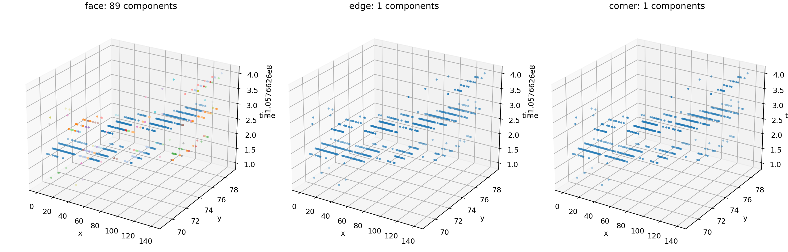
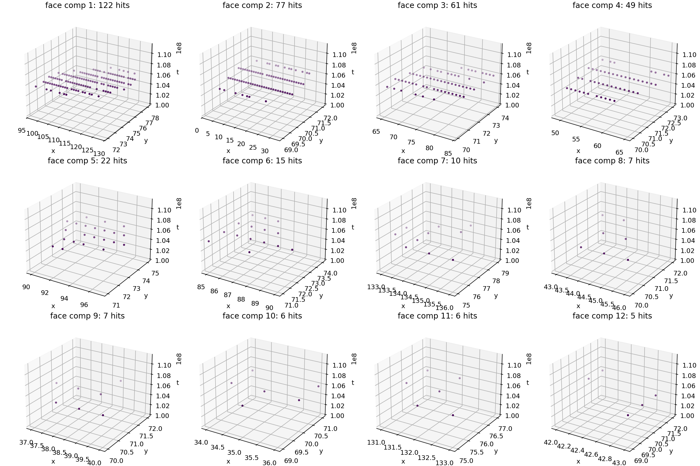

# Candidate 25638 Continuity Check

- source: `F08/tot_toa__r0000000028.t3pa`
- separator candidate id: `25638`
- hits: `511`
- time span: `3.000` raw time units
- bbox: x `0..140`, y `69..79`

## Component Counts

| connectivity | components | largest component hits | top component sizes |
|---|---:|---:|---|
| face | 89 | 122 | `[122, 77, 61, 49, 22, 15, 10, 7, 7, 6, 6, 5]` |
| edge | 1 | 511 | `[511]` |
| corner | 1 | 511 | `[511]` |

## Interpretation

This candidate is **not** a clean single physical particle by stricter continuity. It is one connected component under edge/corner-neighbor rules, but it splits into many components under face connectivity. That means the earlier audit did not catch it because the active separator/check used permissive diagonal connectivity, which can merge visually separate trajectories through diagonal touches or thin bridges.

For the cube-grid rendering and an independent connectivity check, see [candidate_25638_voxel_cube_connectivity.md](candidate_25638_voxel_cube_connectivity.md).
