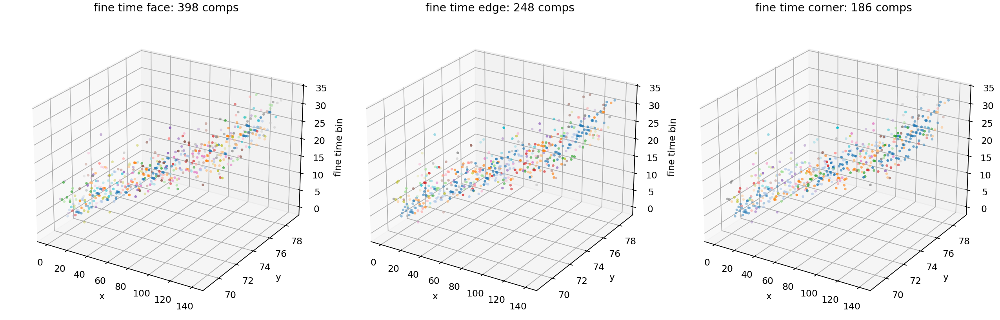
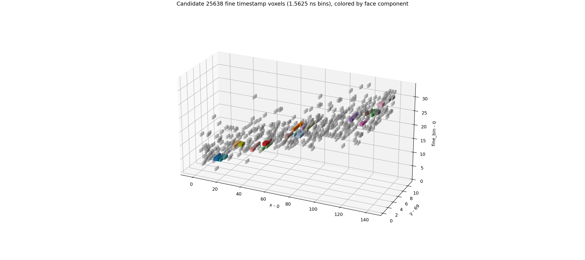

# Candidate 25638 Fine-Time Check

- source: `F08/tot_toa__r0000000028.t3pa`
- separator candidate id: `25638`
- hits: `511`
- coarse span: `3.000` ToA ticks = `75.000` ns
- fine span: `2.0625` ToA ticks = `51.562` ns
- fine timestamp formula: `ToA - FToA / 16` in 25 ns tick units

## Component Counts

| time axis | bin | connectivity | components | largest | top sizes |
|---|---:|---|---:|---:|---|
| coarse_25ns | 1.00000 | face | 89 | 122 | `[122, 77, 61, 49, 22, 15, 10, 7, 7, 6, 6, 5]` |
| coarse_25ns | 1.00000 | edge | 1 | 511 | `[511]` |
| coarse_25ns | 1.00000 | corner | 1 | 511 | `[511]` |
| fine_1p5625ns | 0.06250 | face | 398 | 6 | `[6, 6, 4, 4, 4, 4, 4, 4, 4, 3, 3, 3]` |
| fine_1p5625ns | 0.06250 | edge | 248 | 14 | `[14, 12, 12, 11, 11, 10, 10, 10, 9, 8, 7, 7]` |
| fine_1p5625ns | 0.06250 | corner | 186 | 31 | `[31, 17, 17, 15, 14, 14, 12, 11, 11, 10, 10, 10]` |
| fine_25ns_bins | 1.00000 | face | 52 | 277 | `[277, 103, 14, 11, 11, 8, 7, 6, 6, 5, 4, 4]` |
| fine_25ns_bins | 1.00000 | edge | 1 | 511 | `[511]` |
| fine_25ns_bins | 1.00000 | corner | 1 | 511 | `[511]` |

## Fine-Time Views

## Interpretation

The previous particle shard used coarse `ToA` only for `hit_time`. After reconstructing fine timestamps from `ToA` and `FToA`, this candidate spreads over many fine time bins instead of four coarse bins. It remains a bad single-particle candidate: even with fine time it is not one face-contiguous object, and under edge/corner it still percolates through dense diagonal contacts. The important correction is that all future particle building and audits must use `ToA - FToA/16`, and the time bin for voxel continuity should be chosen explicitly, e.g. `1/16` for one fine-time bin or a larger physical tolerance.
