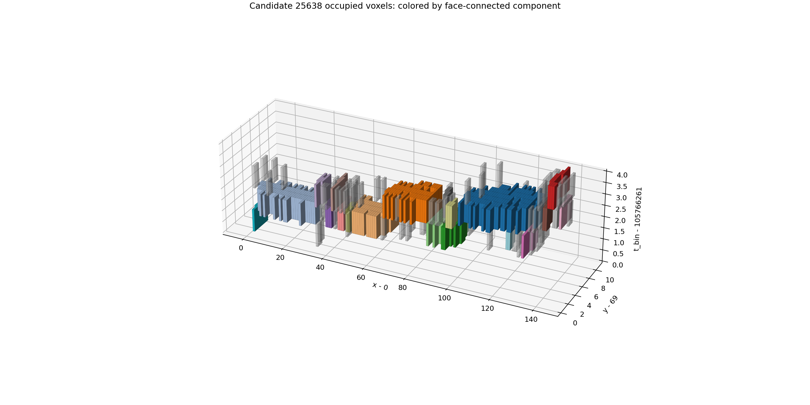
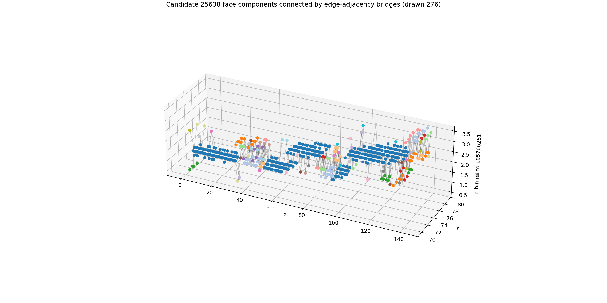

# Candidate 25638 Voxel-Cube Connectivity

- source: `F08/tot_toa__r0000000028.t3pa`
- separator candidate id: `25638`
- hits: `511`
- occupied voxels: `511`
- absolute time bins: `[105766261, 105766262, 105766263, 105766264]`
- bbox: x `0..140`, y `69..79`, relative t `0..3`

## Verified Connectivity

| rule | components | largest sizes |
|---|---:|---|
| face-only neighbors | 89 | `[122, 77, 61, 49, 22, 15, 10, 7, 7, 6, 6, 5]` |
| face+edge neighbors | 1 | `[511]` |
| face+edge+corner neighbors | 1 | `[511]` |

So yes: with the cube-grid definition used here, it is one component under edge connectivity, and also one component under corner connectivity. It is not one component under face-only connectivity. The reason is that the 89 face components are connected by diagonal edge-sharing contacts between occupied cubes.

- face components: `89`
- edge-only bridge pairs between face components: `151`
- corner-only bridge pairs between face components: `79`

## Cube Grid Views

## Interpretation

This confirms the implementation, but it also confirms that edge/corner connectivity is too permissive for your intended physical-particle notion in this dense case. The candidate is a single edge-connected occupied-cube object, yet visually and face-wise it is many trajectories/components. For Phase 2 training, these should be excluded or split with a stricter rule.
