# Aligned-Time Crowded File Many-Particle Fixed 256x256xTime Cube Overview: 08 Thu 7293

Source shard: `local_data/processed/native_grid_dbscan_crowded_file_v001/particles_aligned_time_v001/08_thu_proton_daily_batch/toa_tot__r0000007293.particles.npz`

Raw source: `local_data/raw/08_thu_proton_daily_batch/toa_tot__r0000007293.t3pa`

This is a whole-file inspection view. A literal one-image, equal-axis rendering of every cube is not useful because this file spans `12,327,013,936` fine-time bins. The report therefore uses whole-file summaries plus an equal-cube atlas of the densest short time windows.

- hits: `487,940`
- particles: `13,632`
- noise fraction: `0.027`
- fine-time span: `12,327,013,936` bins = `19.261` s
- plotted z cube: `100` fine bins = `156.2500` ns

## Whole-File Context

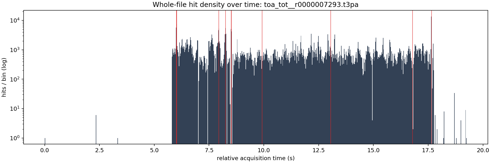

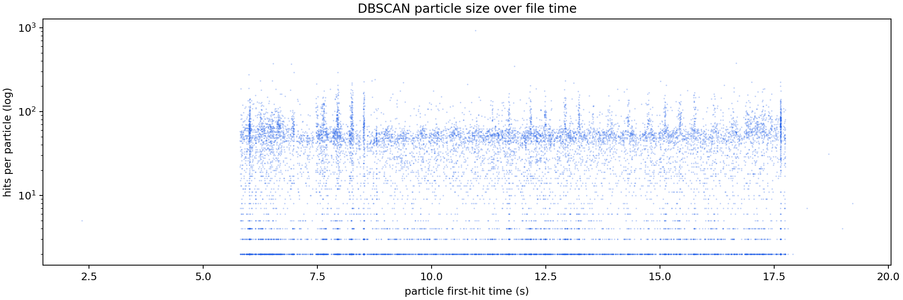

## Densest Time Windows As Equal Cubes

Each window uses real cube scaling: one x pixel, one y pixel, and one fine time bin have the same drawn size. The z axis is local to the selected time window, but the table gives absolute relative acquisition time.

The x/y axes are fixed to the full detector plane `0..256`.
The z axis is fixed to the full selected time slab.

Windows were selected by `particles`.

| rank | start s | span ns | z cube ns | hits | voxels | particles | noise frac | image |
|---:|---:|---:|---:|---:|---:|---:|---:|---|
| 1 | 8.511720 | 40000.0 | 156.2500 | 237 | 237 | 9 | 0.021 | [png](assets/native_grid_dbscan_aligned_time_crowded_08_7293_many_particles_100x_time_fixed_z/whole_file_window_01_z5447500800_5447526400_cubes.png) |
| 2 | 13.047600 | 40000.0 | 156.2500 | 60 | 60 | 8 | 0.050 | [png](assets/native_grid_dbscan_aligned_time_crowded_08_7293_many_particles_100x_time_fixed_z/whole_file_window_02_z8350464000_8350489600_cubes.png) |
| 3 | 8.514840 | 40000.0 | 156.2500 | 32 | 32 | 8 | 0.188 | [png](assets/native_grid_dbscan_aligned_time_crowded_08_7293_many_particles_100x_time_fixed_z/whole_file_window_03_z5449497600_5449523200_cubes.png) |
| 4 | 7.944360 | 40000.0 | 156.2500 | 313 | 313 | 7 | 0.026 | [png](assets/native_grid_dbscan_aligned_time_crowded_08_7293_many_particles_100x_time_fixed_z/whole_file_window_04_z5084390400_5084416000_cubes.png) |
| 5 | 8.515040 | 40000.0 | 156.2500 | 289 | 289 | 7 | 0.038 | [png](assets/native_grid_dbscan_aligned_time_crowded_08_7293_many_particles_100x_time_fixed_z/whole_file_window_05_z5449625600_5449651200_cubes.png) |
| 6 | 17.649240 | 40000.0 | 156.2500 | 228 | 228 | 7 | 0.022 | [png](assets/native_grid_dbscan_aligned_time_crowded_08_7293_many_particles_100x_time_fixed_z/whole_file_window_06_z11295513600_11295539200_cubes.png) |
| 7 | 6.011040 | 40000.0 | 156.2500 | 205 | 205 | 7 | 0.010 | [png](assets/native_grid_dbscan_aligned_time_crowded_08_7293_many_particles_100x_time_fixed_z/whole_file_window_07_z3847065600_3847091200_cubes.png) |
| 8 | 6.021920 | 40000.0 | 156.2500 | 114 | 114 | 7 | 0.053 | [png](assets/native_grid_dbscan_aligned_time_crowded_08_7293_many_particles_100x_time_fixed_z/whole_file_window_08_z3854028800_3854054400_cubes.png) |
| 9 | 8.249600 | 40000.0 | 156.2500 | 104 | 104 | 7 | 0.067 | [png](assets/native_grid_dbscan_aligned_time_crowded_08_7293_many_particles_100x_time_fixed_z/whole_file_window_09_z5279744000_5279769600_cubes.png) |
| 10 | 9.919120 | 40000.0 | 156.2500 | 96 | 96 | 7 | 0.083 | [png](assets/native_grid_dbscan_aligned_time_crowded_08_7293_many_particles_100x_time_fixed_z/whole_file_window_10_z6348236800_6348262400_cubes.png) |
| 11 | 6.022320 | 40000.0 | 156.2500 | 92 | 92 | 7 | 0.033 | [png](assets/native_grid_dbscan_aligned_time_crowded_08_7293_many_particles_100x_time_fixed_z/whole_file_window_11_z3854284800_3854310400_cubes.png) |
| 12 | 16.782600 | 40000.0 | 156.2500 | 91 | 91 | 7 | 0.044 | [png](assets/native_grid_dbscan_aligned_time_crowded_08_7293_many_particles_100x_time_fixed_z/whole_file_window_12_z10740864000_10740889600_cubes.png) |

### Window 1

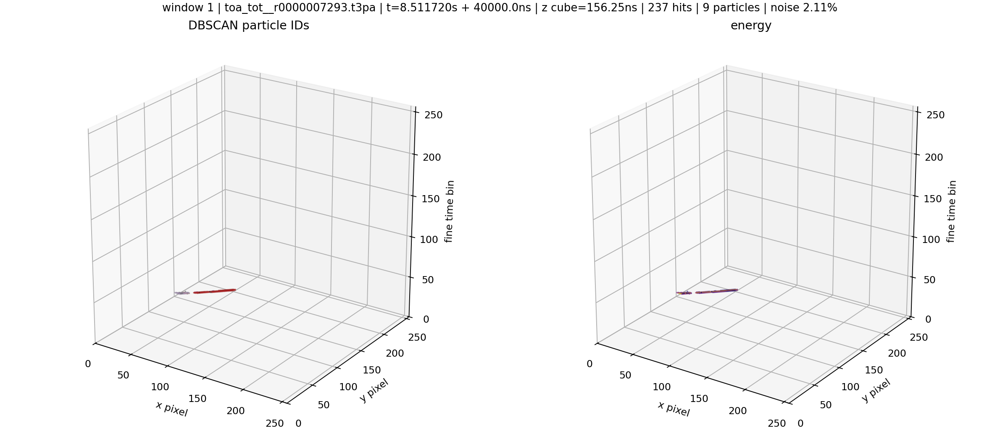

### Window 2

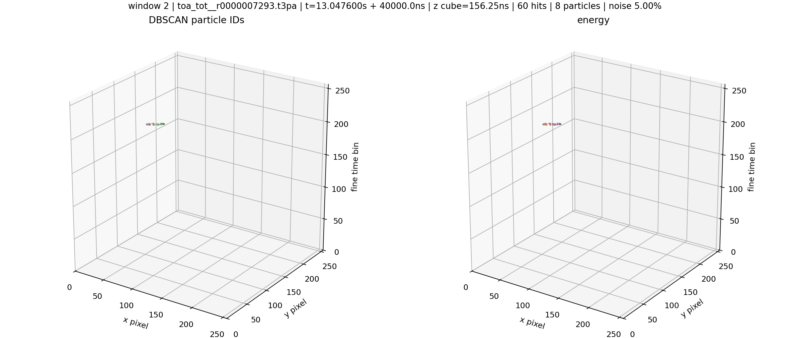

### Window 3

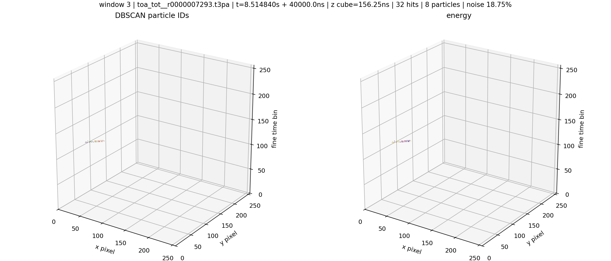

### Window 4

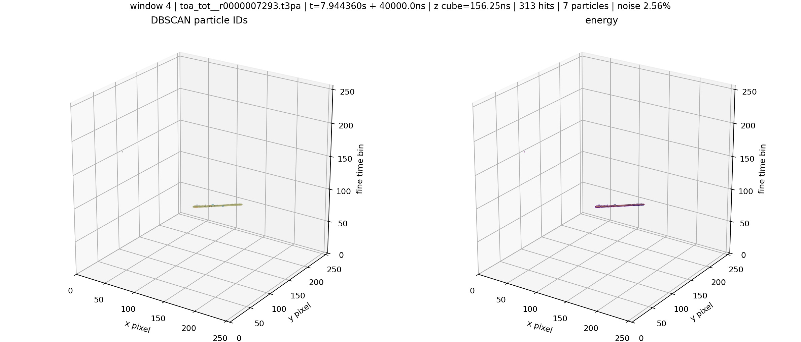

### Window 5

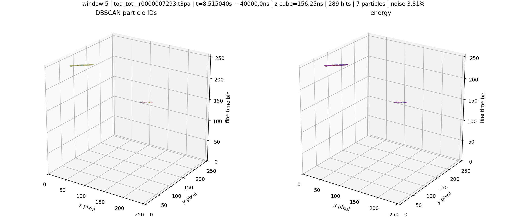

### Window 6

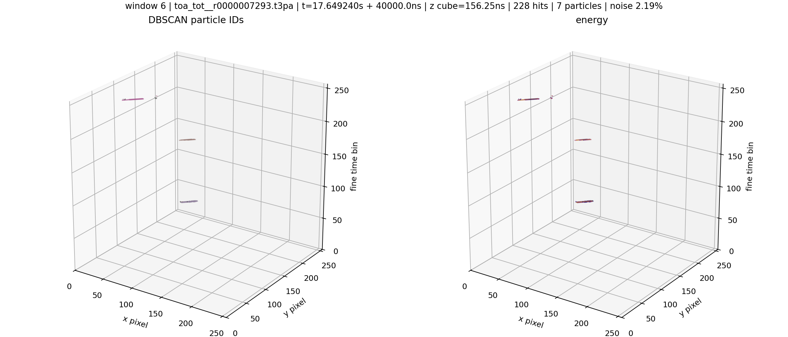

### Window 7

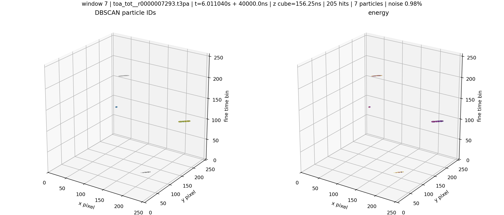

### Window 8

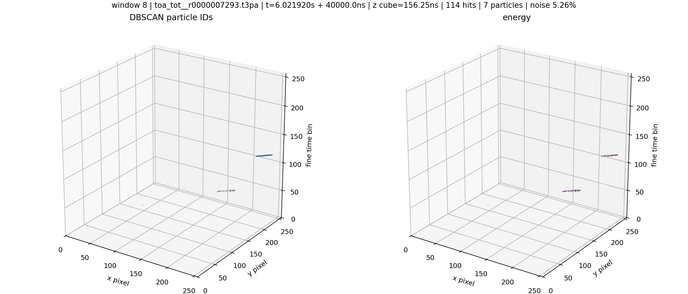

### Window 9

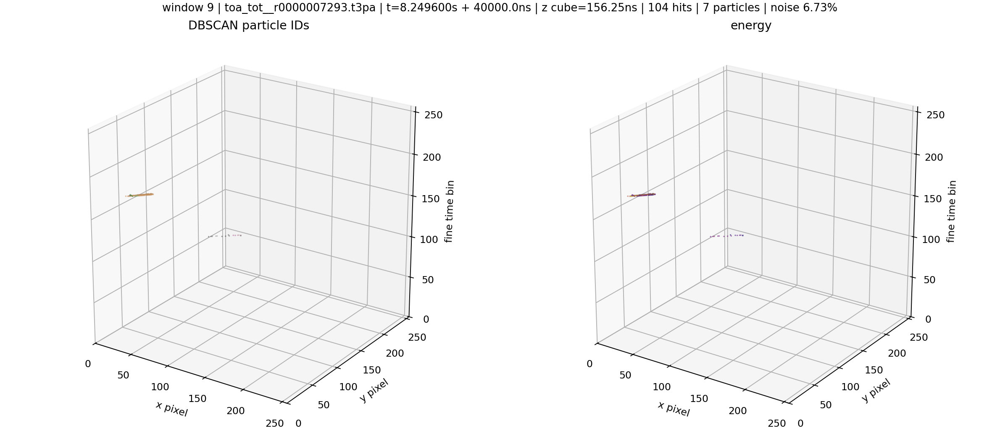

### Window 10

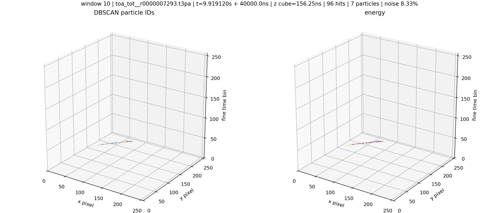

### Window 11

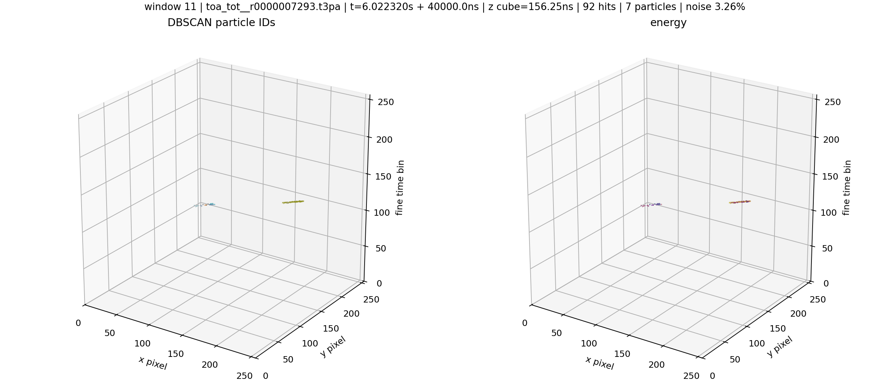

### Window 12

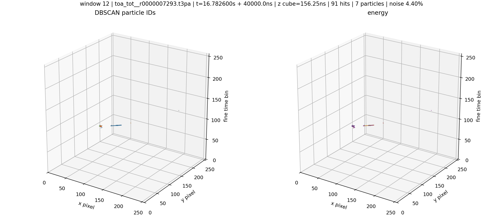
