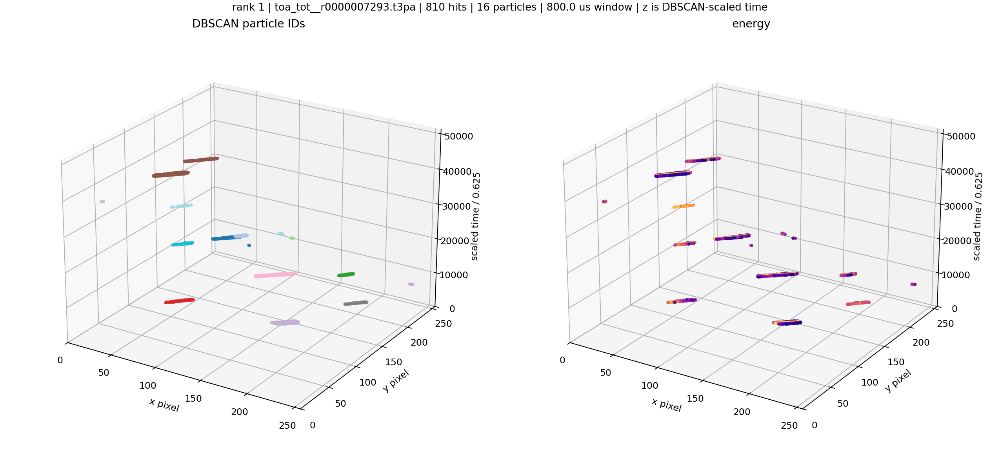
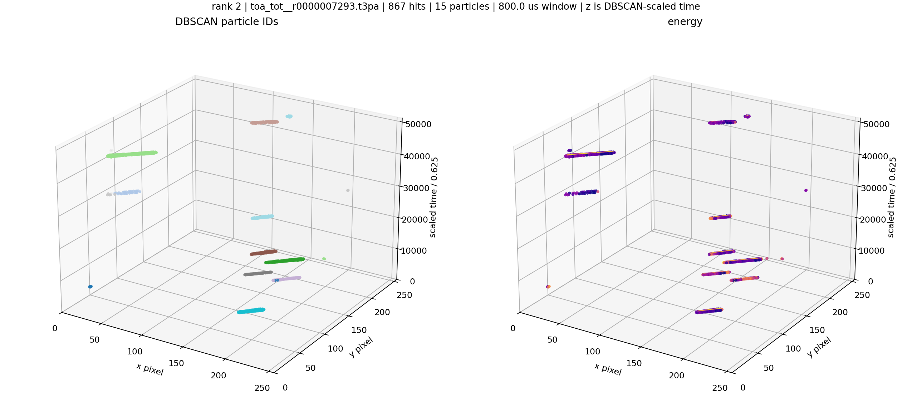
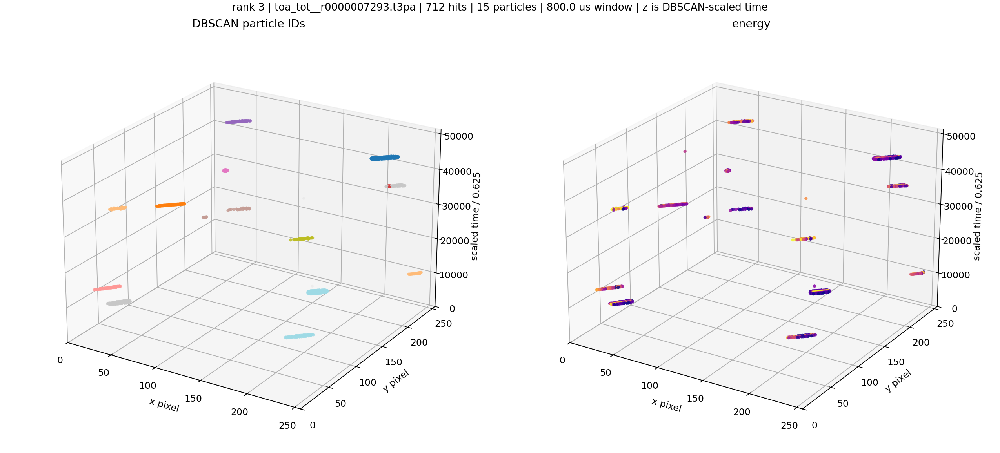
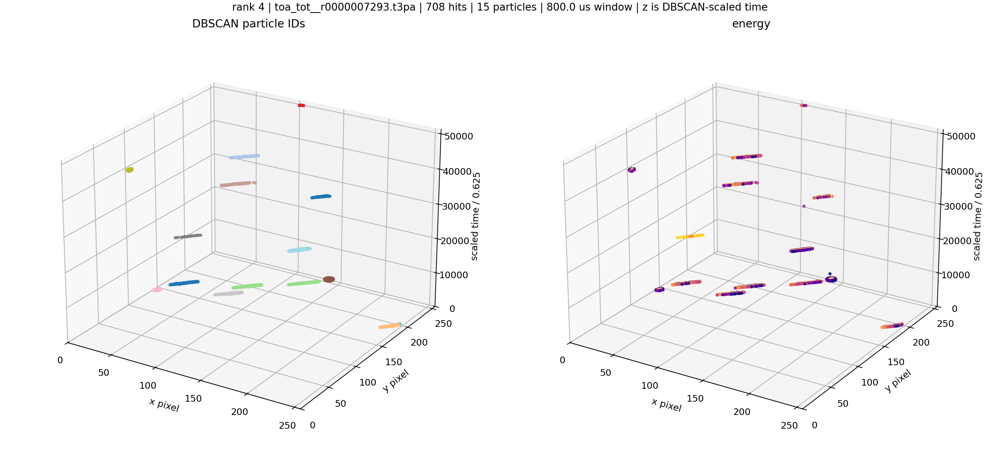
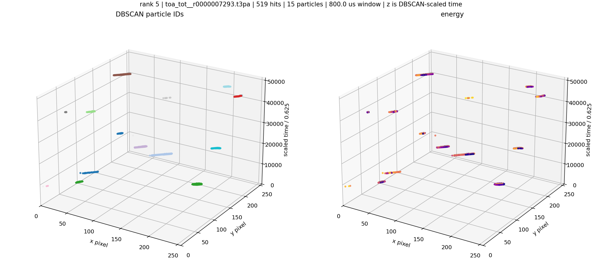
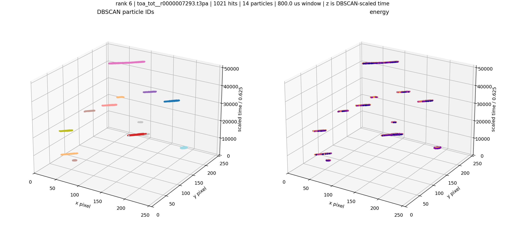
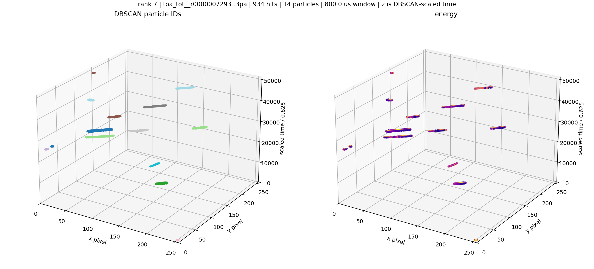
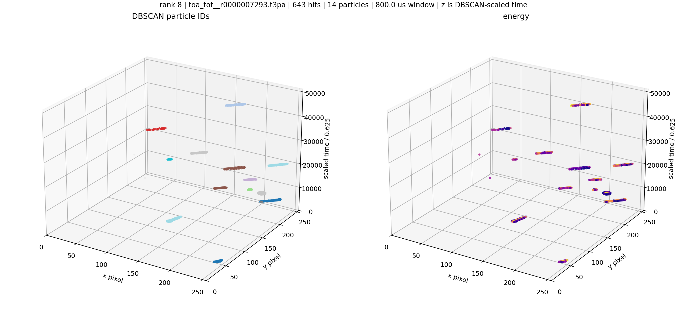

# Aligned-Time eps5 Crowded File: Scaled-Time Windows With More Than 10 Particles

Source shard: `local_data/processed/native_grid_dbscan_crowded_file_v001/particles_aligned_time_eps5_v001/08_thu_proton_daily_batch/toa_tot__r0000007293.particles.npz`

Raw source: `local_data/raw/08_thu_proton_daily_batch/toa_tot__r0000007293.t3pa`

These plots use DBSCAN-scaled time on z: `z = (ToA - FToA / 16 - window_start) / 0.625`.
The visual z aspect is compressed for readability, but the z-axis tick values are the scaled-time values used by DBSCAN.

| rank | start s | span us | scaled time span | hits | particles | noise frac | image |
|---:|---:|---:|---:|---:|---:|---:|---|
| 1 | 8.522400 | 800.0 | 51200.0 | 810 | 16 | 0.001 | [png](assets/native_grid_dbscan_aligned_time_eps5_crowded_08_7293_scaled_time_many_particles/scaled_time_window_01_z5454336000_5454848000.png) |
| 2 | 8.514400 | 800.0 | 51200.0 | 867 | 15 | 0.008 | [png](assets/native_grid_dbscan_aligned_time_eps5_crowded_08_7293_scaled_time_many_particles/scaled_time_window_02_z5449216000_5449728000.png) |
| 3 | 6.010400 | 800.0 | 51200.0 | 712 | 15 | 0.011 | [png](assets/native_grid_dbscan_aligned_time_eps5_crowded_08_7293_scaled_time_many_particles/scaled_time_window_03_z3846656000_3847168000.png) |
| 4 | 6.016000 | 800.0 | 51200.0 | 708 | 15 | 0.007 | [png](assets/native_grid_dbscan_aligned_time_eps5_crowded_08_7293_scaled_time_many_particles/scaled_time_window_04_z3850240000_3850752000.png) |
| 5 | 8.518400 | 800.0 | 51200.0 | 519 | 15 | 0.012 | [png](assets/native_grid_dbscan_aligned_time_eps5_crowded_08_7293_scaled_time_many_particles/scaled_time_window_05_z5451776000_5452288000.png) |
| 6 | 17.635200 | 800.0 | 51200.0 | 1,021 | 14 | 0.001 | [png](assets/native_grid_dbscan_aligned_time_eps5_crowded_08_7293_scaled_time_many_particles/scaled_time_window_06_z11286528000_11287040000.png) |
| 7 | 8.252800 | 800.0 | 51200.0 | 934 | 14 | 0.004 | [png](assets/native_grid_dbscan_aligned_time_eps5_crowded_08_7293_scaled_time_many_particles/scaled_time_window_07_z5281792000_5282304000.png) |
| 8 | 6.021600 | 800.0 | 51200.0 | 643 | 14 | 0.005 | [png](assets/native_grid_dbscan_aligned_time_eps5_crowded_08_7293_scaled_time_many_particles/scaled_time_window_08_z3853824000_3854336000.png) |

### Window 1

### Window 2

### Window 3

### Window 4

### Window 5

### Window 6

### Window 7

### Window 8

