# Native Grid DBSCAN Fine-Time Sample: Largest Labels

Fresh run after fixing T3PA timestamps to `time = ToA - FToA / 16` in 25 ns tick units. Backend: `native-grid-dbscan`. Params: `configs/teachers/dbscan_v002_candidate.json`.

Command output directory: `local_data/processed/native_grid_dbscan_fine_sample_v001/particles/`.

## Input Files

| source | hits | particles | noise frac | runtime s | hits/s | warnings |
|---|---:|---:|---:|---:|---:|---|
| `F08/tot_toa__r0000000028.t3pa` | 2,326,137 | 61,383 | 0.024 | 9.315 | 249,727 | `nan` |
| `F08/tot_toa__r0000000052.t3pa` | 2,452,962 | 64,842 | 0.025 | 9.921 | 247,238 | `nan` |
| `data M07/sync__M07-W0044_r000.t3pa` | 1,413,287 | 249,452 | 0.182 | 5.864 | 241,027 | `nan` |

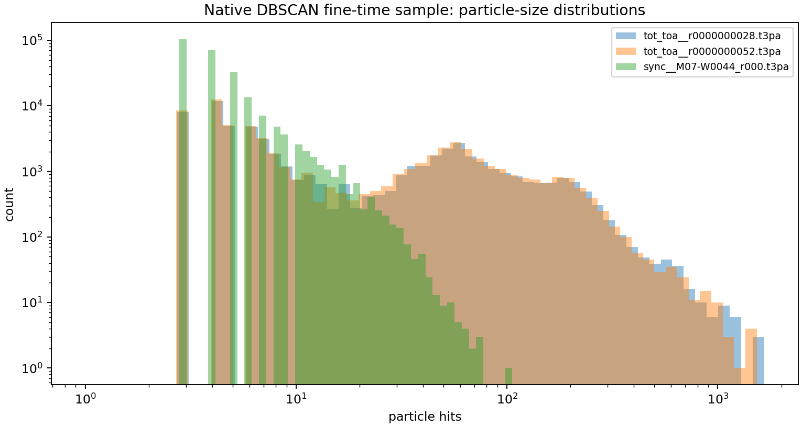

## Largest Native-DBSCAN Labels

Each image has: left = DBSCAN label colored by energy, middle = same hits colored by strict face-connected components using one FToA bin (`1.5625 ns`), right = time histogram. If `face_components_fine` is large, the DBSCAN label is visually/physically suspicious even though DBSCAN grouped it.

| rank | source | particle | hits | span ns | face comps fine | corner comps fine | image |
|---:|---|---:|---:|---:|---:|---:|---|
| 1 | `F08/tot_toa__r0000000028.t3pa` | 35582 | 1,661 | 2131643.75 | 1394 | 676 | [png](assets/native_grid_dbscan_fine_sample_v001/largest_01_tot_toa__r0000000028_p35582.png) |
| 2 | `F08/tot_toa__r0000000028.t3pa` | 5231 | 1,572 | 409639.06 | 1273 | 476 | [png](assets/native_grid_dbscan_fine_sample_v001/largest_02_tot_toa__r0000000028_p5231.png) |
| 3 | `F08/tot_toa__r0000000052.t3pa` | 13953 | 1,531 | 1116556.25 | 1216 | 578 | [png](assets/native_grid_dbscan_fine_sample_v001/largest_03_tot_toa__r0000000052_p13953.png) |
| 4 | `F08/tot_toa__r0000000028.t3pa` | 9391 | 1,485 | 409648.44 | 1170 | 497 | [png](assets/native_grid_dbscan_fine_sample_v001/largest_04_tot_toa__r0000000028_p9391.png) |
| 5 | `F08/tot_toa__r0000000052.t3pa` | 25330 | 1,386 | 410235.94 | 1273 | 1059 | [png](assets/native_grid_dbscan_fine_sample_v001/largest_05_tot_toa__r0000000052_p25330.png) |
| 6 | `F08/tot_toa__r0000000052.t3pa` | 33102 | 1,383 | 499082.81 | 1140 | 564 | [png](assets/native_grid_dbscan_fine_sample_v001/largest_06_tot_toa__r0000000052_p33102.png) |
| 7 | `F08/tot_toa__r0000000052.t3pa` | 57008 | 1,382 | 409645.31 | 1109 | 515 | [png](assets/native_grid_dbscan_fine_sample_v001/largest_07_tot_toa__r0000000052_p57008.png) |
| 8 | `F08/tot_toa__r0000000052.t3pa` | 44712 | 1,333 | 409664.06 | 1084 | 544 | [png](assets/native_grid_dbscan_fine_sample_v001/largest_08_tot_toa__r0000000052_p44712.png) |
| 9 | `F08/tot_toa__r0000000028.t3pa` | 24463 | 1,270 | 420278.12 | 1043 | 556 | [png](assets/native_grid_dbscan_fine_sample_v001/largest_09_tot_toa__r0000000028_p24463.png) |
| 10 | `F08/tot_toa__r0000000028.t3pa` | 30447 | 1,250 | 1972096.88 | 1138 | 871 | [png](assets/native_grid_dbscan_fine_sample_v001/largest_10_tot_toa__r0000000028_p30447.png) |
| 11 | `F08/tot_toa__r0000000028.t3pa` | 46029 | 1,225 | 1290810.94 | 1007 | 580 | [png](assets/native_grid_dbscan_fine_sample_v001/largest_11_tot_toa__r0000000028_p46029.png) |
| 12 | `F08/tot_toa__r0000000028.t3pa` | 3011 | 1,220 | 306873.44 | 959 | 338 | [png](assets/native_grid_dbscan_fine_sample_v001/largest_12_tot_toa__r0000000028_p3011.png) |
| 13 | `F08/tot_toa__r0000000028.t3pa` | 9687 | 1,196 | 2174407.81 | 1101 | 856 | [png](assets/native_grid_dbscan_fine_sample_v001/largest_13_tot_toa__r0000000028_p9687.png) |
| 14 | `F08/tot_toa__r0000000052.t3pa` | 29338 | 1,144 | 1063623.44 | 890 | 378 | [png](assets/native_grid_dbscan_fine_sample_v001/largest_14_tot_toa__r0000000052_p29338.png) |
| 15 | `F08/tot_toa__r0000000052.t3pa` | 61499 | 1,124 | 1104675.00 | 960 | 545 | [png](assets/native_grid_dbscan_fine_sample_v001/largest_15_tot_toa__r0000000052_p61499.png) |
| 16 | `F08/tot_toa__r0000000052.t3pa` | 15671 | 1,093 | 409639.06 | 898 | 387 | [png](assets/native_grid_dbscan_fine_sample_v001/largest_16_tot_toa__r0000000052_p15671.png) |
| 17 | `data M07/sync__M07-W0044_r000.t3pa` | 63912 | 106 | 98.44 | 95 | 76 | [png](assets/native_grid_dbscan_fine_sample_v001/largest_17_sync__M07-W0044_r000_p63912.png) |
| 18 | `data M07/sync__M07-W0044_r000.t3pa` | 40544 | 76 | 215.62 | 72 | 61 | [png](assets/native_grid_dbscan_fine_sample_v001/largest_18_sync__M07-W0044_r000_p40544.png) |

### Rank 1

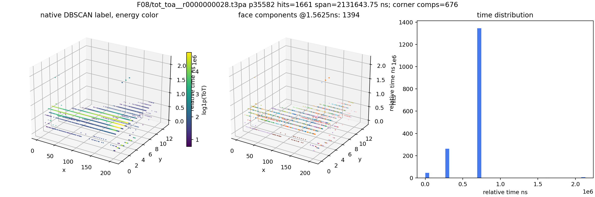

### Rank 2

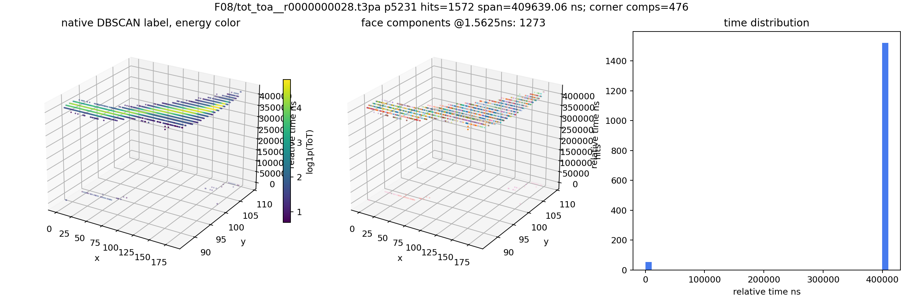

### Rank 3

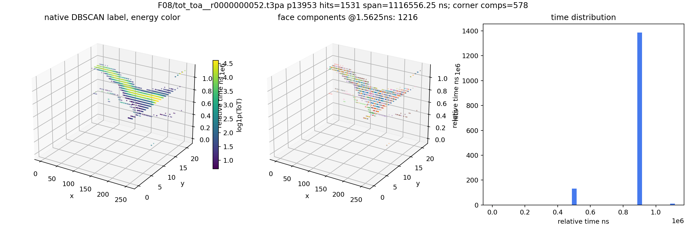

### Rank 4

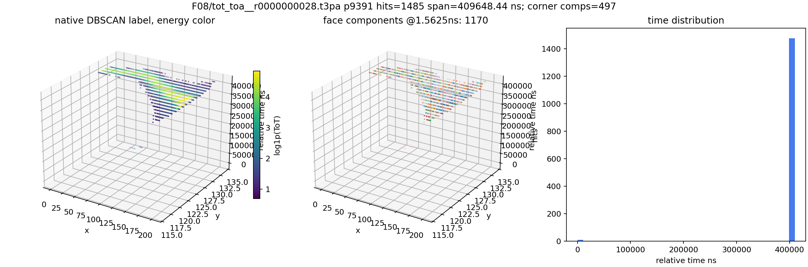

### Rank 5

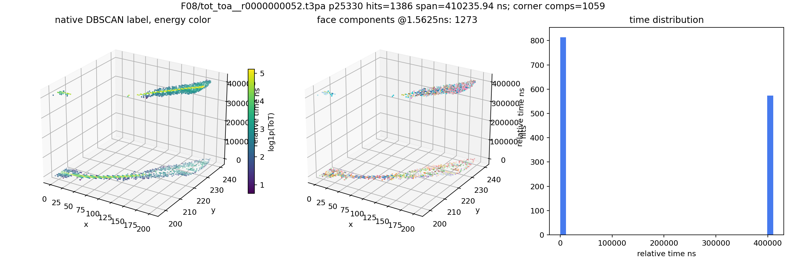

### Rank 6

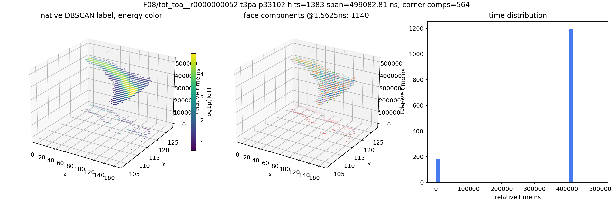

### Rank 7

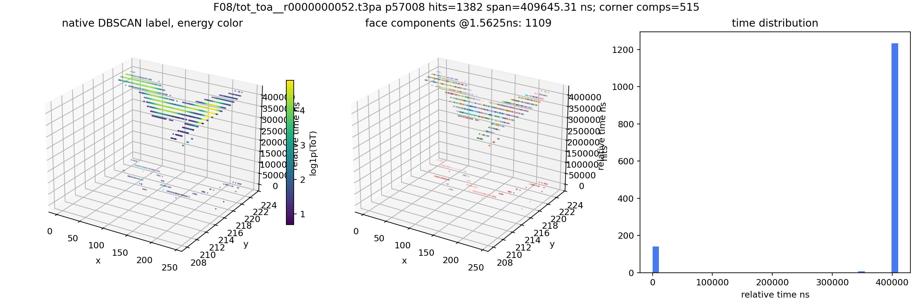

### Rank 8

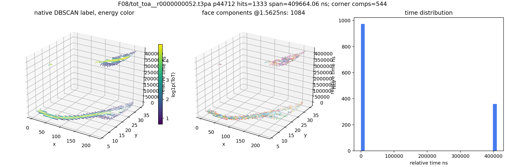

### Rank 9

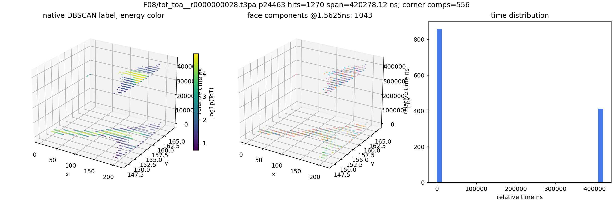

### Rank 10

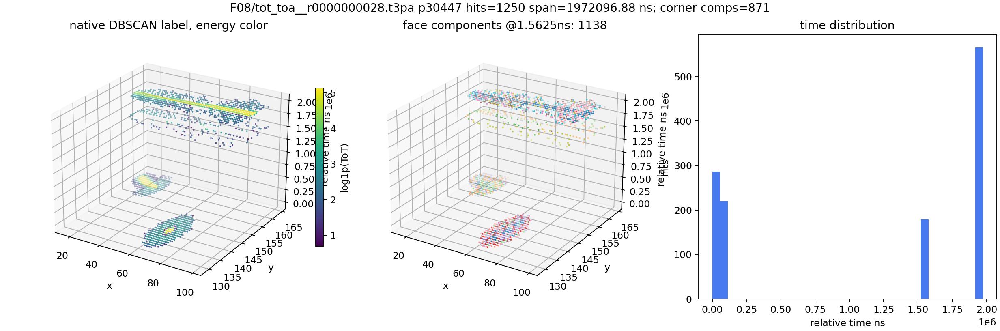

### Rank 11

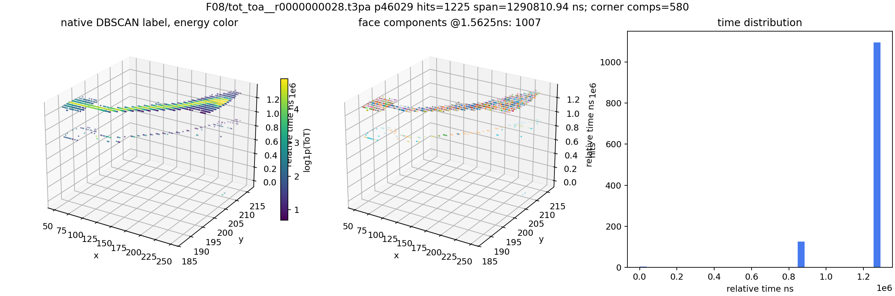

### Rank 12

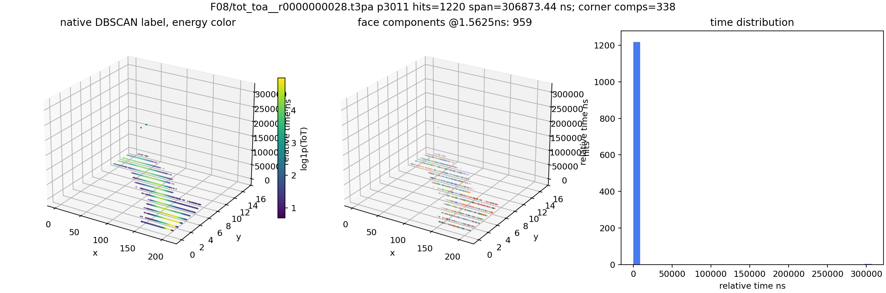

### Rank 13

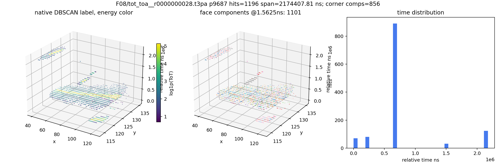

### Rank 14

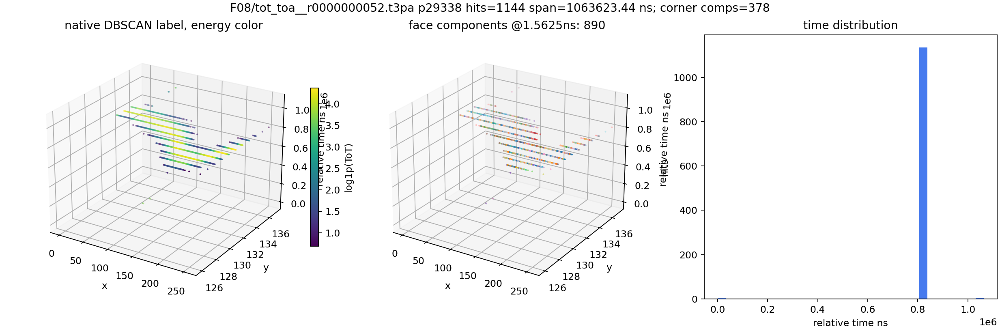

### Rank 15

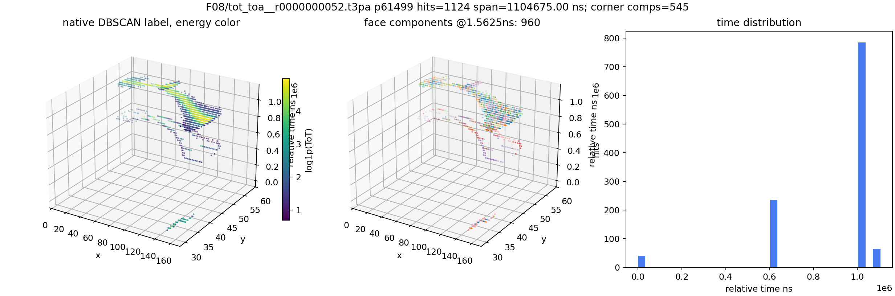

### Rank 16

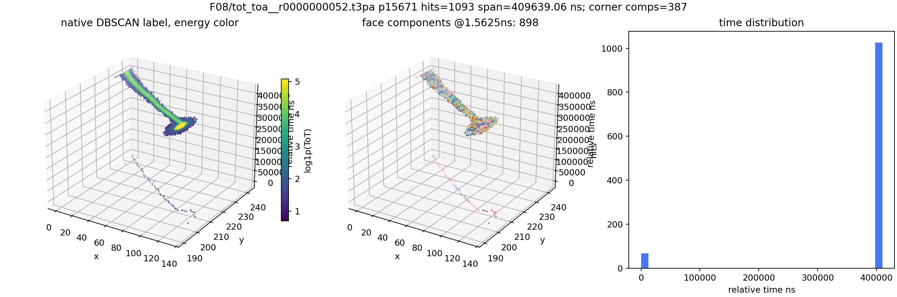

### Rank 17

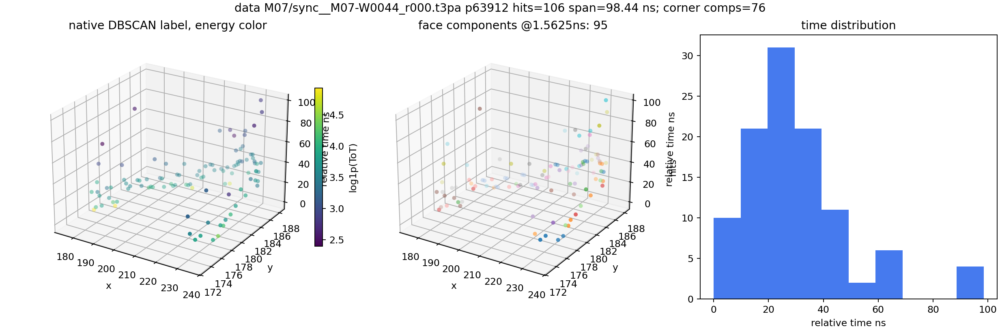

### Rank 18

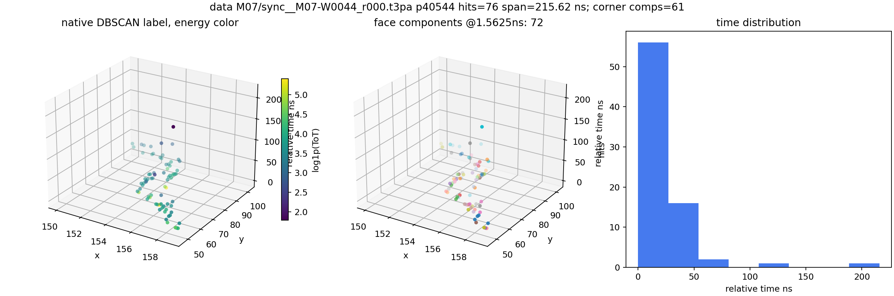

## Interpretation

This is a DBSCAN stress gallery, not a clean Phase 2 training set. Several largest native-DBSCAN labels still contain many strict fine-time face components, so DBSCAN is still over-merging in dense bursts. The corrected fine timestamp is necessary, but DBSCAN with these params is not sufficient to guarantee single-particle labels.
