# Crowded File Many-Particle Fixed 256x256xTime Cube Overview: 08 Thu 7293, 10x Time

Source shard: `local_data/processed/native_grid_dbscan_crowded_file_v001/particles_fine_voxel_like/08_thu_proton_daily_batch/toa_tot__r0000007293.particles.npz`

Raw source: `local_data/raw/08_thu_proton_daily_batch/toa_tot__r0000007293.t3pa`

This is a whole-file inspection view. A literal one-image, equal-axis rendering of every cube is not useful because this file spans `12,327,013,936` fine-time bins. The report therefore uses whole-file summaries plus an equal-cube atlas of the densest short time windows.

- hits: `487,940`
- particles: `76,331`
- noise fraction: `0.373`
- fine-time span: `12,327,013,936` bins = `19.261` s
- plotted z cube: `10` fine bins = `15.6250` ns

## Whole-File Context

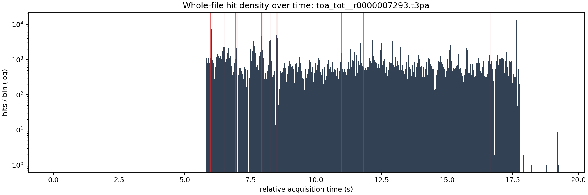

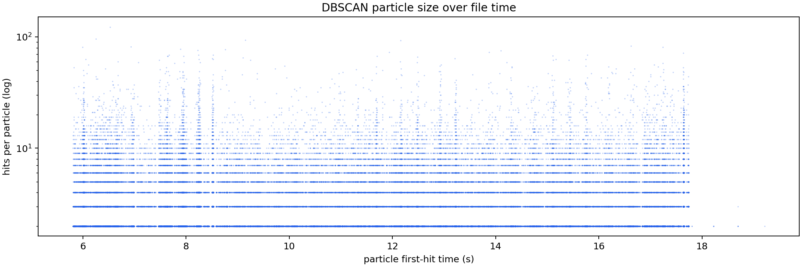

## Densest Time Windows As Equal Cubes

Each window uses real cube scaling: one x pixel, one y pixel, and one fine time bin have the same drawn size. The z axis is local to the selected time window, but the table gives absolute relative acquisition time.

The x/y axes are fixed to the full detector plane `0..256`.
The z axis is fixed to the full selected time slab.

Windows were selected by `particles`.

| rank | start s | span ns | z cube ns | hits | voxels | particles | noise frac | image |
|---:|---:|---:|---:|---:|---:|---:|---:|---|
| 1 | 10.960380 | 4000.0 | 15.6250 | 955 | 955 | 120 | 0.371 | [png](assets/native_grid_dbscan_fine_voxel_like_crowded_08_7293_many_particles_10x_time_fixed_z/whole_file_window_01_z7014643200_7014645760_cubes.png) |
| 2 | 7.944376 | 4000.0 | 15.6250 | 312 | 312 | 49 | 0.394 | [png](assets/native_grid_dbscan_fine_voxel_like_crowded_08_7293_many_particles_10x_time_fixed_z/whole_file_window_02_z5084400640_5084403200_cubes.png) |
| 3 | 5.994736 | 4000.0 | 15.6250 | 277 | 277 | 47 | 0.347 | [png](assets/native_grid_dbscan_fine_voxel_like_crowded_08_7293_many_particles_10x_time_fixed_z/whole_file_window_03_z3836631040_3836633600_cubes.png) |
| 4 | 16.665076 | 4000.0 | 15.6250 | 394 | 394 | 43 | 0.365 | [png](assets/native_grid_dbscan_fine_voxel_like_crowded_08_7293_many_particles_10x_time_fixed_z/whole_file_window_04_z10665648640_10665651200_cubes.png) |
| 5 | 6.527040 | 4000.0 | 15.6250 | 375 | 375 | 42 | 0.216 | [png](assets/native_grid_dbscan_fine_voxel_like_crowded_08_7293_many_particles_10x_time_fixed_z/whole_file_window_05_z4177305600_4177308160_cubes.png) |
| 6 | 6.930352 | 4000.0 | 15.6250 | 367 | 367 | 42 | 0.264 | [png](assets/native_grid_dbscan_fine_voxel_like_crowded_08_7293_many_particles_10x_time_fixed_z/whole_file_window_06_z4435425280_4435427840_cubes.png) |
| 7 | 11.812012 | 4000.0 | 15.6250 | 354 | 354 | 40 | 0.209 | [png](assets/native_grid_dbscan_fine_voxel_like_crowded_08_7293_many_particles_10x_time_fixed_z/whole_file_window_07_z7559687680_7559690240_cubes.png) |
| 8 | 6.989168 | 4000.0 | 15.6250 | 292 | 292 | 40 | 0.264 | [png](assets/native_grid_dbscan_fine_voxel_like_crowded_08_7293_many_particles_10x_time_fixed_z/whole_file_window_08_z4473067520_4473070080_cubes.png) |
| 9 | 8.515076 | 4000.0 | 15.6250 | 238 | 238 | 36 | 0.328 | [png](assets/native_grid_dbscan_fine_voxel_like_crowded_08_7293_many_particles_10x_time_fixed_z/whole_file_window_09_z5449648640_5449651200_cubes.png) |
| 10 | 8.511732 | 4000.0 | 15.6250 | 237 | 237 | 35 | 0.384 | [png](assets/native_grid_dbscan_fine_voxel_like_crowded_08_7293_many_particles_10x_time_fixed_z/whole_file_window_10_z5447508480_5447511040_cubes.png) |
| 11 | 7.936700 | 4000.0 | 15.6250 | 177 | 177 | 34 | 0.282 | [png](assets/native_grid_dbscan_fine_voxel_like_crowded_08_7293_many_particles_10x_time_fixed_z/whole_file_window_11_z5079488000_5079490560_cubes.png) |
| 12 | 8.257604 | 4000.0 | 15.6250 | 228 | 228 | 33 | 0.285 | [png](assets/native_grid_dbscan_fine_voxel_like_crowded_08_7293_many_particles_10x_time_fixed_z/whole_file_window_12_z5284866560_5284869120_cubes.png) |

### Window 1

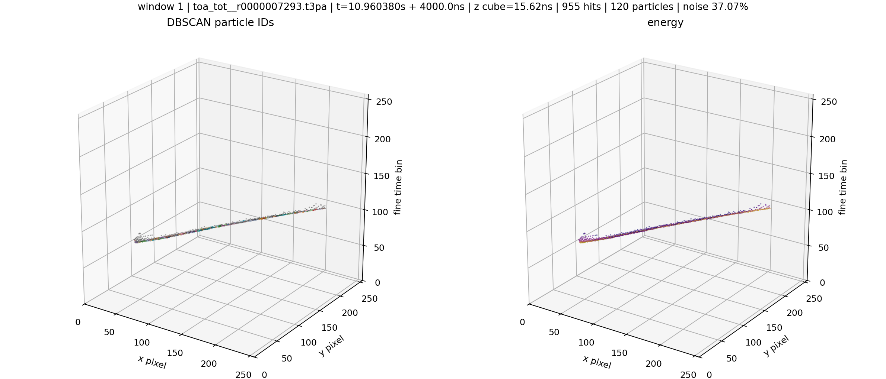

### Window 2

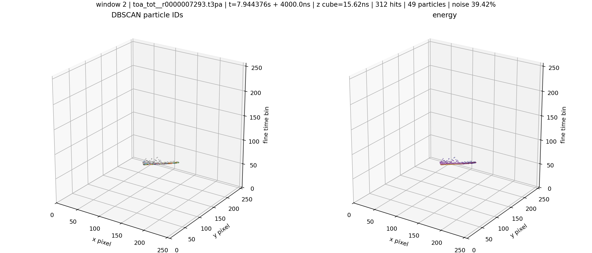

### Window 3

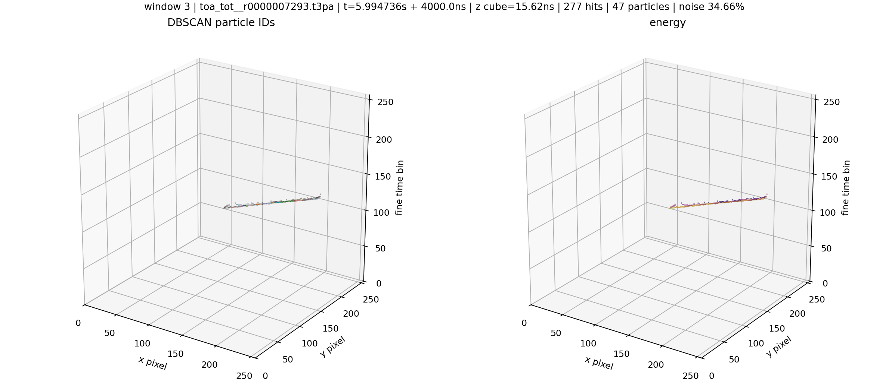

### Window 4

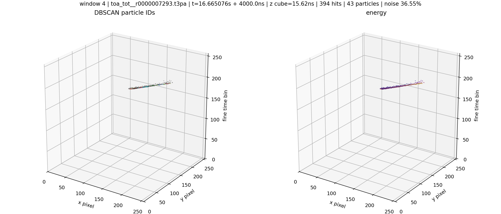

### Window 5

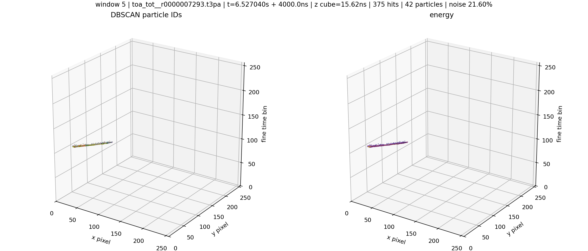

### Window 6

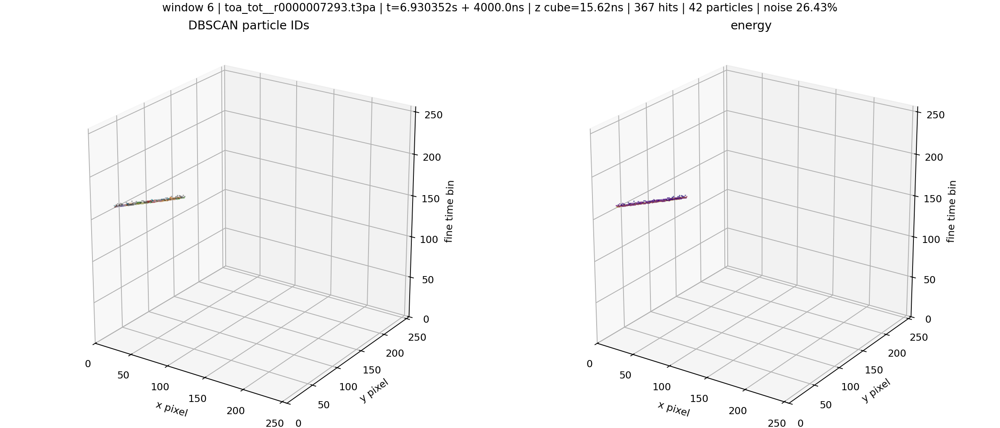

### Window 7

### Window 8

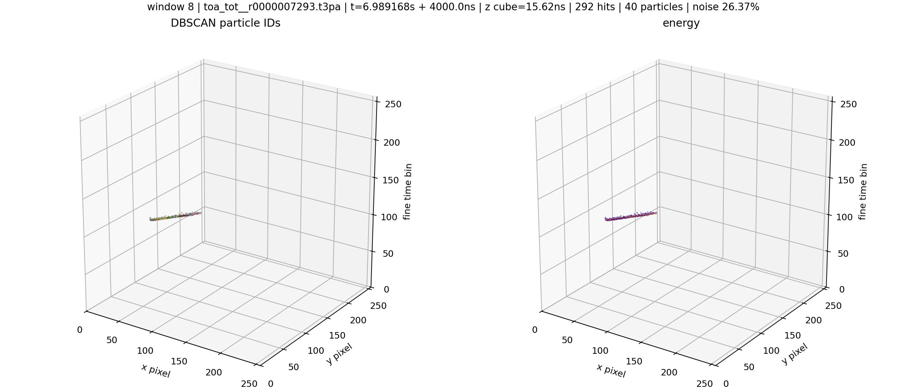

### Window 9

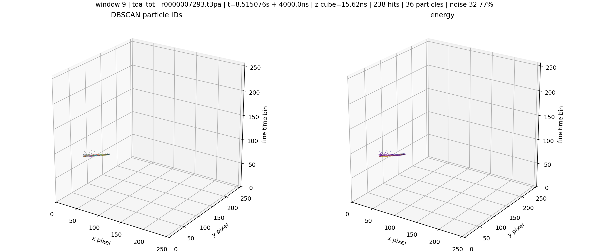

### Window 10

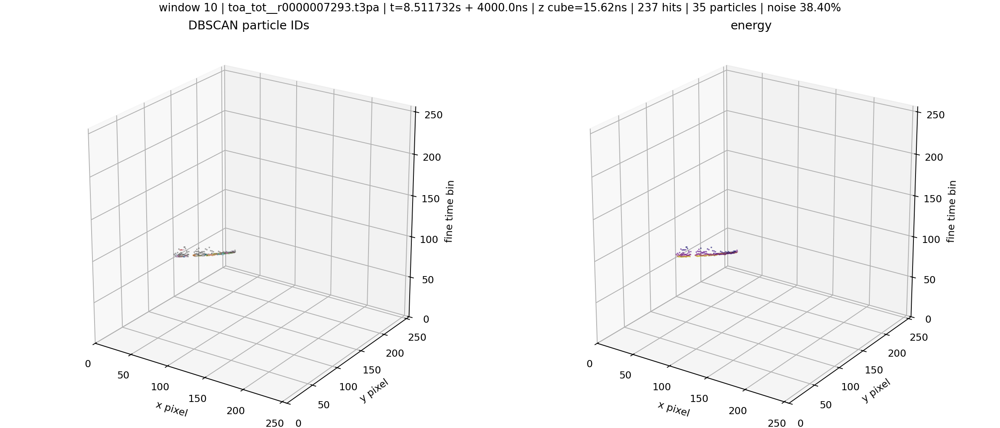

### Window 11

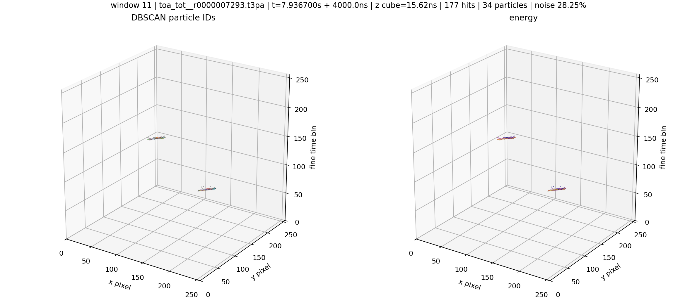

### Window 12

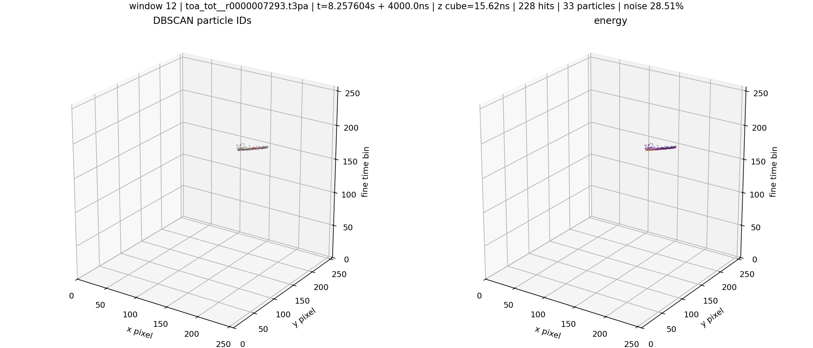
