# Reasonable File Many-Particle Fixed-Detector Cube Overview: 08 Thu 7333

Source shard: `local_data/processed/native_grid_dbscan_reasonable_file_v001/particles_fine_voxel_like/08_thu_proton_daily_batch/toa_tot__r0000007333.particles.npz`

Raw source: `local_data/raw/08_thu_proton_daily_batch/toa_tot__r0000007333.t3pa`

This is a whole-file inspection view. A literal one-image, equal-axis rendering of every cube is not useful because this file spans `12,777,351,155` fine-time bins. The report therefore uses whole-file summaries plus an equal-cube atlas of the densest short time windows.

- hits: `88,825`
- particles: `15,160`
- noise fraction: `0.434`
- fine-time span: `12,777,351,155` bins = `19.965` s

## Whole-File Context

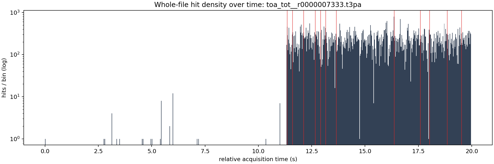

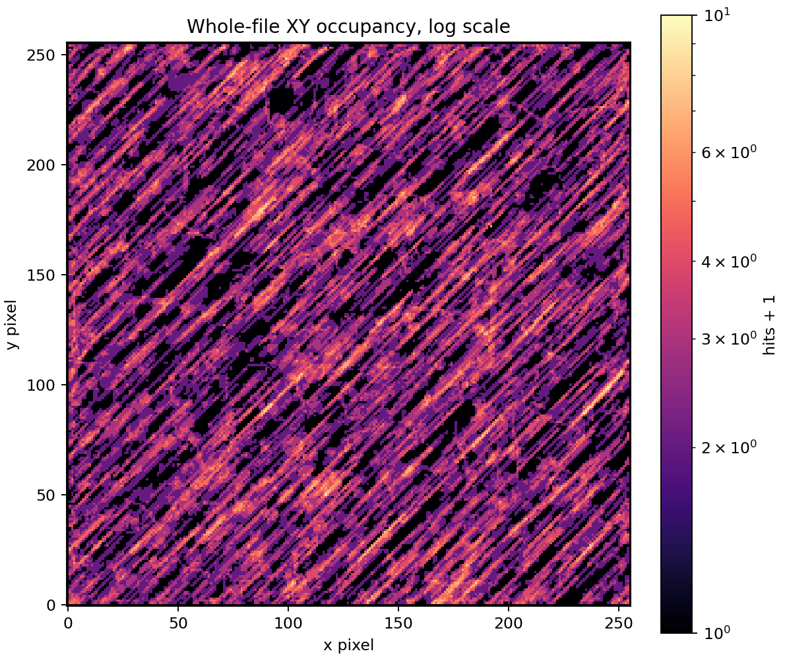

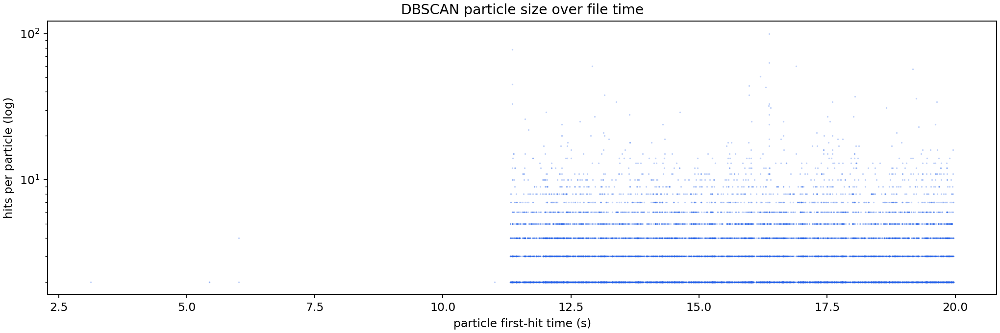

## Densest Time Windows As Equal Cubes

Each window uses real cube scaling: one x pixel, one y pixel, and one fine time bin have the same drawn size. The z axis is local to the selected time window, but the table gives absolute relative acquisition time.

The x/y axes are fixed to the full detector plane `0..256`.

Windows were selected by `particles`.

| rank | start s | span ns | hits | voxels | particles | noise frac | image |
|---:|---:|---:|---:|---:|---:|---:|---|
| 1 | 16.367674 | 400.0 | 610 | 610 | 63 | 0.243 | [png](assets/native_grid_dbscan_fine_voxel_like_reasonable_08_7333_many_particles/whole_file_window_01_z10475311104_10475311360_cubes.png) |
| 2 | 12.671127 | 400.0 | 210 | 210 | 32 | 0.324 | [png](assets/native_grid_dbscan_fine_voxel_like_reasonable_08_7333_many_particles/whole_file_window_02_z8109521408_8109521664_cubes.png) |
| 3 | 11.350905 | 400.0 | 307 | 307 | 28 | 0.248 | [png](assets/native_grid_dbscan_fine_voxel_like_reasonable_08_7333_many_particles/whole_file_window_03_z7264579328_7264579584_cubes.png) |
| 4 | 19.519795 | 400.0 | 149 | 149 | 23 | 0.430 | [png](assets/native_grid_dbscan_fine_voxel_like_reasonable_08_7333_many_particles/whole_file_window_04_z12492668672_12492668928_cubes.png) |
| 5 | 11.602626 | 400.0 | 103 | 103 | 23 | 0.282 | [png](assets/native_grid_dbscan_fine_voxel_like_reasonable_08_7333_many_particles/whole_file_window_05_z7425680896_7425681152_cubes.png) |
| 6 | 18.028476 | 400.0 | 127 | 127 | 21 | 0.252 | [png](assets/native_grid_dbscan_fine_voxel_like_reasonable_08_7333_many_particles/whole_file_window_06_z11538224384_11538224640_cubes.png) |
| 7 | 13.653522 | 400.0 | 140 | 140 | 20 | 0.300 | [png](assets/native_grid_dbscan_fine_voxel_like_reasonable_08_7333_many_particles/whole_file_window_07_z8738254080_8738254336_cubes.png) |
| 8 | 12.120830 | 400.0 | 111 | 111 | 20 | 0.387 | [png](assets/native_grid_dbscan_fine_voxel_like_reasonable_08_7333_many_particles/whole_file_window_08_z7757331200_7757331456_cubes.png) |
| 9 | 17.598084 | 400.0 | 151 | 151 | 18 | 0.265 | [png](assets/native_grid_dbscan_fine_voxel_like_reasonable_08_7333_many_particles/whole_file_window_09_z11262773760_11262774016_cubes.png) |
| 10 | 12.912553 | 400.0 | 147 | 147 | 18 | 0.143 | [png](assets/native_grid_dbscan_fine_voxel_like_reasonable_08_7333_many_particles/whole_file_window_10_z8264033792_8264034048_cubes.png) |
| 11 | 18.854454 | 400.0 | 145 | 145 | 18 | 0.331 | [png](assets/native_grid_dbscan_fine_voxel_like_reasonable_08_7333_many_particles/whole_file_window_11_z12066850560_12066850816_cubes.png) |
| 12 | 13.151577 | 400.0 | 139 | 139 | 18 | 0.237 | [png](assets/native_grid_dbscan_fine_voxel_like_reasonable_08_7333_many_particles/whole_file_window_12_z8417009152_8417009408_cubes.png) |

### Window 1

### Window 2

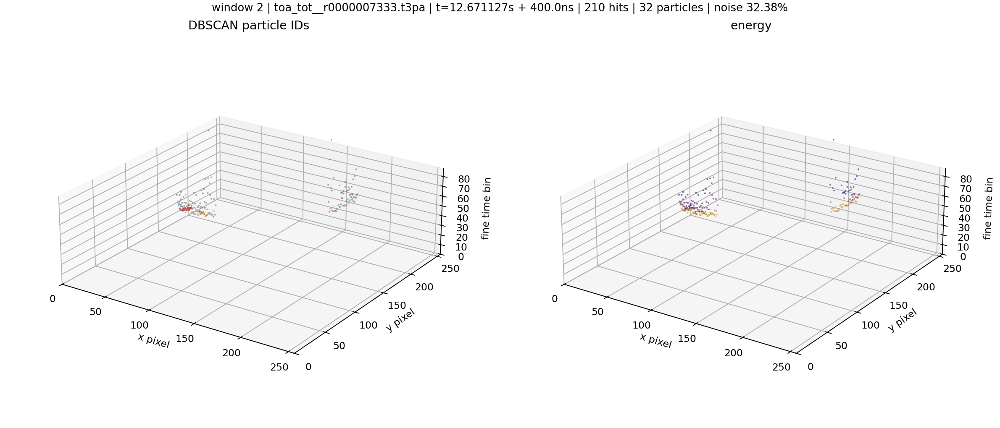

### Window 3

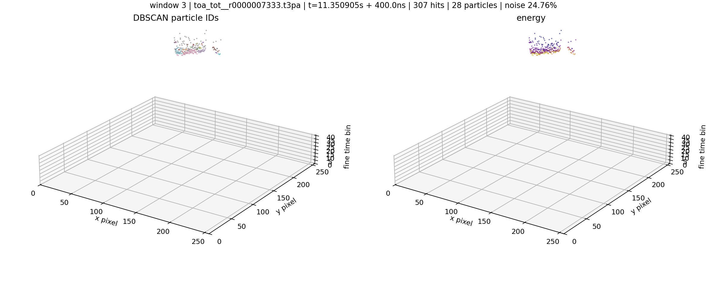

### Window 4

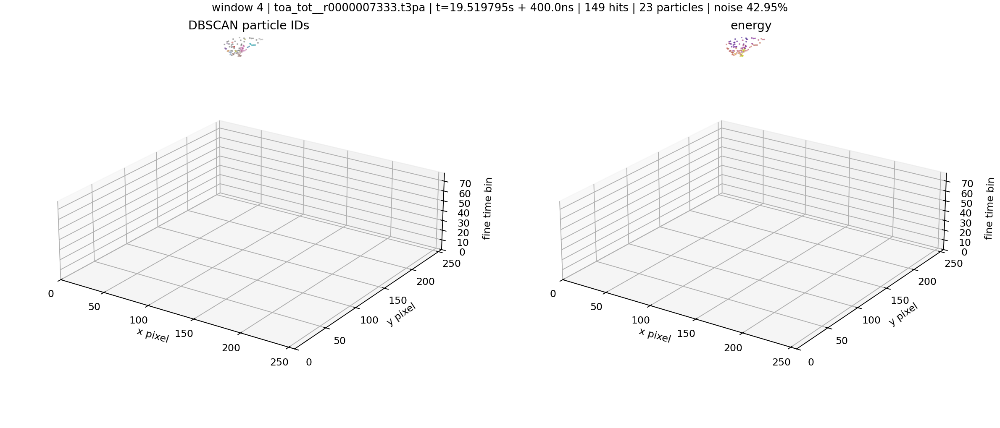

### Window 5

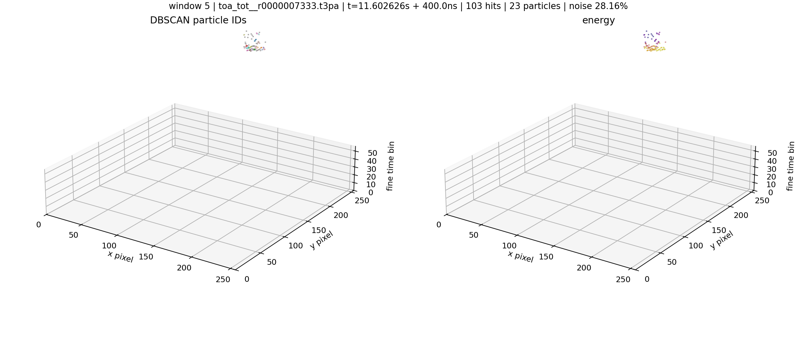

### Window 6

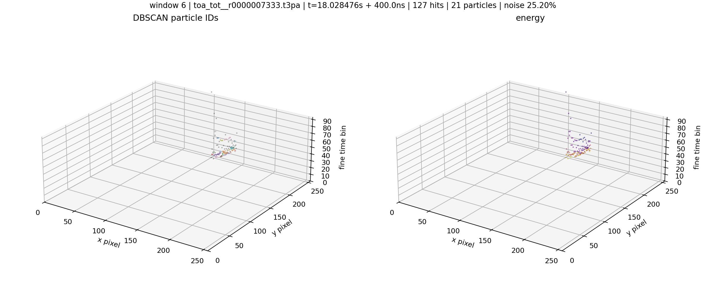

### Window 7

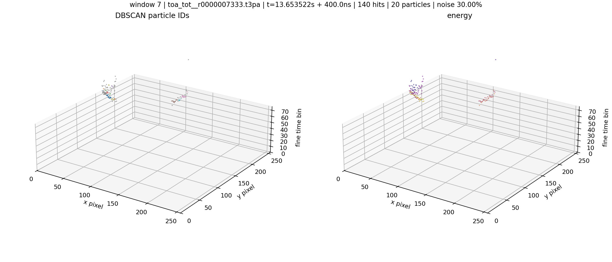

### Window 8

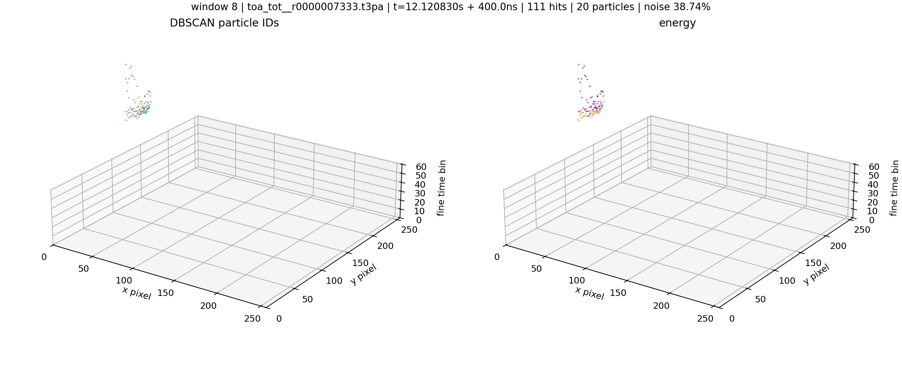

### Window 9

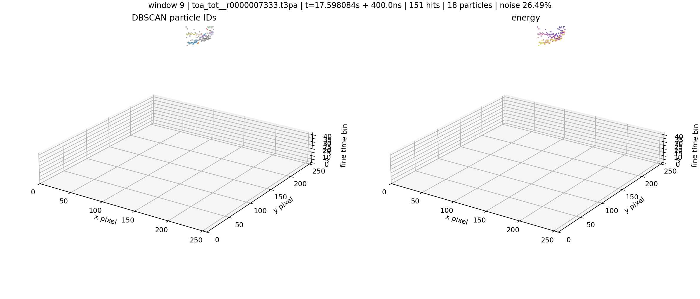

### Window 10

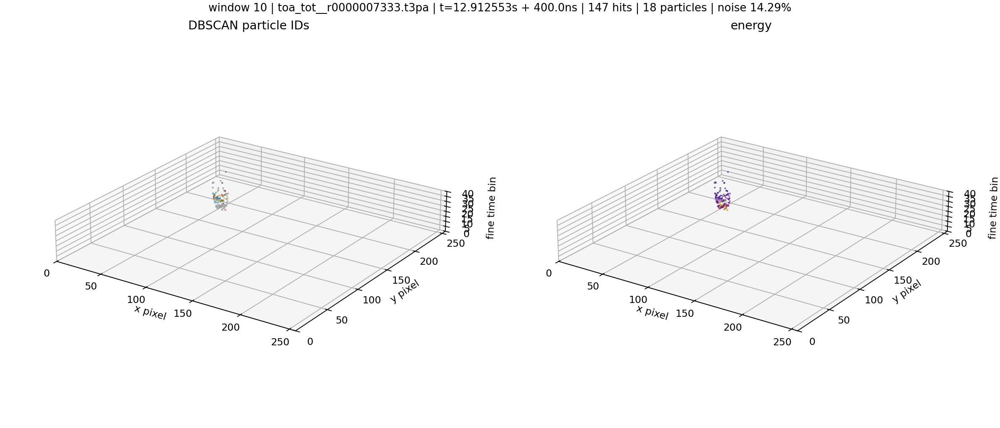

### Window 11

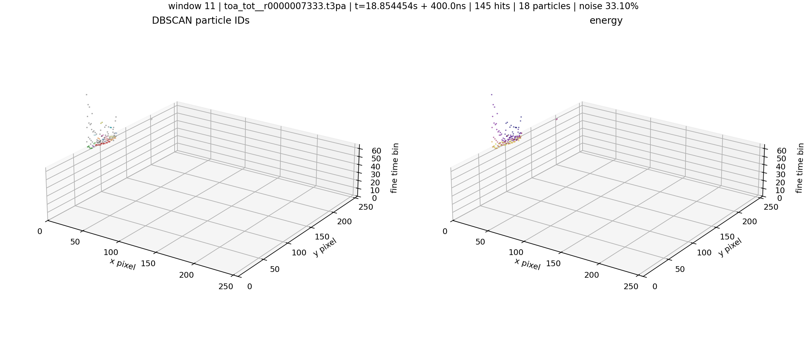

### Window 12

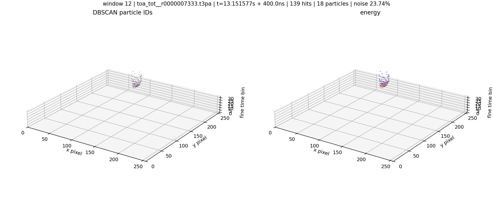
