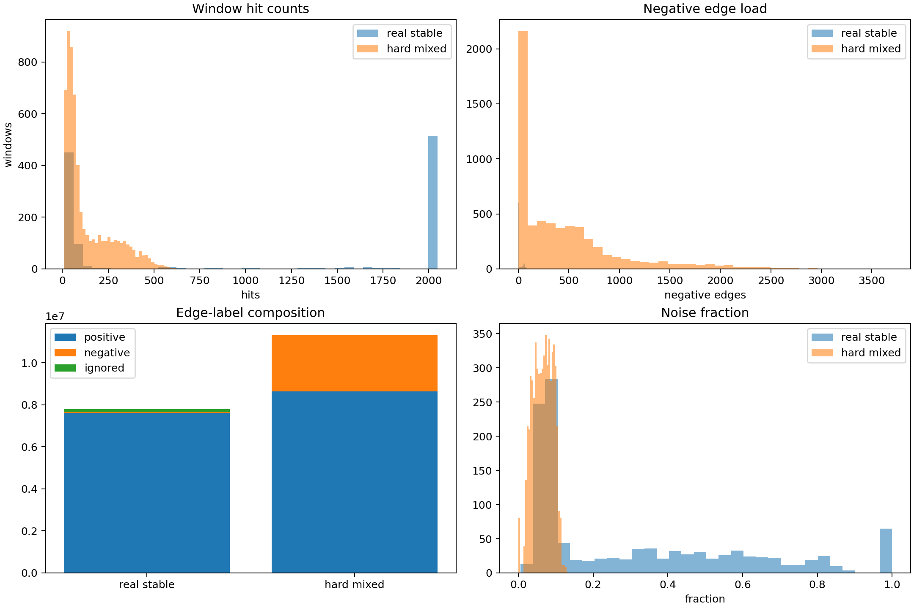
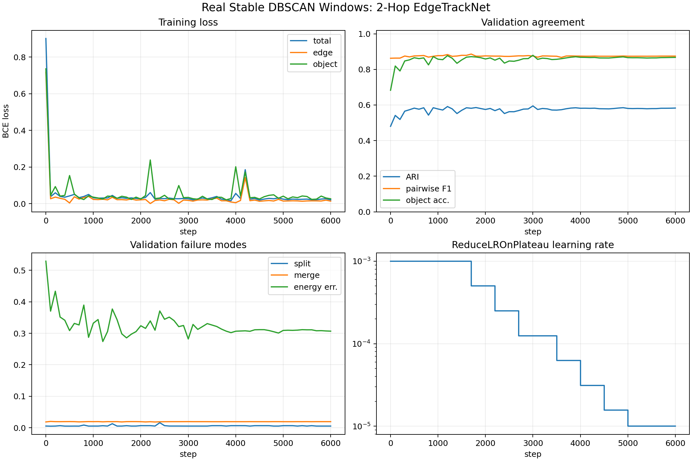
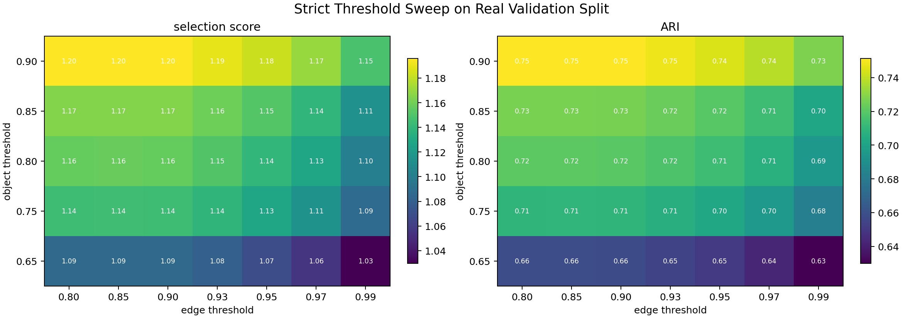
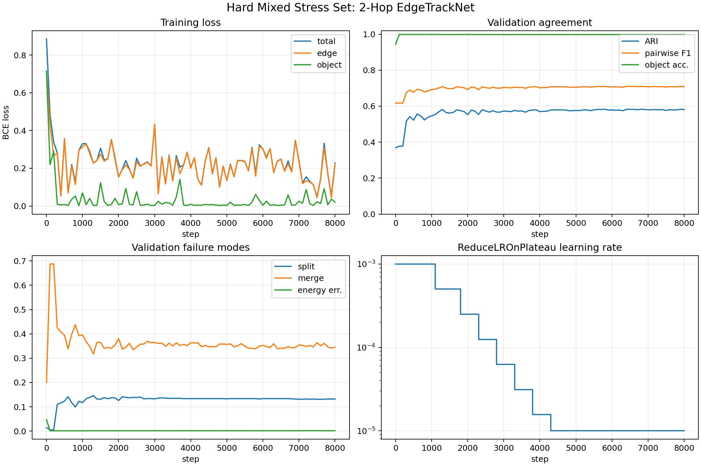
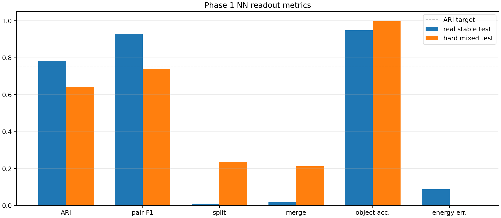
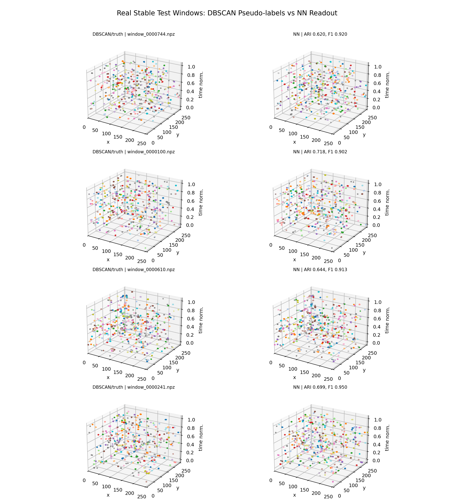
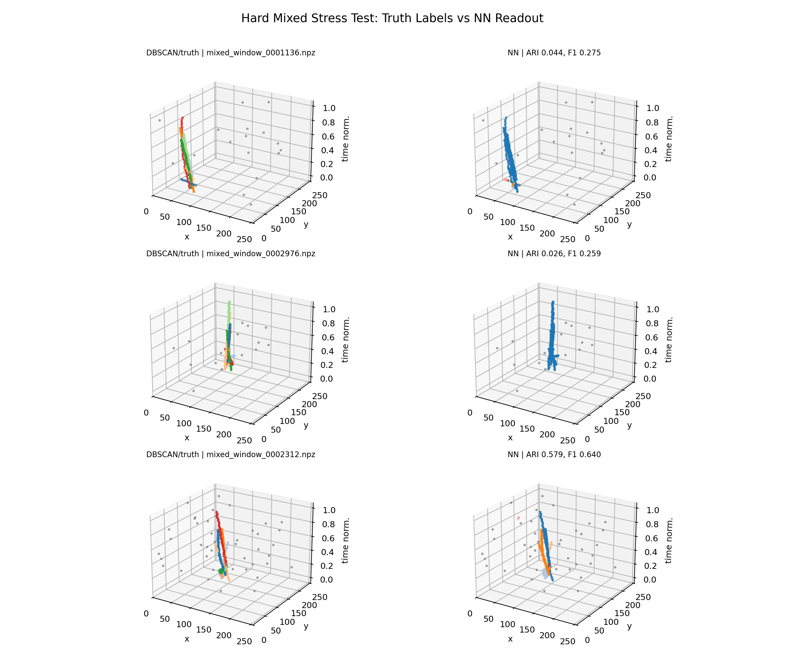

# Phase 1 Report: Neural Replacement for 3D DBSCAN Particle Extraction

Status: archived neural-network separator report. The active Phase 1 baseline is
now the exact, real-time `native-grid-dbscan` backend documented in
[`phase1-native-grid-baseline.md`](phase1-native-grid-baseline.md).

## Executive Summary

Phase 1 trained a hit-level graph neural network, `EdgeTrackNetTiny`, to replace the 3D DBSCAN particle extraction pass on stable pseudo-label windows. The model predicts local same-particle edges and hit objectness, then turns those probabilities into variable-size particle IDs with connected components. Energy is preserved as an input and output diagnostic, but the clustering distance and NN graph construction remain based on `(x, y, time)` geometry.

The strongest Phase 1 model is the 2-hop message-passing EdgeTrackNet trained on stable DBSCAN pseudo-label windows. With a strict validation-selected readout threshold, it meets the replacement target on the real stable test split.

| Metric | Value |
|---|---:|
| Adjusted Rand index | 0.7828 |
| Pairwise F1 | 0.9299 |
| Split rate | 0.0103 |
| Merge rate | 0.0184 |
| Object accuracy | 0.9484 |
| Energy error | 0.0889 |
| Latency p50 ms | 0.4779 |
| Latency p95 ms | 0.5012 |

Target gate: ARI >= 0.75, pairwise F1 >= 0.92, split <= 0.08, merge <= 0.08, object accuracy >= 0.9, energy error <= 0.2.

The hard mixed stress set remains deliberately harder than the stable DBSCAN distribution. It is useful as a failure-mode detector: the same architecture is not yet robust enough for dense close-particle ambiguity there.

## Data Preparation

### Source Labels

The teacher labels come from the 3D DBSCAN pipeline built earlier. Each raw `.t3pa` file was converted into an NPZ particle shard containing all hits and `hit_particle_id`, where `-1` is noise. For Phase 1 NN training, only stable pseudo-label windows are used: each candidate window is re-clustered with neighboring DBSCAN settings and kept only when the mean adjusted Rand index stays above the configured stability threshold. Unstable windows are omitted rather than treated as hard negatives.

### Hit Features

Each hit becomes a 7-value feature vector:

| Feature | Definition | Purpose |
|---|---|---|
| `x/255` | detector x normalized by chip width | spatial position |
| `y/255` | detector y normalized by chip height | spatial position |
| `t_norm` | per-window min-max normalized ToA | local timing coordinate |
| `log1p(ToT)` | energy-like feature saved as `hit_energy` | charge/energy proxy |
| `FToA/30` | fine time clipped to `[0, 4]` | timing refinement |
| `delta_t_prev` | previous time delta divided by p95 local delta, clipped to `[0, 10]` | local temporal pitch |
| `delta_t_next` | next time delta divided by p95 local delta, clipped to `[0, 10]` | local temporal pitch |

Windows are sorted by time. The real stable dataset uses `window_size=2048`, `window_overlap=512`, `k_neighbors=12`, and graph radius `3.5` in scaled `(x, y, t/time_scale)` space. The hard mixed dataset uses a denser graph (`k_neighbors=16`, radius `4.5`) to force nearby negative edges.

### Graph and Labels

For each window a directed local graph is built with SciPy `cKDTree`: every hit connects to up to `k` neighbors within the radius. Edge labels are: positive if both endpoints are non-noise and share the same DBSCAN particle ID, negative if both endpoints are non-noise and belong to different particles, and ignored if either endpoint is noise. Objectness labels are one for non-noise hits and zero for noise hits. Edge and object losses use cluster-balanced weights so large particles do not dominate the objective.

### Synthetic and Mixed Data

The new mixed dataset generator creates controlled validation and stress windows in the same NPZ format as real pseudo-label windows. It extracts real DBSCAN particle templates, recenters them, randomly shifts them in detector position and time, reflects them in x/y, injects noise hits, and combines multiple particles per window. It also generates procedural line, kink, blob, and dense-track particles. The `hard_fraction` mode deliberately places several particles within a small space-time neighborhood, producing many real negative edges and exposing split/merge weaknesses.

| Dataset | Windows | Train/Val/Test | Hits | Edges | Positive/Negative/Ignored Edges | Mean Particles | Mean Noise |
|---|---:|---:|---:|---:|---:|---:|---:|
| Real stable DBSCAN windows | 1167 | 802/181/184 | 1017.3 mean | 6680.4 mean | 6533.4/23.3/123.7 mean | 117.2 | 0.308 |
| Hard mixed stress windows | 6000 | 4181/903/916 | 136.4 mean | 1886.5 mean | 1438.7/446.7/1.1 mean | 5.0 | 0.065 |
| Mild mixed windows | 4000 | 2775/628/597 | 126.3 mean | 1555.5 mean | 1550.9/3.4/1.2 mean | 5.0 | 0.065 |



## Network Architecture

Final model config: `input_dim=7`, `hidden_dim=128`, `edge_hidden_dim=128`, `dropout=0.05`, `message_passing_steps=2`. The checkpoint has 316,802 trainable parameters.

| Block | Input -> Output | Layers | Parameters |
|---|---:|---|---:|
| Hit encoder | 7 -> 128 | Linear, LayerNorm, SiLU, Dropout(0.05), Linear, LayerNorm, SiLU | 18,048 |
| Message block x 2 | 387 edge input and 256 update input -> 128 | message MLP plus mean aggregation into destination nodes, then residual update MLP | 232,192 |
| Edge head | 387 -> 1 | Linear(387, 128), LayerNorm, SiLU, Dropout, Linear(128, 64), SiLU, Linear(64, 1) | 58,241 |
| Object head | 128 -> 1 | Linear(128, 64), SiLU, Linear(64, 1) | 8,321 |
| Total | - | all trainable | 316,802 |

### Forward Pass

1. The collate function concatenates variable-size windows into one node matrix `[total_hits, 7]`. Directed edge indices are offset and concatenated into `[2, total_edges]`. Per-window slices are retained for evaluation, but the forward pass itself is fully ragged.
2. The hit encoder maps each hit feature vector to a 128-dimensional hidden state using two linear layers with LayerNorm and SiLU activations.
3. Each message-passing step computes an edge message from `[h_src, h_dst, h_src - h_dst, distance, delta_t, delta_energy]`. Messages are mean-aggregated into destination nodes and passed through an update MLP. The node state is updated residually: `h = h + update([h, aggregate])`.
4. The edge head evaluates the final pair state `[h_src, h_dst, h_src - h_dst, aux]` and outputs one logit per directed edge. `sigmoid(edge_logit)` is interpreted as same-particle probability.
5. The object head outputs one logit per hit. `sigmoid(object_logit)` is interpreted as non-noise/object probability.
6. Readout filters hits by object threshold, unions endpoint pairs whose edge probability is above the edge threshold, and returns connected-component IDs. Inactive hits are `-1` noise.

### Initialization and Normalization

No custom initialization is used. `torch.nn.Linear` therefore uses the standard PyTorch reset behavior: Kaiming-uniform weight initialization with the linear-layer bias sampled from the corresponding fan-in bound. `LayerNorm` scale starts at one and bias starts at zero. Dropout is active only during training. Feature normalization is performed before the network, and LayerNorm is applied inside the hit encoder, message MLPs, update MLPs, and edge head.

## Training Setup

The final real-window run used AdamW with learning rate `0.001`, weight decay `0.0001`, batch size `4`, and `6000` requested steps. Validation ran every `100` steps. A `ReduceLROnPlateau` scheduler monitored the model-selection score and multiplied LR by `0.5` after `4` stagnant validation checks, down to `min_lr=1e-05`.

The loss is weighted binary cross entropy over labeled edges plus `0.25` times weighted binary cross entropy over hit objectness. Ignored noise edges do not contribute to edge loss. Model selection score combines ARI, pairwise F1, object accuracy, split/merge penalties, and energy error.

## Training Convergence

The original pairwise-only baseline learned a useful edge signal but did not reach the replacement gate. Its first pass test metrics were ARI `0.501`, pairwise F1 `0.840`, split/merge around `0.015`, object accuracy `0.786`, and energy error `0.423`. The 2-hop message-passing model is clearly stronger on the real stable distribution.

Best validation checkpoint for the real 2-hop model occurred at step `3000` before readout threshold tuning. The default sweep selected edge/object thresholds `0.8` / `0.8`, while the stricter sweep selected `0.85` / `0.9`.





The hard mixed stress set shows the current limit. It contains intentionally close particles and many negative edges; the 2-hop model improves over pairwise-only but still fails the replacement gate there.





## Validation Results

### Real Stable Test Split

Strict validation-selected thresholds on the real stable split:

| Metric | Value |
|---|---:|
| Adjusted Rand index | 0.7828 |
| Pairwise F1 | 0.9299 |
| Split rate | 0.0103 |
| Merge rate | 0.0184 |
| Object accuracy | 0.9484 |
| Energy error | 0.0889 |
| Latency p50 ms | 0.4779 |
| Latency p95 ms | 0.5012 |

The rendered examples below are intentionally challenging test windows selected by negative-edge load, particle count, and hit count. They are for visual inspection of failure modes; the table above is the aggregate held-out score.



### Hard Mixed Stress Split

The hard mixed stress split is not the acceptance target; it is a robustness probe. It reveals that the model can still merge or split close particles when the local radius graph contains many plausible negative edges.

| Metric | Value |
|---|---:|
| Adjusted Rand index | 0.6427 |
| Pairwise F1 | 0.7378 |
| Split rate | 0.2361 |
| Merge rate | 0.2132 |
| Object accuracy | 0.9975 |
| Energy error | 0.0024 |
| Latency p50 ms | 0.4937 |
| Latency p95 ms | 0.5234 |



## Example-Level Metrics

These example-level means summarize only the rendered inspection windows, not the full test split.

| Dataset | Examples | Mean ARI | Mean Pairwise F1 | Mean Split | Mean Merge |
|---|---:|---:|---:|---:|---:|
| real stable | 4 | 0.6704 | 0.9212 | 0.0077 | 0.0563 |
| hard mixed | 3 | 0.2162 | 0.3913 | 0.2500 | 0.5417 |

Detailed example rows are saved in [`validation_examples.csv`](assets/phase1_dbscan_replacement/validation_examples.csv).

## Interpretation

The Phase 1 NN is reasonable as a DBSCAN replacement for the stable pseudo-label distribution: it satisfies the chosen acceptance gate on held-out real windows after validation threshold selection, with sub-millisecond p95 window latency on the local GPU run. The model is especially good at preserving energy/objectness and avoiding gross over-splitting on real windows.

It is not yet a universal replacement for ambiguous close-particle cases. The hard mixed stress set produces substantially more negative edges than the real stable dataset, and the current connected-components readout still trades merges against splits as the edge threshold changes. The next model iteration should either add stronger relational context, edge calibration focused on hard negatives, or a learned clustering/readout layer rather than relying only on thresholded connected components.

## Reproduction Commands

```bash
particle-train-edge-tracknet \
  --manifest local_data/processed/pass1_edge_dataset/manifest.csv \
  --out local_data/experiments/edge_tracknet_real_mp_search \
  --steps 6000 \
  --min-steps 1500 \
  --batch-size 4 \
  --learning-rate 0.001 \
  --eval-interval 100 \
  --max-eval-windows 160 \
  --hidden-dim 128 \
  --edge-hidden-dim 128 \
  --message-passing-steps 2 \
  --device cuda
```

```bash
python scripts/generate_phase1_report.py
```
