# Phase 2 Largest Particle Reconstruction Snapshots

This demo uses the corrected `voxel_corner_min2_v001` particle dataset and the best reconstruction-style Phase 2 checkpoint from the representative sweep.

- Dataset: `local_data/processed/phase2_particles_voxel_corner_min2_v001`
- Checkpoint: `local_data/experiments/phase2_particle_sweep_voxel_corner_min2_v001_representative/runs/26_deepsets_denoising_ae_z8/checkpoint.pt`
- Model: `deepsets` / `denoising_ae`
- Latent size: `8`
- Decoder output size: `64` points
- Numeric summary: [largest_reconstruction_summary.csv](assets/phase2_voxel_reconstruction_snapshots/largest_reconstruction_summary.csv)

The left panel in each image is the actual Phase 2 input view, capped at 512 sampled hits for very large particles. The middle panel is the decoded 64-point point set. The right panel is the encoded latent vector `z`. Coordinates are particle-relative Phase 2 features: centered `x`, centered `y`, and scaled relative time. Color is normalized `log1p(ToT)` energy.

Important reading: the autoencoder is a compact point-set summarizer here. It is not expected to reproduce every hit of a 1000+ hit component; the useful question is whether the latent preserves enough morphology for downstream family grouping.

## Montage

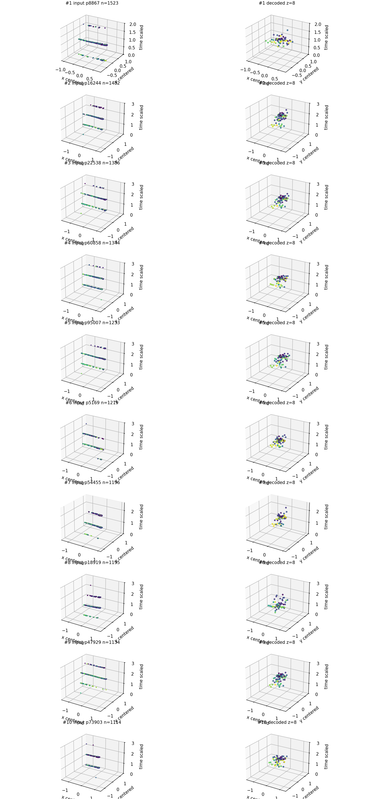

## Top Largest Views

| Rank | Source | Particle | Hits | View hits | Sample | Chamfer | z preview | Image |
|---:|---|---:|---:|---:|---:|---:|---|---|
| 1 | `F08/tot_toa__r0000000028.t3pa` | 8867 | 1523 | 512 | 0.336 | 0.5606 | `0.422, -0.354, 0.386, -0.304` | [png](assets/phase2_voxel_reconstruction_snapshots/particle_01_p008867_original_decoded.png) |
| 2 | `F08/tot_toa__r0000000028.t3pa` | 16244 | 1482 | 512 | 0.345 | 0.4541 | `0.415, -0.245, 0.365, -0.048` | [png](assets/phase2_voxel_reconstruction_snapshots/particle_02_p016244_original_decoded.png) |
| 3 | `F08/tot_toa__r0000000052.t3pa` | 22538 | 1386 | 512 | 0.369 | 0.4476 | `0.419, -0.258, 0.387, -0.108` | [png](assets/phase2_voxel_reconstruction_snapshots/particle_03_p022538_original_decoded.png) |
| 4 | `F08/tot_toa__r0000000028.t3pa` | 60858 | 1344 | 512 | 0.381 | 0.3736 | `0.437, -0.278, 0.343, -0.218` | [png](assets/phase2_voxel_reconstruction_snapshots/particle_04_p060858_original_decoded.png) |
| 5 | `F08/tot_toa__r0000000052.t3pa` | 95007 | 1233 | 512 | 0.415 | 0.4357 | `0.411, -0.279, 0.378, -0.180` | [png](assets/phase2_voxel_reconstruction_snapshots/particle_05_p095007_original_decoded.png) |
| 6 | `F08/tot_toa__r0000000028.t3pa` | 5169 | 1219 | 512 | 0.420 | 0.6351 | `0.418, -0.244, 0.374, -0.058` | [png](assets/phase2_voxel_reconstruction_snapshots/particle_06_p005169_original_decoded.png) |
| 7 | `F08/tot_toa__r0000000052.t3pa` | 54455 | 1196 | 512 | 0.428 | 0.4962 | `0.384, -0.181, 0.338, 0.078` | [png](assets/phase2_voxel_reconstruction_snapshots/particle_07_p054455_original_decoded.png) |
| 8 | `F08/tot_toa__r0000000027.t3pa` | 18919 | 1195 | 512 | 0.428 | 0.3543 | `0.396, -0.277, 0.251, -0.510` | [png](assets/phase2_voxel_reconstruction_snapshots/particle_08_p018919_original_decoded.png) |
| 9 | `F08/tot_toa__r0000000052.t3pa` | 47929 | 1134 | 512 | 0.451 | 0.4725 | `0.401, -0.268, 0.402, -0.126` | [png](assets/phase2_voxel_reconstruction_snapshots/particle_09_p047929_original_decoded.png) |
| 10 | `F08/tot_toa__r0000000028.t3pa` | 73903 | 1114 | 512 | 0.460 | 0.4192 | `0.430, -0.286, 0.299, -0.303` | [png](assets/phase2_voxel_reconstruction_snapshots/particle_10_p073903_original_decoded.png) |

### Rank 1: Particle 8867

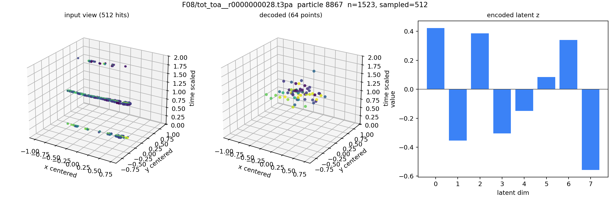

### Rank 2: Particle 16244

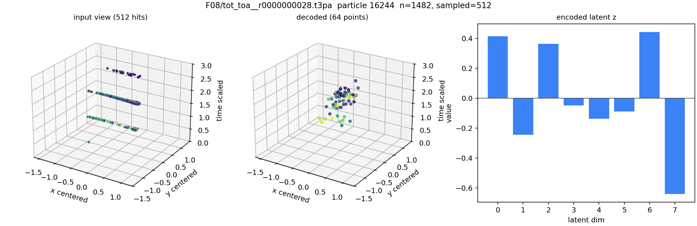

### Rank 3: Particle 22538

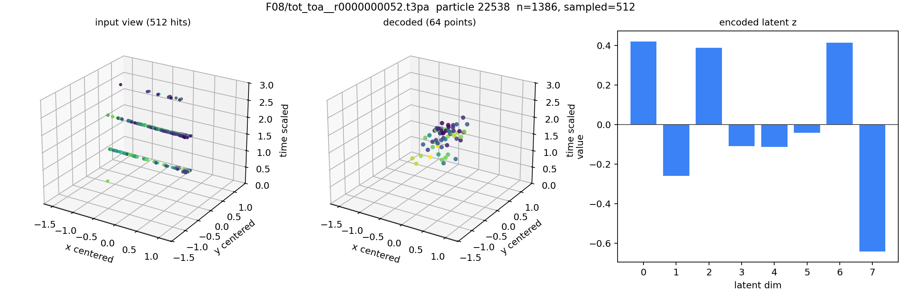

### Rank 4: Particle 60858

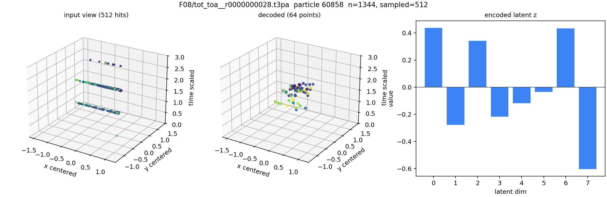

### Rank 5: Particle 95007

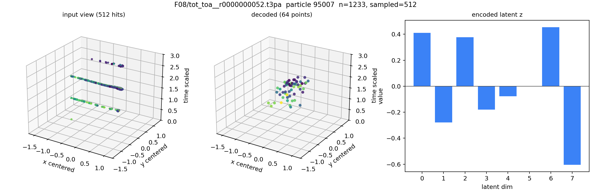

### Rank 6: Particle 5169

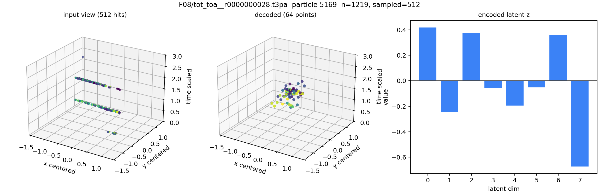

### Rank 7: Particle 54455

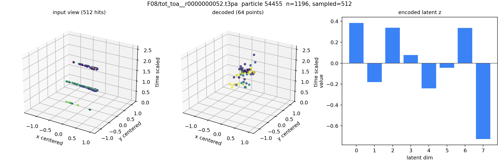

### Rank 8: Particle 18919

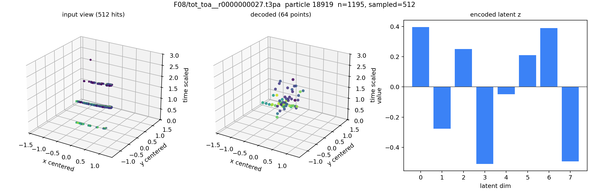

### Rank 9: Particle 47929

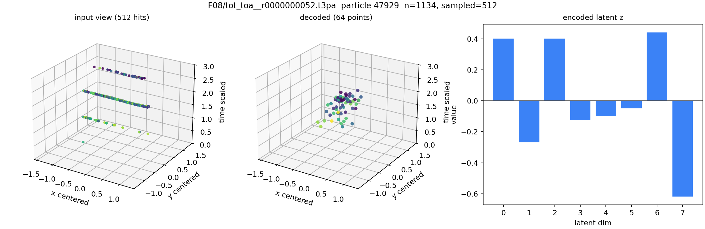

### Rank 10: Particle 73903

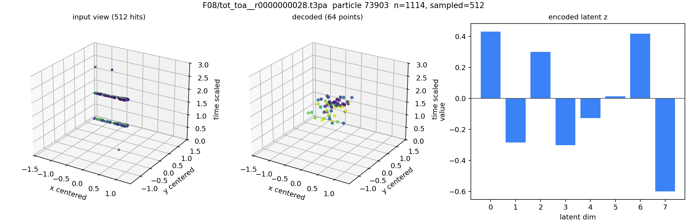
