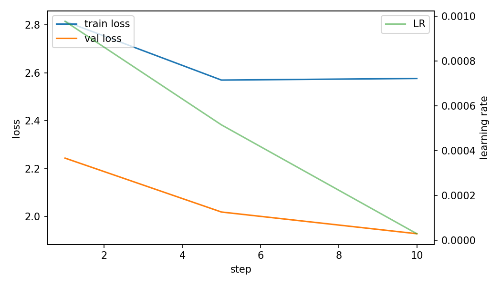
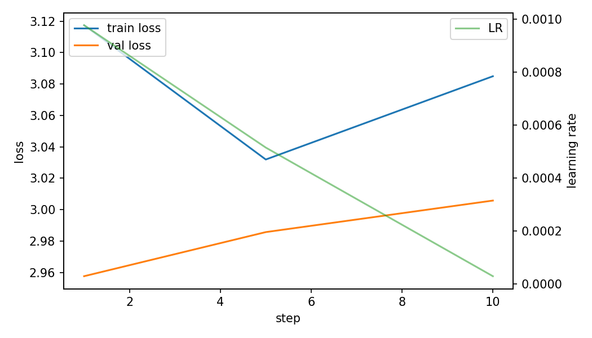

# Phase 2 Particle Embedding Report

## Scope

Phase 2 starts after the active `native-grid-dbscan` separator has produced variable-size particles. The neural networks in this phase do not replace the separator; they learn embeddings for already separated `(x, y, time, energy)` hit sequences, then cluster those embeddings to discover particle families.

Discovered cluster IDs are morphology groups, not physical particle labels. They must be named later by inspection, simulation truth, or external labels.

## Current Run Status

The tracked metrics in this report come from the completed `smoke` run artifacts in `local_data/experiments/phase2_particle_sweep_v001`. A smoke run proves the full data/model/evaluation/report path; it is not a final overnight-quality physics result.

Full overnight command prepared by this implementation:

```bash
particle-train-phase2-sweep \
  --dataset local_data/processed/phase2_particles_v001 \
  --out local_data/experiments/phase2_particle_sweep_v001_overnight \
  --budget overnight \
  --device cuda \
  --batch-size 64

particle-evaluate-phase2 \
  --dataset local_data/processed/phase2_particles_v001 \
  --experiment local_data/experiments/phase2_particle_sweep_v001_overnight \
  --out local_data/experiments/phase2_particle_sweep_v001_overnight/evaluation \
  --device cuda
```

## Data Flow

Raw `.t3pa` files are separated by the native DBSCAN baseline into NPZ particle shards. `particle-build-phase2-dataset` converts every non-noise particle into one or more variable-hit views, with source-grouped train/validation/test splits by raw file. Large particles are sampled into multiple views capped at `max_points` while keeping full-particle summary descriptors.

- dataset views: 98500
- particles represented: 98341
- total view hits: 1146043
- split counts: `{'test': 13515, 'train': 66641, 'val': 18344}`
- size buckets: `{'1-3': 8568, '11-50': 28336, '4-10': 60025, '51-512': 1359, '>512 sampled': 212}`

## Input Tensors

Per-hit point features: `x_centered`, `y_centered`, `t_scaled`, `t_norm`, `log_tot`, `ftoa_norm`, `r_norm`, `cos_theta`, `sin_theta`, `rank_time`.

Global summary features are concatenated after point pooling: `log_n_hits`, `log_total_energy`, `log_max_energy`, `mean_energy`, `std_energy`, `duration_scaled`, `log_duration`, `bbox_x`, `bbox_y`, `bbox_area`, `density_xy_time`, `pca_xy_linearity`, `pca_xy_minor`, `pca_xyt_linearity`, `pca_xyt_planarity`, `q_theta`, `cos_phi_t`, `sin_phi_t`, `sample_fraction`, `view_log_n_hits`, `large_flag`, `time_monotonicity`. Train-split mean/std statistics are stored in `normalization.json` and reused during training and evaluation.

## Model Family

The sweep supports four encoder backbones: `DeepSets/PointNet`, `EdgeConv/DGCNN-lite`, `SetTransformer-lite`, and `PointTransformer-lite`. Objectives cover point autoencoding, denoising autoencoding, masked point autoencoding, contrastive ParticleEmbed, DEC, and VaDE-style variational clustering. All models output a fixed-size latent vector `z` per particle view.

Training uses AdamW, cosine learning-rate scheduling, gradient clipping, automatic mixed precision on CUDA, hit dropout/jitter/time stretch augmentations where relevant, and stratified batches across hit-count buckets.

| Component | Implementation Detail |
|---|---|
| DeepSets/PointNet | shared hit MLP, max/mean/attention pooling, summary MLP, latent projection |
| EdgeConv/DGCNN-lite | shared hit MLP plus local kNN message block before pooling |
| SetTransformer-lite | two masked self-attention encoder layers over hit tokens |
| PointTransformer-lite | position-conditioned masked transformer over hit tokens |
| AE / denoising / masked AE | fixed-size point decoder trained with Chamfer-style reconstruction loss |
| Contrastive ParticleEmbed | two augmented views with InfoNCE alignment/uniformity objective |
| DEC | cluster-logit KL self-training target for frozen/fine-tuned embeddings |
| VaDE/GMM-VAE | variational latent with reconstruction, KL, and soft mixture entropy terms |

## Sweep Results

| Run | Backbone | Objective | Best Step | Val Loss | Embeddings | Selection |
|---|---|---|---:|---:|---:|---:|
| `01_deepsets_ae` | deepsets | ae | 10 | 1.9288 | 64 | -1.9274 |
| `02_edgeconv_contrastive` | edgeconv | contrastive | 1 | 2.9576 | 64 | -2.9554 |

## Clustering Results

| Run | Method | Clusters | Noise | Silhouette | Davies-Bouldin |
|---|---|---:|---:|---:|---:|
| `01_deepsets_ae` | kmeans_8 | 8 | 0.000 | 0.099 | 0.000 |
| `01_deepsets_ae` | gmm_8_unavailable_kmeans_fallback | 8 | 0.000 | 0.099 | 0.000 |
| `01_deepsets_ae` | kmeans_12 | 12 | 0.000 | 0.169 | 0.000 |
| `01_deepsets_ae` | gmm_12_unavailable_kmeans_fallback | 12 | 0.000 | 0.169 | 0.000 |
| `01_deepsets_ae` | kmeans_16 | 16 | 0.000 | 0.095 | 0.000 |
| `01_deepsets_ae` | gmm_16_unavailable_kmeans_fallback | 16 | 0.000 | 0.095 | 0.000 |
| `01_deepsets_ae` | kmeans_24 | 24 | 0.000 | 0.116 | 0.000 |
| `01_deepsets_ae` | gmm_24_unavailable_kmeans_fallback | 24 | 0.000 | 0.116 | 0.000 |
| `01_deepsets_ae` | hdbscan_unavailable_kmeans_fallback | 8 | 0.000 | 0.099 | 0.000 |
| `02_edgeconv_contrastive` | kmeans_8 | 8 | 0.000 | 0.158 | 0.000 |
| `02_edgeconv_contrastive` | gmm_8_unavailable_kmeans_fallback | 8 | 0.000 | 0.158 | 0.000 |
| `02_edgeconv_contrastive` | kmeans_12 | 12 | 0.000 | 0.183 | 0.000 |
| `02_edgeconv_contrastive` | gmm_12_unavailable_kmeans_fallback | 12 | 0.000 | 0.183 | 0.000 |
| `02_edgeconv_contrastive` | kmeans_16 | 16 | 0.000 | 0.129 | 0.000 |
| `02_edgeconv_contrastive` | gmm_16_unavailable_kmeans_fallback | 16 | 0.000 | 0.129 | 0.000 |
| `02_edgeconv_contrastive` | kmeans_24 | 24 | 0.000 | 0.091 | 0.000 |
| `02_edgeconv_contrastive` | gmm_24_unavailable_kmeans_fallback | 24 | 0.000 | 0.091 | 0.000 |
| `02_edgeconv_contrastive` | hdbscan_unavailable_kmeans_fallback | 8 | 0.000 | 0.158 | 0.000 |

## Plots






## Interpretation Checklist

- Prefer HDBSCAN for first-pass family discovery because it can leave ambiguous particles as noise.
- Compare discovered families by hit-count bucket, time span, total energy, PCA descriptors, and prototype galleries before assigning names.
- Train supervised imitator classifiers only after a discovered clustering is frozen; imitator accuracy is a deployment metric, not discovery truth.
- Treat file-scale or diffuse large clusters as quality-flagged candidates that may need separator review before physical interpretation.
