# Phase 2 Canonical Path Autoencoder Report

This model separates detector-plane rotation before encoding. The network sees canonical ordered paths and stores `theta_xy` as metadata outside the latent vector.

- checkpoint: `local_data/experiments/phase2_path_ae_focus_v002_wide/runs/path_ae_z128_p128_h256/checkpoint.pt`
- latent dim: `128`
- path samples: `128`
- hidden dim: `256`

## Metrics

| split | loss | path relative L2 | energy-path relative L2 | diff relative L2 | energy sum rel L1 |
|---|---:|---:|---:|---:|---:|
| val | 0.4610 | 0.1766 | 0.1492 | 0.5980 | 0.0066 |
| test | 0.4547 | 0.1722 | 0.1467 | 0.5990 | 0.0066 |

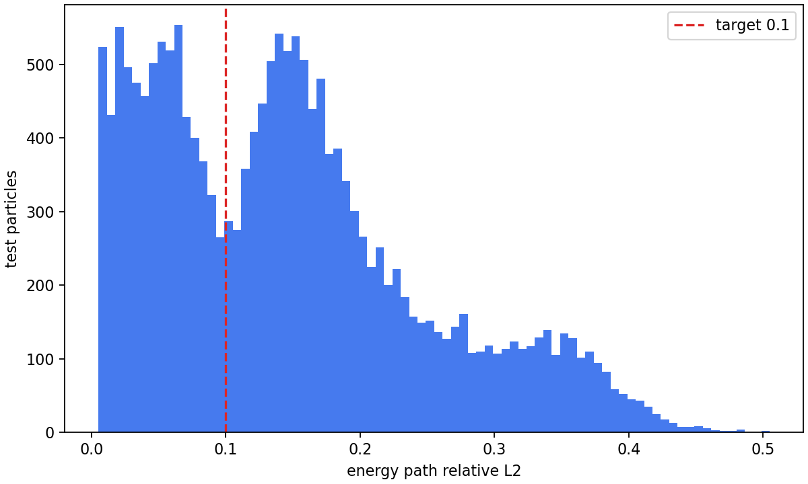

## Largest Test Particles

| rank | source | particle | hits | energy-path rel L2 | image |
|---:|---|---:|---:|---:|---|
| 1 | `F08/tot_toa__r0000000042.t3pa` | 18070 | 512 | 0.2886 | [png](assets/phase2_path_ae_focus_v001/neural_z128/largest_01_p18070_path_ae.png) |
| 2 | `F08/tot_toa__r0000000042.t3pa` | 35403 | 512 | 0.3346 | [png](assets/phase2_path_ae_focus_v001/neural_z128/largest_02_p35403_path_ae.png) |
| 3 | `F08/tot_toa__r0000000028.t3pa` | 8867 | 512 | 0.3934 | [png](assets/phase2_path_ae_focus_v001/neural_z128/largest_03_p8867_path_ae.png) |
| 4 | `F08/tot_toa__r0000000028.t3pa` | 47164 | 512 | 0.3395 | [png](assets/phase2_path_ae_focus_v001/neural_z128/largest_04_p47164_path_ae.png) |
| 5 | `F08/tot_toa__r0000000028.t3pa` | 95108 | 512 | 0.3432 | [png](assets/phase2_path_ae_focus_v001/neural_z128/largest_05_p95108_path_ae.png) |
| 6 | `F08/tot_toa__r0000000028.t3pa` | 3615 | 512 | 0.3471 | [png](assets/phase2_path_ae_focus_v001/neural_z128/largest_06_p3615_path_ae.png) |
| 7 | `F08/tot_toa__r0000000028.t3pa` | 2618 | 512 | 0.3524 | [png](assets/phase2_path_ae_focus_v001/neural_z128/largest_07_p2618_path_ae.png) |
| 8 | `F08/tot_toa__r0000000028.t3pa` | 3209 | 512 | 0.3406 | [png](assets/phase2_path_ae_focus_v001/neural_z128/largest_08_p3209_path_ae.png) |
| 9 | `F08/tot_toa__r0000000028.t3pa` | 48342 | 512 | 0.2920 | [png](assets/phase2_path_ae_focus_v001/neural_z128/largest_09_p48342_path_ae.png) |
| 10 | `F08/tot_toa__r0000000042.t3pa` | 3888 | 512 | 0.3887 | [png](assets/phase2_path_ae_focus_v001/neural_z128/largest_10_p3888_path_ae.png) |

### Rank 1

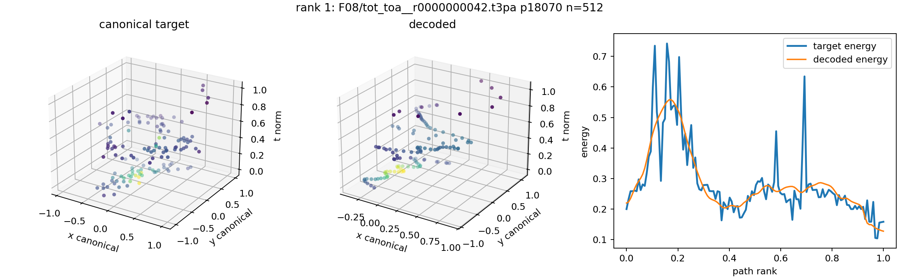

### Rank 2

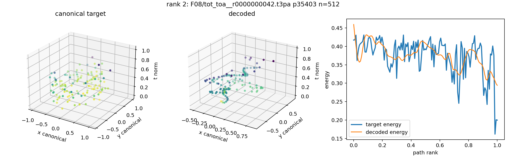

### Rank 3

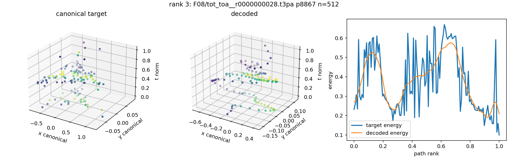

### Rank 4

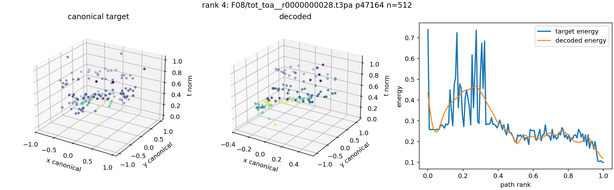

### Rank 5

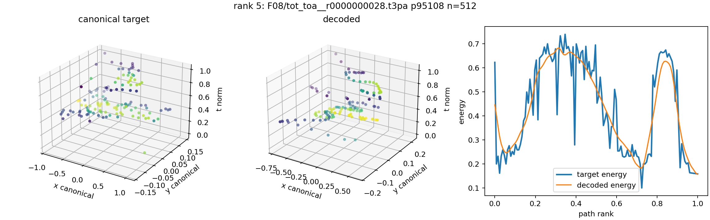

### Rank 6

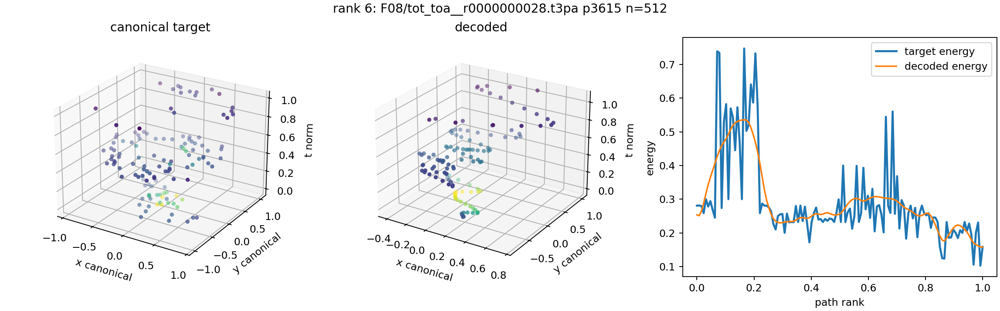

### Rank 7

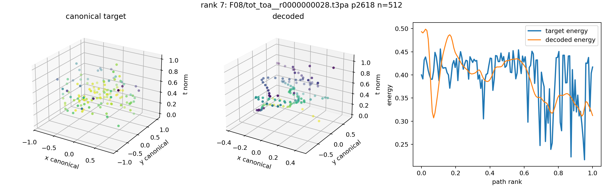

### Rank 8

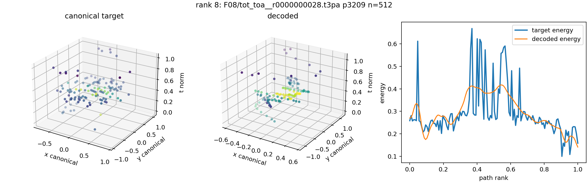

### Rank 9

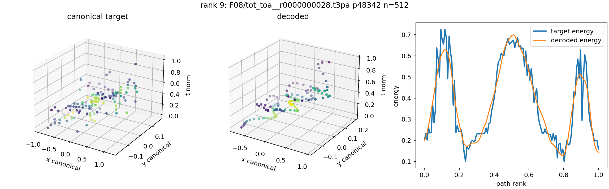

### Rank 10

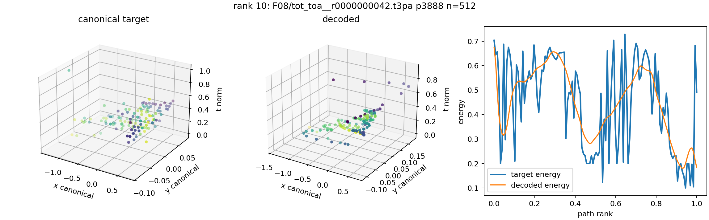
