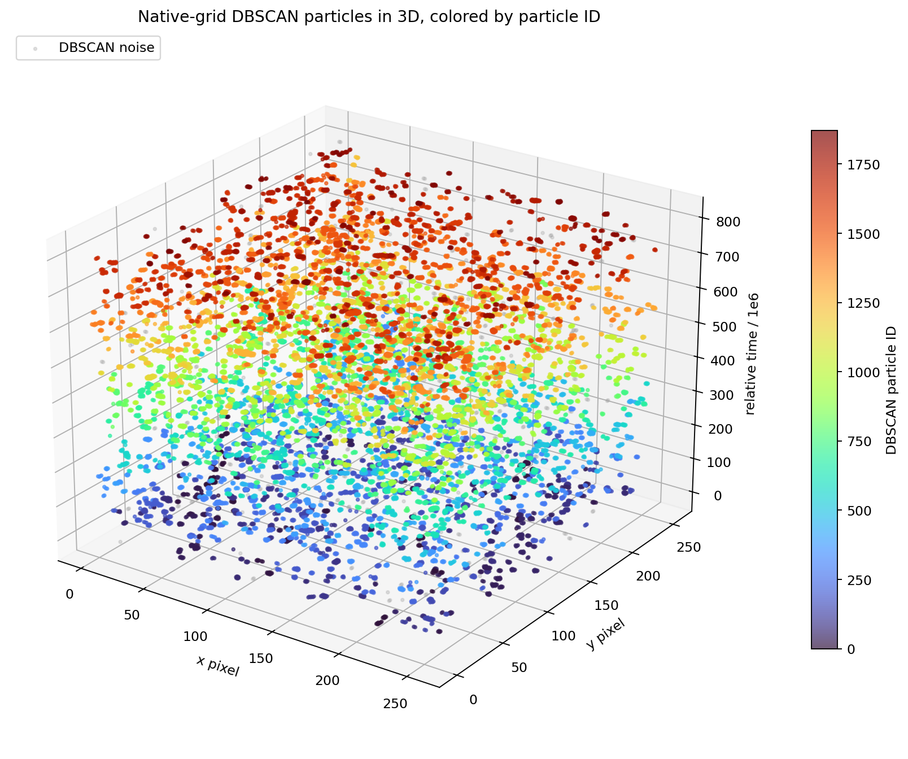
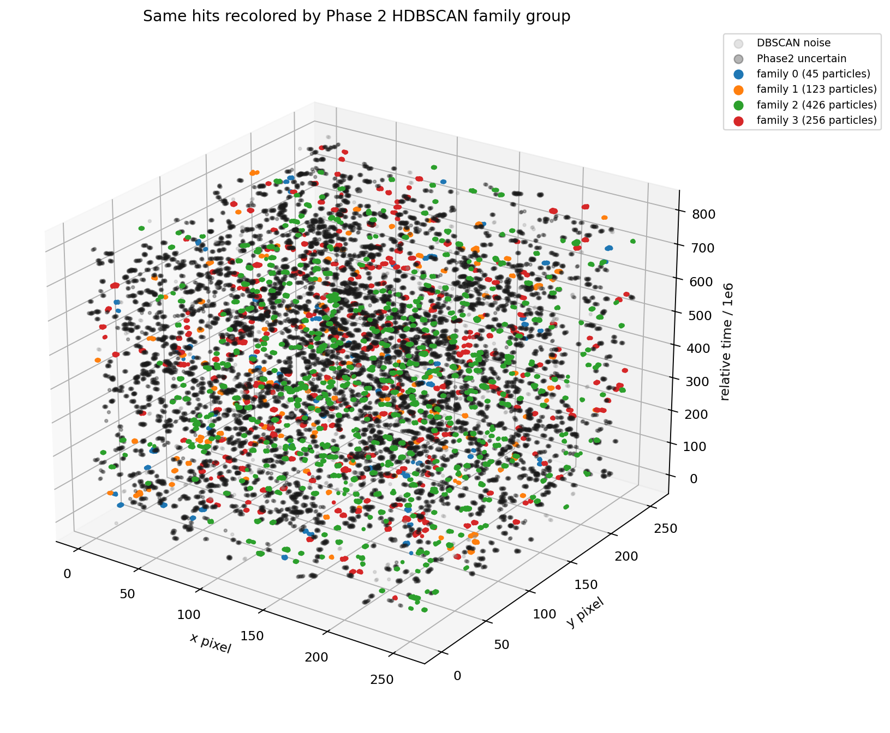
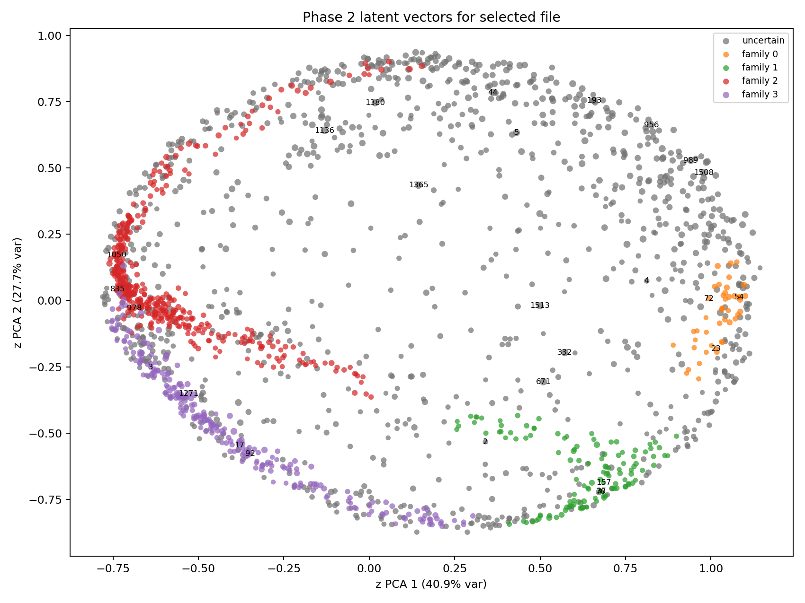

# Phase 2 Selected File Demo

Source file: `F08/tot_toa__r0000000000.t3pa`

This replaces the earlier 69k-hit example, which was a useful warning but a poor demo: native-grid DBSCAN connected almost all hits into one giant component `p1`. DBSCAN uses density-connected components, so if a chain of neighboring hits bridges the event, it merges everything along that chain. Phase 2 cannot split that afterward because Phase 2 receives DBSCAN particles as already-separated objects.

For the clearer demo here I selected a balanced file with many small DBSCAN particles: 21,657 hits, 1,872 DBSCAN particles, largest DBSCAN particle 124 hits, median 7 hits. It is only 0.35% of the largest file, but it is a much better visualization of the Phase 1 -> Phase 2 flow.

Follow-up audit note: even this "clearer" file still contains merged
multi-clump DBSCAN particles under `dbscan_v001`. Use this page as a diagnostic
view of the old separator, not as evidence that Phase 2 families are physically
meaningful.

Phase 2 model used here: `17_settransformer_dec`, the best HDBSCAN family-discovery row from the overnight report. The plotted/CSV encoding is the normalized 64-dimensional latent vector `z` from that model. The final family group is assigned by HDBSCAN approximate prediction against the validation embeddings from that run. `-1` means HDBSCAN considered the particle uncertain/noise in embedding space.

## File Summary

- raw hits in particle shard: 21,657
- fraction of largest file: 0.35%
- DBSCAN particles: 1,872
- DBSCAN noise hits: 419
- largest DBSCAN particle: 124 hits (0.57% of file)
- median DBSCAN particle: 7.0 hits
- Phase 2 HDBSCAN family counts: `{-1: 1022, 0: 45, 1: 123, 2: 426, 3: 256}`
- DEC-head argmax counts: `{0: 185, 1: 120, 3: 91, 4: 98, 5: 64, 6: 167, 7: 52, 8: 298, 9: 142, 11: 167, 12: 146, 13: 2, 14: 340}`
- full embedding table: [particle_embeddings_and_groups.csv](assets/phase2_selected_file_demo/particle_embeddings_and_groups.csv)

## 3D DBSCAN Particles

The colorbar is DBSCAN particle ID. A legend with 1,872 entries would be unreadable, so this plot uses a continuous particle-ID colormap.

## 3D Hits Recolored By Phase 2 Family

Each hit keeps its DBSCAN particle membership, but the particle color is replaced by the Phase 2 embedding-family assignment.

## Phase 2 Latent PCA

Each point is one DBSCAN particle. Marker size scales with hit count. Only the largest or most confident examples are text-labeled to keep the plot readable.

## Per-Particle Encodings And Groups

The table below is an inspectable subset: largest particles, most confident family examples, and representative uncertain particles. The CSV contains all 1,872 particles and all 64 latent dimensions.

| particle_id | n_hits | sample_fraction | energy_sum | time_span      | phase2_family_hdbscan | phase2_family_strength | dec_group_argmax | dec_group_confidence | z_pca_0 | z_pca_1 | z_pca_2 | z_00    | z_01    | z_02    | z_03    | z_04    | z_05    | z_06    | z_07    |
| ----------- | ------ | --------------- | ---------- | -------------- | --------------------- | ---------------------- | ---------------- | -------------------- | ------- | ------- | ------- | ------- | ------- | ------- | ------- | ------- | ------- | ------- | ------- |
| 1365        | 124    | 1.0000          | 354.6581   | 177852032.0000 | -1                    | 0.0000                 | 5                | 1.0000               | 0.1440  | 0.4351  | 0.8788  | 0.2478  | 0.0393  | 0.0185  | 0.0460  | 0.0559  | 0.1382  | -0.1703 | 0.0617  |
| 671         | 120    | 1.0000          | 340.4886   | 223065718.0000 | -1                    | 0.0000                 | 7                | 0.5046               | 0.5094  | -0.3060 | 0.8166  | 0.0185  | 0.1478  | -0.1181 | -0.0558 | 0.1430  | -0.1155 | -0.2452 | -0.0331 |
| 332         | 119    | 1.0000          | 341.4153   | 275359417.0000 | -1                    | 0.0000                 | 7                | 0.9953               | 0.5721  | -0.1960 | 0.7877  | 0.0348  | 0.1557  | -0.1632 | -0.0263 | 0.1566  | -0.1190 | -0.2431 | -0.0560 |
| 1508        | 91     | 1.0000          | 260.4970   | 151823683.0000 | -1                    | 0.0000                 | 3                | 0.9998               | 0.9788  | 0.4813  | 0.2710  | 0.1535  | 0.1310  | -0.2045 | 0.1545  | 0.0735  | -0.0427 | -0.1976 | -0.1141 |
| 44          | 89     | 1.0000          | 258.4503   | 169431689.0000 | -1                    | 0.0000                 | 3                | 0.9880               | 0.3615  | 0.7849  | 0.3651  | 0.2697  | -0.0084 | 0.0085  | 0.1104  | -0.0230 | 0.1574  | -0.0950 | 0.0381  |
| 989         | 79     | 1.0000          | 227.2999   | 209557841.0000 | -1                    | 0.0000                 | 3                | 1.0000               | 0.9410  | 0.5285  | 0.2796  | 0.1648  | 0.1154  | -0.1820 | 0.1456  | 0.0637  | -0.0102 | -0.2078 | -0.0947 |
| 956         | 76     | 1.0000          | 218.5691   | 201171183.0000 | -1                    | 0.0000                 | 3                | 1.0000               | 0.8253  | 0.6610  | 0.1169  | 0.1845  | 0.0848  | -0.1236 | 0.1508  | 0.0255  | 0.0401  | -0.1393 | -0.0829 |
| 1380        | 76     | 1.0000          | 217.3342   | 135691095.0000 | -1                    | 0.0000                 | 5                | 1.0000               | 0.0173  | 0.7453  | 0.5631  | 0.2852  | -0.0528 | 0.0436  | 0.0941  | -0.0008 | 0.1800  | -0.0453 | 0.0651  |
| 1136        | 72     | 1.0000          | 200.9942   | 146983728.0000 | -1                    | 0.0000                 | 5                | 0.9999               | -0.1305 | 0.6408  | 0.4637  | 0.2585  | -0.0548 | 0.1425  | 0.0423  | -0.0516 | 0.2490  | -0.0341 | 0.1189  |
| 1513        | 72     | 1.0000          | 200.3032   | 133431858.0000 | -1                    | 0.0000                 | 7                | 0.9961               | 0.4997  | -0.0200 | 0.9448  | 0.1116  | 0.1362  | -0.1208 | 0.0010  | 0.1405  | -0.0494 | -0.2620 | -0.0212 |
| 193         | 71     | 1.0000          | 200.6189   | 97870921.0000  | -1                    | 0.0000                 | 3                | 0.9998               | 0.6589  | 0.7545  | 0.1834  | 0.2279  | 0.0377  | -0.0720 | 0.1450  | -0.0059 | 0.0765  | -0.1108 | -0.0355 |
| 112         | 70     | 1.0000          | 193.8493   | 133433710.0000 | -1                    | 0.0000                 | 3                | 1.0000               | 0.8572  | 0.5726  | 0.4978  | 0.2105  | 0.0999  | -0.1855 | 0.1490  | 0.0769  | -0.0279 | -0.1992 | -0.0817 |
| 12          | 69     | 1.0000          | 190.1227   | 191210124.0000 | -1                    | 0.0000                 | 7                | 0.9999               | 0.7542  | 0.2122  | 0.7248  | 0.1508  | 0.1530  | -0.1864 | 0.0667  | 0.1279  | -0.0460 | -0.2682 | -0.0655 |
| 5           | 67     | 1.0000          | 194.5828   | 209834477.0000 | -1                    | 0.0000                 | 5                | 0.9894               | 0.4307  | 0.6331  | 0.7429  | 0.2712  | 0.0390  | -0.0730 | 0.0840  | 0.0662  | 0.0959  | -0.1864 | 0.0158  |
| 446         | 66     | 1.0000          | 195.3968   | 94369793.0000  | -1                    | 0.0000                 | 3                | 0.9631               | 0.6311  | 0.6025  | 0.7135  | 0.2480  | 0.0644  | -0.1401 | 0.1215  | 0.0777  | 0.0195  | -0.1873 | -0.0273 |
| 676         | 63     | 1.0000          | 183.2269   | 200410521.0000 | -1                    | 0.0000                 | 5                | 0.9985               | 0.4990  | 0.3276  | 0.8798  | 0.2036  | 0.1174  | -0.1046 | 0.0639  | 0.1110  | 0.0375  | -0.2494 | -0.0128 |
| 1180        | 61     | 1.0000          | 178.8981   | 130120922.0000 | -1                    | 0.0000                 | 7                | 1.0000               | 0.8013  | 0.2318  | 0.7274  | 0.1506  | 0.1494  | -0.2154 | 0.0923  | 0.1298  | -0.0838 | -0.2476 | -0.0760 |
| 936         | 59     | 1.0000          | 168.6053   | 182414794.0000 | -1                    | 0.0000                 | 7                | 0.7120               | 0.8755  | 0.3879  | 0.5732  | 0.1762  | 0.1413  | -0.2145 | 0.1076  | 0.1041  | -0.0434 | -0.2494 | -0.0858 |
| 1078        | 59     | 1.0000          | 165.4778   | 191038287.0000 | -1                    | 0.0000                 | 5                | 1.0000               | -0.0807 | 0.5805  | 0.7689  | 0.2497  | -0.0506 | 0.0618  | 0.0568  | 0.0218  | 0.1901  | -0.0912 | 0.0931  |
| 166         | 21     | 1.0000          | 55.1303    | 124404694.0000 | 0                     | 1.0000                 | 12               | 1.0000               | 1.0689  | 0.0171  | -0.1723 | -0.0309 | 0.1450  | -0.1517 | 0.1402  | 0.0357  | -0.1091 | -0.1549 | -0.1008 |
| 237         | 19     | 1.0000          | 55.6748    | 54713191.0000  | 0                     | 1.0000                 | 12               | 1.0000               | 1.0575  | 0.1399  | -0.1642 | -0.0033 | 0.1448  | -0.1538 | 0.1577  | 0.0343  | -0.0839 | -0.1524 | -0.1139 |
| 1533        | 17     | 1.0000          | 47.6961    | 1836339.0000   | 0                     | 1.0000                 | 12               | 1.0000               | 1.0962  | 0.0589  | -0.1494 | -0.0186 | 0.1378  | -0.1605 | 0.1641  | 0.0356  | -0.1300 | -0.1508 | -0.1120 |
| 1052        | 16     | 1.0000          | 47.3332    | 62136092.0000  | 0                     | 1.0000                 | 12               | 1.0000               | 1.0525  | 0.0139  | -0.2279 | -0.0445 | 0.1364  | -0.1391 | 0.1441  | 0.0268  | -0.1081 | -0.1380 | -0.1061 |
| 619         | 15     | 1.0000          | 41.6462    | 16535379.0000  | 0                     | 1.0000                 | 12               | 1.0000               | 1.0463  | 0.0492  | -0.2432 | -0.0389 | 0.1337  | -0.1399 | 0.1519  | 0.0241  | -0.1016 | -0.1296 | -0.1100 |
| 1386        | 15     | 1.0000          | 40.6448    | 4728328.0000   | 0                     | 1.0000                 | 12               | 1.0000               | 1.0545  | -0.0822 | -0.2472 | -0.0652 | 0.1200  | -0.1187 | 0.1500  | 0.0119  | -0.1333 | -0.1343 | -0.0761 |
| 1669        | 13     | 1.0000          | 36.1851    | 45511487.0000  | 0                     | 1.0000                 | 12               | 1.0000               | 1.0852  | 0.0032  | -0.0920 | -0.0265 | 0.1563  | -0.1863 | 0.1455  | 0.0546  | -0.1339 | -0.1668 | -0.1231 |
| 1492        | 12     | 1.0000          | 36.4089    | 49509084.0000  | 0                     | 1.0000                 | 12               | 1.0000               | 1.0858  | -0.0417 | -0.1028 | -0.0385 | 0.1504  | -0.1808 | 0.1441  | 0.0505  | -0.1424 | -0.1652 | -0.1154 |
| 488         | 10     | 1.0000          | 28.3335    | 1783542.0000   | 1                     | 1.0000                 | 1                | 0.9998               | 0.6942  | -0.6530 | -0.1295 | -0.1623 | 0.0327  | 0.0861  | 0.0400  | -0.0535 | -0.2245 | -0.0625 | 0.0445  |
| 1677        | 8      | 1.0000          | 21.3193    | 3.0000         | 1                     | 1.0000                 | 6                | 0.9999               | 0.6211  | -0.7845 | 0.1924  | -0.1528 | 0.0639  | 0.1117  | -0.0059 | -0.0291 | -0.2116 | -0.1407 | 0.0689  |
| 162         | 7      | 1.0000          | 17.1444    | 2.0000         | 1                     | 1.0000                 | 11               | 0.7749               | 0.4606  | -0.4720 | -0.5816 | -0.1836 | -0.0110 | 0.1626  | -0.0026 | -0.1296 | -0.1147 | 0.0885  | 0.0258  |
| 1062        | 7      | 1.0000          | 18.1647    | 2.0000         | 1                     | 1.0000                 | 1                | 0.9997               | 0.7341  | -0.6514 | -0.0876 | -0.1589 | 0.0387  | 0.0662  | 0.0474  | -0.0418 | -0.2274 | -0.0839 | 0.0460  |
| 1097        | 7      | 1.0000          | 19.3180    | 3.0000         | 1                     | 1.0000                 | 6                | 0.9998               | 0.5744  | -0.7904 | 0.1455  | -0.1579 | 0.0564  | 0.1379  | -0.0107 | -0.0436 | -0.2053 | -0.1149 | 0.0692  |
| 1159        | 7      | 1.0000          | 22.3024    | 2.0000         | 1                     | 1.0000                 | 6                | 1.0000               | 0.5930  | -0.7758 | 0.2210  | -0.1494 | 0.0618  | 0.1229  | 0.0016  | -0.0290 | -0.2063 | -0.1390 | 0.0734  |
| 195         | 6      | 1.0000          | 15.6722    | 2.0000         | 1                     | 1.0000                 | 6                | 0.9297               | 0.7500  | -0.7023 | 0.1605  | -0.1417 | 0.0618  | 0.0420  | 0.0450  | -0.0034 | -0.2415 | -0.1556 | 0.0594  |
| 1311        | 6      | 1.0000          | 16.1552    | 2.0000         | 1                     | 1.0000                 | 6                | 0.9000               | 0.7169  | -0.7087 | 0.1191  | -0.1494 | 0.0550  | 0.0685  | 0.0370  | -0.0177 | -0.2344 | -0.1394 | 0.0585  |
| 178         | 25     | 1.0000          | 74.2160    | 74424695.0000  | 2                     | 1.0000                 | 14               | 1.0000               | -0.5973 | -0.0436 | -0.4128 | -0.0727 | -0.1030 | 0.2456  | -0.0813 | -0.1373 | 0.1341  | 0.2723  | 0.0268  |
| 978         | 20     | 1.0000          | 55.3335    | 90491872.0000  | 2                     | 1.0000                 | 14               | 1.0000               | -0.6880 | -0.0280 | -0.2825 | -0.0735 | -0.1203 | 0.2257  | -0.0778 | -0.1095 | 0.1427  | 0.2583  | 0.0243  |
| 1632        | 18     | 1.0000          | 49.3294    | 20544358.0000  | 2                     | 1.0000                 | 14               | 0.9981               | -0.4699 | -0.0957 | -0.5329 | -0.0888 | -0.0841 | 0.2654  | -0.0886 | -0.1617 | 0.1130  | 0.2748  | 0.0256  |
| 732         | 17     | 1.0000          | 44.4867    | 14842733.0000  | 2                     | 1.0000                 | 14               | 1.0000               | -0.5881 | -0.0538 | -0.4236 | -0.0772 | -0.1019 | 0.2449  | -0.0829 | -0.1378 | 0.1289  | 0.2743  | 0.0227  |
| 13          | 16     | 1.0000          | 42.9492    | 25249592.0000  | 2                     | 1.0000                 | 14               | 1.0000               | -0.5727 | -0.0439 | -0.4402 | -0.0730 | -0.1013 | 0.2475  | -0.0801 | -0.1434 | 0.1321  | 0.2744  | 0.0282  |
| 1482        | 16     | 1.0000          | 44.0006    | 37270075.0000  | 2                     | 1.0000                 | 9                | 1.0000               | -0.7185 | 0.2336  | 0.0569  | -0.0494 | -0.2072 | 0.0846  | -0.0198 | -0.0062 | 0.1423  | 0.1934  | 0.0199  |
| 189         | 14     | 1.0000          | 37.4069    | 63647045.0000  | 2                     | 1.0000                 | 14               | 1.0000               | -0.7270 | 0.0706  | -0.1885 | -0.0561 | -0.1546 | 0.1820  | -0.0551 | -0.0806 | 0.1477  | 0.2476  | 0.0244  |
| 348         | 14     | 1.0000          | 39.7244    | 35592291.0000  | 2                     | 1.0000                 | 14               | 1.0000               | -0.6203 | -0.0101 | -0.3925 | -0.0721 | -0.1130 | 0.2369  | -0.0747 | -0.1298 | 0.1427  | 0.2697  | 0.0284  |
| 1271        | 113    | 1.0000          | 337.7076   | 213332388.0000 | 3                     | 0.8822                 | 8                | 1.0000               | -0.5286 | -0.3516 | 0.4866  | -0.0134 | 0.0371  | 0.3021  | -0.1684 | -0.0568 | 0.1518  | 0.0070  | 0.0807  |
| 1032        | 24     | 1.0000          | 71.9230    | 27979961.0000  | 3                     | 1.0000                 | 8                | 1.0000               | -0.5437 | -0.3673 | 0.4455  | -0.0212 | 0.0312  | 0.3112  | -0.1651 | -0.0699 | 0.1481  | 0.0238  | 0.0806  |
| 558         | 23     | 1.0000          | 69.5266    | 57712660.0000  | 3                     | 1.0000                 | 8                | 1.0000               | -0.5533 | -0.3140 | 0.4081  | -0.0045 | 0.0272  | 0.3209  | -0.1537 | -0.0832 | 0.1650  | 0.0351  | 0.0896  |
| 304         | 20     | 1.0000          | 55.7711    | 65379193.0000  | 3                     | 1.0000                 | 8                | 1.0000               | -0.6699 | -0.1947 | 0.3011  | -0.0042 | -0.0193 | 0.3024  | -0.1303 | -0.0847 | 0.1870  | 0.0855  | 0.0879  |
| 1010        | 17     | 1.0000          | 51.9442    | 54533831.0000  | 3                     | 1.0000                 | 8                | 1.0000               | -0.4832 | -0.4312 | 0.4940  | -0.0275 | 0.0455  | 0.3119  | -0.1729 | -0.0643 | 0.1254  | 0.0011  | 0.0794  |
| 1703        | 17     | 1.0000          | 47.9424    | 53651572.0000  | 3                     | 1.0000                 | 8                | 1.0000               | -0.6666 | -0.1986 | 0.2788  | -0.0049 | -0.0173 | 0.3080  | -0.1325 | -0.0874 | 0.1886  | 0.0890  | 0.0869  |
| 149         | 16     | 1.0000          | 49.0364    | 2.0000         | 3                     | 1.0000                 | 8                | 1.0000               | -0.4869 | -0.4376 | 0.5078  | -0.0326 | 0.0438  | 0.3069  | -0.1769 | -0.0590 | 0.1217  | -0.0025 | 0.0747  |
| 396         | 14     | 1.0000          | 40.2124    | 12500776.0000  | 3                     | 1.0000                 | 8                | 1.0000               | -0.4305 | -0.4922 | 0.4845  | -0.0396 | 0.0532  | 0.3208  | -0.1801 | -0.0742 | 0.1080  | -0.0091 | 0.0796  |
| 1673        | 14     | 1.0000          | 41.8902    | 2.0000         | 3                     | 1.0000                 | 8                | 1.0000               | -0.5732 | -0.3300 | 0.3854  | -0.0153 | 0.0228  | 0.3214  | -0.1574 | -0.0853 | 0.1574  | 0.0472  | 0.0835  |
