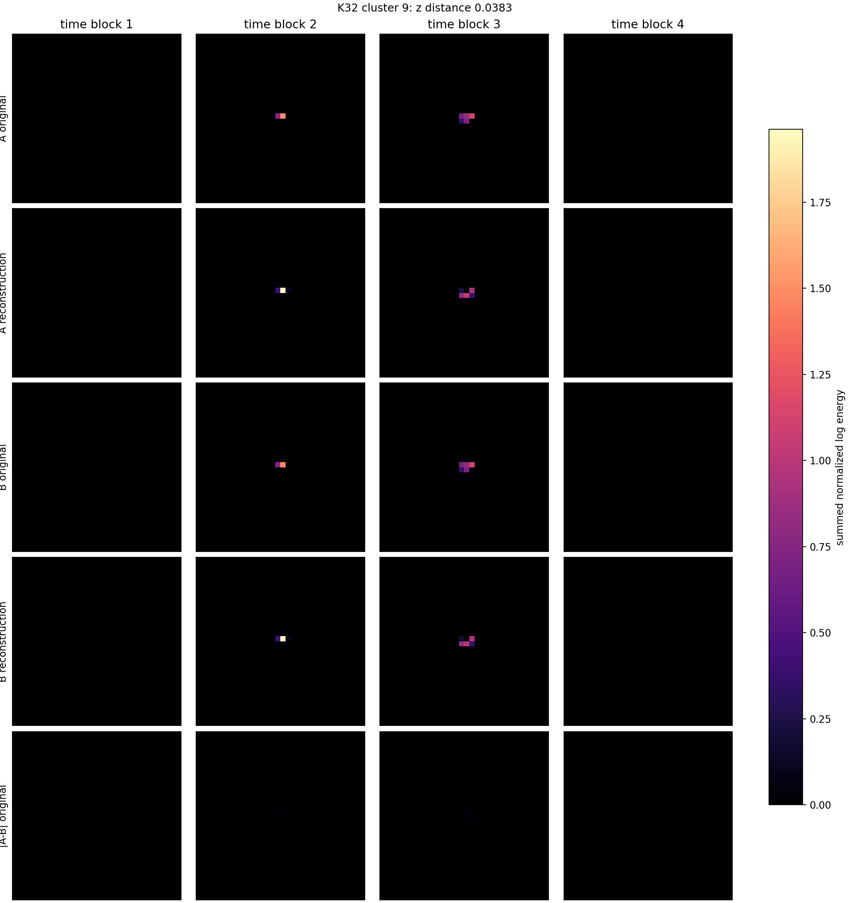
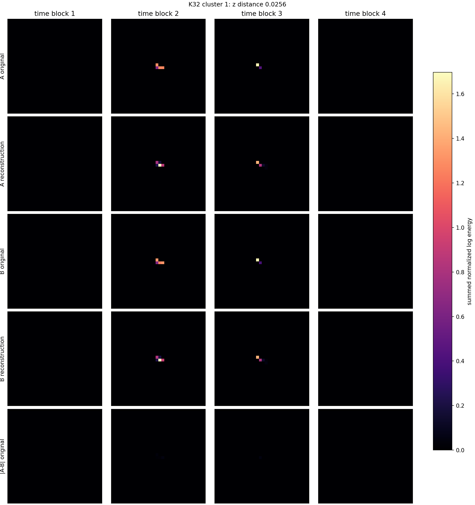

# Phase 2 Similar-Latent Particle Pair Gallery

Pairs are selected from the current clean simple z8 autoencoder. For each of the largest K=32 latent groups, the script finds a nearest-neighbor pair in standardized `z_shape` space, requiring different source files and at least 10 hits.

| pair | K32 group | z distance | hits A/B | source folders | recon L2 A/B | original A-B rel L2 | image |
|---:|---:|---:|---:|---|---:|---:|---|
| 1 | 2 | 0.0277 | 10/10 | `data I05` / `data I05` | 0.407/0.403 | 0.031 | [png](../../assets/phase2_coworker_similar_latent_pairs_v001/similar_latent_pair_01_cluster_02.png) |
| 2 | 11 | 0.0988 | 10/10 | `F08` / `F08` | 0.908/0.909 | 0.651 | [png](../../assets/phase2_coworker_similar_latent_pairs_v001/similar_latent_pair_02_cluster_11.png) |
| 3 | 9 | 0.0383 | 12/12 | `D05` / `D05` | 0.548/0.548 | 0.023 | [png](../../assets/phase2_coworker_similar_latent_pairs_v001/similar_latent_pair_03_cluster_09.png) |
| 4 | 1 | 0.0256 | 11/11 | `data I05` / `data I05` | 0.349/0.352 | 0.029 | [png](../../assets/phase2_coworker_similar_latent_pairs_v001/similar_latent_pair_04_cluster_01.png) |
| 5 | 18 | 0.0391 | 21/21 | `D05` / `D05` | 0.423/0.413 | 0.023 | [png](../../assets/phase2_coworker_similar_latent_pairs_v001/similar_latent_pair_05_cluster_18.png) |
| 6 | 15 | 0.0724 | 11/11 | `data M07` / `D05` | 0.249/0.412 | 0.181 | [png](../../assets/phase2_coworker_similar_latent_pairs_v001/similar_latent_pair_06_cluster_15.png) |
| 7 | 24 | 0.0758 | 19/17 | `08_thu_proton_daily_batch` / `08_thu_proton_daily_batch` | 0.286/0.271 | 0.203 | [png](../../assets/phase2_coworker_similar_latent_pairs_v001/similar_latent_pair_07_cluster_24.png) |
| 8 | 14 | 0.1271 | 13/13 | `data I05` / `data I05` | 0.431/0.494 | 0.288 | [png](../../assets/phase2_coworker_similar_latent_pairs_v001/similar_latent_pair_08_cluster_14.png) |

## Pair 1: K32 Group 2

- A: `data I05/sync__I05-W0044_r001.t3pa`, particle `381877`, hits `10`
- B: `data I05/sync__I05-W0044_r000.t3pa`, particle `179610`, hits `10`
- z distance: `0.0277`
- z_shape A: `-1.069 -0.400 +0.557 -0.089 +0.801 +0.414 -0.500 -0.859`
- z_shape B: `-1.072 -0.412 +0.545 -0.092 +0.812 +0.411 -0.508 -0.853`

## Pair 2: K32 Group 11

- A: `F08/tot_toa__r0000000052.t3pa`, particle `6877`, hits `10`
- B: `F08/tot_toa__r0000000038.t3pa`, particle `19671`, hits `10`
- z distance: `0.0988`
- z_shape A: `-0.685 -0.222 +0.364 -0.286 +0.272 +0.452 +0.056 -0.737`
- z_shape B: `-0.687 -0.218 +0.348 -0.275 +0.327 +0.508 +0.046 -0.763`

## Pair 3: K32 Group 9

- A: `D05/tot_toa__r0000000028.t3pa`, particle `29951`, hits `12`
- B: `D05/tot_toa__r0000000039.t3pa`, particle `43237`, hits `12`
- z distance: `0.0383`
- z_shape A: `-1.062 -0.910 +0.598 -0.750 +0.870 +0.458 -0.319 -0.607`
- z_shape B: `-1.055 -0.896 +0.590 -0.742 +0.862 +0.459 -0.312 -0.626`

## Pair 4: K32 Group 1

- A: `data I05/sync__I05-W0044_r001.t3pa`, particle `181810`, hits `11`
- B: `data I05/sync__I05-W0044_r002.t3pa`, particle `89389`, hits `11`
- z distance: `0.0256`
- z_shape A: `-0.403 -0.666 +0.234 -0.712 +0.630 +0.318 -0.815 -1.576`
- z_shape B: `-0.412 -0.663 +0.220 -0.712 +0.628 +0.307 -0.816 -1.580`

## Pair 5: K32 Group 18

- A: `D05/tot_toa__r0000000028.t3pa`, particle `95170`, hits `21`
- B: `D05/tot_toa__r0000000045.t3pa`, particle `6986`, hits `21`
- z distance: `0.0391`
- z_shape A: `-1.157 -1.566 +0.646 -0.825 +0.613 +0.189 -0.524 -0.897`
- z_shape B: `-1.165 -1.560 +0.644 -0.807 +0.618 +0.184 -0.546 -0.903`

## Pair 6: K32 Group 15

- A: `data M07/sync__M07-W0044_r000.t3pa`, particle `4824`, hits `11`
- B: `D05/tot_toa__r0000000028.t3pa`, particle `14004`, hits `11`
- z distance: `0.0724`
- z_shape A: `-0.896 -1.107 +0.725 +0.076 +0.256 +0.005 +0.513 -0.660`
- z_shape B: `-0.880 -1.074 +0.711 +0.061 +0.262 -0.012 +0.491 -0.686`

## Pair 7: K32 Group 24

- A: `08_thu_proton_daily_batch/toa_tot__r0000007294.t3pa`, particle `2440`, hits `19`
- B: `08_thu_proton_daily_batch/toa_tot__r0000007296.t3pa`, particle `9108`, hits `17`
- z distance: `0.0758`
- z_shape A: `-1.094 -0.767 +1.224 +0.095 +0.262 -0.827 +0.501 -0.607`
- z_shape B: `-1.080 -0.794 +1.256 +0.096 +0.271 -0.825 +0.531 -0.579`

## Pair 8: K32 Group 14

- A: `data I05/sync__I05-W0044_r000.t3pa`, particle `398540`, hits `13`
- B: `data I05/sync__I05-W0044_r001.t3pa`, particle `150322`, hits `13`
- z distance: `0.1271`
- z_shape A: `+0.084 -0.965 -0.088 -0.239 +0.475 +0.417 -0.027 -1.502`
- z_shape B: `+0.132 -0.942 -0.115 -0.220 +0.436 +0.351 -0.015 -1.500`

## Notes

- This gallery is diagnostic: similar latent codes do not guarantee physical identity.
- The final panel is absolute original-tensor difference, so it exposes where two similar codes still differ in voxel space.
- CSV: `experimental_notes/assets/phase2_coworker_similar_latent_pairs_v001/similar_latent_pairs.csv`
