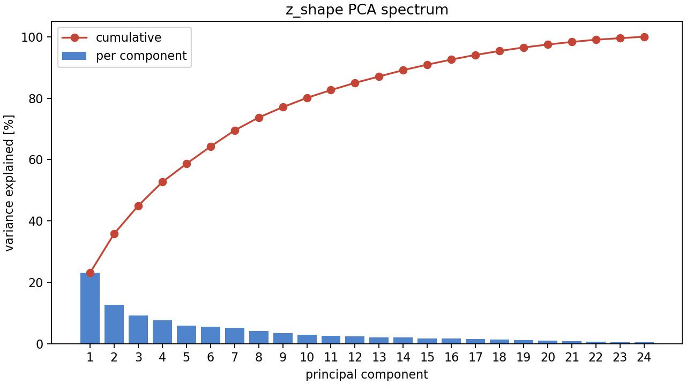
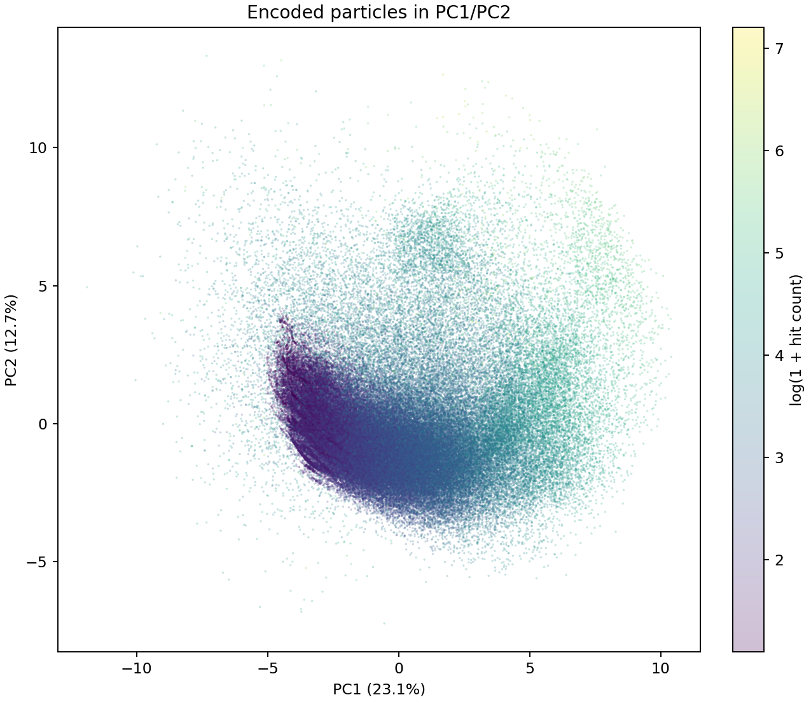
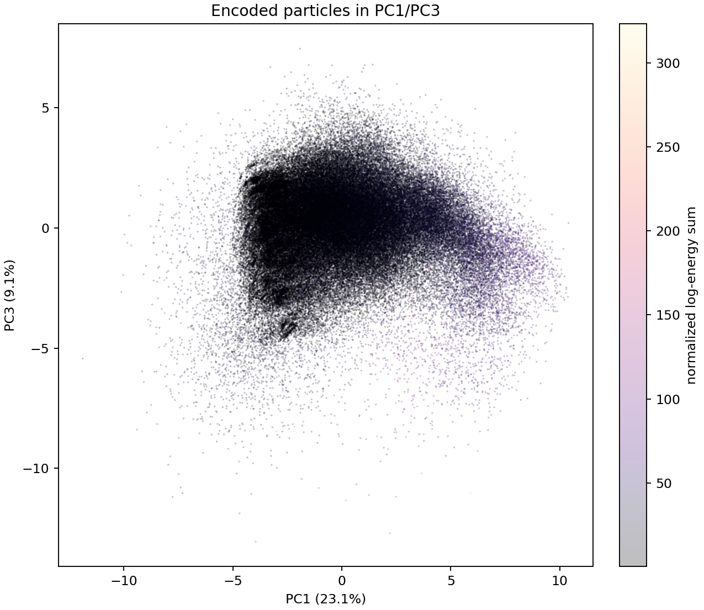
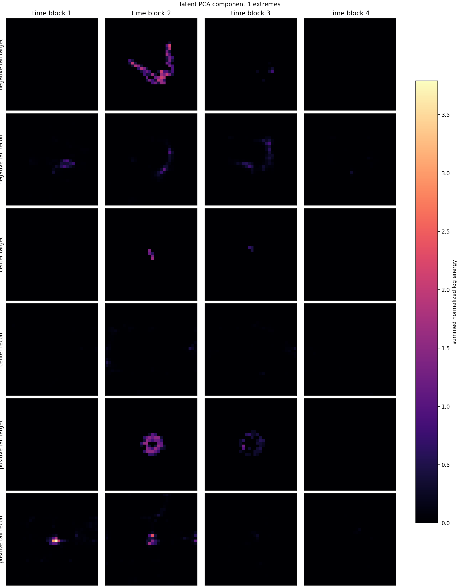
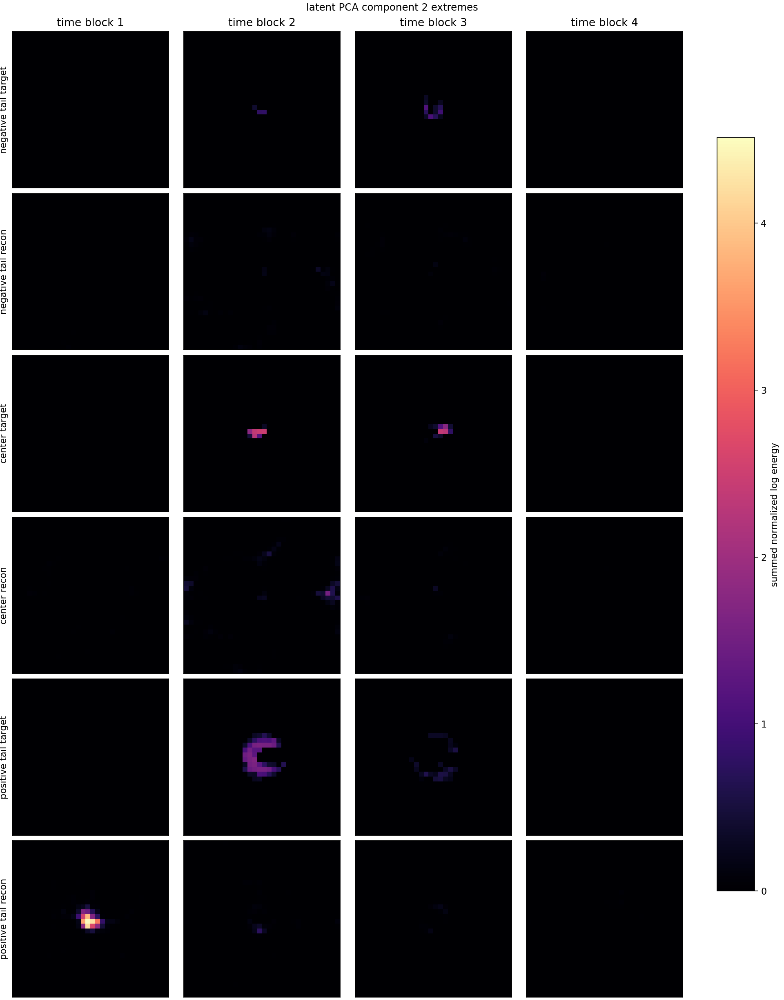
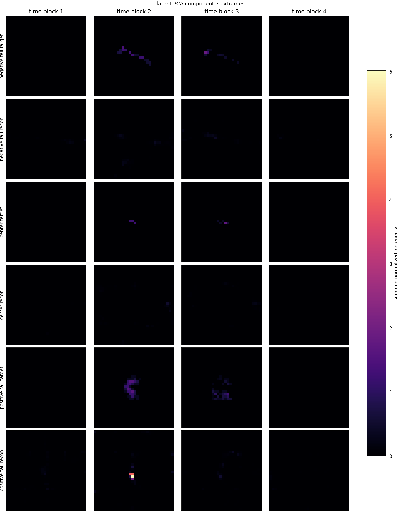
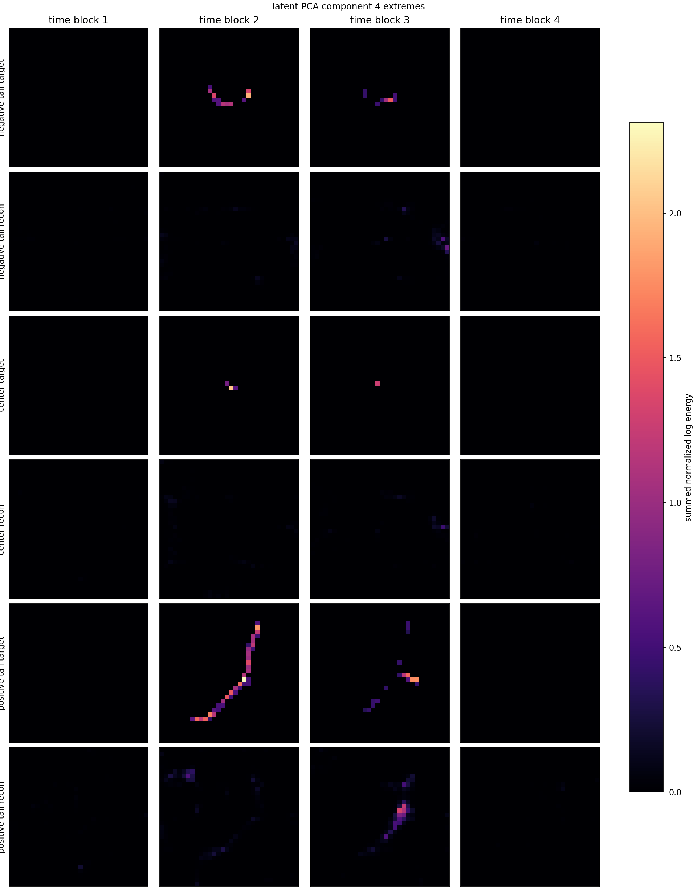
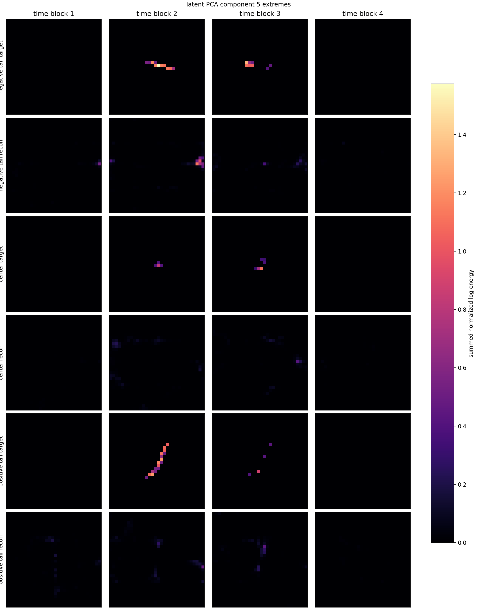
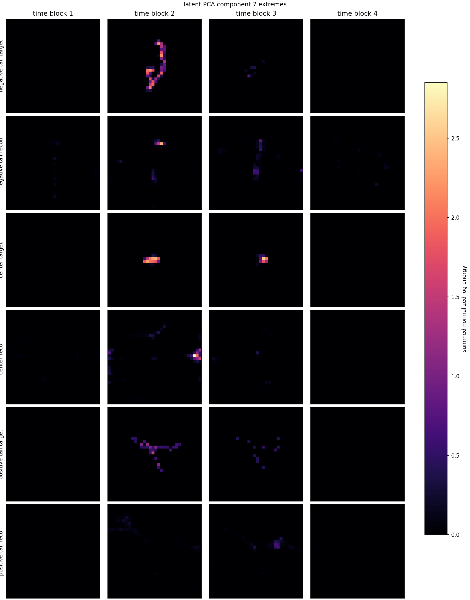
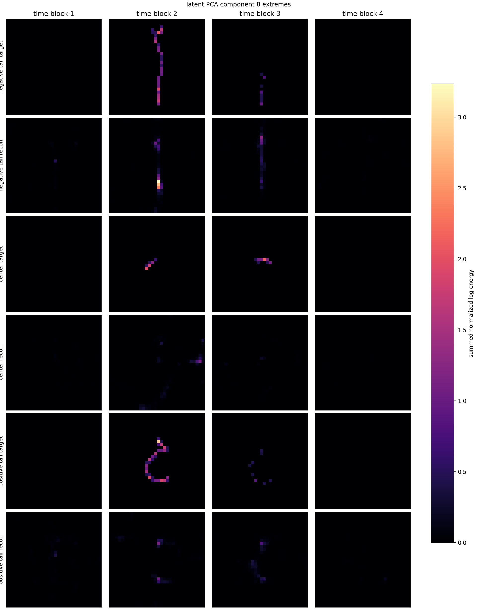

# Phase 2 Encoded-Latent PCA Report

Checkpoint: `local_data/experiments/phase2_canonical_voxel_ae_compressed_plain_l2_wide_z24_depth_xyenergy_b512_v001/checkpoint.pt`
Dataset cache: `local_data/processed/phase2_voxel_energy_8x32x32_representative_v001`

This report encodes every cached particle view with the current model and runs PCA on `z_shape` only. The explicit transform tail is not included in the PCA, but it is used for diagnostics.

## Dataset

| item | value |
|---|---:|
| particles encoded | 1,000,000 |
| latent dimensions | 24 |
| transform mode | `xy_energy` |
| grid | `8 x 32 x 32` |
| train / val / test | 757,765 / 66,022 / 176,213 |

Hit-count buckets:

| bucket | count |
|---|---:|
| 2-4 | 116,714 |
| 5-10 | 261,466 |
| 11-50 | 479,339 |
| 51+ | 142,481 |

Largest source folders:

| folder | count |
|---|---:|
| `data I05` | 490,761 |
| `F08` | 199,575 |
| `D05` | 144,914 |
| `data M07` | 119,015 |
| `13_tue_proton_daily_batch` | 24,279 |
| `08_thu_proton_daily_batch` | 21,456 |

## PCA Spectrum

Effective PCA dimension from entropy of the spectrum: `14.57`.

| cumulative variance | components needed |
|---|---:|
| 50% | 4 |
| 80% | 10 |
| 90% | 15 |
| 95% | 18 |
| 99% | 22 |

## Principal Modes

These are continuous PCA axes, not discrete physical labels. The interpretation column lists the strongest scalar correlations with simple particle descriptors. The images show negative-tail, central, and positive-tail examples for each component.

| PC | variance | cumulative | strongest descriptor correlations | negative / center / positive examples | image |
|---:|---:|---:|---|---|---|
| PC1 | 23.10% | 23.10% | model_energy_scale +0.66, energy +0.56, n_hits +0.52, occupied_voxels +0.49 | neg: `tot_toa__r0000000038.t3pa` p6933 h175; mid: `sync__I05-W0044_r001.t3pa` p270732 h13; pos: `tot_toa__r0000000028.t3pa` p43525 h165 | [png](../../assets/phase2_encoded_pca_xyenergy_v001/pc01_extremes.png) |
| PC2 | 12.72% | 35.83% | energy +0.48, n_hits +0.45, occupied_voxels +0.44, x_span +0.43 | neg: `tot_toa__r0000000039.t3pa` p15480 h27; mid: `tot_toa__r0000000028.t3pa` p79067 h49; pos: `tot_toa__r0000000052.t3pa` p51043 h179 | [png](../../assets/phase2_encoded_pca_xyenergy_v001/pc02_extremes.png) |
| PC3 | 9.13% | 44.96% | x_span -0.29, scale_pca -0.25, occupied_voxels -0.24, energy -0.22 | neg: `sync__I05-W0044_r000.t3pa` p10515 h38; mid: `sync__I05-W0044_r000.t3pa` p4250 h13; pos: `tot_toa__r0000000027.t3pa` p49223 h139 | [png](../../assets/phase2_encoded_pca_xyenergy_v001/pc03_extremes.png) |
| PC4 | 7.72% | 52.68% | y_span +0.38, theta_xy_cos2 -0.37, scale_pca +0.19, theta_xy_sin2 -0.18 | neg: `sync__I05-W0044_r000.t3pa` p297077 h31; mid: `sync__I05-W0044_r001.t3pa` p456904 h7; pos: `sync__I05-W0044_r001.t3pa` p418623 h96 | [png](../../assets/phase2_encoded_pca_xyenergy_v001/pc04_extremes.png) |
| PC5 | 5.92% | 58.60% | x_span -0.31, theta_xy_sin2 +0.26, energy -0.22, model_energy_scale -0.20 | neg: `sync__I05-W0044_r000.t3pa` p363914 h31; mid: `tot_toa__r0000000038.t3pa` p10350 h14; pos: `sync__I05-W0044_r001.t3pa` p504979 h31 | [png](../../assets/phase2_encoded_pca_xyenergy_v001/pc05_extremes.png) |
| PC6 | 5.62% | 64.22% | n_hits +0.22, occupied_voxels +0.21, model_energy_scale +0.20, energy +0.20 | neg: `sync__I05-W0044_r000.t3pa` p332484 h37; mid: `tot_toa__r0000000046.t3pa` p40798 h40; pos: `tot_toa__r0000000042.t3pa` p21973 h142 | [png](../../assets/phase2_encoded_pca_xyenergy_v001/pc06_extremes.png) |
| PC7 | 5.27% | 69.48% | scale_pca -0.24, theta_xy_sin2 +0.22, time_span -0.15, y_span -0.13 | neg: `tot_toa__r0000000027.t3pa` p41559 h125; mid: `tot_toa__r0000000033.t3pa` p14274 h69; pos: `sync__I05-W0044_r002.t3pa` p151525 h48 | [png](../../assets/phase2_encoded_pca_xyenergy_v001/pc07_extremes.png) |
| PC8 | 4.20% | 73.69% | x_span -0.23, model_energy_scale -0.23, energy -0.22, scale_pca -0.22 | neg: `sync__I05-W0044_r001.t3pa` p163639 h72; mid: `sync__I05-W0044_r000.t3pa` p384858 h26; pos: `sync__I05-W0044_r000.t3pa` p291771 h69 | [png](../../assets/phase2_encoded_pca_xyenergy_v001/pc08_extremes.png) |

### PC1

- variance: `23.10%`; cumulative: `23.10%`
- strongest correlations: model_energy_scale +0.66, energy +0.56, n_hits +0.52, occupied_voxels +0.49
- negative tail: split `train`, source `F08/tot_toa__r0000000038.t3pa`, particle `6933`, hits `175`, occupied voxels `79`, energy `73.429`, PC score `-5.707`
- center: split `train`, source `data I05/sync__I05-W0044_r001.t3pa`, particle `270732`, hits `13`, occupied voxels `8`, energy `7.564`, PC score `-0.361`
- positive tail: split `train`, source `F08/tot_toa__r0000000028.t3pa`, particle `43525`, hits `165`, occupied voxels `81`, energy `57.031`, PC score `8.183`

### PC2

- variance: `12.72%`; cumulative: `35.83%`
- strongest correlations: energy +0.48, n_hits +0.45, occupied_voxels +0.44, x_span +0.43
- negative tail: split `train`, source `F08/tot_toa__r0000000039.t3pa`, particle `15480`, hits `27`, occupied voxels `21`, energy `9.479`, PC score `-3.742`
- center: split `train`, source `F08/tot_toa__r0000000028.t3pa`, particle `79067`, hits `49`, occupied voxels `19`, energy `23.743`, PC score `-0.442`
- positive tail: split `train`, source `F08/tot_toa__r0000000052.t3pa`, particle `51043`, hits `179`, occupied voxels `99`, energy `61.790`, PC score `7.968`

### PC3

- variance: `9.13%`; cumulative: `44.96%`
- strongest correlations: x_span -0.29, scale_pca -0.25, occupied_voxels -0.24, energy -0.22
- negative tail: split `train`, source `data I05/sync__I05-W0044_r000.t3pa`, particle `10515`, hits `38`, occupied voxels `28`, energy `21.879`, PC score `-6.252`
- center: split `train`, source `data I05/sync__I05-W0044_r000.t3pa`, particle `4250`, hits `13`, occupied voxels `8`, energy `7.270`, PC score `0.196`
- positive tail: split `train`, source `F08/tot_toa__r0000000027.t3pa`, particle `49223`, hits `139`, occupied voxels `79`, energy `49.924`, PC score `4.145`

### PC4

- variance: `7.72%`; cumulative: `52.68%`
- strongest correlations: y_span +0.38, theta_xy_cos2 -0.37, scale_pca +0.19, theta_xy_sin2 -0.18
- negative tail: split `train`, source `data I05/sync__I05-W0044_r000.t3pa`, particle `297077`, hits `31`, occupied voxels `20`, energy `17.315`, PC score `-3.844`
- center: split `train`, source `data I05/sync__I05-W0044_r001.t3pa`, particle `456904`, hits `7`, occupied voxels `4`, energy `4.714`, PC score `-0.149`
- positive tail: split `train`, source `data I05/sync__I05-W0044_r001.t3pa`, particle `418623`, hits `96`, occupied voxels `60`, energy `50.489`, PC score `6.990`

### PC5

- variance: `5.92%`; cumulative: `58.60%`
- strongest correlations: x_span -0.31, theta_xy_sin2 +0.26, energy -0.22, model_energy_scale -0.20
- negative tail: split `train`, source `data I05/sync__I05-W0044_r000.t3pa`, particle `363914`, hits `31`, occupied voxels `19`, energy `17.295`, PC score `-5.617`
- center: split `train`, source `F08/tot_toa__r0000000038.t3pa`, particle `10350`, hits `14`, occupied voxels `10`, energy `5.165`, PC score `0.025`
- positive tail: split `train`, source `data I05/sync__I05-W0044_r001.t3pa`, particle `504979`, hits `31`, occupied voxels `21`, energy `16.648`, PC score `3.625`

### PC6

- variance: `5.62%`; cumulative: `64.22%`
- strongest correlations: n_hits +0.22, occupied_voxels +0.21, model_energy_scale +0.20, energy +0.20
- negative tail: split `train`, source `data I05/sync__I05-W0044_r000.t3pa`, particle `332484`, hits `37`, occupied voxels `27`, energy `18.810`, PC score `-3.684`
- center: split `val`, source `F08/tot_toa__r0000000046.t3pa`, particle `40798`, hits `40`, occupied voxels `19`, energy `25.390`, PC score `-0.062`
- positive tail: split `train`, source `F08/tot_toa__r0000000042.t3pa`, particle `21973`, hits `142`, occupied voxels `73`, energy `49.589`, PC score `4.602`

### PC7

- variance: `5.27%`; cumulative: `69.48%`
- strongest correlations: scale_pca -0.24, theta_xy_sin2 +0.22, time_span -0.15, y_span -0.13
- negative tail: split `train`, source `F08/tot_toa__r0000000027.t3pa`, particle `41559`, hits `125`, occupied voxels `57`, energy `52.515`, PC score `-4.522`
- center: split `test`, source `F08/tot_toa__r0000000033.t3pa`, particle `14274`, hits `69`, occupied voxels `26`, energy `32.745`, PC score `0.034`
- positive tail: split `train`, source `data I05/sync__I05-W0044_r002.t3pa`, particle `151525`, hits `48`, occupied voxels `41`, energy `24.014`, PC score `3.824`

### PC8

- variance: `4.20%`; cumulative: `73.69%`
- strongest correlations: x_span -0.23, model_energy_scale -0.23, energy -0.22, scale_pca -0.22
- negative tail: split `train`, source `data I05/sync__I05-W0044_r001.t3pa`, particle `163639`, hits `72`, occupied voxels `40`, energy `37.627`, PC score `-5.365`
- center: split `train`, source `data I05/sync__I05-W0044_r000.t3pa`, particle `384858`, hits `26`, occupied voxels `14`, energy `14.717`, PC score `0.034`
- positive tail: split `train`, source `data I05/sync__I05-W0044_r000.t3pa`, particle `291771`, hits `69`, occupied voxels `41`, energy `38.261`, PC score `3.393`

## Notes

- The PCA modes describe the model's learned `z_shape`, not ground-truth particle species.
- Because the `xy_energy` transform head collapsed in the previous check, orientation can still leak into `z_shape`; correlations with `theta_xy_sin2` and `theta_xy_cos2` are included to expose that.
- Full numeric arrays are saved locally at `local_data/experiments/phase2_encoded_pca_xyenergy_v001/encoded_pca_arrays.npz`.
- Per-particle PC scores and metadata are saved locally at `local_data/experiments/phase2_encoded_pca_xyenergy_v001/encoded_particle_rows.csv`.