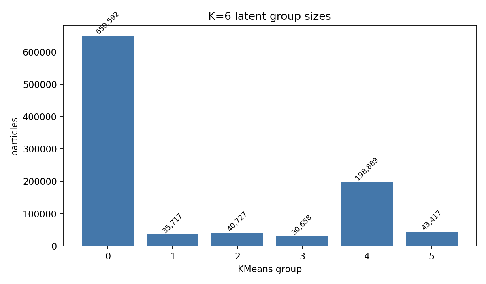
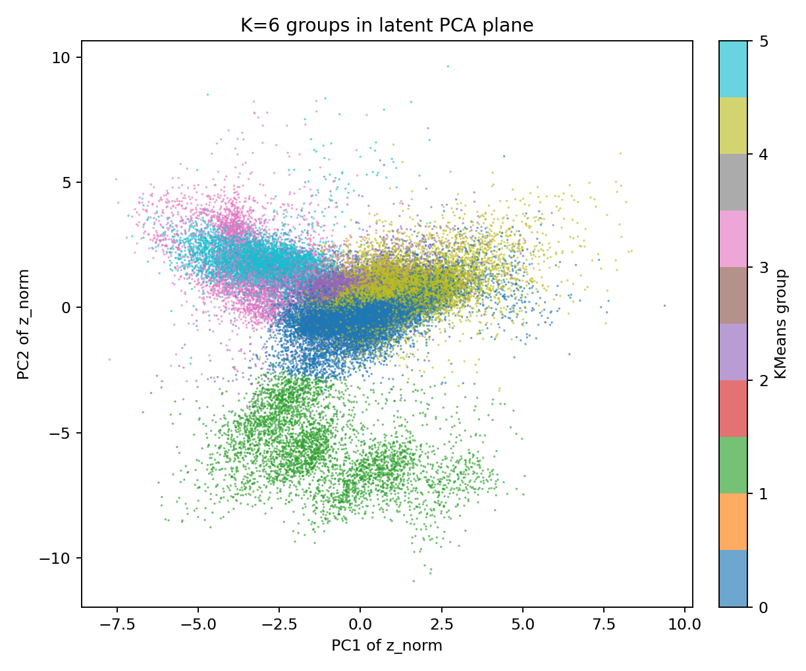
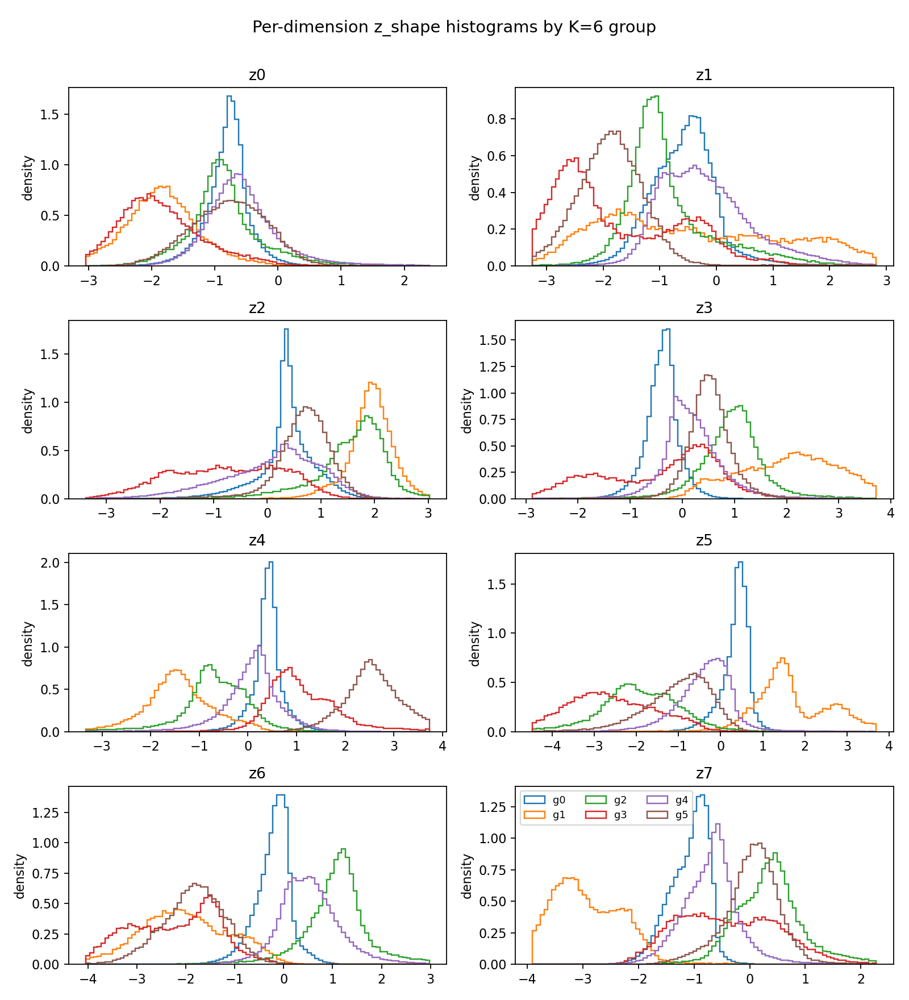
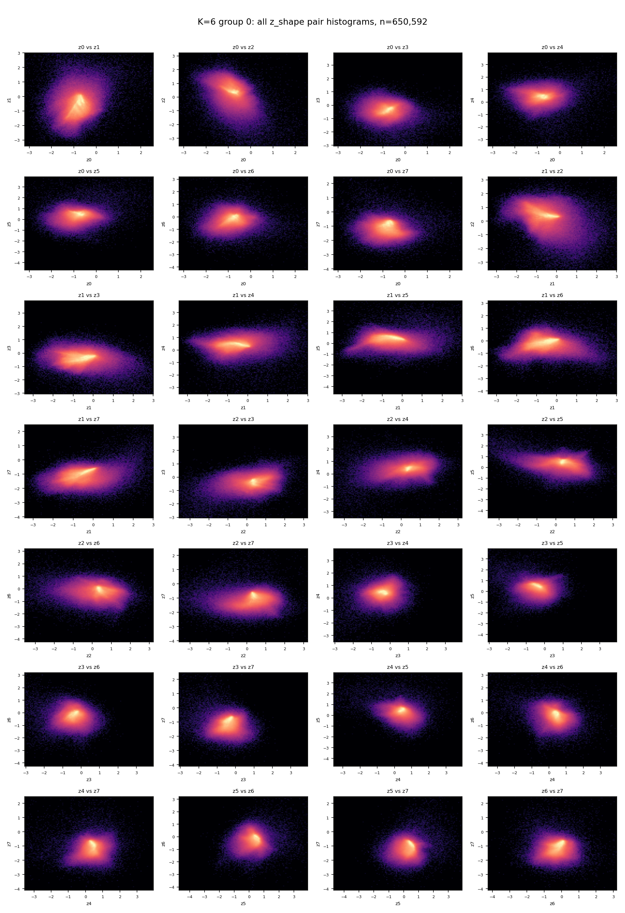
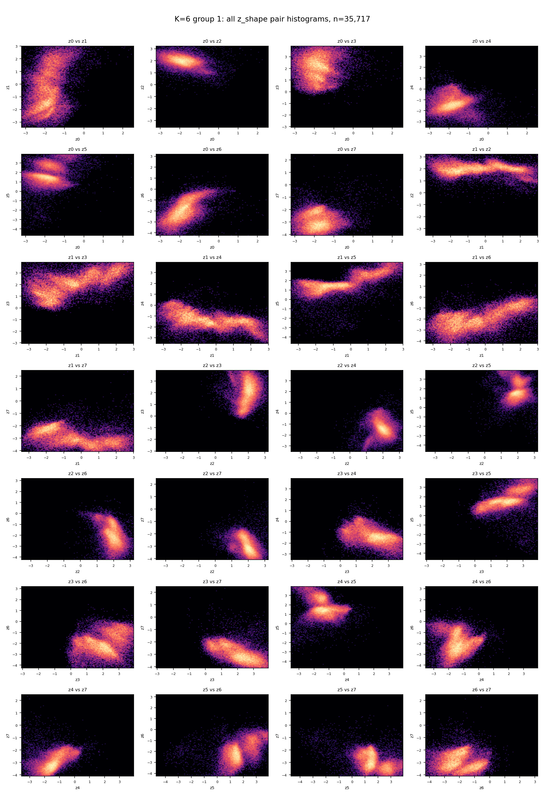
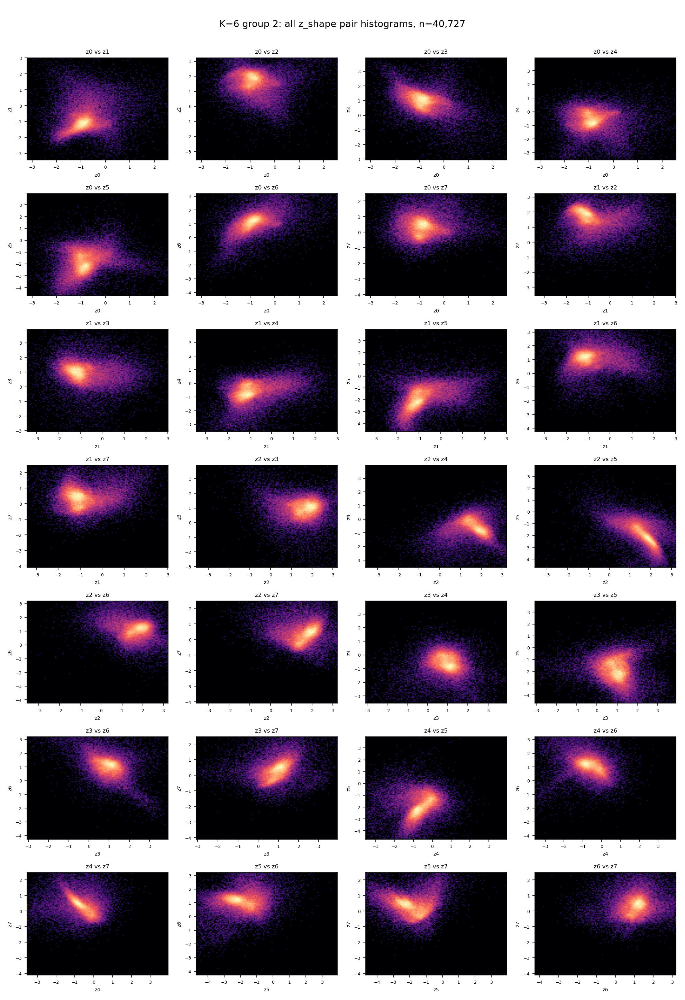
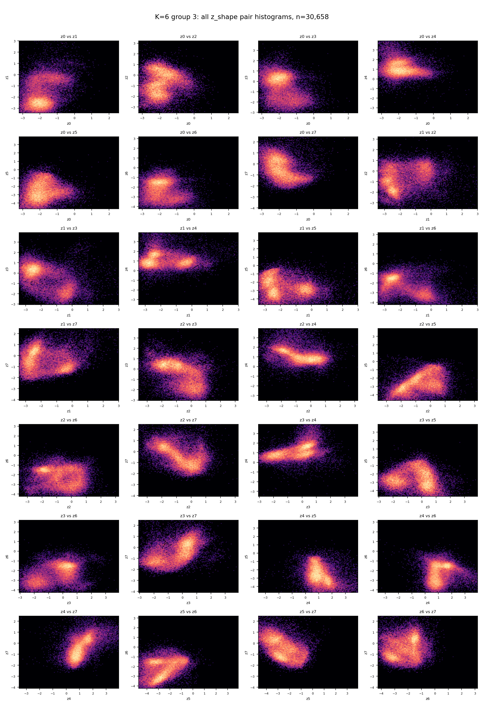
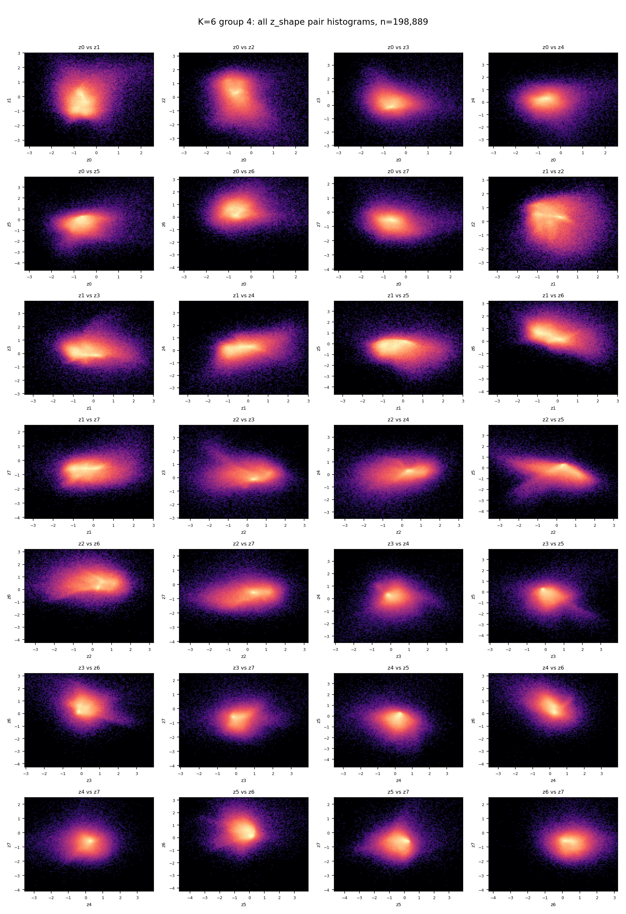
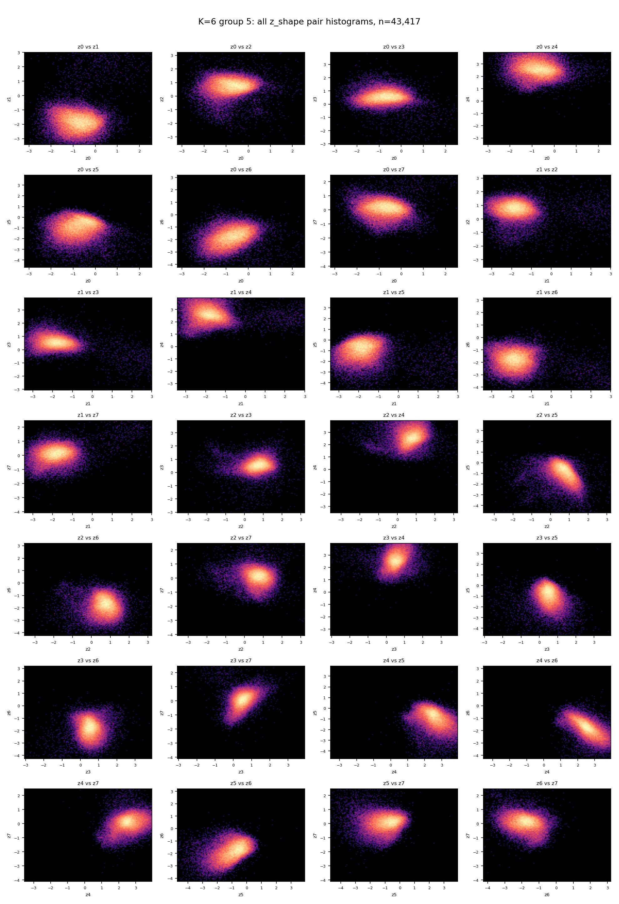

# Simple z8 K=6 Latent Group Histograms

Latent source: `local_data/experiments/phase2_simple_z8_latent_groups_v001/latents_and_groups_k32.npz`

KMeans was fitted on standardized `z_norm`, matching the previous latent grouping convention. The histograms below show raw model latent values `z_shape`, so you can inspect what each coarse group occupies in the actual encoded space.

## Summary

| item | value |
|---|---:|
| particles | 1,000,000 |
| latent dimensions | 8 |
| KMeans groups | 6 |
| pair histograms per group | 28 |
| histogram bins per axis | 120 |
| KMeans inertia | 4,206,464.5 |

## Overview Plots

## Group Sizes

| group | count | fraction |
|---:|---:|---:|
| 0 | 650,592 | 65.06% |
| 1 | 35,717 | 3.57% |
| 2 | 40,727 | 4.07% |
| 3 | 30,658 | 3.07% |
| 4 | 198,889 | 19.89% |
| 5 | 43,417 | 4.34% |

## Per-Group Pairwise Histogram Sheets

### Group 0

- particles: `650,592`

### Group 1

- particles: `35,717`

### Group 2

- particles: `40,727`

### Group 3

- particles: `30,658`

### Group 4

- particles: `198,889`

### Group 5

- particles: `43,417`

## Local Artifacts

- labels and centers: `local_data/experiments/phase2_simple_z8_k6_group_histograms_v001/kmeans_k6_labels.npz`
- group summary: `local_data/experiments/phase2_simple_z8_k6_group_histograms_v001/kmeans_k6_group_summary.csv`
- pair histogram stats: `local_data/experiments/phase2_simple_z8_k6_group_histograms_v001/kmeans_k6_pair_histogram_stats.csv`