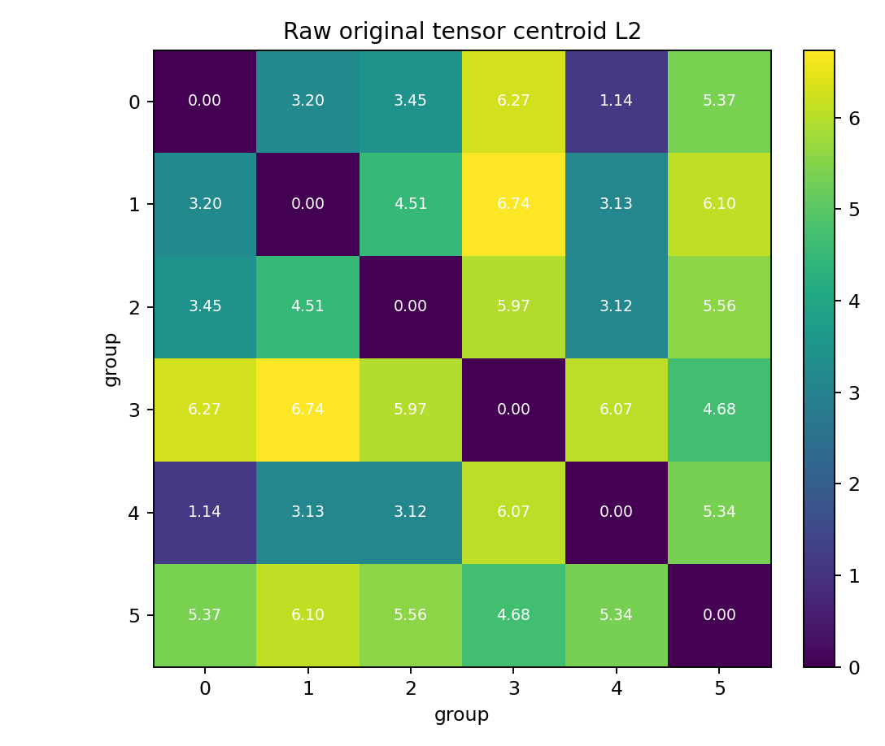
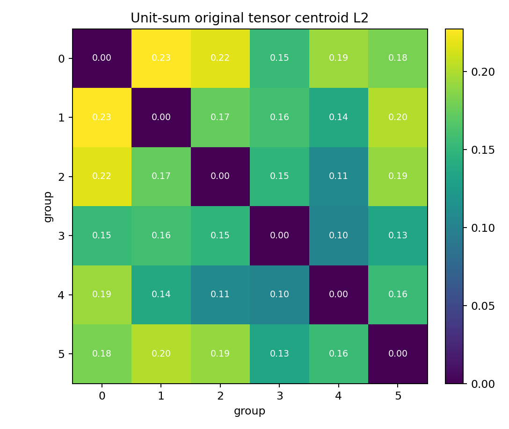

# Simple z8 K=6 Original-Tensor L2 Diagnostics

This checks whether the latent K=6 groups are also compact in the original voxel tensor space. Distances here are between the original `[8,32,32]` energy tensors, not between reconstructions.

Two variants are reported:

- `raw`: direct L2 on stored voxel energy tensors, so total energy/occupancy affects the distance.
- `unit-sum`: each particle tensor is divided by its total voxel energy before L2, so it is closer to a shape-only check.

## Overall Sample Silhouette In Original Tensor Space

| metric | value |
|---|---:|
| sampled particles | 5,000 |
| raw original tensor silhouette | 0.0297 |
| unit-sum original tensor silhouette | 0.0254 |

A positive silhouette means the groups have some separation in original-tensor L2 space. Values near zero mean the groups overlap strongly in that metric.

## Group Compactness

| group | count | raw RMS to centroid | raw nearest centroid | raw sep ratio | raw within p50 | unit RMS | unit nearest centroid | unit sep ratio | unit within p50 | mean energy sum |
|---:|---:|---:|---:|---:|---:|---:|---:|---:|---:|---:|
| 0 | 650,592 | 2.2738 | 1.1441 | 0.503 | 2.8839 | 0.38697 | 0.15407 | 0.398 | 0.52177 | 6.1886 |
| 1 | 35,717 | 5.4088 | 3.1293 | 0.579 | 6.9184 | 0.19180 | 0.13730 | 0.716 | 0.26478 | 30.5479 |
| 2 | 40,727 | 4.8910 | 3.1184 | 0.638 | 6.4892 | 0.17389 | 0.10859 | 0.624 | 0.25139 | 28.5569 |
| 3 | 30,658 | 5.4325 | 4.6850 | 0.862 | 7.2267 | 0.12749 | 0.10224 | 0.802 | 0.17298 | 48.7333 |
| 4 | 198,889 | 4.0548 | 1.1441 | 0.282 | 5.2580 | 0.26710 | 0.10224 | 0.383 | 0.36200 | 17.5792 |
| 5 | 43,417 | 4.2021 | 4.6850 | 1.115 | 5.2072 | 0.13327 | 0.13399 | 1.005 | 0.17606 | 31.6636 |

## Distance Plots

## Interpretation

- If a group's nearest-centroid distance is smaller than its RMS-to-centroid, the group is broader than its separation from another group.
- If sampled within-group p50 is close to nearest between-group p50, the grouping is weak under original-tensor L2.
- Raw L2 is energy-sensitive; unit-sum L2 is a better check for morphology-only grouping.

## Local Artifacts

- group summary: `local_data/experiments/phase2_simple_z8_k6_original_l2_diagnostics_v001/group_original_l2_summary.csv`
- sampled within distances: `local_data/experiments/phase2_simple_z8_k6_original_l2_diagnostics_v001/sampled_within_group_l2.csv`
- sampled between distances: `local_data/experiments/phase2_simple_z8_k6_original_l2_diagnostics_v001/sampled_between_group_l2.csv`
- sampled tensors: `local_data/experiments/phase2_simple_z8_k6_original_l2_diagnostics_v001/sampled_original_tensors_and_labels.npz`