# Simple z8 K=6 Subgroup Diagnostics

This numerically checks whether each coarse K=6 latent group is internally multi-modal. Each group is sampled, then independently swept over sub-K values using KMeans and diagonal Gaussian mixtures.

## How To Read This

- `best_silhouette_k`: compact/separated KMeans estimate. Higher silhouette is better.
- `best_db_k`: Davies-Bouldin estimate. Lower is better.
- `best_bic_k`: diagonal GMM component count. Lower BIC is better, but it may keep increasing K on broad continuous manifolds.
- `elbow_k`: conservative inertia elbow estimate.
- `chosen_inspection_k`: a practical display estimate, using BIC unless it hits the sweep limit, then falling back to silhouette.

## Summary

| group | particles | best silhouette K | silhouette | best DB K | DB | best BIC K | elbow K | chosen inspection K |
|---:|---:|---:|---:|---:|---:|---:|---:|---:|
| 0 | 650,592 | 6 | 0.2446 | 11 | 1.6411 | 12 | 4 | 6 |
| 1 | 35,717 | 2 | 0.4010 | 2 | 0.9803 | 12 | 3 | 2 |
| 2 | 40,727 | 6 | 0.2218 | 6 | 1.3259 | 12 | 6 | 6 |
| 3 | 30,658 | 2 | 0.3036 | 3 | 1.2233 | 12 | 3 | 2 |
| 4 | 198,889 | 2 | 0.2440 | 11 | 1.6659 | 12 | 4 | 2 |
| 5 | 43,417 | 2 | 0.1949 | 5 | 1.4812 | 12 | 5 | 2 |

## Per-Group Diagnostics

### Group 0

- particles: `650,592`
- chosen inspection K: `6`

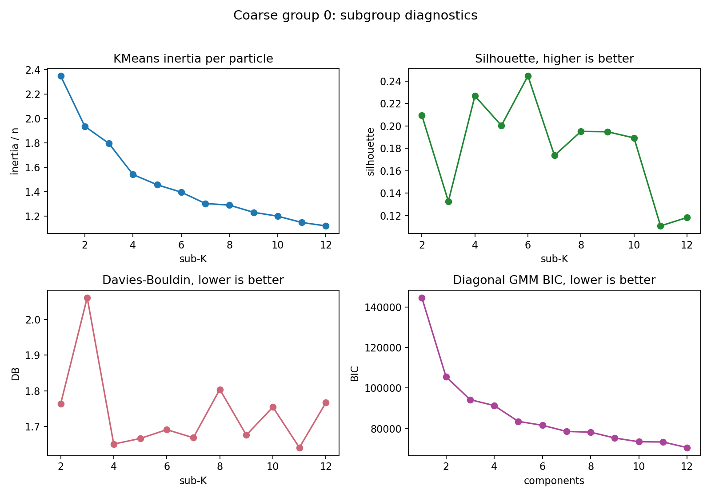

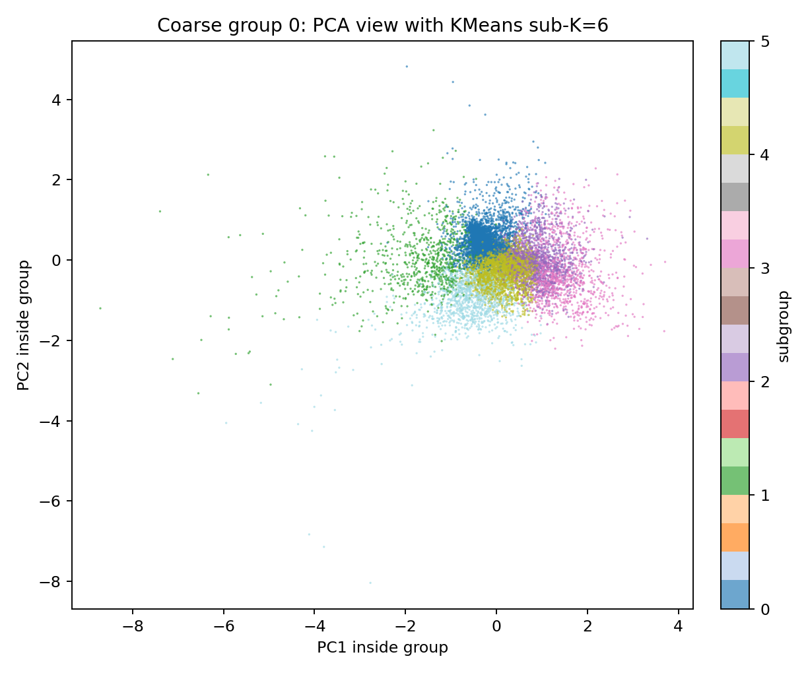

### Group 1

- particles: `35,717`
- chosen inspection K: `2`

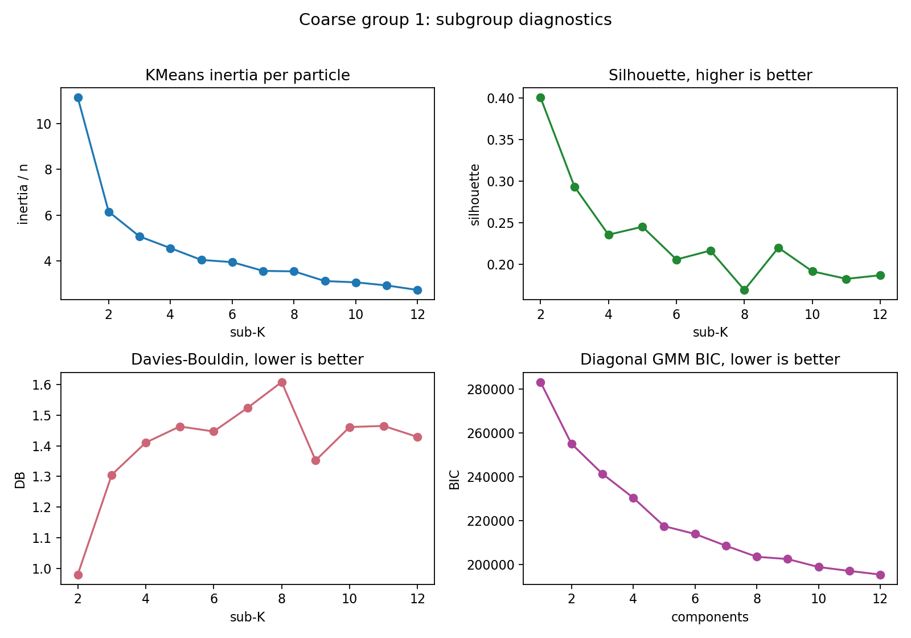

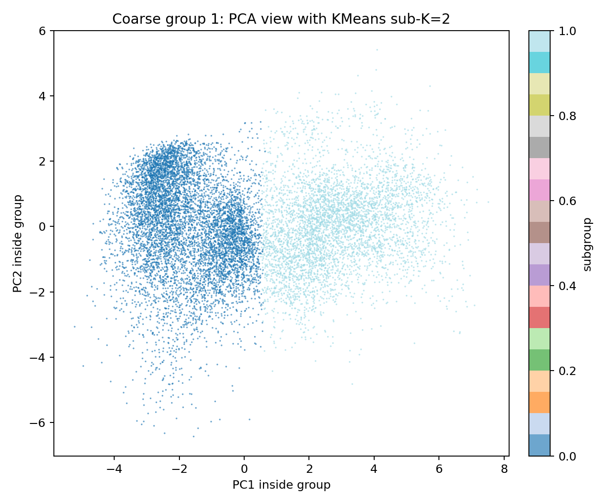

### Group 2

- particles: `40,727`
- chosen inspection K: `6`

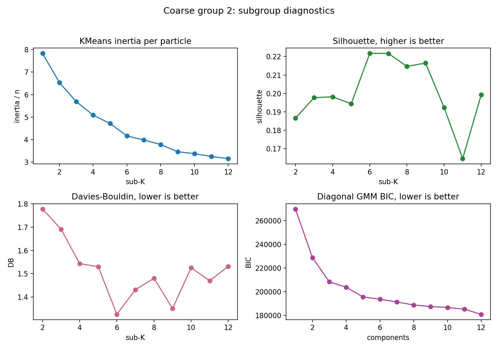

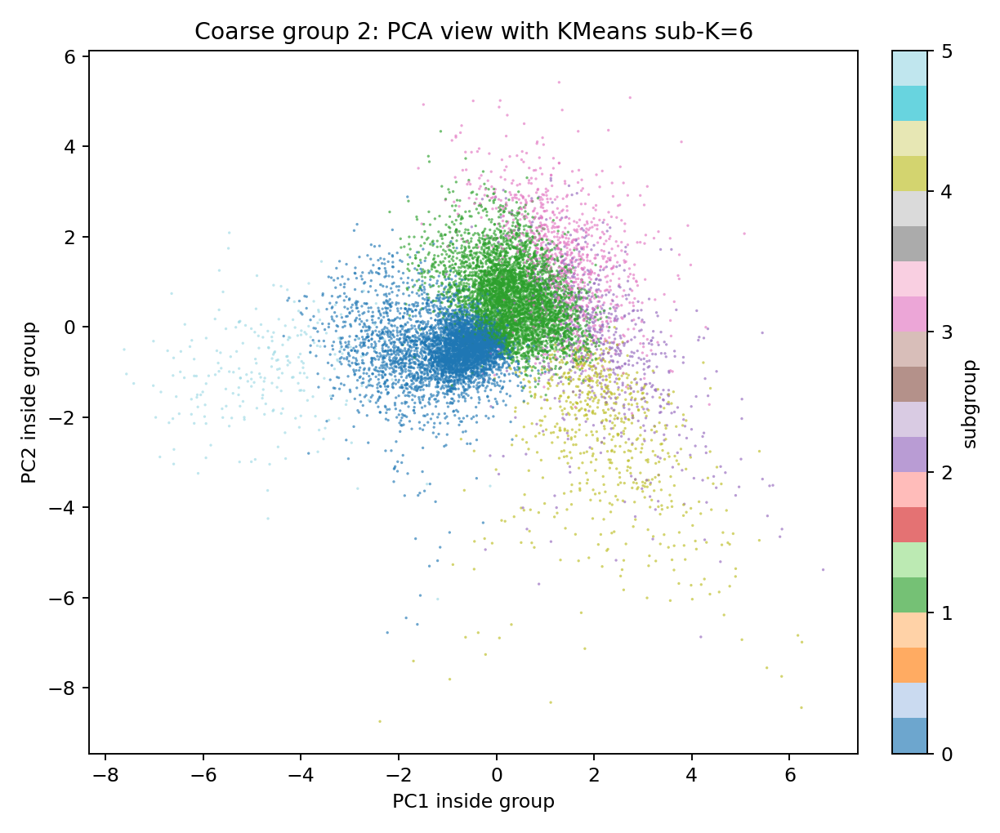

### Group 3

- particles: `30,658`
- chosen inspection K: `2`

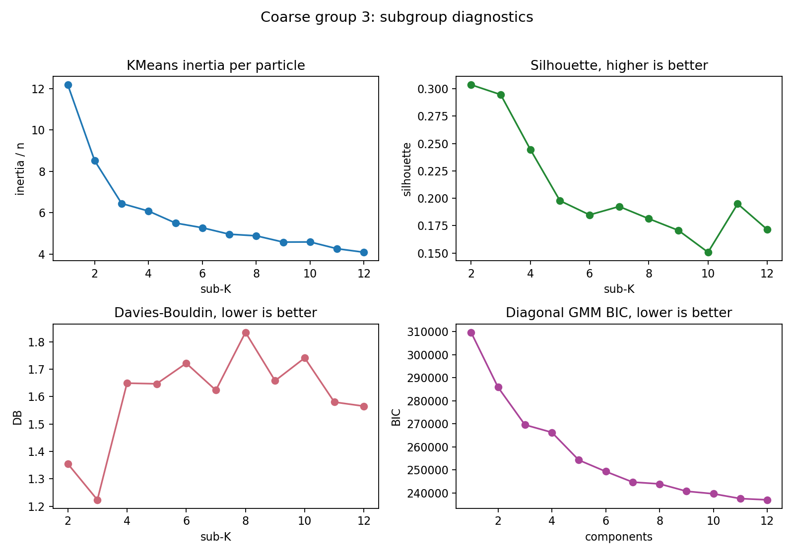

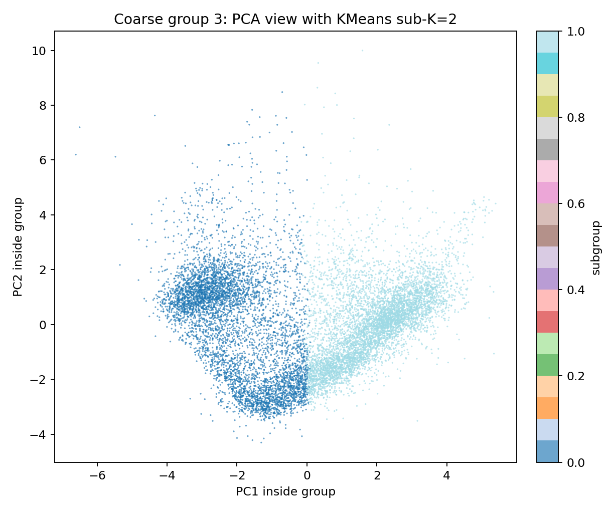

### Group 4

- particles: `198,889`
- chosen inspection K: `2`

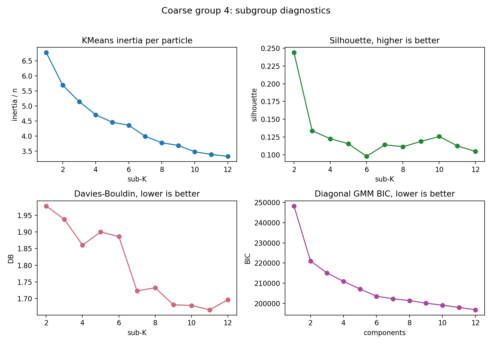

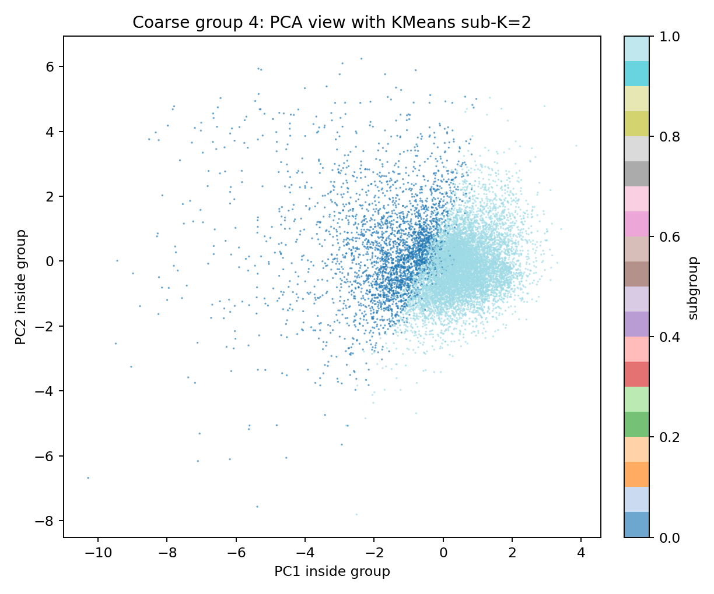

### Group 5

- particles: `43,417`
- chosen inspection K: `2`

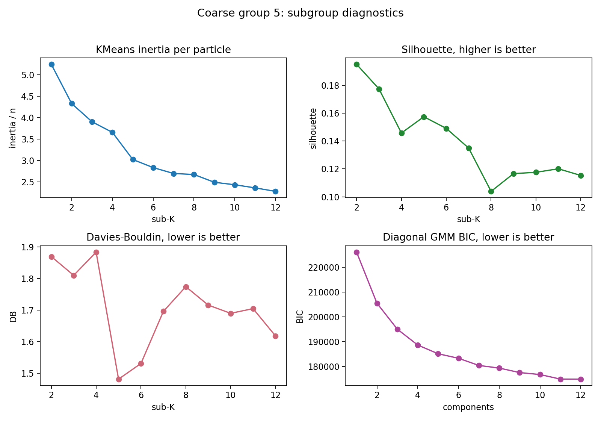

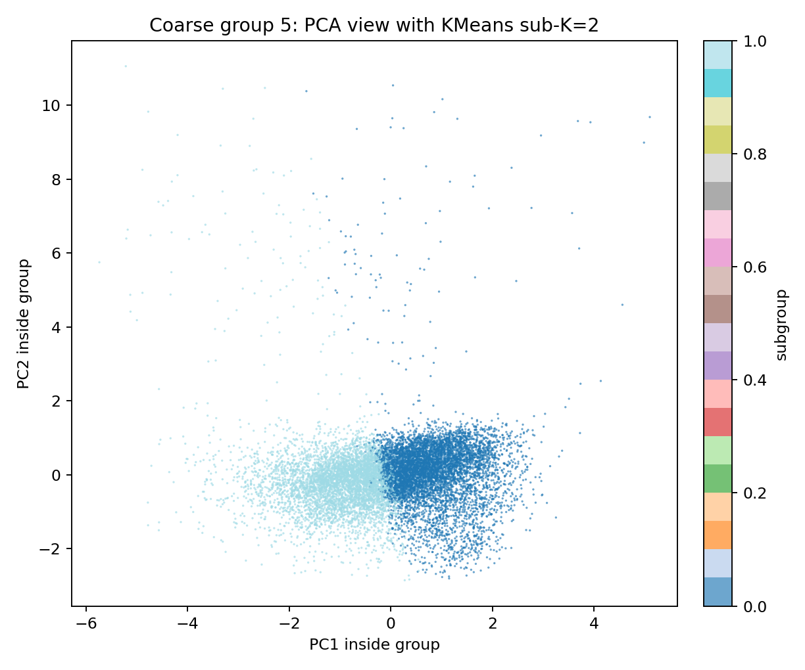

## Local Artifacts

- sweep metrics: `local_data/experiments/phase2_simple_z8_k6_subgroup_diagnostics_v001/subgroup_sweep_metrics.csv`
- summary: `local_data/experiments/phase2_simple_z8_k6_subgroup_diagnostics_v001/subgroup_summary.csv`