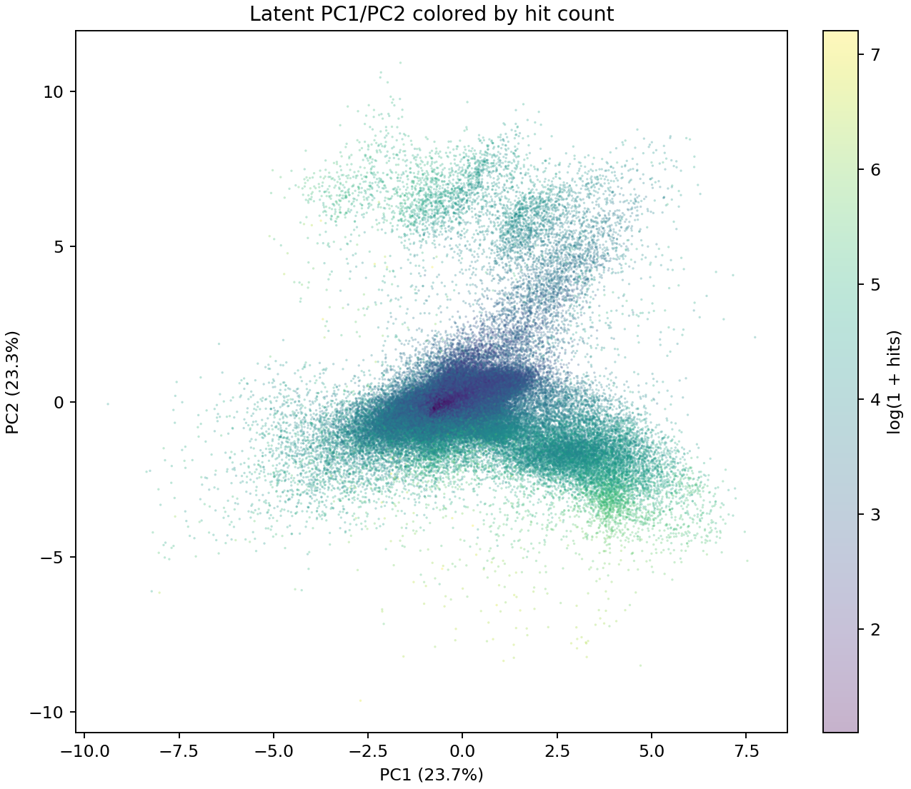
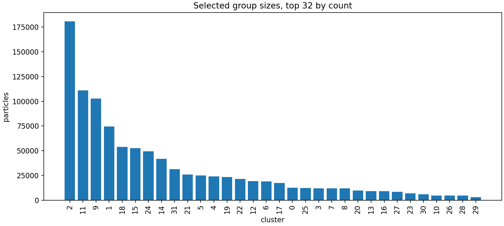
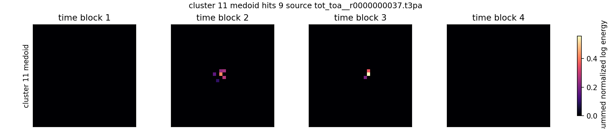
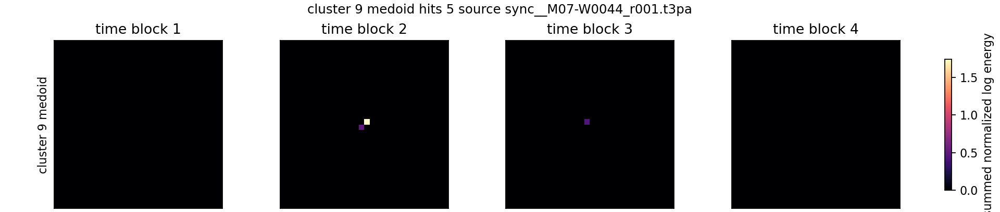
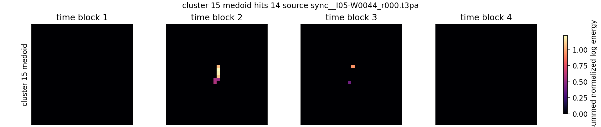
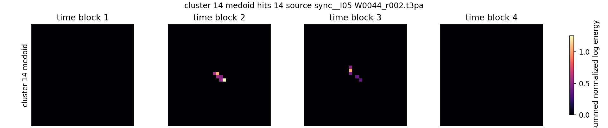
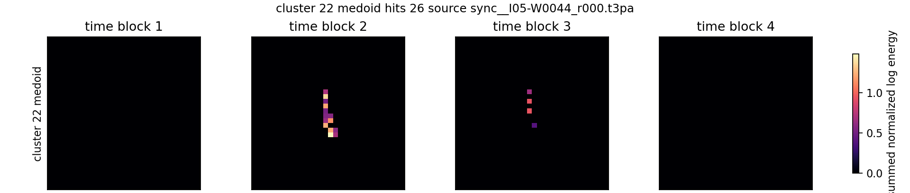
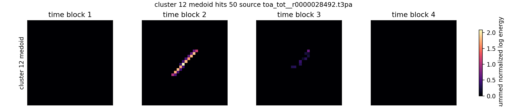
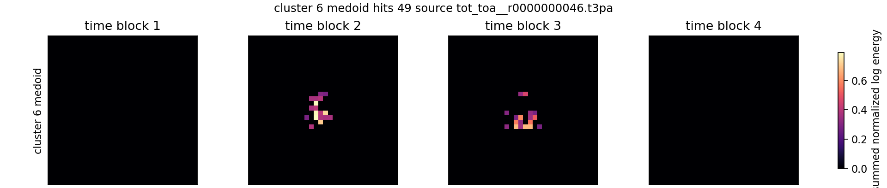

# Simple z8 Latent-Space Grouping

Checkpoint: `local_data/experiments/phase2_simple_voxel_ae_z8_b1024_clean_fixedmine_20phase_v001/checkpoint.pt`
Dataset cache: `local_data/processed/phase2_voxel_energy_8x32x32_representative_v001`

This report encodes all cached particles with the clean z8 voxel autoencoder and groups the 8D latent vectors with MiniBatchKMeans. The groups are unsupervised morphology/encoding groups, not physical particle labels.

## Output Artifacts

- Full particle-to-group table: `local_data/experiments/phase2_simple_z8_latent_groups_v001/particle_latent_groups_k32.csv`
- Latent arrays and labels: `local_data/experiments/phase2_simple_z8_latent_groups_v001/latents_and_groups_k32.npz`
- K sweep scores: `local_data/experiments/phase2_simple_z8_latent_groups_v001/kmeans_scores.csv`
- Group summary: `local_data/experiments/phase2_simple_z8_latent_groups_v001/group_summary_k32.csv`

## Dataset

| item | value |
|---|---:|
| encoded particles | 1,000,000 |
| latent dimensions | 8 |
| selected K | 32 |
| checkpoint best step | 6144 |
| checkpoint best val L2 | 1.476723 |

## PCA And Group Plots

## K Sweep

| K | silhouette sample | Davies-Bouldin sample | Calinski-Harabasz sample | min cluster | max cluster | median cluster |
|---:|---:|---:|---:|---:|---:|---:|
| 8 | 0.1691 | 1.4076 | 3572.2 | 13393 | 384346 | 63051.5 |
| 16 | 0.1136 | 1.4849 | 2572.1 | 12191 | 199776 | 38311.5 |
| 24 | 0.1457 | 1.4889 | 2135.5 | 8933 | 226113 | 24353.5 |
| 32 | 0.1238 | 1.4996 | 1848.2 | 3001 | 180646 | 18170.0 |
| 48 | 0.1172 | 1.6383 | 1436.4 | 2287 | 150774 | 11002.0 |
| 64 | 0.1215 | 1.6350 | 1228.6 | 1998 | 138699 | 9688.0 |

## Selected Groups: K=32

| rank | cluster | count | fraction | median hits | p90 hits | median voxels | median spans x/y/t | dominant bucket | top source folder | medoid |
|---:|---:|---:|---:|---:|---:|---:|---|---|---|---|
| 1 | 2 | 180,646 | 18.06% | 5.0 | 11.0 | 4.0 | 3.0/3.0/1.94 | 5-10 | `data I05` | [image](../../assets/phase2_simple_z8_latent_groups_v001/prototypes/cluster_02_rank_01.png) |
| 2 | 11 | 110,921 | 11.09% | 6.0 | 25.0 | 5.0 | 6.0/5.0/2.44 | 2-4 | `data I05` | [image](../../assets/phase2_simple_z8_latent_groups_v001/prototypes/cluster_11_rank_02.png) |
| 3 | 9 | 102,761 | 10.28% | 8.0 | 13.0 | 5.0 | 3.0/4.0/2.38 | 5-10 | `data I05` | [image](../../assets/phase2_simple_z8_latent_groups_v001/prototypes/cluster_09_rank_03.png) |
| 4 | 1 | 74,623 | 7.46% | 11.0 | 17.0 | 7.0 | 5.0/5.0/3.12 | 11-50 | `data I05` | [image](../../assets/phase2_simple_z8_latent_groups_v001/prototypes/cluster_01_rank_04.png) |
| 5 | 18 | 53,794 | 5.38% | 13.0 | 21.0 | 7.0 | 5.0/5.0/3.31 | 11-50 | `D05` | [image](../../assets/phase2_simple_z8_latent_groups_v001/prototypes/cluster_18_rank_05.png) |
| 6 | 15 | 52,458 | 5.25% | 16.0 | 29.0 | 10.0 | 4.0/11.0/3.56 | 11-50 | `data I05` | [image](../../assets/phase2_simple_z8_latent_groups_v001/prototypes/cluster_15_rank_06.png) |
| 7 | 24 | 49,248 | 4.92% | 16.0 | 27.0 | 10.0 | 9.0/7.0/3.50 | 11-50 | `data I05` | [image](../../assets/phase2_simple_z8_latent_groups_v001/prototypes/cluster_24_rank_07.png) |
| 8 | 14 | 41,774 | 4.18% | 19.0 | 31.0 | 12.0 | 10.0/9.0/3.75 | 11-50 | `data I05` | [image](../../assets/phase2_simple_z8_latent_groups_v001/prototypes/cluster_14_rank_08.png) |
| 9 | 31 | 31,372 | 3.14% | 17.0 | 31.0 | 10.0 | 10.0/4.0/3.50 | 11-50 | `data I05` | [image](../../assets/phase2_simple_z8_latent_groups_v001/prototypes/cluster_31_rank_09.png) |
| 10 | 21 | 25,836 | 2.58% | 24.0 | 42.0 | 15.0 | 11.0/11.0/3.94 | 11-50 | `data I05` | [image](../../assets/phase2_simple_z8_latent_groups_v001/prototypes/cluster_21_rank_10.png) |
| 11 | 5 | 24,894 | 2.49% | 26.0 | 42.0 | 16.0 | 11.0/12.0/3.62 | 11-50 | `data I05` | [image](../../assets/phase2_simple_z8_latent_groups_v001/prototypes/cluster_05_rank_11.png) |
| 12 | 4 | 24,119 | 2.41% | 55.0 | 79.0 | 23.0 | 13.0/6.0/2.94 | 51+ | `F08` | [image](../../assets/phase2_simple_z8_latent_groups_v001/prototypes/cluster_04_rank_12.png) |
| 13 | 19 | 23,510 | 2.35% | 30.0 | 55.0 | 19.0 | 12.0/18.0/4.06 | 11-50 | `data I05` | [image](../../assets/phase2_simple_z8_latent_groups_v001/prototypes/cluster_19_rank_13.png) |
| 14 | 22 | 21,438 | 2.14% | 27.0 | 48.0 | 17.0 | 6.0/20.0/4.12 | 11-50 | `data I05` | [image](../../assets/phase2_simple_z8_latent_groups_v001/prototypes/cluster_22_rank_14.png) |
| 15 | 12 | 19,173 | 1.92% | 51.0 | 68.0 | 28.0 | 19.0/19.0/3.06 | 51+ | `08_thu_proton_daily_batch` | [image](../../assets/phase2_simple_z8_latent_groups_v001/prototypes/cluster_12_rank_15.png) |
| 16 | 6 | 18,957 | 1.90% | 44.0 | 90.0 | 27.0 | 13.0/15.0/4.75 | 11-50 | `data I05` | [image](../../assets/phase2_simple_z8_latent_groups_v001/prototypes/cluster_06_rank_16.png) |
| 17 | 17 | 17,383 | 1.74% | 69.0 | 103.0 | 27.0 | 15.0/7.0/3.25 | 51+ | `F08` | 805353 |
| 18 | 0 | 12,499 | 1.25% | 47.0 | 81.0 | 21.0 | 9.0/8.0/2.50 | 11-50 | `F08` | 222069 |
| 19 | 25 | 12,403 | 1.24% | 28.0 | 39.0 | 17.0 | 6.0/6.0/6.25 | 11-50 | `D05` | 63442 |
| 20 | 3 | 12,033 | 1.20% | 52.0 | 73.0 | 28.0 | 9.0/8.0/7.69 | 51+ | `D05` | 60723 |
| 21 | 7 | 11,862 | 1.19% | 181.0 | 249.0 | 71.0 | 16.0/16.0/1.75 | 51+ | `F08` | 134846 |
| 22 | 8 | 11,818 | 1.18% | 42.0 | 98.0 | 26.0 | 27.0/9.0/4.44 | 11-50 | `data I05` | 571572 |
| 23 | 20 | 9,753 | 0.98% | 49.0 | 107.0 | 30.0 | 26.0/15.0/4.75 | 11-50 | `data I05` | 314460 |
| 24 | 13 | 9,237 | 0.92% | 96.0 | 155.0 | 37.0 | 19.0/8.0/3.00 | 51+ | `F08` | 163969 |
| 25 | 16 | 8,935 | 0.89% | 81.0 | 112.0 | 45.0 | 11.0/10.0/11.94 | 51+ | `D05` | 54962 |
| 26 | 27 | 8,556 | 0.86% | 49.0 | 101.0 | 31.0 | 26.0/18.0/4.62 | 11-50 | `data I05` | 384476 |
| 27 | 23 | 6,870 | 0.69% | 62.0 | 121.0 | 39.0 | 28.0/28.0/5.12 | 51+ | `data I05` | 705569 |
| 28 | 30 | 5,971 | 0.60% | 143.0 | 238.0 | 76.0 | 18.0/18.0/6.06 | 51+ | `F08` | 137018 |
| 29 | 10 | 4,742 | 0.47% | 135.0 | 189.0 | 76.0 | 14.0/13.0/16.00 | 51+ | `D05` | 38853 |
| 30 | 26 | 4,731 | 0.47% | 87.0 | 142.0 | 38.0 | 19.0/19.0/4.50 | 51+ | `13_tue_proton_daily_batch` | 766802 |
| 31 | 28 | 4,682 | 0.47% | 60.0 | 109.0 | 37.0 | 13.0/40.0/4.94 | 51+ | `data I05` | 294631 |
| 32 | 29 | 3,001 | 0.30% | 82.0 | 152.0 | 50.0 | 35.0/38.0/5.31 | 51+ | `data I05` | 485298 |

## Prototype Gallery

### Cluster 2 (rank 1)

- source: `data M07/sync__M07-W0044_r001.t3pa`
- particle: `32949`
- hits: `5`

### Cluster 11 (rank 2)

- source: `F08/tot_toa__r0000000037.t3pa`
- particle: `1228`
- hits: `9`

### Cluster 9 (rank 3)

- source: `data M07/sync__M07-W0044_r001.t3pa`
- particle: `119376`
- hits: `5`

### Cluster 1 (rank 4)

- source: `data I05/sync__I05-W0044_r000.t3pa`
- particle: `207651`
- hits: `10`

### Cluster 18 (rank 5)

- source: `F08/tot_toa__r0000000038.t3pa`
- particle: `1954`
- hits: `15`

### Cluster 15 (rank 6)

- source: `data I05/sync__I05-W0044_r000.t3pa`
- particle: `221978`
- hits: `14`

### Cluster 24 (rank 7)

- source: `data M07/sync__M07-W0044_r000.t3pa`
- particle: `70596`
- hits: `16`

### Cluster 14 (rank 8)

- source: `data I05/sync__I05-W0044_r002.t3pa`
- particle: `108890`
- hits: `14`

### Cluster 31 (rank 9)

- source: `data I05/sync__I05-W0044_r000.t3pa`
- particle: `325283`
- hits: `15`

### Cluster 21 (rank 10)

- source: `data I05/sync__I05-W0044_r001.t3pa`
- particle: `364044`
- hits: `22`

### Cluster 5 (rank 11)

- source: `13_tue_proton_daily_batch/toa_tot__r0000028492.t3pa`
- particle: `3266`
- hits: `29`

### Cluster 4 (rank 12)

- source: `F08/tot_toa__r0000000033.t3pa`
- particle: `12006`
- hits: `57`

### Cluster 19 (rank 13)

- source: `data I05/sync__I05-W0044_r001.t3pa`
- particle: `501237`
- hits: `17`

### Cluster 22 (rank 14)

- source: `data I05/sync__I05-W0044_r000.t3pa`
- particle: `341371`
- hits: `26`

### Cluster 12 (rank 15)

- source: `13_tue_proton_daily_batch/toa_tot__r0000028492.t3pa`
- particle: `847`
- hits: `50`

### Cluster 6 (rank 16)

- source: `F08/tot_toa__r0000000046.t3pa`
- particle: `44271`
- hits: `49`

## Notes

- The clustering is over z-scored `z_shape` only.
- KMeans imposes groups even if the latent manifold is continuous; use the K sweep and prototype gallery as diagnostics, not as proof of physical species.
- Because this z8 autoencoder was trained for reconstruction, latent groups may still encode nuisance pose, energy, or reconstruction difficulty.