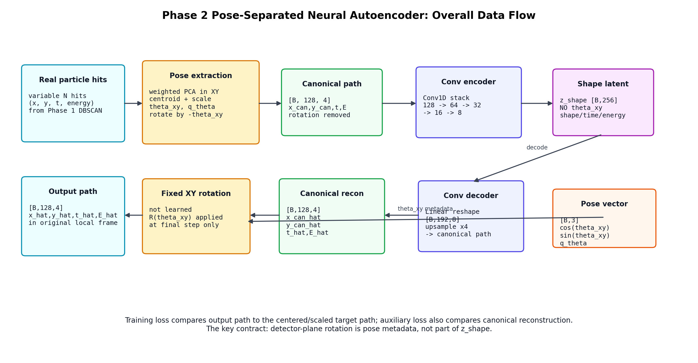
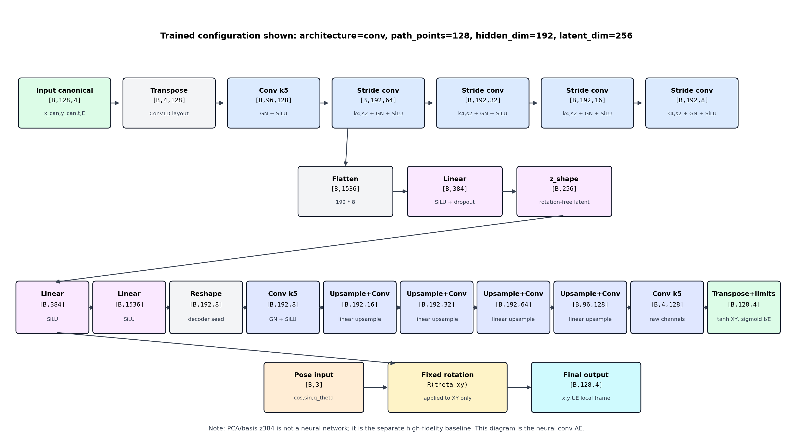

# Phase 2 Neural Autoencoder Structure

This page visualizes the pose-separated neural autoencoder used in the Phase 2 reconstruction experiments.

The trained neural model shown here is:

- architecture: `conv`
- input path samples: `128`
- input channels: `4` = `(x_can, y_can, t_norm, energy)`
- hidden channels: `192`
- shape latent: `z_shape = 256`
- pose metadata: `cos(theta_xy), sin(theta_xy), q_theta`

The important design rule is that `theta_xy` is not inside `z_shape`. The decoder reconstructs a canonical path, then a fixed rotation matrix applies `theta_xy` to XY at the end.

## Overall Flow



## Layer And Tensor Shapes



## What Is Learned

Learned by the NN:

- canonical shape
- time profile
- energy profile
- compressed `z_shape` representation

Not learned as class latent:

- detector-plane rotation `theta_xy`

The final XY rotation is deterministic:

```text
[x_hat]   [ cos(theta) -sin(theta) ] [x_can_hat]
[y_hat] = [ sin(theta)  cos(theta) ] [y_can_hat]
```

## Current Fit Context

The neural conv AE is useful structurally, but its current `z=256` reconstruction is still weaker than the PCA/basis high-fidelity baseline. The PCA/basis model is not a neural network; it reaches better reconstruction because it keeps a much larger linear basis (`z=384+`).
