# Phase 2 Rotation-Separated Path Autoencoder Investigation

## Verdict

The corrected voxel-continuity particle shards are not compressible to a high-fidelity `8-16` dimensional latent over the full focus population. The z8/z12/z16 neural path autoencoders improve over a naive point-cloud decoder, but remain far above the target `0.1` mean relative L2 on energy paths. A rotation-separated PCA/basis autoencoder reaches the target only around z192 on direct path reconstruction.

This result is now provisional. The Phase 1 shard used for this report was built from coarse `ToA` only. T3PA timestamps must use `ToA - FToA / 16`; see the focused check [candidate_25638_fine_time_check.md](../../assets/phase2_path_ae_focus_v001/candidate_25638_continuity/candidate_25638_fine_time_check.md). The Phase 2 dataset should be rebuilt from a fine-time Phase 1 separator before treating these reconstruction metrics as final.

## Design

- input candidate: variable hits `(x, y, time, energy)` from the active voxel-continuity Phase 1 separator; these are separator outputs, not hand-truth physical particle labels; the current report uses deprecated coarse-time shards and must be regenerated after fine-time rebuilding;
- canonicalization: energy-weighted PCA stores detector-plane `theta_xy` and rotates the path to a canonical xy frame before encoding;
- encoded content: canonical shape, time pitch, scale-normalized curvature, and energy profile;
- reconstruction target: ordered canonical path `(x_can, y_can, t_norm, energy)` and metric on the derived energy path `(x*E, y*E, t*E, E)`;
- latent sweep: neural z8/z12/z16/z32/z64/z96/z128 and PCA/basis z8 through z256.

The design follows the archived [variable-hit report](../../background/variable_hit_nn_report.pdf) guidance to keep variable hit sets and ToT/energy-aware reconstruction, while using the XY-invariant report rule that `theta_xy` is metadata, not class/shape latent. External reference points were PointNet-style set encoding, FoldingNet-style canonical decoder queries, and masked point modeling for particle trajectory point clouds.

## PCA/Basis Latent Sweep

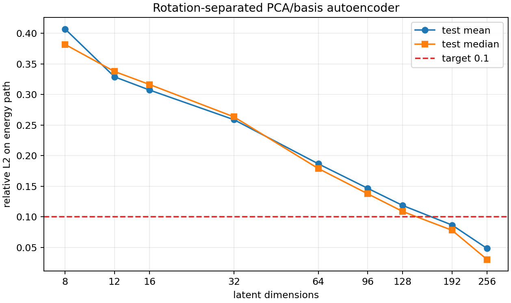

| latent dim | mean rel L2 | median rel L2 | p90 rel L2 | explained variance |
|---:|---:|---:|---:|---:|
| 8 | 0.4069 | 0.3817 | 0.5847 | 0.4859 |
| 12 | 0.3288 | 0.3376 | 0.4510 | 0.5735 |
| 16 | 0.3073 | 0.3163 | 0.4342 | 0.6424 |
| 32 | 0.2588 | 0.2635 | 0.3986 | 0.7805 |
| 64 | 0.1867 | 0.1790 | 0.3335 | 0.8889 |
| 96 | 0.1467 | 0.1378 | 0.2853 | 0.9389 |
| 128 | 0.1186 | 0.1088 | 0.2447 | 0.9640 |
| 192 | 0.0867 | 0.0781 | 0.1801 | 0.9875 |
| 256 | 0.0484 | 0.0304 | 0.1131 | 0.9959 |

## Largest Separator-Candidate View Reconstructions

The example gallery uses the smallest PCA/basis latent that reaches the target when available: `z192`. Each row is one Phase 1 separator candidate view. These are not hand-validated physical truth labels; a bad separator candidate can still contain more than one physical particle, and large candidates are capped/sampled views.

| rank | source | candidate | source hits | view hits | rel L2 | image |
|---:|---|---:|---:|---:|---:|---|
| 1 | `F08/tot_toa__r0000000028.t3pa` | 8867 | 1523 | 512 | 0.2732 | [png](../../assets/phase2_path_ae_focus_v001/pca_z192_largest_01_p8867.png) |
| 2 | `F08/tot_toa__r0000000028.t3pa` | 8867 | 1523 | 512 | 0.2769 | [png](../../assets/phase2_path_ae_focus_v001/pca_z192_largest_02_p8867.png) |
| 3 | `F08/tot_toa__r0000000028.t3pa` | 8867 | 1523 | 512 | 0.2716 | [png](../../assets/phase2_path_ae_focus_v001/pca_z192_largest_03_p8867.png) |
| 4 | `F08/tot_toa__r0000000028.t3pa` | 8867 | 1523 | 512 | 0.2145 | [png](../../assets/phase2_path_ae_focus_v001/pca_z192_largest_04_p8867.png) |
| 5 | `F08/tot_toa__r0000000028.t3pa` | 16244 | 1482 | 512 | 0.2238 | [png](../../assets/phase2_path_ae_focus_v001/pca_z192_largest_05_p16244.png) |
| 6 | `F08/tot_toa__r0000000028.t3pa` | 16244 | 1482 | 512 | 0.2227 | [png](../../assets/phase2_path_ae_focus_v001/pca_z192_largest_06_p16244.png) |
| 7 | `F08/tot_toa__r0000000028.t3pa` | 16244 | 1482 | 512 | 0.2374 | [png](../../assets/phase2_path_ae_focus_v001/pca_z192_largest_07_p16244.png) |
| 8 | `F08/tot_toa__r0000000028.t3pa` | 16244 | 1482 | 512 | 0.2135 | [png](../../assets/phase2_path_ae_focus_v001/pca_z192_largest_08_p16244.png) |
| 9 | `F08/tot_toa__r0000000028.t3pa` | 60858 | 1344 | 512 | 0.2225 | [png](../../assets/phase2_path_ae_focus_v001/pca_z192_largest_09_p60858.png) |
| 10 | `F08/tot_toa__r0000000028.t3pa` | 60858 | 1344 | 512 | 0.1908 | [png](../../assets/phase2_path_ae_focus_v001/pca_z192_largest_10_p60858.png) |

### Rank 1

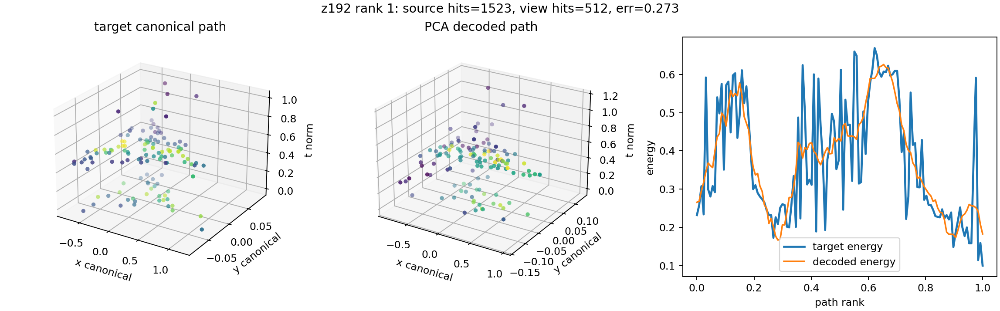

### Rank 2

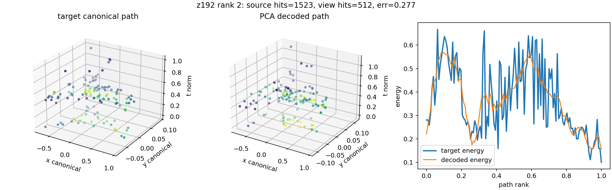

### Rank 3

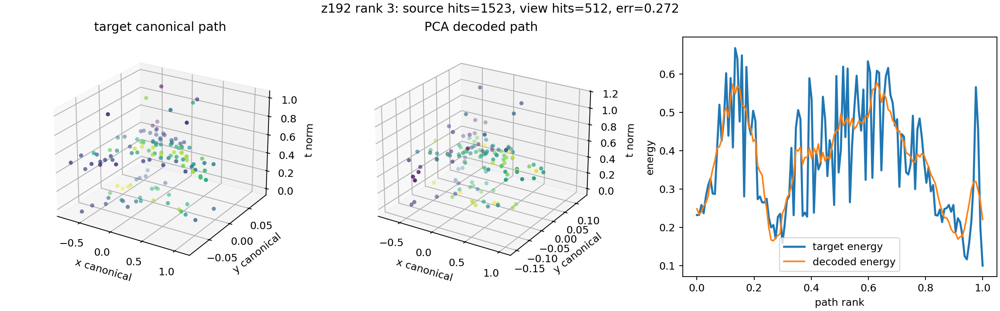

### Rank 4

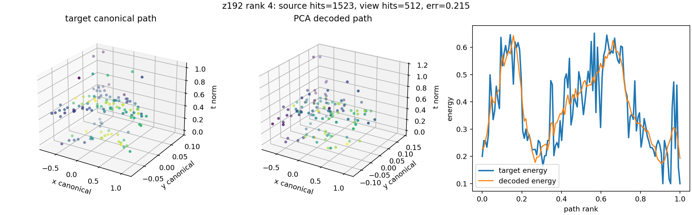

### Rank 5

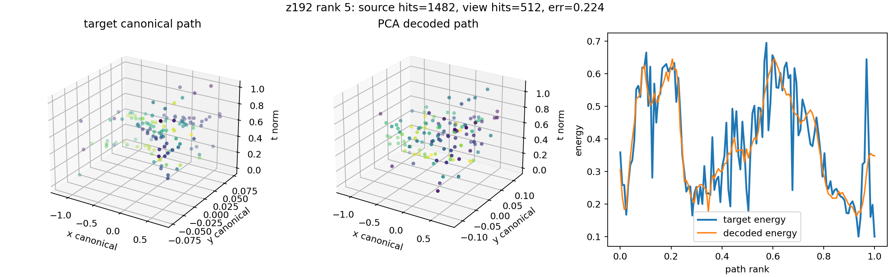

### Rank 6

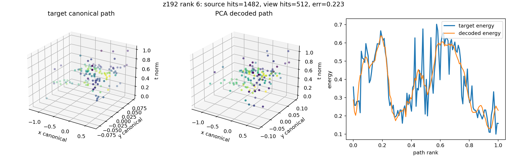

### Rank 7

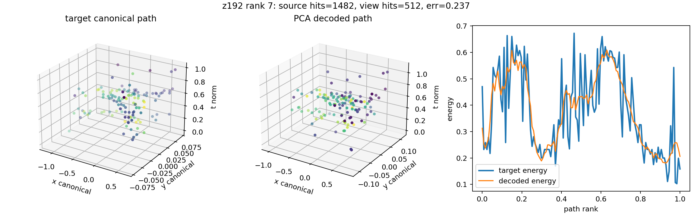

### Rank 8

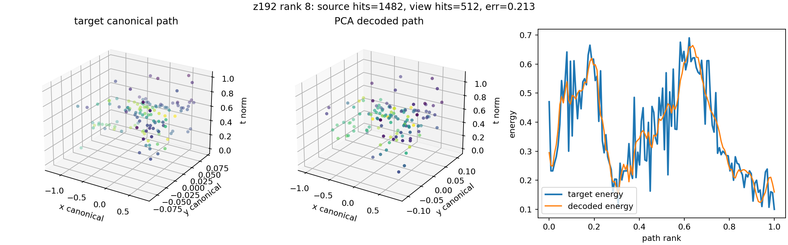

### Rank 9

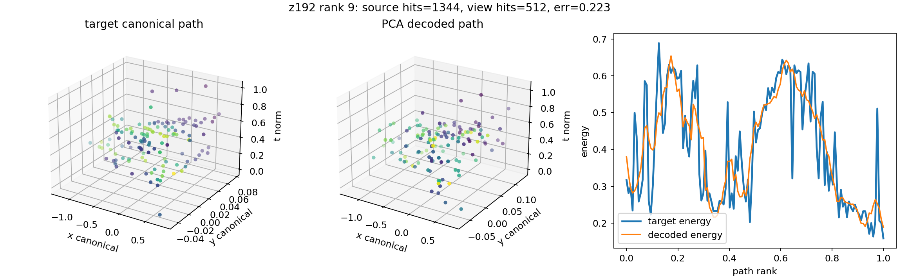

### Rank 10

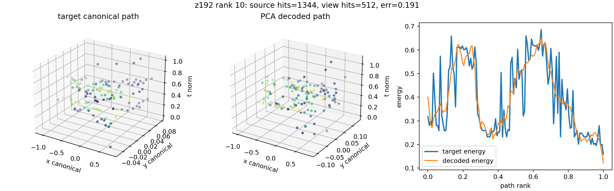

## Clean Single-Candidate Reconstruction Checks

These examples are filtered differently from the largest-candidate stress gallery: full views only (`source hits == view hits`), no sampled `>512` candidates, one view per candidate, and high XY linearity (`q_theta >= 0.85`). They are still separator candidates rather than hand-truth labels, but the left panels are intended to be visually closer to single particle-like trajectories.

| rank | source | candidate | source hits | q_theta | rel L2 | image |
|---:|---|---:|---:|---:|---:|---|
| 1 | `F08/tot_toa__r0000000028.t3pa` | 25638 | 511 | 0.998 | 0.1765 | [png](../../assets/phase2_path_ae_focus_v001/pca_z192_clean_single_01_p25638.png) |
| 2 | `F08/tot_toa__r0000000028.t3pa` | 90262 | 504 | 0.975 | 0.2430 | [png](../../assets/phase2_path_ae_focus_v001/pca_z192_clean_single_02_p90262.png) |
| 3 | `F08/tot_toa__r0000000037.t3pa` | 16725 | 489 | 0.983 | 0.2073 | [png](../../assets/phase2_path_ae_focus_v001/pca_z192_clean_single_03_p16725.png) |
| 4 | `F08/tot_toa__r0000000037.t3pa` | 14139 | 465 | 0.969 | 0.1866 | [png](../../assets/phase2_path_ae_focus_v001/pca_z192_clean_single_04_p14139.png) |
| 5 | `D05/tot_toa__r0000000037.t3pa` | 6092 | 449 | 0.997 | 0.1642 | [png](../../assets/phase2_path_ae_focus_v001/pca_z192_clean_single_05_p6092.png) |
| 6 | `F08/tot_toa__r0000000028.t3pa` | 80059 | 435 | 0.967 | 0.1218 | [png](../../assets/phase2_path_ae_focus_v001/pca_z192_clean_single_06_p80059.png) |
| 7 | `F08/tot_toa__r0000000042.t3pa` | 21537 | 405 | 0.982 | 0.2404 | [png](../../assets/phase2_path_ae_focus_v001/pca_z192_clean_single_07_p21537.png) |
| 8 | `F08/tot_toa__r0000000028.t3pa` | 70262 | 400 | 0.857 | 0.1367 | [png](../../assets/phase2_path_ae_focus_v001/pca_z192_clean_single_08_p70262.png) |
| 9 | `F08/tot_toa__r0000000028.t3pa` | 11544 | 396 | 0.919 | 0.1562 | [png](../../assets/phase2_path_ae_focus_v001/pca_z192_clean_single_09_p11544.png) |
| 10 | `08_thu_proton_daily_batch/toa_tot__r0000007294.t3pa` | 36 | 391 | 0.998 | 0.1560 | [png](../../assets/phase2_path_ae_focus_v001/pca_z192_clean_single_10_p36.png) |

### Clean Candidate 1

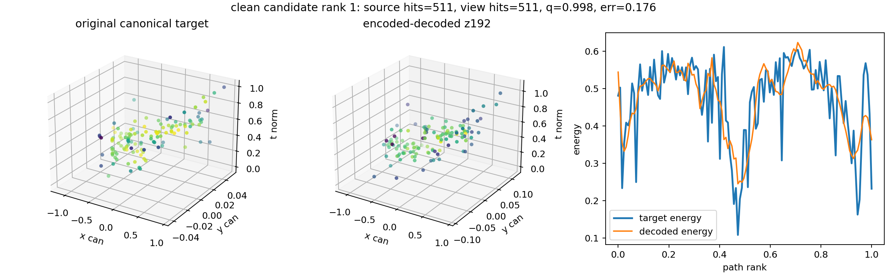

### Clean Candidate 2

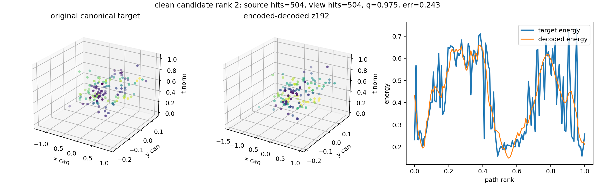

### Clean Candidate 3

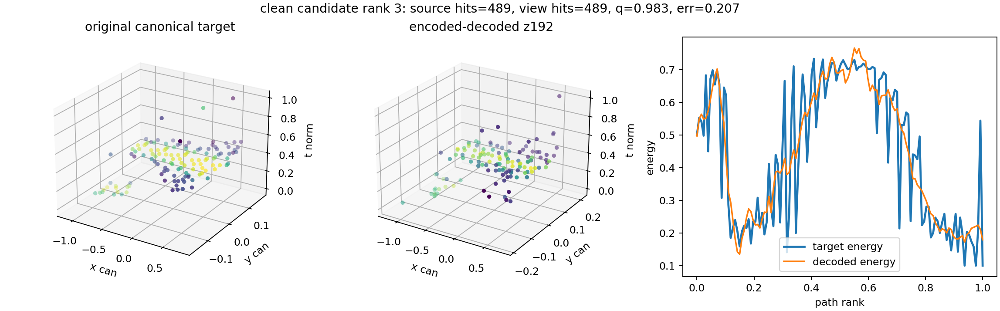

### Clean Candidate 4

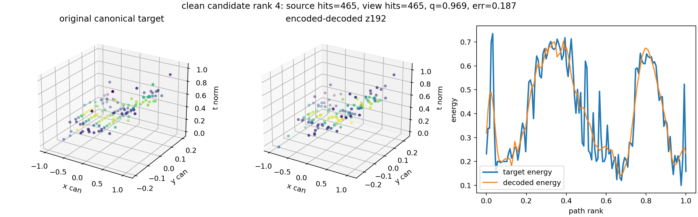

### Clean Candidate 5

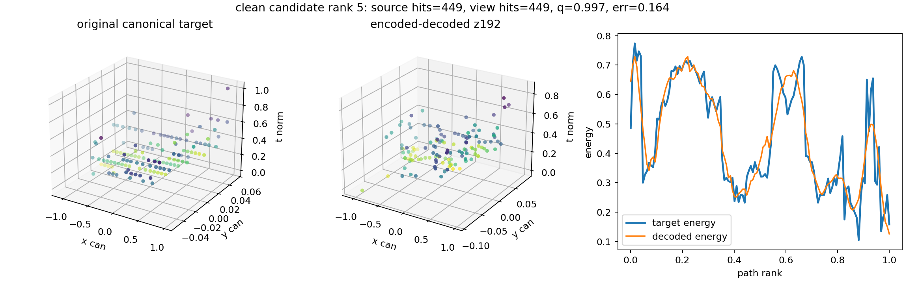

### Clean Candidate 6

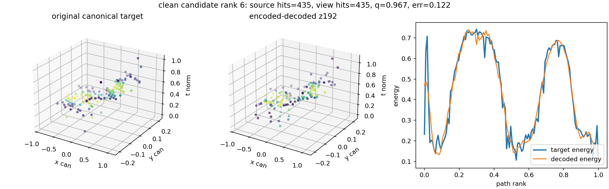

### Clean Candidate 7

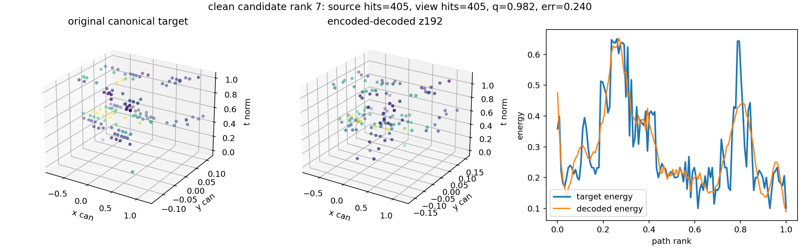

### Clean Candidate 8

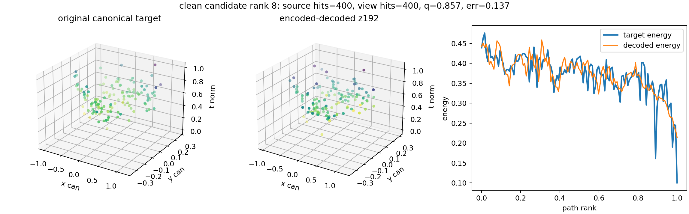

### Clean Candidate 9

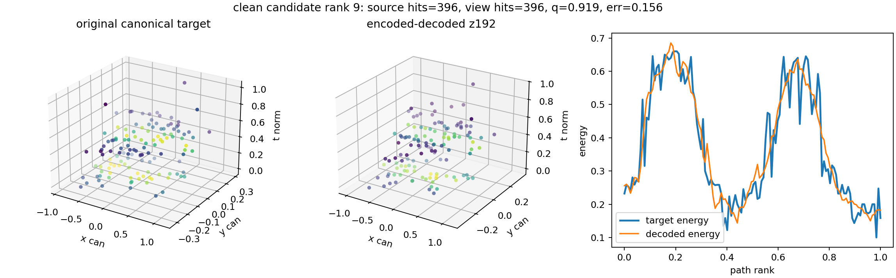

### Clean Candidate 10

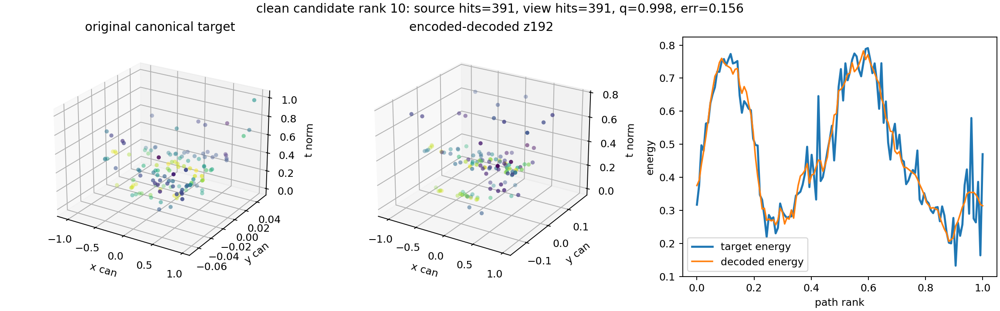

## Strict Face-Contiguous Candidate Checks

These are stricter than the previous linearity-filtered examples: each selected candidate is a full view, has no sampling cap, and is exactly one connected component under **face** connectivity in `(x, y, time-bin)` with `time_bin=1`. This still is not human truth, but it rejects candidates like `F08/tot_toa__r0000000028.t3pa` candidate `25638`, which was one edge/corner-connected blob but 89 face components. The focused diagnostic is in [candidate_25638_continuity.md](../../assets/phase2_path_ae_focus_v001/candidate_25638_continuity/candidate_25638_continuity.md), the cube-grid rendering is in [candidate_25638_voxel_cube_connectivity.md](../../assets/phase2_path_ae_focus_v001/candidate_25638_continuity/candidate_25638_voxel_cube_connectivity.md), and the corrected fine-time check is in [candidate_25638_fine_time_check.md](../../assets/phase2_path_ae_focus_v001/candidate_25638_continuity/candidate_25638_fine_time_check.md).

| rank | source | candidate | hits | rel L2 | face comps | time span | image |
|---:|---|---:|---:|---:|---:|---:|---|
| 1 | `08_thu_proton_daily_batch/toa_tot__r0000007333.t3pa` | 3354 | 37 | 0.0405 | 1 | 0.0 | [png](../../assets/phase2_path_ae_focus_v001/pca_z192_strict_face_single_01_p3354.png) |
| 2 | `08_thu_proton_daily_batch/toa_tot__r0000007332.t3pa` | 1509 | 36 | 0.0294 | 1 | 0.0 | [png](../../assets/phase2_path_ae_focus_v001/pca_z192_strict_face_single_02_p1509.png) |
| 3 | `08_thu_proton_daily_batch/toa_tot__r0000007332.t3pa` | 1454 | 35 | 0.0307 | 1 | 0.0 | [png](../../assets/phase2_path_ae_focus_v001/pca_z192_strict_face_single_03_p1454.png) |
| 4 | `08_thu_proton_daily_batch/toa_tot__r0000007332.t3pa` | 203 | 29 | 0.0230 | 1 | 0.0 | [png](../../assets/phase2_path_ae_focus_v001/pca_z192_strict_face_single_04_p203.png) |
| 5 | `F08/tot_toa__r0000000042.t3pa` | 34092 | 29 | 0.0638 | 1 | 0.0 | [png](../../assets/phase2_path_ae_focus_v001/pca_z192_strict_face_single_05_p34092.png) |

### Strict Face Candidate 1

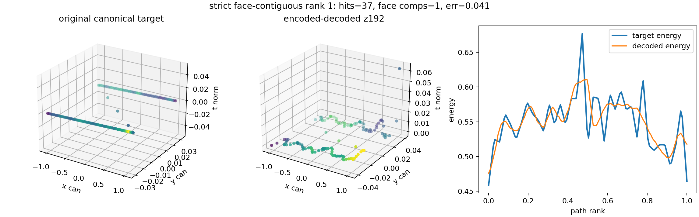

### Strict Face Candidate 2

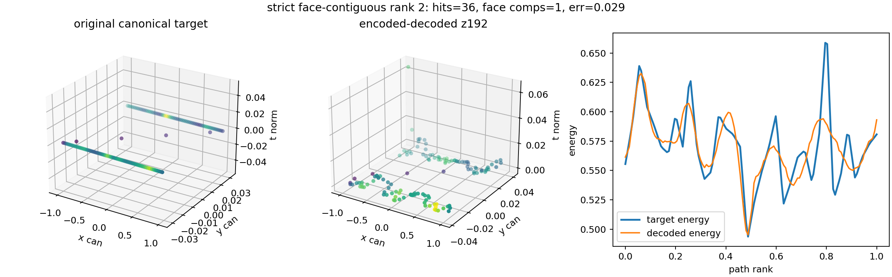

### Strict Face Candidate 3

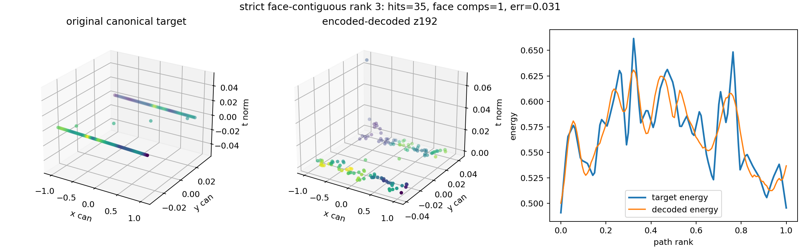

### Strict Face Candidate 4

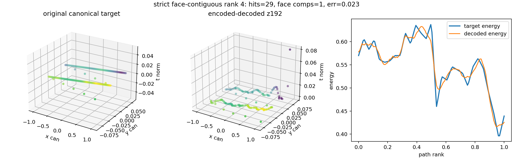

### Strict Face Candidate 5

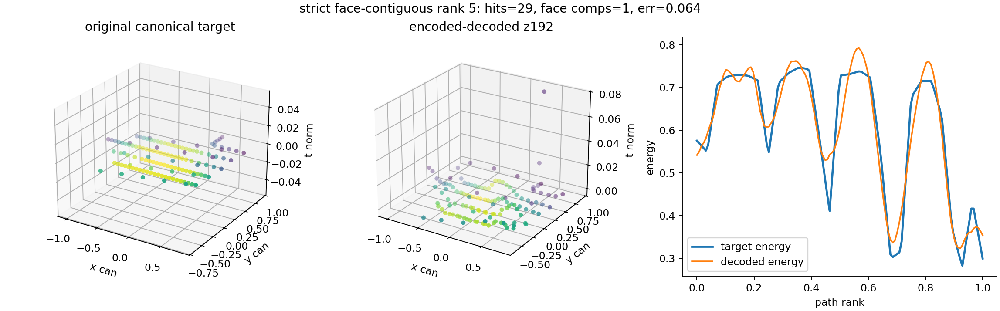

## Interpretation

- `8-16` dimensions are not enough for high-fidelity reconstruction over the full current particle population.
- `32-128` dimensions improve steadily but still leave visible simplification of large or branching trajectories.
- `192` dimensions is the first direct-path PCA/basis setting that crosses the mean `0.1` target on this cache.
- If a displayed candidate visibly contains several physical trajectories, that is a Phase 1 separation/quality issue, not an autoencoder success case.
- The current cache was built before the `ToA/FToA` timestamp fix. The next valid Phase 2 run must use fine-time shards from `configs/teachers/voxel_corner_fine_min2_v001.json`.
- For a true `8-16` dimensional scientific latent, the target should shift from exact reconstruction to morphology/class embedding, with a separate high-dimensional decoder or residual store for visualization.
