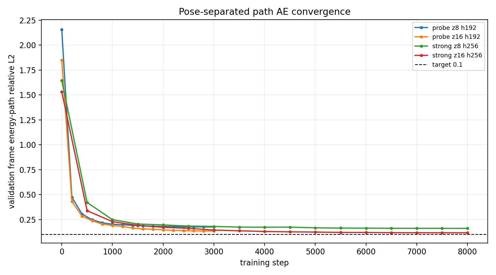
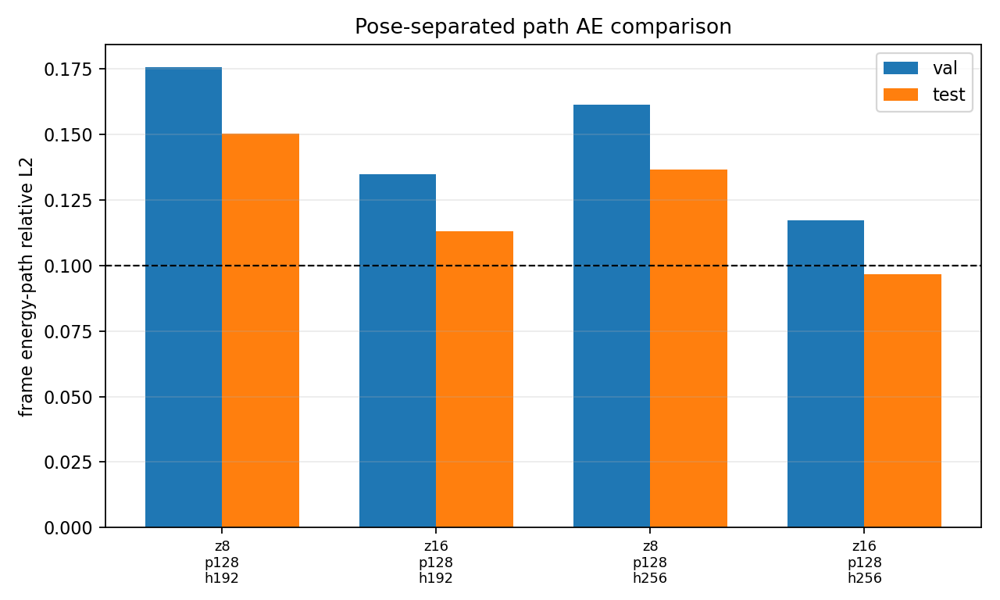
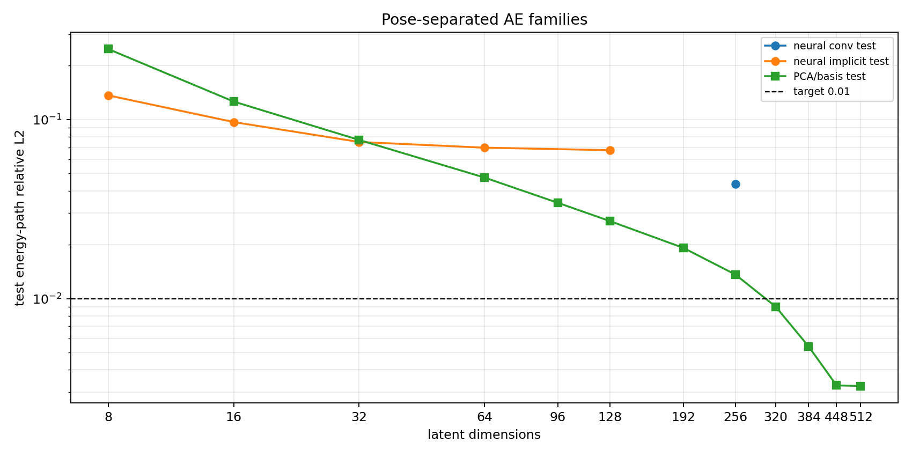

# Phase 2 Pose-Separated Autoencoder Probe

This note records the first implementation of the rotation-factorized Phase 2 path autoencoder.

## Design

The model separates detector-plane pose from particle shape:

1. Build a time-ordered energy path from each native-grid-DBSCAN particle.
2. Compute weighted PCA in the detector plane.
3. Store `theta_xy` as explicit pose metadata: `cos(theta_xy)`, `sin(theta_xy)`, and `q_theta`.
4. Rotate the path into canonical XY orientation.
5. Encode only the canonical path into `z_shape`.
6. Decode a canonical path.
7. Apply a fixed, non-learned XY rotation matrix at the final decoder step to reconstruct the original local frame.

The learned latent therefore contains shape/time/energy information, while detector-plane rotation is outside the class embedding.

## Data

Source dataset:

`local_data/processed/phase2_particles_eps5_v001`

Training cache:

`local_data/processed/phase2_pose_path_cache_eps5_v001_probe`

Probe cache size:

| split | views |
|---|---:|
| train | 120,000 |
| validation | 24,000 |
| test | 24,000 |

Each cached item stores:

| array | shape | meaning |
|---|---:|---|
| `canonical` | `[128, 4]` | `(x_can, y_can, t_norm, energy)` |
| `target` | `[128, 4]` | centered/scaled original-frame `(x, y, t_norm, energy)` |
| `pose` | `[3]` | `cos(theta_xy), sin(theta_xy), q_theta` |

## Model

Implementation:

- `PoseSeparatedPathAutoencoder` in `src/particle_classification/phase2_path_ae.py`
- training script: `scripts/autoencoders/train_phase2_pose_autoencoder.py`

Backbone:

- point/path MLP with LayerNorm + SiLU
- residual 1D convolution along path samples
- mean, max, and attention pooling
- Fourier query decoder
- final fixed XY rotation via `rotate_path_by_pose`

Loss:

- original-frame weighted relative path L2
- original-frame energy-path relative L2
- derivative/path smoothness relative L2
- energy-sum relative L1
- monotonic-time penalty
- auxiliary canonical reconstruction loss

Training used AdamW, cosine LR decay, AMP, gradient clipping, growing batch size, rotation augmentation, and a short LBFGS polish.

## Results

| run | latent | hidden | steps | val energy-path rel. L2 | test energy-path rel. L2 | test path rel. L2 |
|---|---:|---:|---:|---:|---:|---:|
| probe | 8 | 192 | 3,000 | 0.1757 | 0.1503 | 0.1801 |
| probe | 16 | 192 | 3,000 | 0.1348 | 0.1130 | 0.1334 |
| stronger | 8 | 256 | 8,000 | 0.1614 | 0.1365 | 0.1622 |
| stronger | 16 | 256 | 8,000 | 0.1172 | 0.0968 | 0.1137 |
| implicit sweep | 32 | 384 | 8,000 | 0.0919 | 0.0750 | 0.0876 |
| implicit sweep | 64 | 384 | 8,000 | 0.0852 | 0.0697 | 0.0817 |
| implicit sweep | 128 | 384 | 8,000 | 0.0825 | 0.0674 | 0.0786 |
| conv hifi | 256 | 192 | 6,000 | 0.0543 | 0.0438 | 0.0501 |

The first neural implementation was not merely undertrained. A tiny overfit check showed the implicit Fourier-query decoder could not memorize 512 examples below roughly `0.07` energy-path relative L2. A sequence/conv decoder improves the fit, but even `z=256` remains at `0.0438` on the held-out test subset.

## High-Fidelity PCA/Basis Fit

To test whether the `<0.01` target is a training problem or an information bottleneck, I fitted a pose-separated PCA/basis autoencoder on the same canonical paths. This keeps the same pose contract: `theta_xy` is outside the latent and the basis reconstructs only the canonical path.

| latent | val mean | val p90 | test mean | test p90 | explained variance |
|---:|---:|---:|---:|---:|---:|
| 16 | 0.1460 | 0.3479 | 0.1261 | 0.3082 | 0.8602 |
| 32 | 0.0929 | 0.2838 | 0.0769 | 0.2247 | 0.9322 |
| 64 | 0.0595 | 0.1951 | 0.0474 | 0.1411 | 0.9709 |
| 128 | 0.0333 | 0.1114 | 0.0271 | 0.0685 | 0.9904 |
| 192 | 0.0231 | 0.0599 | 0.0192 | 0.0317 | 0.9961 |
| 256 | 0.0161 | 0.0277 | 0.0136 | 0.0162 | 0.9986 |
| 320 | 0.0104 | 0.0148 | 0.0090 | 0.0099 | 0.9997 |
| 384 | 0.0061 | 0.0077 | 0.0054 | 0.0062 | 1.0000 |
| 448 | 0.0035 | 0.0046 | 0.0033 | 0.0044 | 1.0000 |

The first setting that is safely below `<0.01` on both validation mean and test mean is `z=384`. `z=320` is below target on the test mean but slightly above on validation mean.

## Figures








## Commands

```bash
.venv/bin/python scripts/autoencoders/train_phase2_pose_autoencoder.py \
  --dataset local_data/processed/phase2_particles_eps5_v001 \
  --cache local_data/processed/phase2_pose_path_cache_eps5_v001_probe \
  --out local_data/experiments/phase2_pose_path_ae_eps5_stronger \
  --device cuda \
  --path-points 128 \
  --latent-dim 8 \
  --latent-dim 16 \
  --hidden-dim 256 \
  --fourier-frequencies 8 \
  --steps 8000 \
  --min-steps 3000 \
  --eval-interval 500 \
  --patience 12 \
  --batch-sizes 512,1024 \
  --learning-rate 6e-4 \
  --min-learning-rate 1e-5 \
  --lbfgs-steps 10 \
  --lbfgs-batch 4096
```

## Next Checks

The `<0.01` reconstruction target is achievable, but not with the original small neural latent. Current conclusion:

- `8-16` dimensions are appropriate for morphology/class embedding, not near-lossless path reconstruction.
- `z=384` PCA/basis is the current high-fidelity baseline.
- the neural conv decoder should be kept for learned nonlinear compression, but it needs either a much richer latent, a residual basis head, or a different objective to compete with PCA at the `<0.01` level.
- the next serious run should evaluate bucketed errors by hit count, `q_theta`, and time span, because the high-percentile failures are concentrated in more complex paths.
