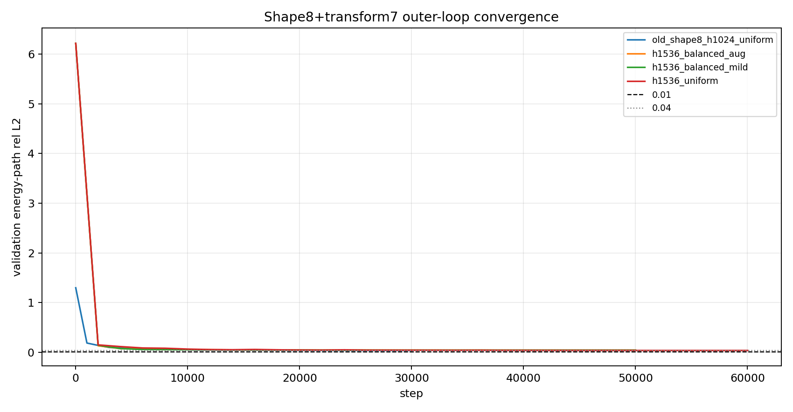
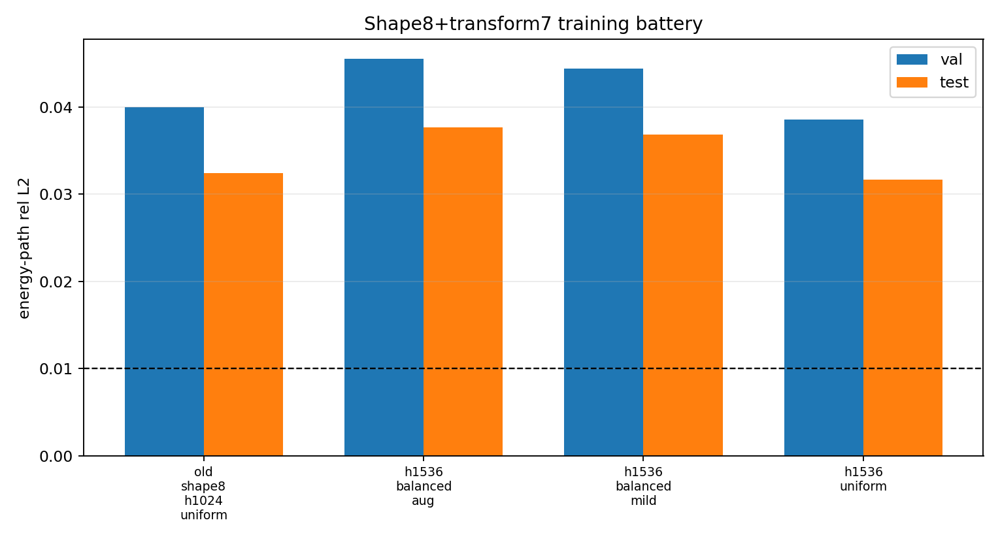
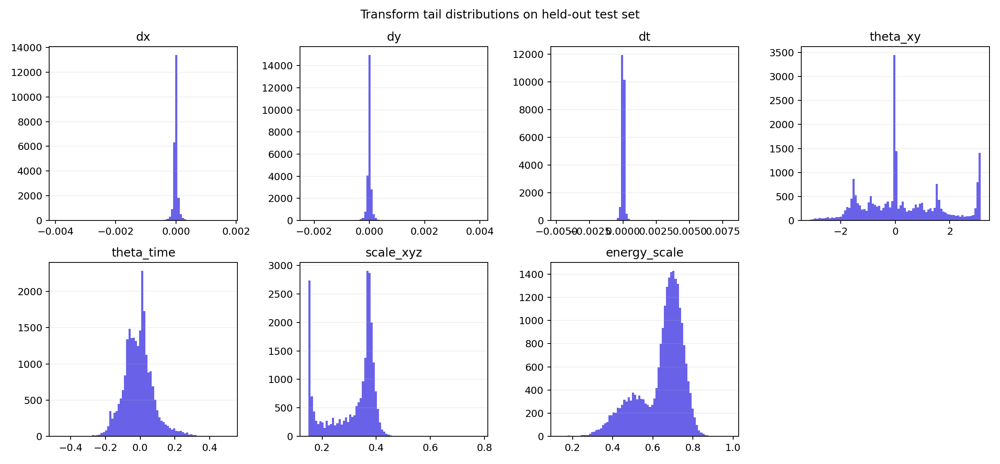
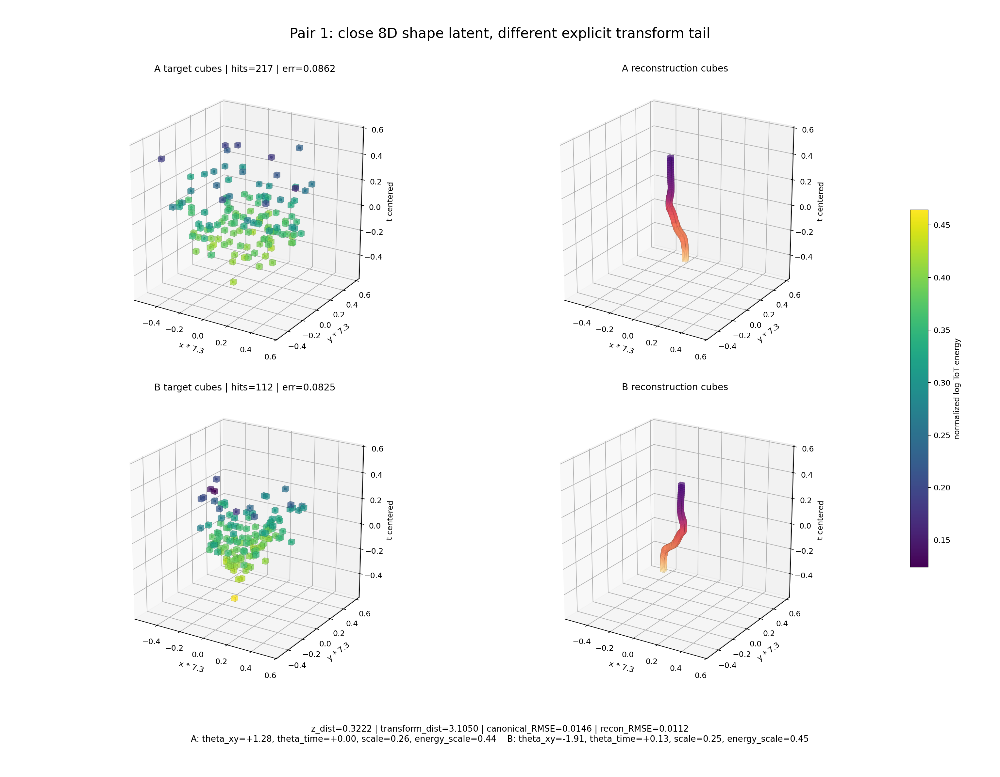
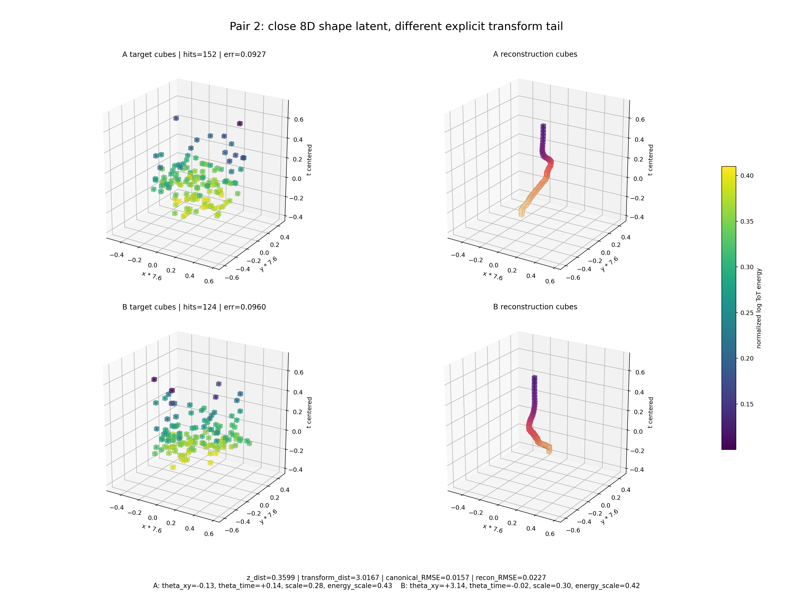
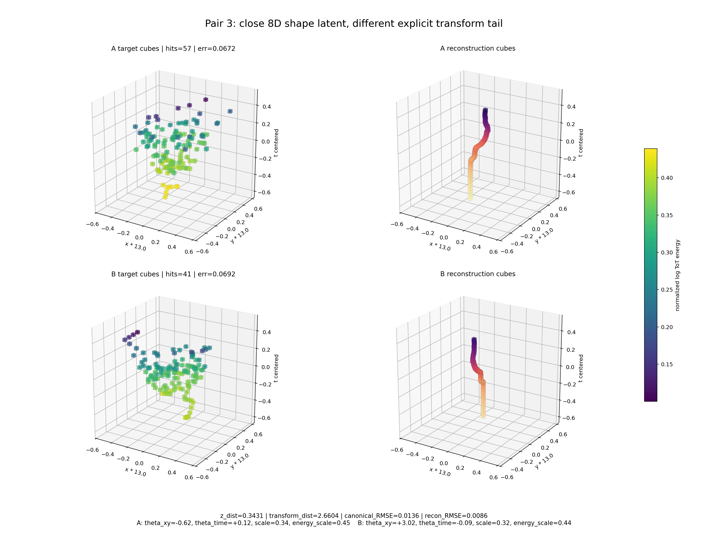
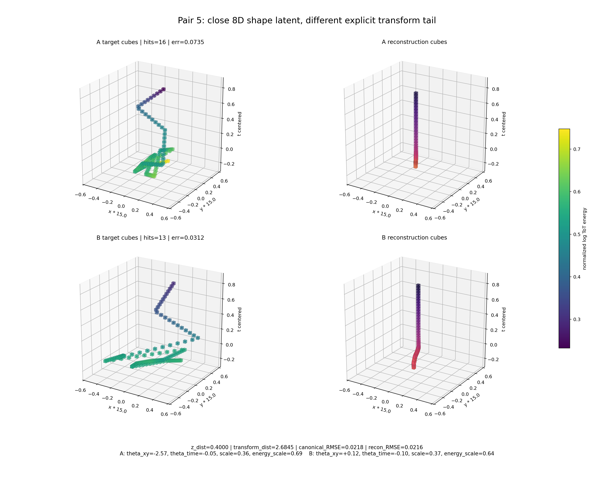
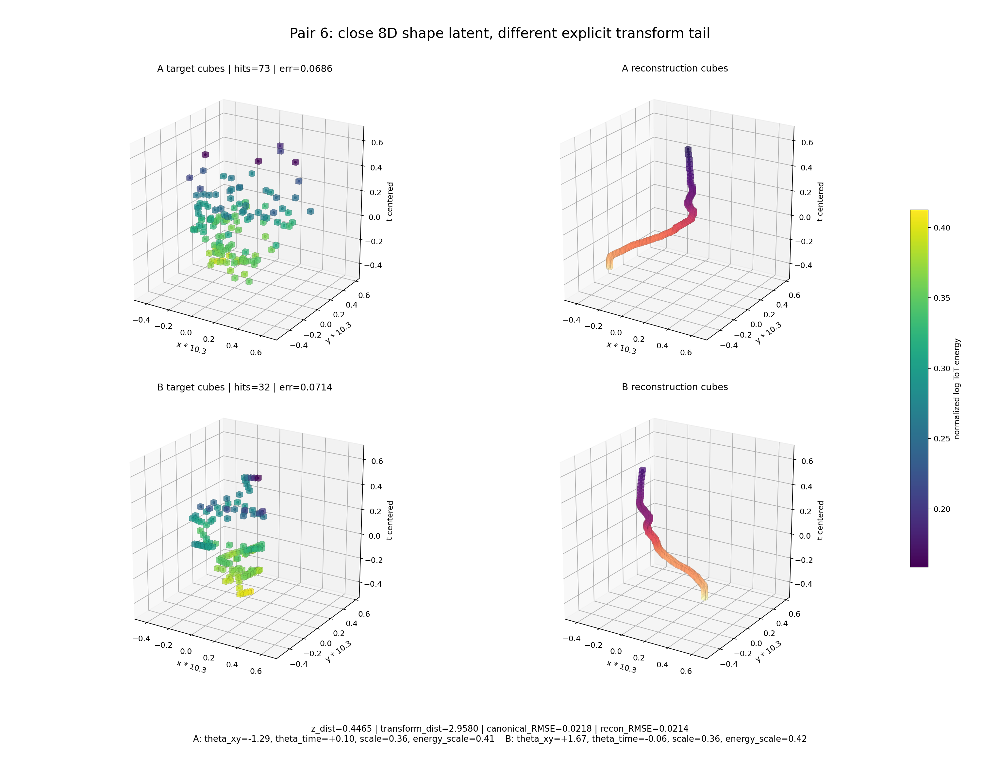
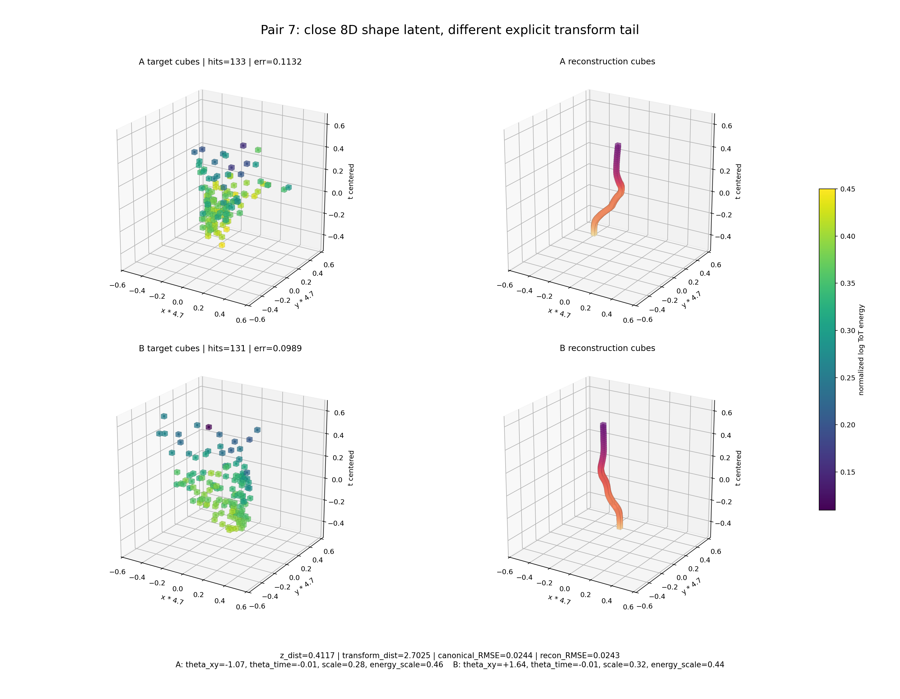

# Phase 2 Shape8 Structured-Transform Heavy Training

This pass focuses only on the smallest requested neural latent: `z_shape=8` plus the 7 explicit transform values `dx, dy, dt, theta_xy, theta_time, scale_xyz, energy_scale`. Energy remains the normalized log feature `log1p(ToT) / log1p(1023)`, and paths are centered by subtracting mean `(x,y,t)`.

## Outer Loop Training Battery

| run | hidden | sampling | denoise | val energy rel L2 | test energy rel L2 | test path rel L2 |
|---|---:|---|---|---:|---:|---:|
| `outer_h1536_uniform` | 1536 | uniform | no | 0.0386 | 0.0316 | 0.0323 |
| `old_shape8_h1024_uniform` | 1024 | uniform | no | 0.0400 | 0.0325 | 0.0331 |
| `outer_h1536_balanced_mild` | 1536 | balanced hard | no | 0.0445 | 0.0368 | 0.0378 |
| `outer_h1536_balanced_aug` | 1536 | balanced hard | yes | 0.0455 | 0.0376 | 0.0386 |

## Best Model Bucketed Test Metrics

The best overall model is the uniform `hidden=1536` run. Bucketed metrics show the same pattern as before: tiny particles are reconstructed well, larger particles remain the hard failure mode.

| hit bucket | items | mean err | median err | p90 err | p99 err |
|---|---:|---:|---:|---:|---:|
| 2-3 | 11425 | 0.0042 | 0.0039 | 0.0057 | 0.0099 |
| 4-10 | 8898 | 0.0163 | 0.0081 | 0.0401 | 0.0718 |
| 11-50 | 2372 | 0.1076 | 0.0825 | 0.2274 | 0.2914 |
| 51-128 | 1063 | 0.2276 | 0.2507 | 0.3142 | 0.3570 |
| 129-512 | 220 | 0.2823 | 0.3204 | 0.3948 | 0.4284 |
| >512 | 22 | 0.3249 | 0.3365 | 0.4246 | 0.6284 |

## Transform Tail Distributions

## Similar `z_shape` But Different Transform Tail

I searched the held-out test set for particle pairs with very nearby 8D `z_shape` values but larger differences in the 7D explicit transform tail. This is a qualitative check of whether the model uses the tail as pose/scale metadata. If the design is working, the canonical decoded paths should be similar while final reconstructions differ via the transform values.

The pair images below were regenerated as semi-transparent cube plots. Each figure shows A/B target paths and A/B reconstructions as separate cube clouds colored by normalized log-ToT energy. The `x` and `y` axes are multiplied by the per-pair display scale printed on the axes, because the centered Phase 2 path tensors have a much larger time span than detector-plane span.

| rank | A particle | B particle | z distance | transform distance | canonical RMSE | image |
|---:|---|---|---:|---:|---:|---|
| 1 | `F08/tot_toa__r0000000028.t3pa:83788` (217 hits) | `F08/tot_toa__r0000000042.t3pa:8307` (112 hits) | 0.3222 | 3.1050 | 0.0146 | [png](../../assets/phase2_shape8_heavy_training/latent_transform_pairs/latent_pair_01.png) |
| 2 | `F08/tot_toa__r0000000028.t3pa:25748` (152 hits) | `F08/tot_toa__r0000000028.t3pa:49623` (124 hits) | 0.3599 | 3.0167 | 0.0157 | [png](../../assets/phase2_shape8_heavy_training/latent_transform_pairs/latent_pair_02.png) |
| 3 | `F08/tot_toa__r0000000037.t3pa:5920` (57 hits) | `F08/tot_toa__r0000000028.t3pa:54535` (41 hits) | 0.3431 | 2.6604 | 0.0136 | [png](../../assets/phase2_shape8_heavy_training/latent_transform_pairs/latent_pair_03.png) |
| 4 | `F08/tot_toa__r0000000028.t3pa:54691` (301 hits) | `F08/tot_toa__r0000000028.t3pa:41853` (166 hits) | 0.4181 | 2.9727 | 0.0218 | [png](../../assets/phase2_shape8_heavy_training/latent_transform_pairs/latent_pair_04.png) |
| 5 | `data M07/sync__M07-W0044_r000.t3pa:153838` (16 hits) | `data M07/sync__M07-W0044_r000.t3pa:263144` (13 hits) | 0.4000 | 2.6845 | 0.0218 | [png](../../assets/phase2_shape8_heavy_training/latent_transform_pairs/latent_pair_05.png) |
| 6 | `F08/tot_toa__r0000000028.t3pa:45334` (73 hits) | `F08/tot_toa__r0000000028.t3pa:4062` (32 hits) | 0.4465 | 2.9580 | 0.0218 | [png](../../assets/phase2_shape8_heavy_training/latent_transform_pairs/latent_pair_06.png) |
| 7 | `F08/tot_toa__r0000000037.t3pa:3396` (133 hits) | `F08/tot_toa__r0000000042.t3pa:11958` (131 hits) | 0.4117 | 2.7025 | 0.0244 | [png](../../assets/phase2_shape8_heavy_training/latent_transform_pairs/latent_pair_07.png) |
| 8 | `F08/tot_toa__r0000000028.t3pa:83788` (217 hits) | `F08/tot_toa__r0000000037.t3pa:4972` (113 hits) | 0.4847 | 3.1261 | 0.0274 | [png](../../assets/phase2_shape8_heavy_training/latent_transform_pairs/latent_pair_08.png) |

### Pair 1

### Pair 2

### Pair 3

### Pair 4

### Pair 5

### Pair 6

### Pair 7

### Pair 8

## Interpretation

- Heavy outer-loop training improved the best `8+7` test error slightly, from `0.0325` to `0.0316`.
- Balanced hard-particle sampling and denoising did not improve the global test metric; it raised the training difficulty but did not solve the large-particle reconstruction gap.
- The transform-tail pair search finds cases where nearby 8D shape latents share similar decoded canonical paths and differ through transform values, so the mechanism is being used in the intended direction.
- The transform entries are still not guaranteed physical truth because they are trained only through reconstruction, not supervised by measured `dx/theta/scale` labels.
- For faithful large-particle reconstruction, this dense `8+7` model is still not enough; the next architecture should use a sequence decoder, basis residual, or hierarchical particle representation while keeping the transform tail.
