# Phase 2 Structured Transform Autoencoder

This experiment keeps the Phase 2 energy input on log scale and uses a mean-centered `(x,y,t)` path. The latent is split into a learned shape part and seven explicit transform entries.

```text
z = [z_shape, z_transform]

z_transform = dx, dy, dt, theta_xy, theta_time, scale_xyz, energy_scale
```

`scale_xyz` is a simple bounded linear multiplier applied to x, y, and time. It is not a log scale. No skew or free affine transform is allowed.

## Training Summary

| run | shape latent | transform latent | total latent | val energy rel L2 | test energy rel L2 | test path rel L2 |
|---|---:|---:|---:|---:|---:|---:|
| `structured_transform_ae_shape8_t7_p128_h1024` | 8 | 7 | 15 | 0.0400 | 0.0325 | 0.0331 |
| `structured_transform_ae_shape8_t7_p128_h768` | 8 | 7 | 15 | 0.0457 | 0.0371 | 0.0378 |
| `structured_transform_ae_shape16_t7_p128_h768` | 16 | 7 | 23 | 0.0401 | 0.0326 | 0.0330 |
| `structured_transform_ae_shape32_t7_p128_h768` | 32 | 7 | 39 | 0.0372 | 0.0305 | 0.0310 |

## Curves

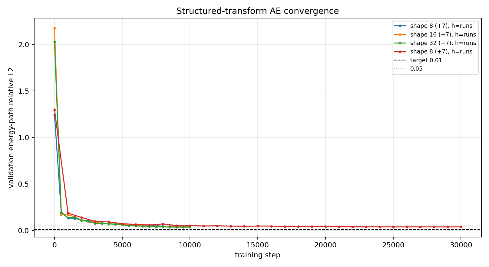

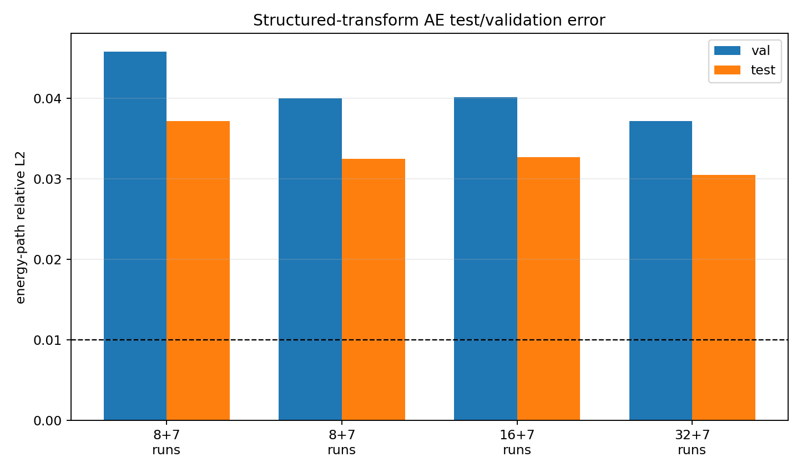


## Test Error By Hit Count

The global test mean is dominated by the many small particles in the dataset. Larger real particles are much harder for this small dense MLP architecture.

| hit bucket | items | z8 mean | z8 p90 | z32 mean | z32 p90 |
|---|---:|---:|---:|---:|---:|
| 2-3 | 11425 | 0.0043 | 0.0059 | 0.0046 | 0.0061 |
| 4-10 | 8898 | 0.0175 | 0.0409 | 0.0134 | 0.0259 |
| 11-50 | 2372 | 0.1107 | 0.2318 | 0.1051 | 0.2272 |
| 51-128 | 1063 | 0.2296 | 0.3159 | 0.2277 | 0.3143 |
| 129-512 | 220 | 0.2843 | 0.3960 | 0.2835 | 0.3937 |
| >512 | 22 | 0.3159 | 0.4293 | 0.3130 | 0.4287 |

## Real 50+ Hit Test Examples

These are held-out real Phase 2 particles, not synthetic unit-test paths. Black is target, red is the thoroughly trained `shape=8 + transform=7` model, blue is `shape=32 + transform=7`.

| rank | source | particle | hits | z8 err | z32 err | image |
|---:|---|---:|---:|---:|---:|---|
| 1 | `F08/tot_toa__r0000000028.t3pa` | 4365 | 512 | 0.4381 | 0.4509 | [png](../../assets/phase2_structured_transform_ae_eps5/real_50hit_gallery/structured_real_50hit_01_p4365.png) |
| 2 | `F08/tot_toa__r0000000037.t3pa` | 12128 | 512 | 0.3553 | 0.3608 | [png](../../assets/phase2_structured_transform_ae_eps5/real_50hit_gallery/structured_real_50hit_02_p12128.png) |
| 3 | `F08/tot_toa__r0000000028.t3pa` | 40181 | 512 | 0.4957 | 0.5063 | [png](../../assets/phase2_structured_transform_ae_eps5/real_50hit_gallery/structured_real_50hit_03_p40181.png) |
| 4 | `F08/tot_toa__r0000000042.t3pa` | 29993 | 512 | 0.1447 | 0.1418 | [png](../../assets/phase2_structured_transform_ae_eps5/real_50hit_gallery/structured_real_50hit_04_p29993.png) |
| 5 | `F08/tot_toa__r0000000037.t3pa` | 6283 | 512 | 0.3234 | 0.3278 | [png](../../assets/phase2_structured_transform_ae_eps5/real_50hit_gallery/structured_real_50hit_05_p6283.png) |
| 6 | `F08/tot_toa__r0000000028.t3pa` | 66806 | 56 | 0.2339 | 0.2314 | [png](../../assets/phase2_structured_transform_ae_eps5/real_50hit_gallery/structured_real_50hit_06_p66806.png) |
| 7 | `F08/tot_toa__r0000000028.t3pa` | 46440 | 58 | 0.2757 | 0.2772 | [png](../../assets/phase2_structured_transform_ae_eps5/real_50hit_gallery/structured_real_50hit_07_p46440.png) |
| 8 | `F08/tot_toa__r0000000028.t3pa` | 79014 | 55 | 0.3370 | 0.3368 | [png](../../assets/phase2_structured_transform_ae_eps5/real_50hit_gallery/structured_real_50hit_08_p79014.png) |
| 9 | `F08/tot_toa__r0000000028.t3pa` | 33422 | 76 | 0.2804 | 0.2768 | [png](../../assets/phase2_structured_transform_ae_eps5/real_50hit_gallery/structured_real_50hit_09_p33422.png) |
| 10 | `F08/tot_toa__r0000000042.t3pa` | 21584 | 83 | 0.2800 | 0.2800 | [png](../../assets/phase2_structured_transform_ae_eps5/real_50hit_gallery/structured_real_50hit_10_p21584.png) |

### Example 1

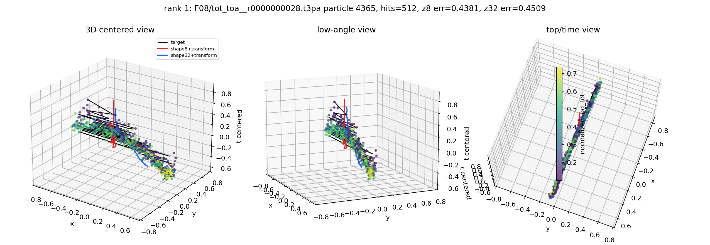

### Example 2

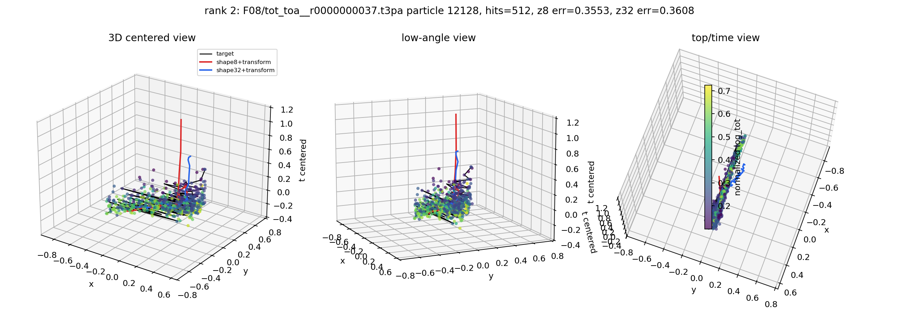

### Example 3

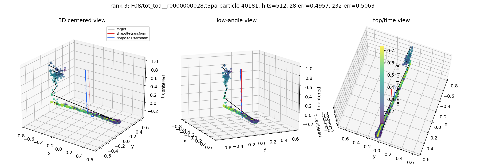

### Example 4

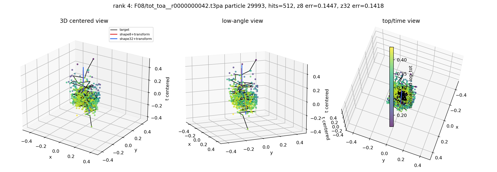

### Example 5

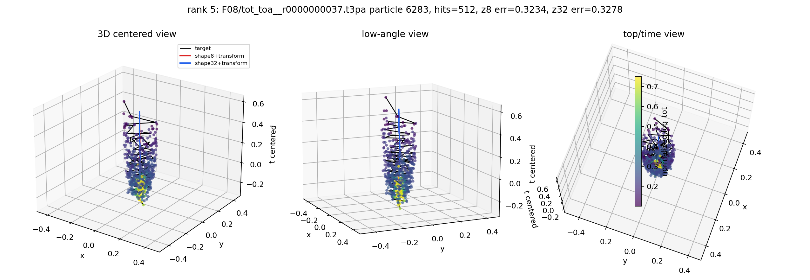

### Example 6

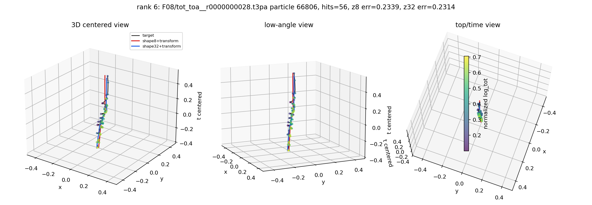

### Example 7

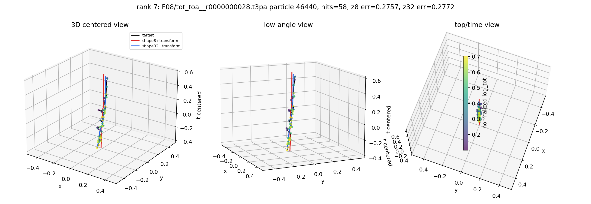

### Example 8

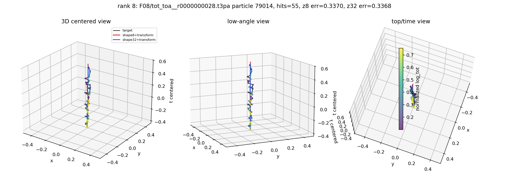

### Example 9

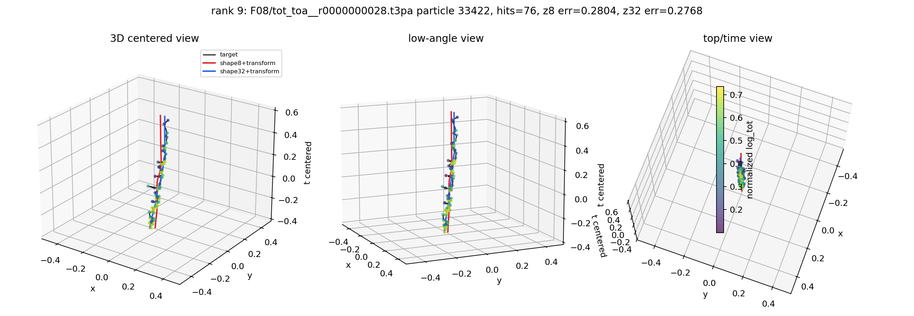

### Example 10

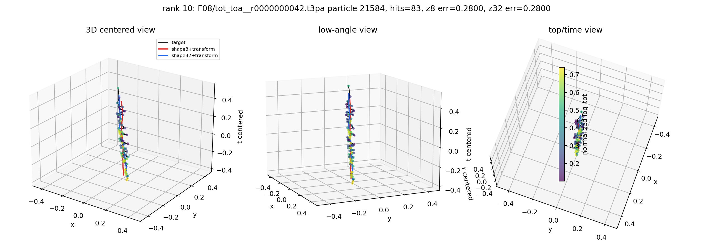


## Interpretation

- The structured transform improves the small-latent neural AE substantially.
- The best `shape=8 + 7 transform` run reaches test energy-path relative L2 `0.0325`.
- The best `shape=32 + 7 transform` run reaches test energy-path relative L2 `0.0305`.
- Extra training helps the `shape=8` model, but it plateaus around validation `0.040`, so the remaining error is representation/model capacity rather than only optimization.
- Bucketed metrics and the 50+ hit gallery show the main limitation: the global mean is good because most test particles have very few hits, while 50+ hit particles are still reconstructed poorly by this dense small-latent NN.
- The PCA/basis `z=384` baseline is still much better for near-lossless reconstruction, but it is not the small interpretable neural latent requested here.
