# Phase 2 Autoencoder Reconstruction Demo

Current corrected snapshot gallery: [phase2-largest-particle-reconstruction-snapshots.md](phase2-largest-particle-reconstruction-snapshots.md).

Source file: `F08/tot_toa__r0000000000.t3pa`

Autoencoder checkpoint: `19_pointtransformer_ae` (`PointTransformer-lite + AE`), the best reconstruction-style encoder from the overnight sweep.

Each input particle is a variable-size hit set with 10 per-hit features plus 22 summary features. The encoder compresses that particle view into a 64-dimensional latent vector `z`; the decoder reconstructs a fixed 64-point particle view. For particles with more than 64 original hits, the reconstruction is therefore a compact learned point-set summary, not a one-to-one copy of every hit.

The plots below use the same 3D view for the original and reconstructed point sets. Color is energy-like `log1p(ToT) / log1p(1023)`. The z-axis is relative time in `ToA / 1e6` units, reconstructed from the decoded `t_scaled` feature.

> Audit note: these examples exposed a separator problem. The "original"
> particles below are `dbscan_v001` outputs, and several are multi-clump merged
> structures rather than single particles. Treat this gallery as a diagnostic
> failure case, not as a trustworthy reconstruction benchmark.

## Top 10 Largest Particles

Full numeric summary: [top10_reconstruction_summary.csv](../../assets/phase2_autoencoder_reconstruction/top10_reconstruction_summary.csv)

| particle_id | n_hits | energy_sum | time_span      | reconstruction_chamfer_xyte_norm | decoded_points | z_00    | z_01   | z_02   | z_03    | z_04    | z_05    | z_06    | z_07    |
| ----------- | ------ | ---------- | -------------- | -------------------------------- | -------------- | ------- | ------ | ------ | ------- | ------- | ------- | ------- | ------- |
| 1365        | 124    | 354.6581   | 177852032.0000 | 0.4710                           | 64             | 0.0549  | 0.0338 | 0.2035 | -0.0074 | -0.0699 | -0.1265 | -0.0472 | -0.0022 |
| 671         | 120    | 340.4886   | 223065718.0000 | 0.4611                           | 64             | 0.1807  | 0.1751 | 0.1563 | 0.0241  | -0.0196 | -0.0393 | -0.1486 | 0.1060  |
| 332         | 119    | 341.4153   | 275359417.0000 | 0.4435                           | 64             | 0.0863  | 0.1287 | 0.1182 | 0.0013  | -0.0190 | -0.1351 | -0.1048 | 0.0549  |
| 1271        | 113    | 337.7076   | 213332388.0000 | 0.3690                           | 64             | 0.0035  | 0.1284 | 0.1100 | -0.0967 | -0.0206 | -0.1312 | -0.1856 | 0.1382  |
| 1508        | 91     | 260.4970   | 151823683.0000 | 0.5174                           | 64             | 0.0587  | 0.0382 | 0.0711 | 0.0188  | 0.0919  | -0.2442 | -0.1455 | 0.0090  |
| 44          | 89     | 258.4503   | 169431689.0000 | 0.4744                           | 64             | 0.1543  | 0.0176 | 0.2009 | 0.0073  | -0.0301 | -0.1756 | -0.0468 | -0.0117 |
| 989         | 79     | 227.2999   | 209557841.0000 | 0.4469                           | 64             | -0.0025 | 0.0577 | 0.1445 | -0.0111 | -0.0386 | -0.2187 | -0.1069 | -0.0161 |
| 956         | 76     | 218.5691   | 201171183.0000 | 0.3978                           | 64             | 0.0403  | 0.0323 | 0.1191 | 0.0036  | -0.0176 | -0.2284 | -0.1175 | -0.0205 |
| 1380        | 76     | 217.3342   | 135691095.0000 | 0.3764                           | 64             | 0.1446  | 0.1435 | 0.1403 | -0.0194 | 0.0001  | -0.1394 | -0.0923 | 0.1276  |
| 1136        | 72     | 200.9942   | 146983728.0000 | 0.2963                           | 64             | 0.0219  | 0.0976 | 0.1325 | -0.1050 | 0.0056  | -0.1705 | -0.1204 | 0.1246  |

## Montage

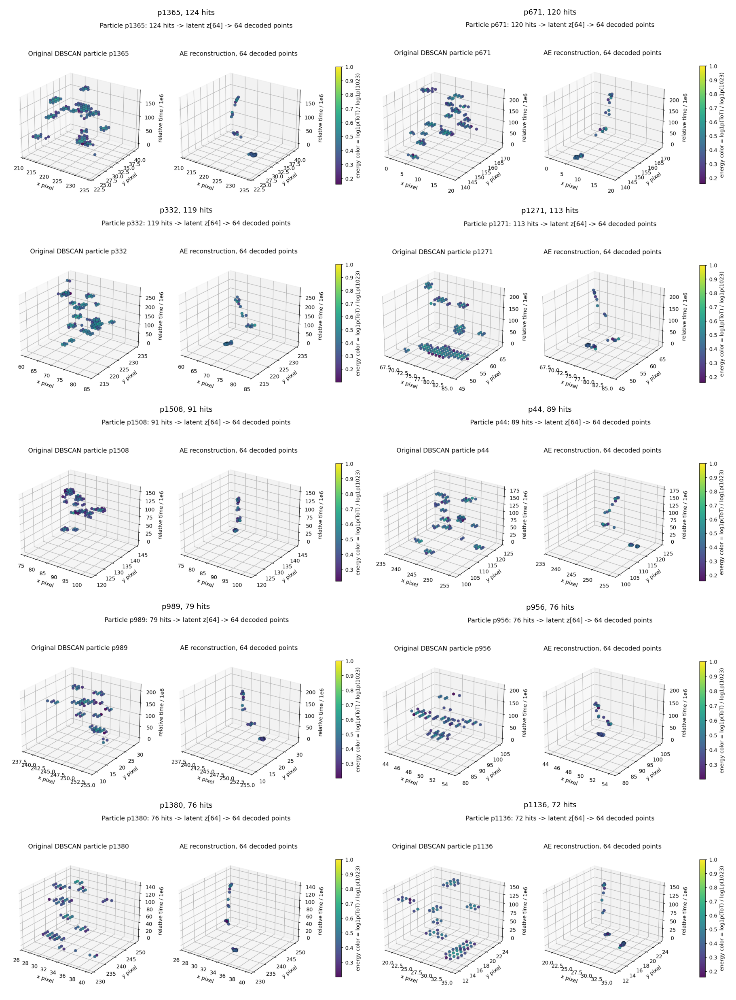

## Individual 3D Comparisons

### Particle p1365 (124 hits)

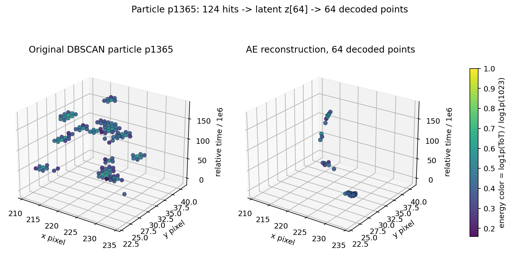

### Particle p671 (120 hits)

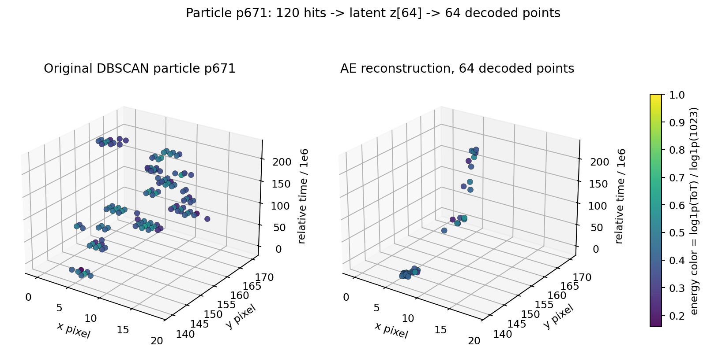

### Particle p332 (119 hits)

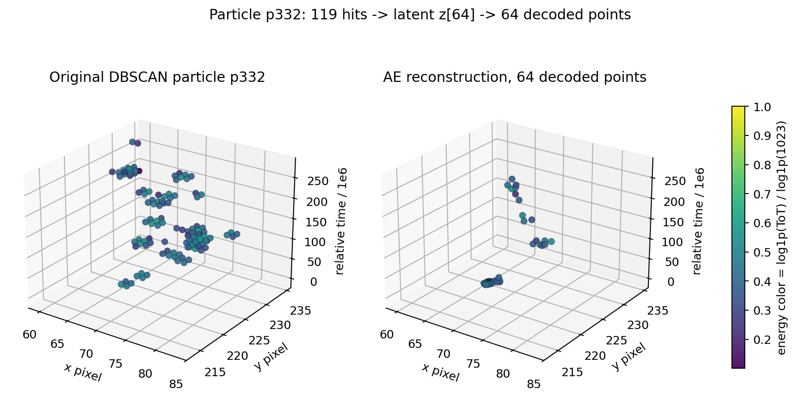

### Particle p1271 (113 hits)

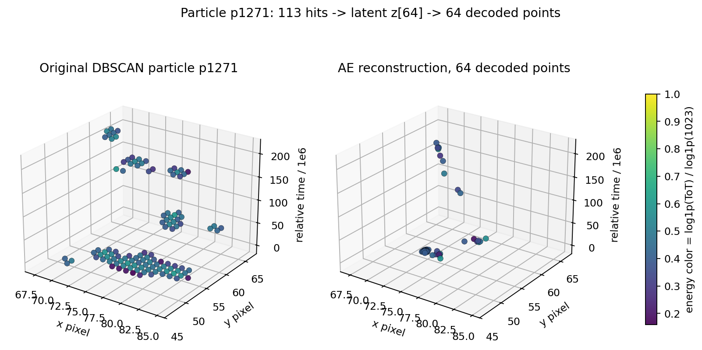

### Particle p1508 (91 hits)

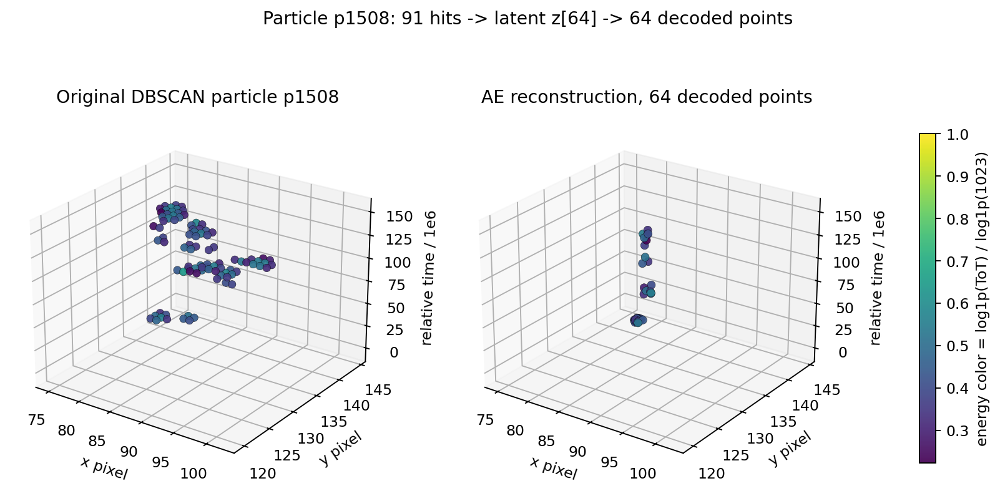

### Particle p44 (89 hits)

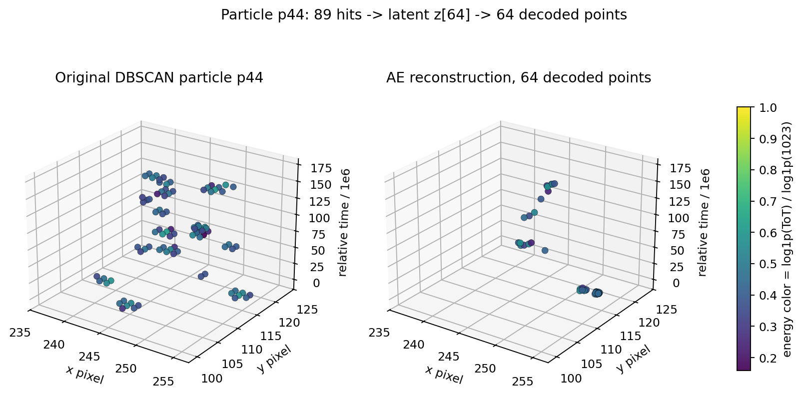

### Particle p989 (79 hits)

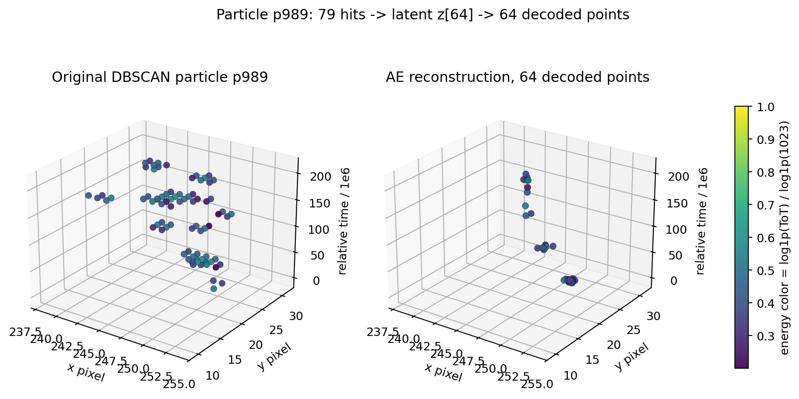

### Particle p956 (76 hits)

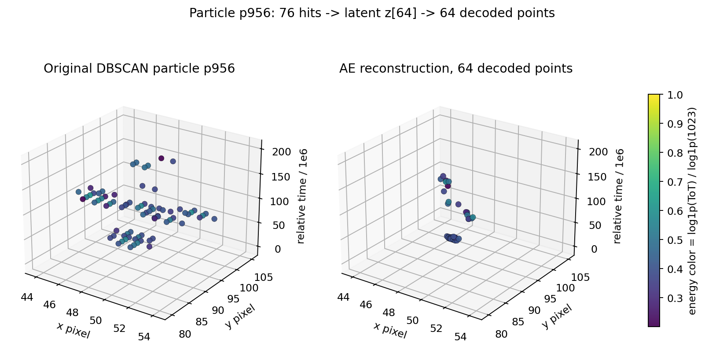

### Particle p1380 (76 hits)

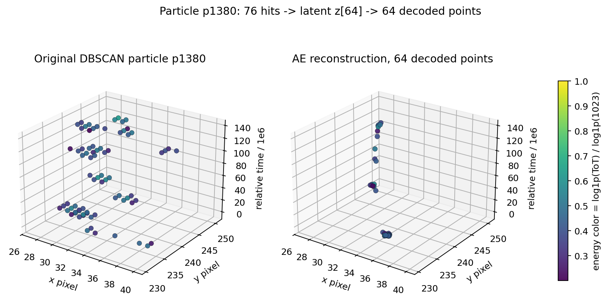

### Particle p1136 (72 hits)

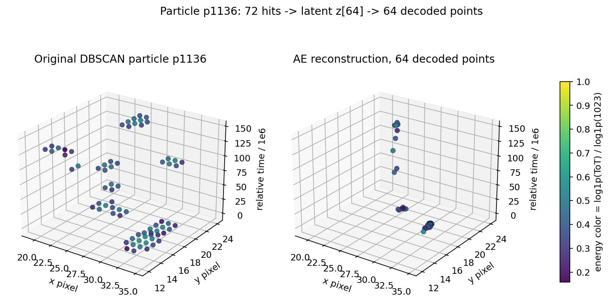
