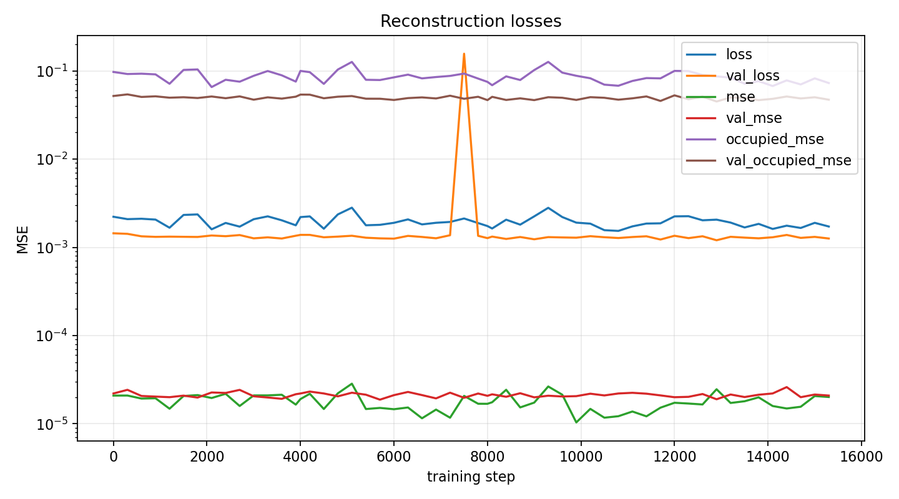
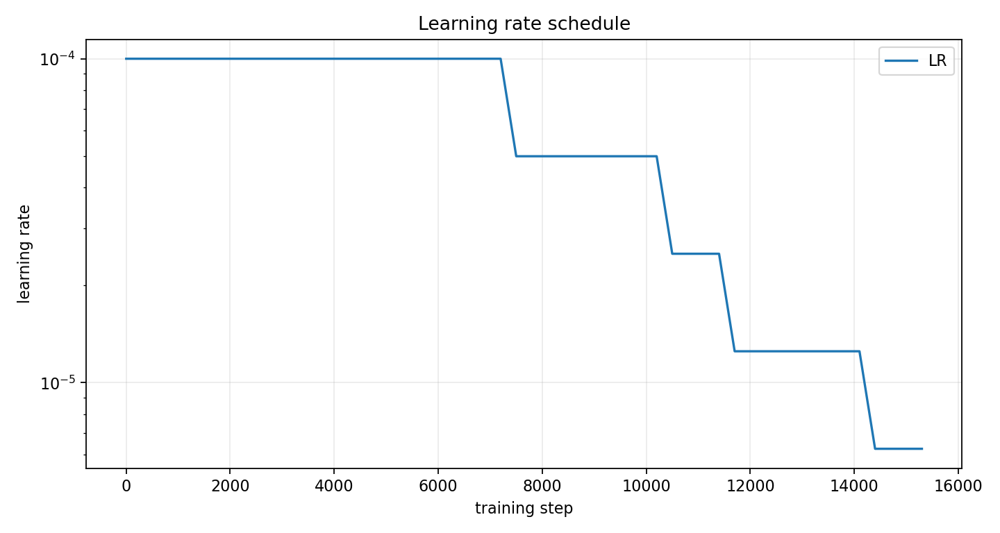
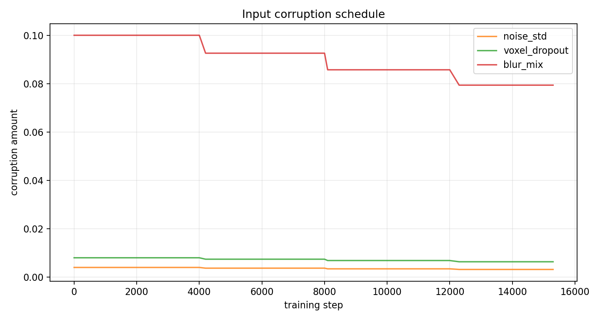
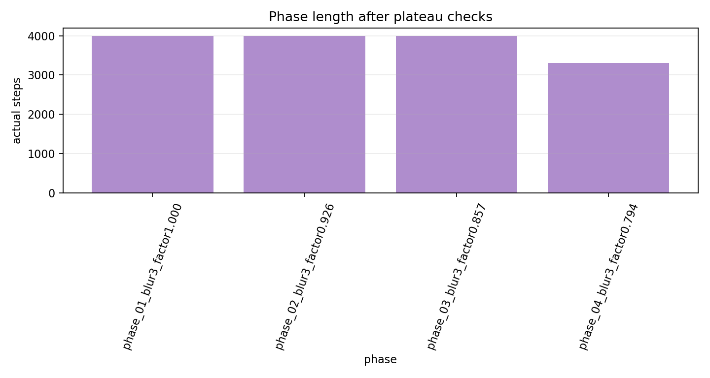

# Phase 2 Voxel Autoencoder Continuation Report

This report documents the staged 3D voxel autoencoder training run over centered `[T,Y,X] = [32,64,64]` energy tensors.

## Run

- summary: `local_data/experiments/phase2_voxel_curriculum_continuation_v001/voxel_autoencoder_summary.json`
- checkpoint: `local_data/experiments/phase2_voxel_curriculum_continuation_v001/runs/voxel_patch_mlp_z8+7_32x64x64_h768/checkpoint.pt`
- init checkpoint: `local_data/experiments/phase2_voxel_curriculum_v001/runs/voxel_patch_mlp_z8+7_32x64x64_h768/checkpoint.pt`
- metrics CSV: `local_data/experiments/phase2_voxel_curriculum_continuation_v001/runs/voxel_patch_mlp_z8+7_32x64x64_h768/metrics.csv`
- stage summary CSV: `local_data/experiments/phase2_voxel_curriculum_continuation_v001/runs/voxel_patch_mlp_z8+7_32x64x64_h768/stage_summary.csv`
- duration: `2.6e+03 s`
- best validation loss: `0.00120241` at step `12900`

## Configuration

| item | value |
|---|---:|
| model `architecture` | `patch_mlp` |
| model `shape_latent_dim` | `8` |
| model `aux_latent_dim` | `7` |
| model `hidden_dim` | `768` |
| model `patch_hidden_dim` | `192` |
| model `patch_embed_dim` | `32` |
| model `output_activation` | `softplus` |
| model `output_bias_init` | `-6.0` |
| grid `t_bins` | `32` |
| grid `y_bins` | `64` |
| grid `x_bins` | `64` |
| grid `time_bin` | `0.625` |
| grid `xy_bin` | `1.0` |
| train `batch_size` | `128` |
| train `learning_rate` | `0.0001` |
| train `min_learning_rate` | `0.0` |
| train `weight_decay` | `0.0002` |
| train `occupied_weight` | `0.02` |
| train `energy_weight` | `0.002` |
| train `lr_schedule` | `plateau` |
| train `phase_patience_evals` | `0` |
| train `lr_patience_evals` | `4` |
| train `keep_lr_across_stages` | `True` |
| train `stop_lr_below` | `5e-06` |

## Phase Summary

| stage | actual_steps | stop_reason | best_val_loss | blur_kernel | blur_mix | noise_std | voxel_dropout | duration_s |
| --- | --- | --- | --- | --- | --- | --- | --- | --- |
| phase_01_blur3_factor1.000 | 4000 | max_steps | 0.00125846 | 3 | 0.1 | 0.004 | 0.008 | 668.54 |
| phase_02_blur3_factor0.926 | 4000 | max_steps | 0.00125396 | 3 | 0.0925875 | 0.0037035 | 0.007407 | 671.107 |
| phase_03_blur3_factor0.857 | 4000 | max_steps | 0.00122528 | 3 | 0.0857244 | 0.00342898 | 0.00685795 | 670.264 |
| phase_04_blur3_factor0.794 | 3300 | lr_below_5e-06 | 0.00120241 | 3 | 0.0793701 | 0.0031748 | 0.0063496 | 553.94 |

## Test Metrics

| metric | value |
|---|---:|
| `test_background_mse` | `5.10794e-06` |
| `test_energy_sum_relative_l1` | `0.0776954` |
| `test_loss` | `0.00121097` |
| `test_mse` | `8.78924e-06` |
| `test_occupied_mse` | `0.0523394` |

## Training Plots

## Last Evaluations

| step | stage | stage_step | lr | blur_kernel | blur_mix | noise_std | voxel_dropout | loss | mse | occupied_mse | background_mse | energy_sum_relative_l1 | val_loss | val_mse | val_occupied_mse | val_background_mse | val_energy_sum_relative_l1 |
| --- | --- | --- | --- | --- | --- | --- | --- | --- | --- | --- | --- | --- | --- | --- | --- | --- | --- |
| 13200 | phase_04_blur3_factor0.794 | 1200 | 1.25e-05 | 3 | 0.0793701 | 0.0031748 | 0.0063496 | 0.00190679 | 1.72325e-05 | 0.0835831 | 9.16767e-06 | 0.108945 | 0.00131579 | 2.1493e-05 | 0.0498248 | 1.39907e-05 | 0.148901 |
| 13500 | phase_04_blur3_factor0.794 | 1500 | 1.25e-05 | 3 | 0.0793701 | 0.0031748 | 0.0063496 | 0.00167877 | 1.80251e-05 | 0.071431 | 1.02305e-05 | 0.116065 | 0.00128812 | 2.0114e-05 | 0.0492291 | 1.29229e-05 | 0.141715 |
| 13800 | phase_04_blur3_factor0.794 | 1800 | 1.25e-05 | 3 | 0.0793701 | 0.0031748 | 0.0063496 | 0.00184398 | 1.99544e-05 | 0.0763685 | 1.09884e-05 | 0.148329 | 0.00126509 | 2.13609e-05 | 0.0465223 | 1.45139e-05 | 0.156644 |
| 14100 | phase_04_blur3_factor0.794 | 2100 | 1.25e-05 | 3 | 0.0793701 | 0.0031748 | 0.0063496 | 0.00161536 | 1.59137e-05 | 0.06726 | 9.12735e-06 | 0.127124 | 0.00129991 | 2.20877e-05 | 0.0481473 | 1.48938e-05 | 0.157435 |
| 14400 | phase_04_blur3_factor0.794 | 2400 | 6.25e-06 | 3 | 0.0793701 | 0.0031748 | 0.0063496 | 0.00175875 | 1.49182e-05 | 0.0778823 | 8.18781e-06 | 0.0930941 | 0.00138084 | 2.60771e-05 | 0.0511634 | 1.71122e-05 | 0.165749 |
| 14700 | phase_04_blur3_factor0.794 | 2700 | 6.25e-06 | 3 | 0.0793701 | 0.0031748 | 0.0063496 | 0.00165686 | 1.56144e-05 | 0.0700855 | 8.5972e-06 | 0.119769 | 0.00127957 | 2.00363e-05 | 0.0486266 | 1.31297e-05 | 0.1435 |
| 15000 | phase_04_blur3_factor0.794 | 3000 | 6.25e-06 | 3 | 0.0793701 | 0.0031748 | 0.0063496 | 0.00189446 | 2.06487e-05 | 0.0821252 | 1.14228e-05 | 0.115656 | 0.00131317 | 2.14735e-05 | 0.0501509 | 1.40396e-05 | 0.144341 |
| 15300 | phase_04_blur3_factor0.794 | 3300 | 6.25e-06 | 3 | 0.0793701 | 0.0031748 | 0.0063496 | 0.00172091 | 2.01341e-05 | 0.0726952 | 1.16905e-05 | 0.123437 | 0.00125855 | 2.09072e-05 | 0.0470705 | 1.40694e-05 | 0.148115 |
