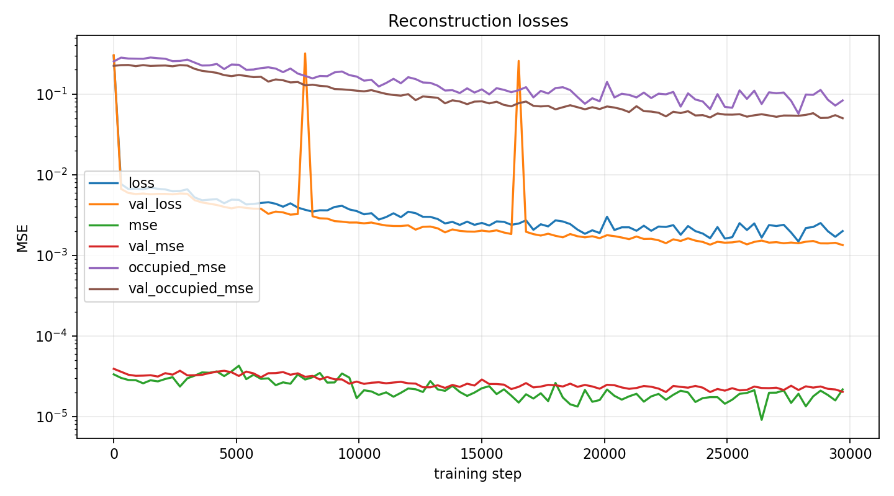
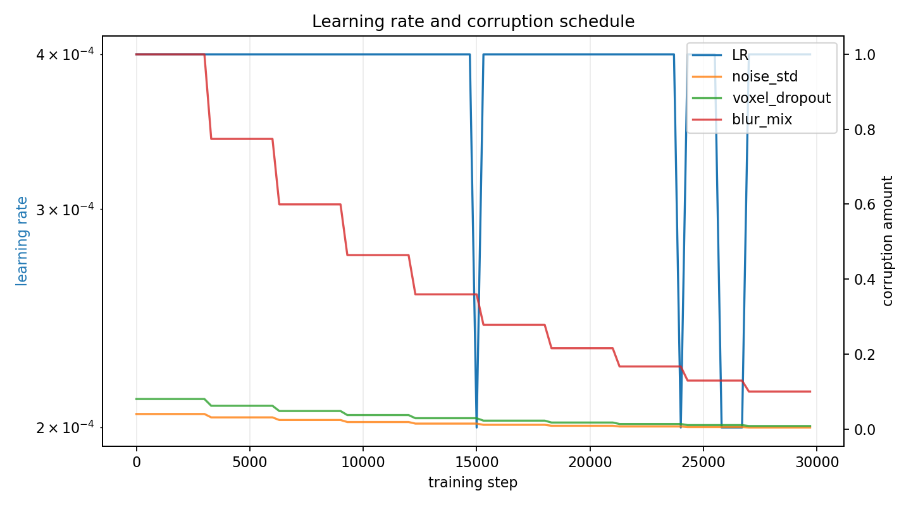
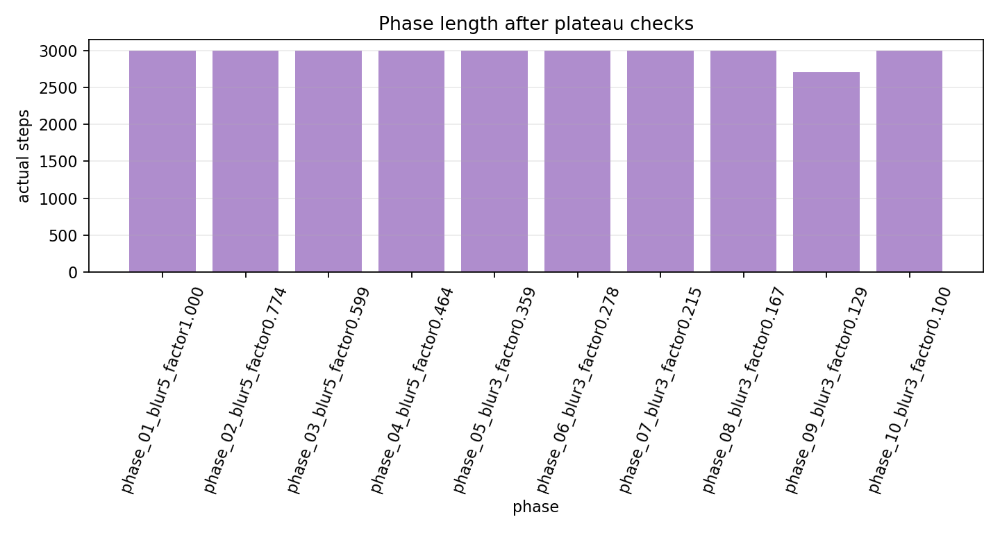

# Phase 2 Voxel Autoencoder 10-Phase Curriculum Run

This report documents the staged 3D voxel autoencoder training run over centered `[T,Y,X] = [32,64,64]` energy tensors.

## Executive Summary

The full 10-phase curriculum run completed on CUDA over the full current Phase 1 particle set. The final saved checkpoint is the best weighted-validation-loss checkpoint from step `29700`.

Key result: the voxel autoencoder finally escaped the earlier empty-reconstruction failure mode. The test energy-sum relative error is `0.0862`, below the `0.1` aggregate target, and the occupied-voxel MSE is `0.0561`. This is a substantial improvement over the smoke runs and earlier point/path autoencoders, but the result should still be treated as a first usable dense-tensor baseline, not as a finished particle-compression model.

Important correction found during smoke testing: plain global MSE is misleading for these sparse tensors because the network can get a small MSE by reconstructing mostly empty space. The successful run uses:

- nonnegative `softplus` decoder output with negative output bias initialization;
- checkpoint selection by weighted validation loss, not global empty-space MSE;
- occupied-voxel MSE term with weight `0.02`;
- energy-sum relative loss term with weight `0.002`;
- 10 corruption phases that reduce blur/noise/dropout to `10%` of the starting amount, never all the way to zero.

## Dataset

The training cache was built from the final aligned-time native-grid DBSCAN Phase 1 particles:

| item | value |
|---|---:|
| particle source | `local_data/processed/particles_aligned_time_eps5_v001` |
| voxel cache | `local_data/processed/phase2_voxel_energy_32x64x64_curriculum_v001` |
| particles | `3,464,792` |
| total input hits | `43,655,589` |
| kept hits inside `32x64x64` crop | `43,458,156` |
| kept hit fraction | `99.55%` |
| cropped particles | `3,393` |
| train particles | `2,625,498` |
| validation particles | `228,754` |
| test particles | `610,540` |

Each particle is centered by its own `(x, y, time)` bounding-box center, then voxelized into a logical 3D tensor `[time, y, x] = [32, 64, 64]`. The single voxel value is summed normalized `log1p(ToT)` energy.

## Smoke Calibration

Before the full run I tested the same 10-phase schedule on a `50k` particle smoke cache. This surfaced two problems:

- With plain global MSE, validation MSE looked small while occupied-voxel MSE and energy error stayed poor.
- With ReLU decoder output initialized near zero, the network could collapse to an all-empty reconstruction because many output units had no useful gradient.

The full run therefore switched to `softplus` output with output bias `-6.0`, monitored weighted validation loss, and kept explicit occupied/energy loss terms. That made the training curves meaningful: occupied error decreased from about `0.28` early in training to about `0.05` validation occupied MSE at the best checkpoint.

## Run

- summary: `local_data/experiments/phase2_voxel_curriculum_v001/voxel_autoencoder_summary.json`
- checkpoint: `local_data/experiments/phase2_voxel_curriculum_v001/runs/voxel_patch_mlp_z8+7_32x64x64_h768/checkpoint.pt`
- metrics CSV: `local_data/experiments/phase2_voxel_curriculum_v001/runs/voxel_patch_mlp_z8+7_32x64x64_h768/metrics.csv`
- stage summary CSV: `local_data/experiments/phase2_voxel_curriculum_v001/runs/voxel_patch_mlp_z8+7_32x64x64_h768/stage_summary.csv`
- duration: `5031 s` (`83.8 min`)
- best validation loss: `0.00133747` at step `29700`

## Configuration

| item | value |
|---|---:|
| model `architecture` | `patch_mlp` |
| model `shape_latent_dim` | `8` |
| model `aux_latent_dim` | `7` |
| model `hidden_dim` | `768` |
| model `patch_hidden_dim` | `192` |
| model `patch_embed_dim` | `32` |
| model `output_activation` | `softplus` |
| model `output_bias_init` | `-6.0` |
| grid `t_bins` | `32` |
| grid `y_bins` | `64` |
| grid `x_bins` | `64` |
| grid `time_bin` | `0.625` |
| grid `xy_bin` | `1.0` |
| train `batch_size` | `128` |
| train `learning_rate` | `0.0004` |
| train `min_learning_rate` | `2e-05` |
| train `weight_decay` | `0.0002` |
| train `occupied_weight` | `0.02` |
| train `energy_weight` | `0.002` |
| train `lr_schedule` | `plateau` |
| train `phase_patience_evals` | `8` |
| train `lr_patience_evals` | `4` |

## Phase Summary

| stage | actual_steps | stop_reason | best_val_loss | blur_kernel | blur_mix | noise_std | voxel_dropout | duration_s |
| --- | --- | --- | --- | --- | --- | --- | --- | --- |
| phase_01_blur5_factor1.000 | 3000 | max_steps | 0.00570062 | 5 | 1 | 0.04 | 0.08 | 515.416 |
| phase_02_blur5_factor0.774 | 3000 | max_steps | 0.00377174 | 5 | 0.774264 | 0.0309705 | 0.0619411 | 516.37 |
| phase_03_blur5_factor0.599 | 3000 | max_steps | 0.00265268 | 5 | 0.599484 | 0.0239794 | 0.0479587 | 515.055 |
| phase_04_blur5_factor0.464 | 3000 | max_steps | 0.0023062 | 5 | 0.464159 | 0.0185664 | 0.0371327 | 515.375 |
| phase_05_blur3_factor0.359 | 3000 | max_steps | 0.001925 | 3 | 0.359381 | 0.0143753 | 0.0287505 | 502.634 |
| phase_06_blur3_factor0.278 | 3000 | max_steps | 0.00174386 | 3 | 0.278256 | 0.0111302 | 0.0222605 | 501.491 |
| phase_07_blur3_factor0.215 | 3000 | max_steps | 0.0015848 | 3 | 0.215443 | 0.00861774 | 0.0172355 | 502.427 |
| phase_08_blur3_factor0.167 | 3000 | max_steps | 0.00141202 | 3 | 0.16681 | 0.0066724 | 0.0133448 | 504.294 |
| phase_09_blur3_factor0.129 | 2700 | plateau | 0.00135454 | 3 | 0.129155 | 0.0051662 | 0.0103324 | 453.966 |
| phase_10_blur3_factor0.100 | 3000 | max_steps | 0.00133747 | 3 | 0.1 | 0.004 | 0.008 | 502.18 |

## Test Metrics

| metric | value |
|---|---:|
| `test_background_mse` | `5.11199e-06` |
| `test_energy_sum_relative_l1` | `0.0861644` |
| `test_loss` | `0.00130337` |
| `test_mse` | `9.05412e-06` |
| `test_occupied_mse` | `0.0560995` |

## Training Plots

## Reconstruction Gallery

Held-out test-particle reconstruction examples are in [phase2-voxel-curriculum-reconstruction-gallery.md](phase2-voxel-curriculum-reconstruction-gallery.md). These examples use the saved best checkpoint and visualize original, reconstruction, and absolute error as four summed time slices.

## Last Evaluations

| step | stage | stage_step | lr | blur_kernel | blur_mix | noise_std | voxel_dropout | loss | mse | occupied_mse | background_mse | energy_sum_relative_l1 | val_loss | val_mse | val_occupied_mse | val_background_mse | val_energy_sum_relative_l1 |
| --- | --- | --- | --- | --- | --- | --- | --- | --- | --- | --- | --- | --- | --- | --- | --- | --- | --- |
| 27600 | phase_10_blur3_factor0.100 | 900 | 0.0004 | 3 | 0.1 | 0.004 | 0.008 | 0.00191542 | 1.47705e-05 | 0.0823849 | 7.51339e-06 | 0.126473 | 0.00143903 | 2.4103e-05 | 0.0539941 | 1.54679e-05 | 0.167522 |
| 27900 | phase_10_blur3_factor0.100 | 1200 | 0.0004 | 3 | 0.1 | 0.004 | 0.008 | 0.00148066 | 1.91746e-05 | 0.056898 | 1.18202e-05 | 0.161761 | 0.00140993 | 2.13486e-05 | 0.0536977 | 1.32138e-05 | 0.157315 |
| 28200 | phase_10_blur3_factor0.100 | 1500 | 0.0004 | 3 | 0.1 | 0.004 | 0.008 | 0.00217779 | 1.33903e-05 | 0.0984238 | 5.97545e-06 | 0.0979635 | 0.00147204 | 2.37141e-05 | 0.0550336 | 1.49856e-05 | 0.173829 |
| 28500 | phase_10_blur3_factor0.100 | 1800 | 0.0004 | 3 | 0.1 | 0.004 | 0.008 | 0.00224477 | 1.78064e-05 | 0.0975892 | 9.26819e-06 | 0.13759 | 0.00150381 | 2.28653e-05 | 0.0577734 | 1.40899e-05 | 0.16274 |
| 28800 | phase_10_blur3_factor0.100 | 2100 | 0.0004 | 3 | 0.1 | 0.004 | 0.008 | 0.00251057 | 2.09545e-05 | 0.112231 | 1.02925e-05 | 0.122501 | 0.00140598 | 2.3599e-05 | 0.0503776 | 1.58108e-05 | 0.187416 |
| 29100 | phase_10_blur3_factor0.100 | 2400 | 0.0004 | 3 | 0.1 | 0.004 | 0.008 | 0.00198481 | 1.84912e-05 | 0.0847401 | 9.9764e-06 | 0.135759 | 0.00140292 | 2.20698e-05 | 0.0507081 | 1.44316e-05 | 0.183344 |
| 29400 | phase_10_blur3_factor0.100 | 2700 | 0.0004 | 3 | 0.1 | 0.004 | 0.008 | 0.00169519 | 1.58626e-05 | 0.0718826 | 8.93963e-06 | 0.120836 | 0.00142837 | 2.16799e-05 | 0.0546195 | 1.34176e-05 | 0.15715 |
| 29700 | phase_10_blur3_factor0.100 | 3000 | 0.0004 | 3 | 0.1 | 0.004 | 0.008 | 0.00199732 | 2.17233e-05 | 0.0831392 | 1.21458e-05 | 0.156405 | 0.00133747 | 2.02754e-05 | 0.0500563 | 1.32697e-05 | 0.158036 |
