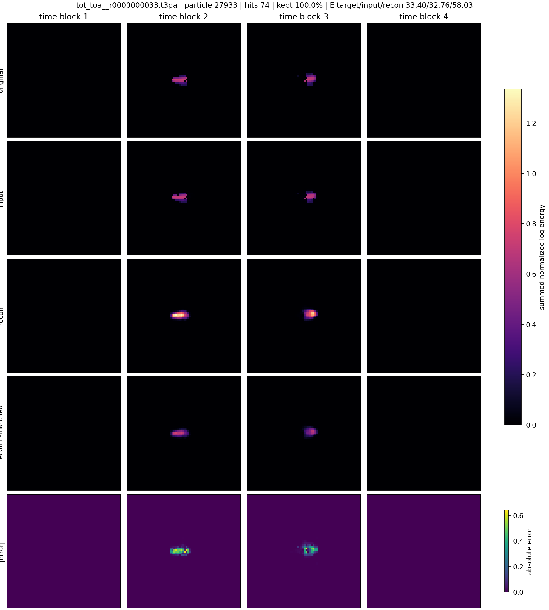
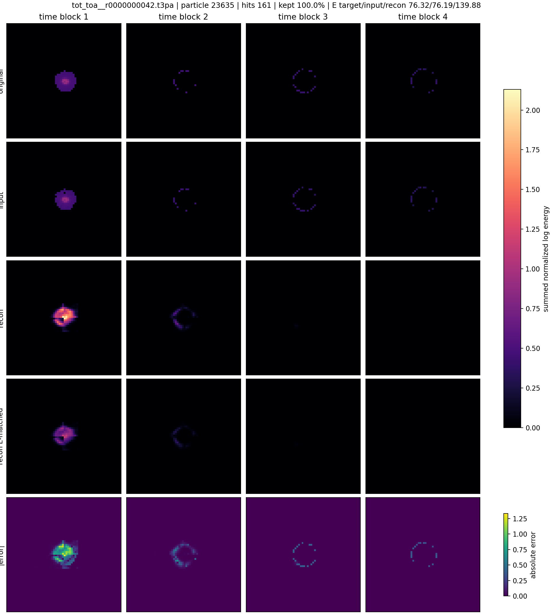

# Phase 2 Voxel Autoencoder Reconstruction Gallery

Checkpoint: `local_data/experiments/phase2_voxel_full_pass_v001/checkpoint.pt`

Each panel is a held-out test particle. The 32 time bins are summed into four 2D XY images.

Rows are clean target, corrupted model input, reconstruction from that corrupted input, and absolute reconstruction error.

Input corruption: `blur_kernel=3`, `blur_mix=0.1`, `noise_std=0.004`, `voxel_dropout=0.008`.

The image panels include a diagnostic `recon E-matched` row: the raw reconstruction multiplied by `input_energy / reconstruction_energy`. This row is not the model output; it shows whether the remaining visual error is mostly global energy scale or geometry.

| # | source | particle | hits | kept | image |
|---:|---|---:|---:|---:|---|
| 1 | `F08/tot_toa__r0000000033.t3pa` | 27933 | 74 | 100.0% | [png](../../../assets/phase2_voxel_autoencoder/full_pass_energy_diagnostic_v001/voxel_reconstruction_example_01.png) |
| 2 | `F08/tot_toa__r0000000033.t3pa` | 6454 | 50 | 100.0% | [png](../../../assets/phase2_voxel_autoencoder/full_pass_energy_diagnostic_v001/voxel_reconstruction_example_02.png) |
| 3 | `08_thu_proton_daily_batch/toa_tot__r0000007293.t3pa` | 8555 | 68 | 100.0% | [png](../../../assets/phase2_voxel_autoencoder/full_pass_energy_diagnostic_v001/voxel_reconstruction_example_03.png) |
| 4 | `D05/tot_toa__r0000000039.t3pa` | 22215 | 56 | 100.0% | [png](../../../assets/phase2_voxel_autoencoder/full_pass_energy_diagnostic_v001/voxel_reconstruction_example_04.png) |
| 5 | `08_thu_proton_daily_batch/toa_tot__r0000007293.t3pa` | 7091 | 57 | 100.0% | [png](../../../assets/phase2_voxel_autoencoder/full_pass_energy_diagnostic_v001/voxel_reconstruction_example_05.png) |
| 6 | `F08/tot_toa__r0000000033.t3pa` | 18882 | 136 | 100.0% | [png](../../../assets/phase2_voxel_autoencoder/full_pass_energy_diagnostic_v001/voxel_reconstruction_example_06.png) |
| 7 | `F08/tot_toa__r0000000033.t3pa` | 41126 | 55 | 100.0% | [png](../../../assets/phase2_voxel_autoencoder/full_pass_energy_diagnostic_v001/voxel_reconstruction_example_07.png) |
| 8 | `D05/tot_toa__r0000000045.t3pa` | 2785 | 85 | 100.0% | [png](../../../assets/phase2_voxel_autoencoder/full_pass_energy_diagnostic_v001/voxel_reconstruction_example_08.png) |
| 9 | `F08/tot_toa__r0000000033.t3pa` | 29777 | 205 | 100.0% | [png](../../../assets/phase2_voxel_autoencoder/full_pass_energy_diagnostic_v001/voxel_reconstruction_example_09.png) |
| 10 | `D05/tot_toa__r0000000042.t3pa` | 23635 | 161 | 100.0% | [png](../../../assets/phase2_voxel_autoencoder/full_pass_energy_diagnostic_v001/voxel_reconstruction_example_10.png) |

## Energy Check

| # | hits | clean E | input E | recon E | input/clean | recon/clean | recon relative error |
|---:|---:|---:|---:|---:|---:|---:|---:|
| 1 | 74 | 33.400 | 32.763 | 58.026 | 0.981 | 1.737 | 0.737 |
| 2 | 50 | 20.271 | 19.956 | 30.791 | 0.984 | 1.519 | 0.519 |
| 3 | 68 | 34.430 | 34.646 | 61.001 | 1.006 | 1.772 | 0.772 |
| 4 | 56 | 24.129 | 24.513 | 28.561 | 1.016 | 1.184 | 0.184 |
| 5 | 57 | 29.908 | 29.304 | 41.900 | 0.980 | 1.401 | 0.401 |
| 6 | 136 | 53.553 | 53.447 | 109.869 | 0.998 | 2.052 | 1.052 |
| 7 | 55 | 26.329 | 26.389 | 43.100 | 1.002 | 1.637 | 0.637 |
| 8 | 85 | 30.218 | 30.428 | 27.509 | 1.007 | 0.910 | 0.090 |
| 9 | 205 | 72.712 | 72.489 | 142.054 | 0.997 | 1.954 | 0.954 |
| 10 | 161 | 76.315 | 76.186 | 139.879 | 0.998 | 1.833 | 0.833 |

## Example 1

## Example 2

## Example 3

## Example 4

## Example 5

## Example 6

## Example 7

## Example 8

## Example 9

## Example 10

