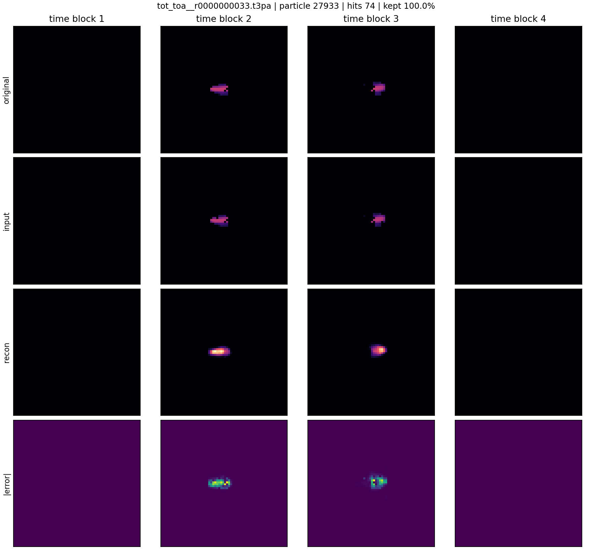
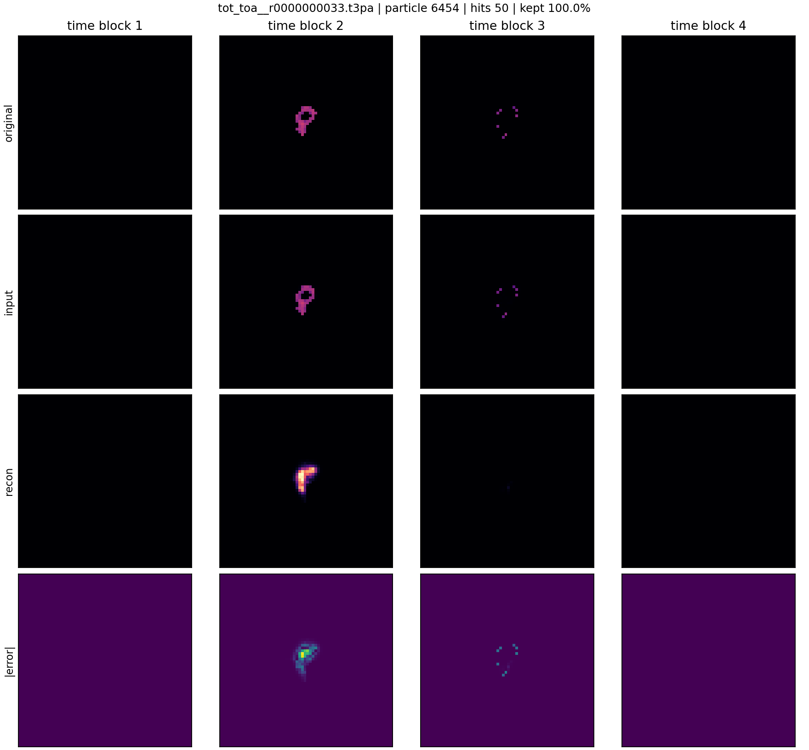
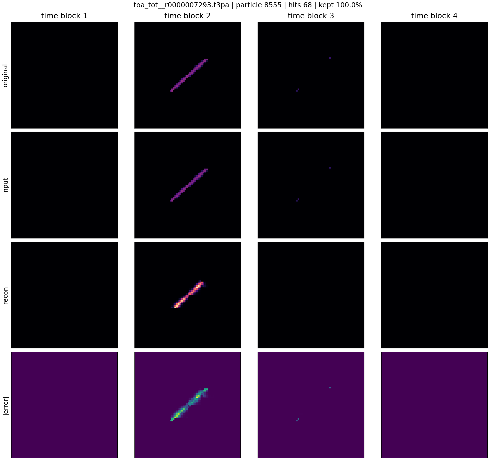
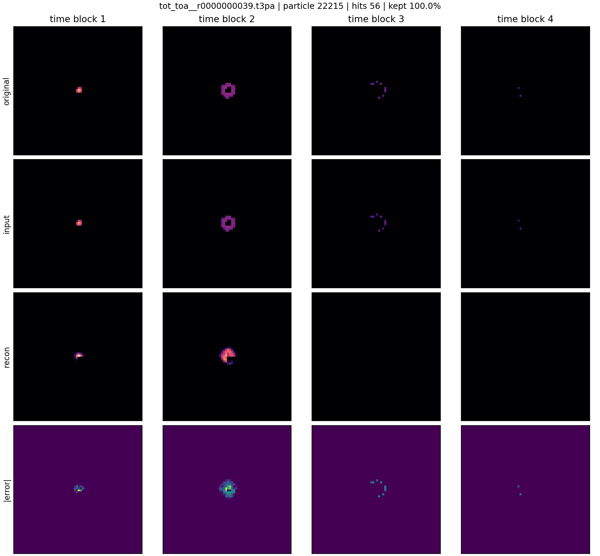
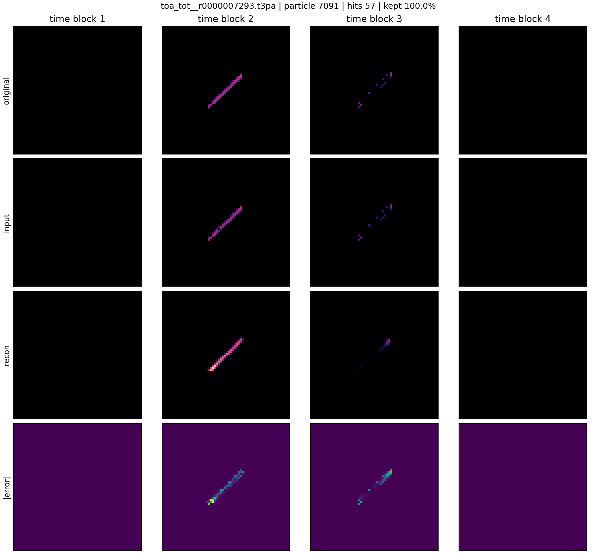
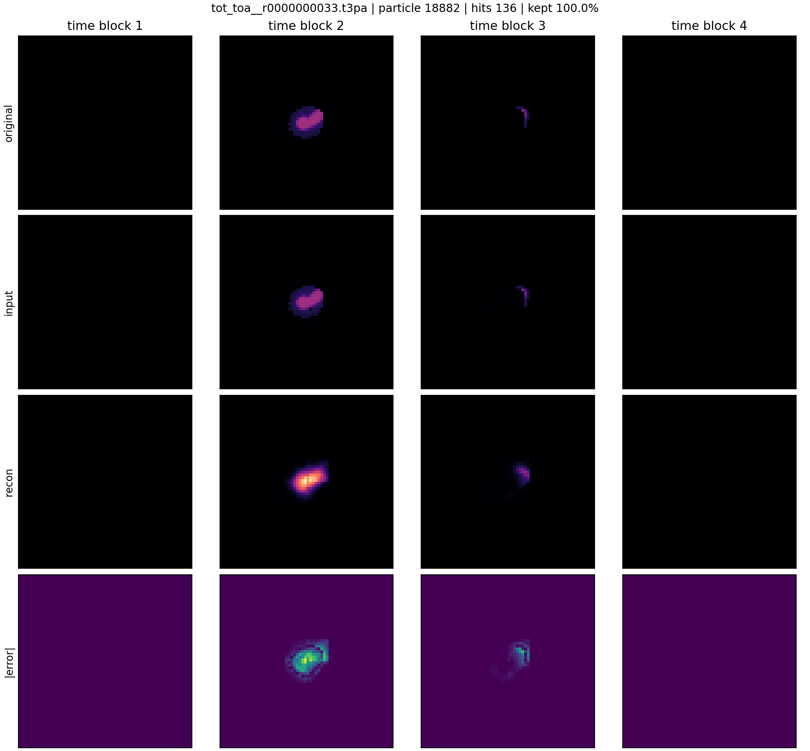
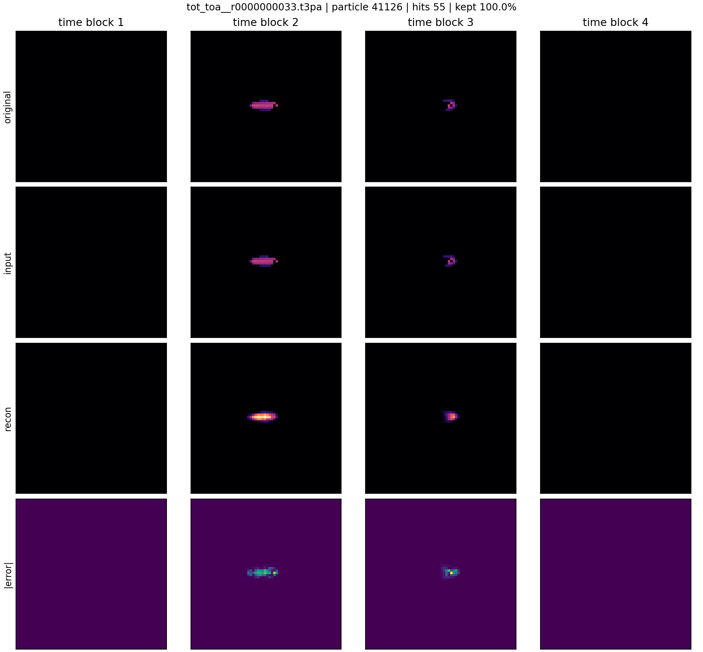
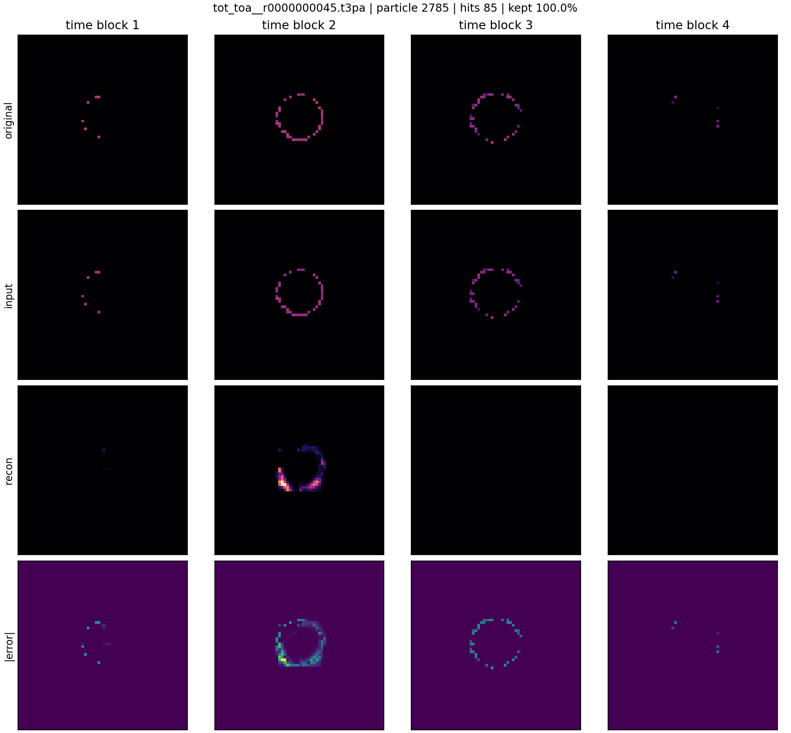
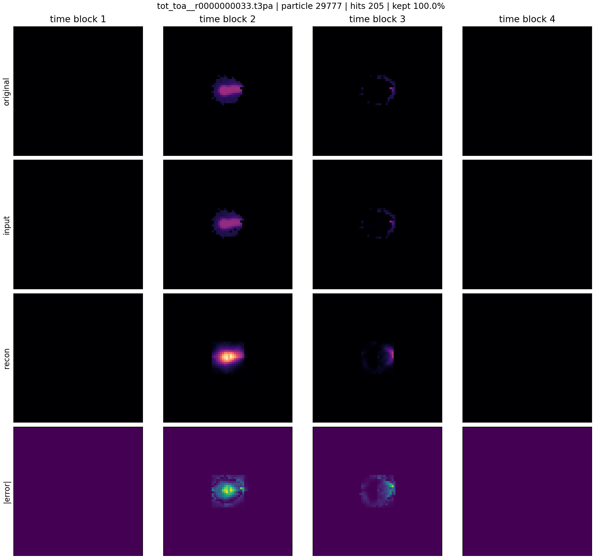
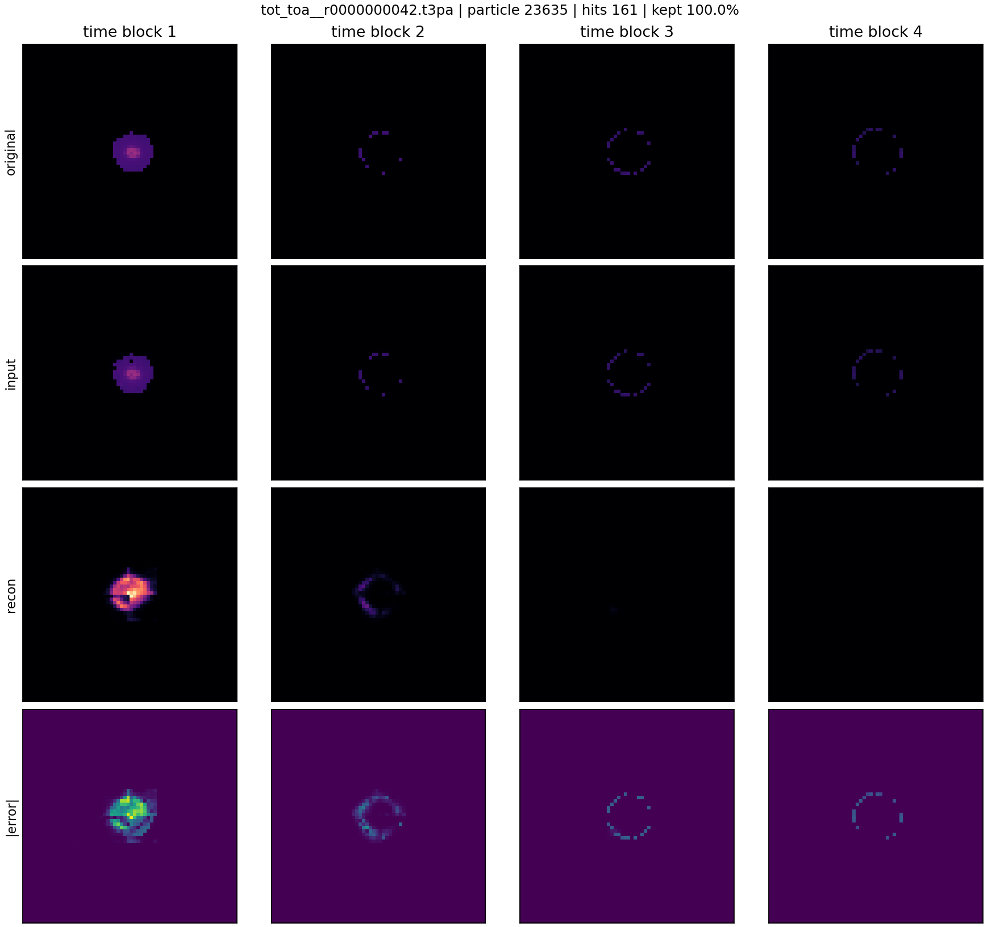

# Phase 2 Voxel Autoencoder Reconstruction Gallery

Checkpoint: `local_data/experiments/phase2_voxel_full_pass_v001/checkpoint.pt`

Each panel is a held-out test particle. The 32 time bins are summed into four 2D XY images.

Rows are clean target, corrupted model input, reconstruction from that corrupted input, and absolute reconstruction error.

Input corruption: `blur_kernel=3`, `blur_mix=0.1`, `noise_std=0.004`, `voxel_dropout=0.008`.

| # | source | particle | hits | kept | image |
|---:|---|---:|---:|---:|---|
| 1 | `F08/tot_toa__r0000000033.t3pa` | 27933 | 74 | 100.0% | [png](../../../assets/phase2_voxel_autoencoder/full_pass_noised_reconstruction_v001/voxel_reconstruction_example_01.png) |
| 2 | `F08/tot_toa__r0000000033.t3pa` | 6454 | 50 | 100.0% | [png](../../../assets/phase2_voxel_autoencoder/full_pass_noised_reconstruction_v001/voxel_reconstruction_example_02.png) |
| 3 | `08_thu_proton_daily_batch/toa_tot__r0000007293.t3pa` | 8555 | 68 | 100.0% | [png](../../../assets/phase2_voxel_autoencoder/full_pass_noised_reconstruction_v001/voxel_reconstruction_example_03.png) |
| 4 | `D05/tot_toa__r0000000039.t3pa` | 22215 | 56 | 100.0% | [png](../../../assets/phase2_voxel_autoencoder/full_pass_noised_reconstruction_v001/voxel_reconstruction_example_04.png) |
| 5 | `08_thu_proton_daily_batch/toa_tot__r0000007293.t3pa` | 7091 | 57 | 100.0% | [png](../../../assets/phase2_voxel_autoencoder/full_pass_noised_reconstruction_v001/voxel_reconstruction_example_05.png) |
| 6 | `F08/tot_toa__r0000000033.t3pa` | 18882 | 136 | 100.0% | [png](../../../assets/phase2_voxel_autoencoder/full_pass_noised_reconstruction_v001/voxel_reconstruction_example_06.png) |
| 7 | `F08/tot_toa__r0000000033.t3pa` | 41126 | 55 | 100.0% | [png](../../../assets/phase2_voxel_autoencoder/full_pass_noised_reconstruction_v001/voxel_reconstruction_example_07.png) |
| 8 | `D05/tot_toa__r0000000045.t3pa` | 2785 | 85 | 100.0% | [png](../../../assets/phase2_voxel_autoencoder/full_pass_noised_reconstruction_v001/voxel_reconstruction_example_08.png) |
| 9 | `F08/tot_toa__r0000000033.t3pa` | 29777 | 205 | 100.0% | [png](../../../assets/phase2_voxel_autoencoder/full_pass_noised_reconstruction_v001/voxel_reconstruction_example_09.png) |
| 10 | `D05/tot_toa__r0000000042.t3pa` | 23635 | 161 | 100.0% | [png](../../../assets/phase2_voxel_autoencoder/full_pass_noised_reconstruction_v001/voxel_reconstruction_example_10.png) |

## Example 1

## Example 2

## Example 3

## Example 4

## Example 5

## Example 6

## Example 7

## Example 8

## Example 9

## Example 10

