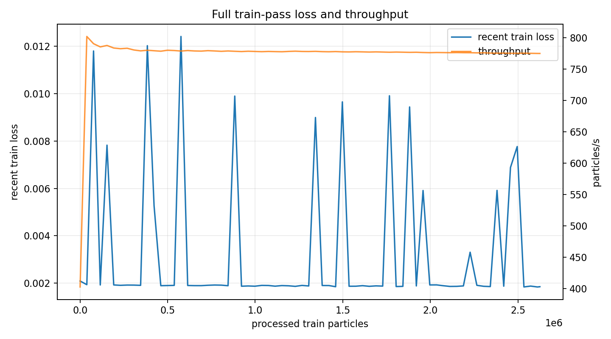
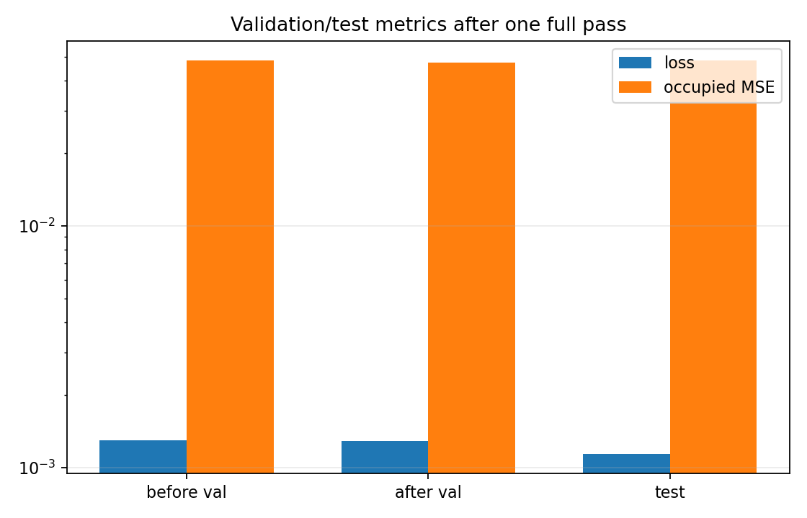

# Phase 2 Voxel Autoencoder Full Train-Pass Check

This run measured one true shuffled pass over the full Phase 2 voxel train split. Unlike the earlier continuation run, this did not sample training particles with replacement: it shuffled the train manifest once, then walked through every train particle exactly once in mini-batches.

## Setup

| item | value |
|---|---:|
| input cache | `local_data/processed/phase2_voxel_energy_32x64x64_curriculum_v001` |
| init checkpoint | `local_data/experiments/phase2_voxel_curriculum_continuation_v001/runs/voxel_patch_mlp_z8+7_32x64x64_h768/checkpoint.pt` |
| output checkpoint | `local_data/experiments/phase2_voxel_full_pass_v001/checkpoint.pt` |
| train particles | `2,625,498` |
| batch size | `128` |
| optimizer steps | `20,512` |
| learning rate | `1e-4` |
| blur kernel | `3` |
| blur mix | `0.1` |
| noise std | `0.004` |
| voxel dropout | `0.008` |

The corruption level is the final corruption level from the first voxel curriculum training loop.

## Timing

| metric | value |
|---|---:|
| train pass time | `3388.56 s` |
| train pass time | `56.48 min` |
| throughput | `774.81 particles/s` |

## Metrics

| split/check | loss | MSE | occupied MSE | background MSE | energy relative L1 |
|---|---:|---:|---:|---:|---:|
| validation before pass | `0.001296` | `0.0000216` | `0.048413` | `0.0000144` | `0.153002` |
| validation after pass | `0.001289` | `0.0000238` | `0.047235` | `0.0000163` | `0.160349` |
| test after pass | `0.001143` | `0.00000844` | `0.048259` | `0.00000504` | `0.084857` |

## Notes

- The pass used the current best continuation checkpoint as the pretrained model.
- The train pass is a better estimate of one real epoch cost than the previous 15k-step continuation, because every train particle was visited once.
- Validation energy relative error worsened slightly in this small validation sample, while validation occupied MSE improved. The held-out test sample after the pass improved on loss and occupied MSE compared with the previous continuation checkpoint, but energy relative error is still a weak point.
