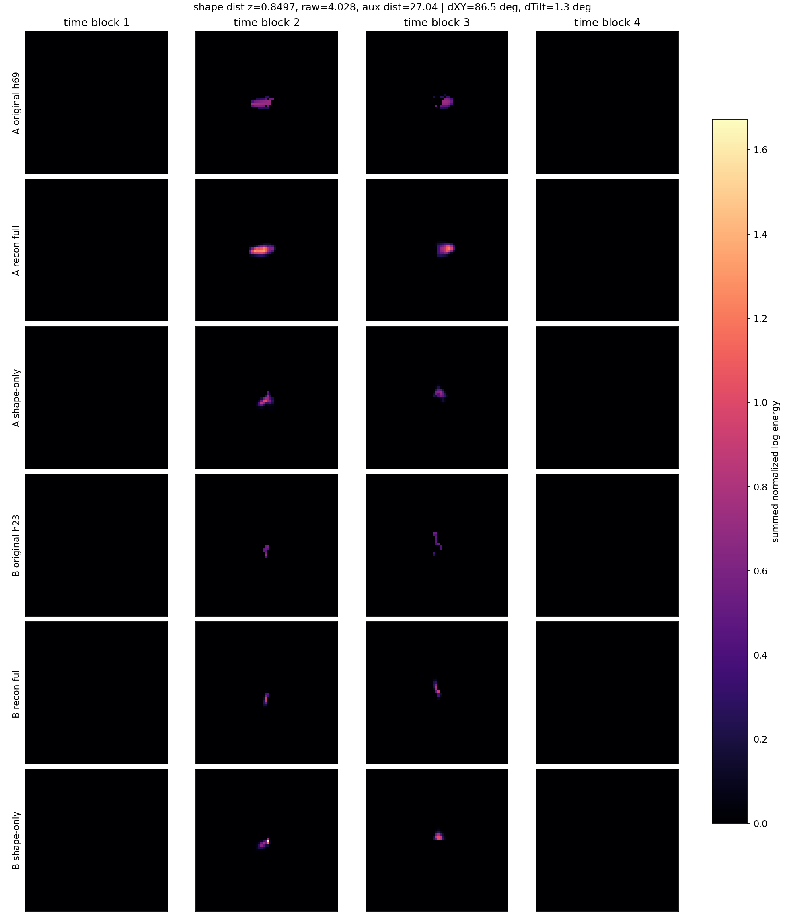
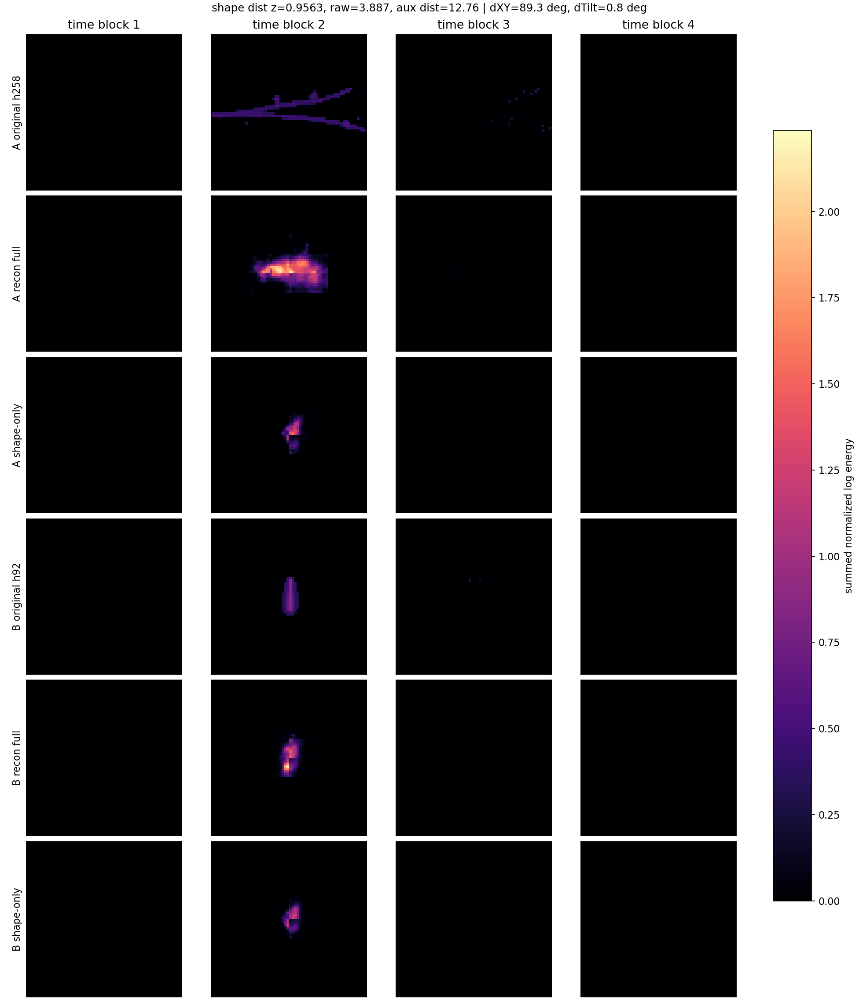
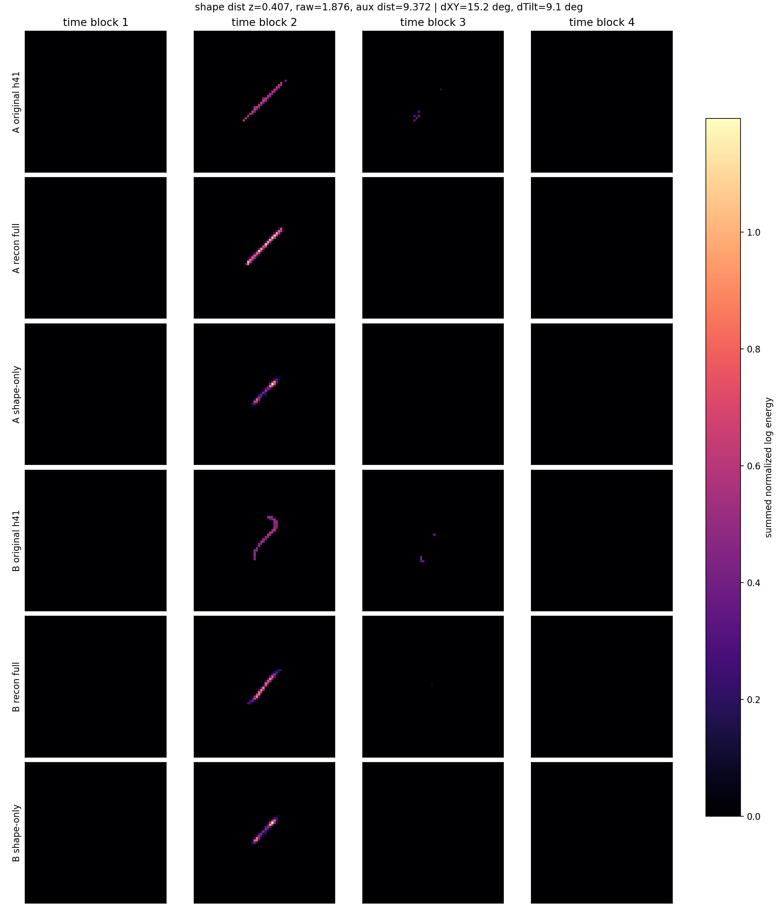
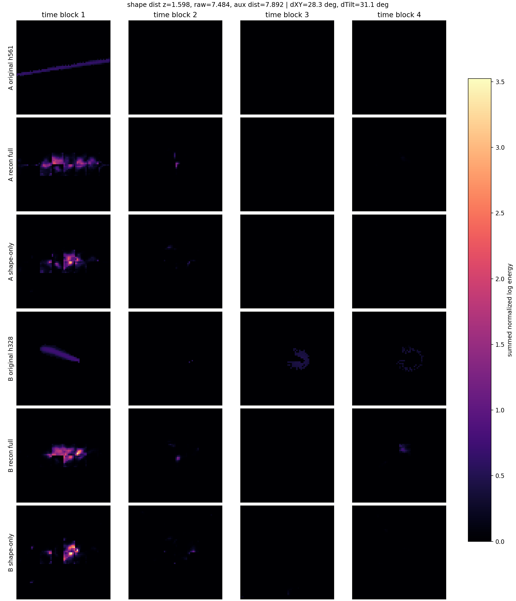

# Phase 2 Voxel Shape-Latent Pair Gallery

Checkpoint: `local_data/experiments/phase2_voxel_full_pass_v001/checkpoint.pt`
Split: `test`
Candidate search: `21083` particles with at least `20` hits.
Encoder input mode: `clean`
Pair mode: `rotation`
Morphology filter: `line`
Line-like thresholds: `linearity_xy >= 0.76`, `aspect_xy >= 2.4`, `max(x_span,y_span) >= 12.0`.
Pair comparability: `hit_ratio <= 3.0`, `energy_ratio <= 4.0`.

Pairs are nearest neighbors in the z-scored 8D `z_shape` space. The 7 `z_aux` values are shown raw. In this checkpoint they are unconstrained auxiliary latents, not guaranteed physical dx/dy/theta/scale parameters.

`theta_xy` and `theta_time_tilt` are not network outputs here. They are diagnostic PCA angles measured from the centered voxel particle: `theta_xy` is the detector-plane major-axis angle modulo 180 degrees, and `theta_time_tilt` is the 3D major-axis angle away from the XY plane.

Each image contains original rows plus reconstructions. `recon full` decodes `z_shape + z_aux`. `shape-only` decodes the same `z_shape` with `z_aux=0`; this is a diagnostic proxy for "before transform/aux influence". It is not a true pre-transform tensor, because this checkpoint does not have a separate final transform layer.

| pair | category | shape dist z-scored | dXY deg | dTilt deg | linearity A/B | aspect A/B | hits A/B | E A/B | image |
|---:|---|---:|---:|---:|---:|---:|---:|---:|---|
| 1 | `xy_rotation` | 0.70328 | 81.3 | 8.9 | 0.92/0.86 | 3.4/2.7 | 41/21 | 15.17/5.43 | [png](../../../assets/phase2_voxel_autoencoder/shape_latent_pairs_v001/shape_latent_pair_01.png) |
| 2 | `xy_rotation` | 0.83511 | 89.5 | 5.3 | 0.85/0.91 | 2.5/3.3 | 75/104 | 23.37/49.14 | [png](../../../assets/phase2_voxel_autoencoder/shape_latent_pairs_v001/shape_latent_pair_02.png) |
| 3 | `xy_rotation` | 0.75539 | 79.3 | 1.6 | 0.90/0.94 | 3.2/4.2 | 56/36 | 21.59/14.03 | [png](../../../assets/phase2_voxel_autoencoder/shape_latent_pairs_v001/shape_latent_pair_03.png) |
| 4 | `xy_rotation` | 0.84968 | 86.5 | 1.3 | 0.88/0.94 | 2.9/3.9 | 69/23 | 34.44/11.09 | [png](../../../assets/phase2_voxel_autoencoder/shape_latent_pairs_v001/shape_latent_pair_04.png) |
| 5 | `xy_rotation` | 0.95632 | 89.3 | 0.8 | 0.94/0.87 | 4.0/2.7 | 258/92 | 101.21/44.20 | [png](../../../assets/phase2_voxel_autoencoder/shape_latent_pairs_v001/shape_latent_pair_05.png) |
| 6 | `time_tilt_rotation` | 0.84314 | 38.8 | 20.8 | 0.97/0.99 | 5.8/11.1 | 20/21 | 10.56/10.77 | [png](../../../assets/phase2_voxel_autoencoder/shape_latent_pairs_v001/shape_latent_pair_06.png) |
| 7 | `time_tilt_rotation` | 0.40701 | 15.2 | 9.1 | 1.00/0.97 | 17.0/5.5 | 41/41 | 19.99/18.86 | [png](../../../assets/phase2_voxel_autoencoder/shape_latent_pairs_v001/shape_latent_pair_07.png) |
| 8 | `time_tilt_rotation` | 0.69904 | 5.1 | 15.1 | 0.98/0.92 | 7.8/3.6 | 61/24 | 30.47/13.30 | [png](../../../assets/phase2_voxel_autoencoder/shape_latent_pairs_v001/shape_latent_pair_08.png) |
| 9 | `time_tilt_rotation` | 1.59780 | 28.3 | 31.1 | 1.00/0.87 | 25.2/2.8 | 561/328 | 89.41/139.26 | [png](../../../assets/phase2_voxel_autoencoder/shape_latent_pairs_v001/shape_latent_pair_09.png) |
| 10 | `time_tilt_rotation` | 0.58146 | 11.8 | 10.2 | 0.99/0.99 | 13.7/10.4 | 21/20 | 10.12/10.58 | [png](../../../assets/phase2_voxel_autoencoder/shape_latent_pairs_v001/shape_latent_pair_10.png) |

## Pair 1

- category: `xy_rotation`
- angle differences: theta_xy `81.3 deg`, theta_time_tilt `8.9 deg`
- comparability: hit_ratio `1.95`, energy_ratio `2.79`
- A: hits `41`, E `15.166`, theta_xy `7.1 deg`, theta_time_tilt `11.2 deg`, linearity_xy `0.916`, aspect_xy `3.44`, span x/y/t `17.0`/`5.0`/`4.750`, source `F08/tot_toa__r0000000033.t3pa`, particle `26525`
- B: hits `21`, E `5.429`, theta_xy `88.4 deg`, theta_time_tilt `2.3 deg`, linearity_xy `0.865`, aspect_xy `2.72`, span x/y/t `5.0`/`14.0`/`3.938`, source `F08/tot_toa__r0000000033.t3pa`, particle `17849`
- `z_shape_A`: `[+1.581, -6.982, -7.605, -2.939, +5.547, -3.850, -2.834, +8.893]`
- `z_shape_B`: `[+2.583, -6.447, -5.458, -2.663, +5.956, -4.369, -3.672, +10.576]`
- `z_aux_A`: `[+7.273, +9.138, -8.620, +9.987, -3.074, +4.831, -0.836]`
- `z_aux_B`: `[-1.863, +5.549, +11.047, +4.364, -5.092, -3.915, +3.850]`

## Pair 2

- category: `xy_rotation`
- angle differences: theta_xy `89.5 deg`, theta_time_tilt `5.3 deg`
- comparability: hit_ratio `1.39`, energy_ratio `2.10`
- A: hits `75`, E `23.365`, theta_xy `92.1 deg`, theta_time_tilt `1.4 deg`, linearity_xy `0.846`, aspect_xy `2.55`, span x/y/t `9.0`/`22.0`/`4.375`, source `F08/tot_toa__r0000000033.t3pa`, particle `5051`
- B: hits `104`, E `49.139`, theta_xy `1.6 deg`, theta_time_tilt `6.7 deg`, linearity_xy `0.909`, aspect_xy `3.32`, span x/y/t `19.0`/`8.0`/`3.438`, source `F08/tot_toa__r0000000033.t3pa`, particle `8043`
- `z_shape_A`: `[+7.454, -7.467, -8.815, -2.409, +2.578, -9.650, -7.541, +4.591]`
- `z_shape_B`: `[+7.406, -7.174, -8.636, -1.931, +2.401, -8.481, -5.938, +1.294]`
- `z_aux_A`: `[-4.711, +4.935, +6.729, -1.348, -11.616, +2.889, +5.484]`
- `z_aux_B`: `[+5.065, +11.249, -10.564, +1.773, -5.566, +8.696, -3.915]`

## Pair 3

- category: `xy_rotation`
- angle differences: theta_xy `79.3 deg`, theta_time_tilt `1.6 deg`
- comparability: hit_ratio `1.56`, energy_ratio `1.54`
- A: hits `56`, E `21.595`, theta_xy `5.3 deg`, theta_time_tilt `8.4 deg`, linearity_xy `0.901`, aspect_xy `3.18`, span x/y/t `17.0`/`7.0`/`3.188`, source `F08/tot_toa__r0000000033.t3pa`, particle `24387`
- B: hits `36`, E `14.033`, theta_xy `84.6 deg`, theta_time_tilt `6.8 deg`, linearity_xy `0.942`, aspect_xy `4.17`, span x/y/t `6.0`/`16.0`/`3.062`, source `F08/tot_toa__r0000000033.t3pa`, particle `11608`
- `z_shape_A`: `[+7.579, -8.595, -1.717, -3.241, +3.354, -7.330, -3.936, +3.378]`
- `z_shape_B`: `[+8.242, -7.905, -1.886, -2.578, +4.722, -7.459, -3.758, +6.202]`
- `z_aux_A`: `[+7.130, +14.402, -9.536, +8.092, -3.938, +4.245, -0.747]`
- `z_aux_B`: `[-8.220, +1.418, +7.178, -0.418, -15.355, -1.106, -0.160]`

## Pair 4

- category: `xy_rotation`
- angle differences: theta_xy `86.5 deg`, theta_time_tilt `1.3 deg`
- comparability: hit_ratio `3.00`, energy_ratio `3.10`
- A: hits `69`, E `34.443`, theta_xy `5.1 deg`, theta_time_tilt `8.6 deg`, linearity_xy `0.883`, aspect_xy `2.92`, span x/y/t `14.0`/`7.0`/`2.500`, source `F08/tot_toa__r0000000033.t3pa`, particle `6527`
- B: hits `23`, E `11.094`, theta_xy `91.6 deg`, theta_time_tilt `7.3 deg`, linearity_xy `0.935`, aspect_xy `3.92`, span x/y/t `4.0`/`12.0`/`2.000`, source `D05/tot_toa__r0000000013.t3pa`, particle `177`
- `z_shape_A`: `[+10.857, -8.742, -0.261, -5.544, +3.394, -6.715, -3.504, -3.461]`
- `z_shape_B`: `[+11.055, -7.407, +1.429, -5.175, +3.549, -6.377, -1.684, -6.284]`
- `z_aux_A`: `[+5.924, +10.770, -10.454, +0.443, -7.433, +5.890, -0.994]`
- `z_aux_B`: `[+3.068, -6.365, +4.994, -7.542, -12.468, -3.260, +3.207]`

## Pair 5

- category: `xy_rotation`
- angle differences: theta_xy `89.3 deg`, theta_time_tilt `0.8 deg`
- comparability: hit_ratio `2.80`, energy_ratio `2.29`
- A: hits `258`, E `101.211`, theta_xy `180.0 deg`, theta_time_tilt `1.8 deg`, linearity_xy `0.937`, aspect_xy `3.98`, span x/y/t `67.0`/`19.0`/`5.250`, source `F08/tot_toa__r0000000033.t3pa`, particle `23533`
- B: hits `92`, E `44.196`, theta_xy `89.3 deg`, theta_time_tilt `0.9 deg`, linearity_xy `0.866`, aspect_xy `2.73`, span x/y/t `7.0`/`16.0`/`5.812`, source `08_thu_proton_daily_batch/toa_tot__r0000007293.t3pa`, particle `2119`
- `z_shape_A`: `[+0.584, +0.626, -13.421, -3.925, -5.556, -8.159, -2.287, +9.509]`
- `z_shape_B`: `[+1.669, -1.442, -13.819, -4.965, -4.084, -9.793, -3.840, +10.588]`
- `z_aux_A`: `[+4.105, +5.289, -6.773, -0.532, -3.996, +9.487, -0.802]`
- `z_aux_B`: `[-1.620, +0.368, +0.553, -3.166, -4.865, +3.822, +2.728]`

## Pair 6

- category: `time_tilt_rotation`
- angle differences: theta_xy `38.8 deg`, theta_time_tilt `20.8 deg`
- comparability: hit_ratio `1.05`, energy_ratio `1.02`
- A: hits `20`, E `10.564`, theta_xy `166.0 deg`, theta_time_tilt `22.5 deg`, linearity_xy `0.970`, aspect_xy `5.75`, span x/y/t `13.0`/`6.0`/`7.250`, source `data M07/sync__M07-W0044_r001.t3pa`, particle `280359`
- B: hits `21`, E `10.768`, theta_xy `127.2 deg`, theta_time_tilt `1.7 deg`, linearity_xy `0.992`, aspect_xy `11.12`, span x/y/t `11.0`/`13.0`/`3.062`, source `data M07/sync__M07-W0044_r001.t3pa`, particle `75335`
- `z_shape_A`: `[+6.202, +3.144, -11.081, -3.905, -1.150, -0.086, -5.343, -5.689]`
- `z_shape_B`: `[+6.311, +2.960, -13.090, -4.123, -0.844, -1.890, -7.454, -6.146]`
- `z_aux_A`: `[+5.874, +1.306, -1.749, -4.939, +6.802, -3.039, -3.680]`
- `z_aux_B`: `[-0.281, +5.892, +5.670, +4.542, -5.959, +0.188, +1.784]`

## Pair 7

- category: `time_tilt_rotation`
- angle differences: theta_xy `15.2 deg`, theta_time_tilt `9.1 deg`
- comparability: hit_ratio `1.00`, energy_ratio `1.06`
- A: hits `41`, E `19.989`, theta_xy `44.4 deg`, theta_time_tilt `0.3 deg`, linearity_xy `0.997`, aspect_xy `16.99`, span x/y/t `20.0`/`19.0`/`4.625`, source `08_thu_proton_daily_batch/toa_tot__r0000007333.t3pa`, particle `1581`
- B: hits `41`, E `18.861`, theta_xy `59.7 deg`, theta_time_tilt `9.4 deg`, linearity_xy `0.967`, aspect_xy `5.48`, span x/y/t `12.0`/`21.0`/`8.500`, source `D05/tot_toa__r0000000042.t3pa`, particle `34422`
- `z_shape_A`: `[-3.933, -12.610, -6.282, -3.581, +0.983, -5.270, +5.579, +10.861]`
- `z_shape_B`: `[-2.846, -12.311, -5.494, -3.913, +1.021, -5.353, +4.936, +9.815]`
- `z_aux_A`: `[-3.850, -2.260, -7.675, +0.071, -2.364, +2.604, -0.298]`
- `z_aux_B`: `[-2.311, -5.785, -1.814, -5.083, -4.585, +0.618, -2.099]`

## Pair 8

- category: `time_tilt_rotation`
- angle differences: theta_xy `5.1 deg`, theta_time_tilt `15.1 deg`
- comparability: hit_ratio `2.54`, energy_ratio `2.29`
- A: hits `61`, E `30.468`, theta_xy `47.6 deg`, theta_time_tilt `0.6 deg`, linearity_xy `0.983`, aspect_xy `7.78`, span x/y/t `15.0`/`16.0`/`6.438`, source `08_thu_proton_daily_batch/toa_tot__r0000007293.t3pa`, particle `1480`
- B: hits `24`, E `13.299`, theta_xy `52.7 deg`, theta_time_tilt `15.7 deg`, linearity_xy `0.921`, aspect_xy `3.56`, span x/y/t `9.0`/`14.0`/`6.500`, source `data M07/sync__M07-W0044_r001.t3pa`, particle `121483`
- `z_shape_A`: `[-4.239, -1.786, -10.115, -4.116, -1.468, -6.876, +2.953, +13.452]`
- `z_shape_B`: `[-3.025, -1.080, -10.910, -3.689, -1.981, -5.354, +1.323, +12.796]`
- `z_aux_A`: `[-1.969, -1.199, -3.655, -6.989, +0.421, +0.054, -0.939]`
- `z_aux_B`: `[-0.105, -1.445, -2.075, -7.397, +3.303, -3.984, -1.787]`

## Pair 9

- category: `time_tilt_rotation`
- angle differences: theta_xy `28.3 deg`, theta_time_tilt `31.1 deg`
- comparability: hit_ratio `1.71`, energy_ratio `1.56`
- A: hits `561`, E `89.412`, theta_xy `8.9 deg`, theta_time_tilt `0.1 deg`, linearity_xy `0.998`, aspect_xy `25.25`, span x/y/t `172.0`/`28.0`/`17.438`, source `F08/tot_toa__r0000000033.t3pa`, particle `34716`
- B: hits `328`, E `139.258`, theta_xy `160.6 deg`, theta_time_tilt `31.2 deg`, linearity_xy `0.873`, aspect_xy `2.80`, span x/y/t `33.0`/`19.0`/`17.938`, source `F08/tot_toa__r0000000033.t3pa`, particle `22704`
- `z_shape_A`: `[-0.707, +6.940, -6.068, -0.705, +1.384, -12.729, -2.072, -2.768]`
- `z_shape_B`: `[-1.532, +11.226, -8.197, +0.900, +0.734, -13.616, -3.565, +2.372]`
- `z_aux_A`: `[-15.272, +5.523, -5.339, -0.296, -6.631, -0.105, -2.685]`
- `z_aux_B`: `[-9.092, +8.046, -7.414, -1.712, -5.302, -2.739, -1.038]`

## Pair 10

- category: `time_tilt_rotation`
- angle differences: theta_xy `11.8 deg`, theta_time_tilt `10.2 deg`
- comparability: hit_ratio `1.05`, energy_ratio `1.05`
- A: hits `21`, E `10.120`, theta_xy `113.1 deg`, theta_time_tilt `10.7 deg`, linearity_xy `0.995`, aspect_xy `13.72`, span x/y/t `7.0`/`16.0`/`3.062`, source `D05/tot_toa__r0000000035.t3pa`, particle `69`
- B: hits `20`, E `10.581`, theta_xy `124.9 deg`, theta_time_tilt `0.5 deg`, linearity_xy `0.991`, aspect_xy `10.37`, span x/y/t `11.0`/`14.0`/`2.000`, source `data M07/sync__M07-W0044_r001.t3pa`, particle `75354`
- `z_shape_A`: `[+10.586, -0.567, -8.451, -5.753, -2.116, -5.310, -9.440, -7.455]`
- `z_shape_B`: `[+9.790, -0.261, -6.709, -5.841, -1.864, -6.472, -8.981, -8.129]`
- `z_aux_A`: `[-0.920, -4.323, +6.512, +0.716, -0.448, -5.462, -2.949]`
- `z_aux_B`: `[-0.748, +8.304, +7.707, +6.621, -5.495, -2.255, +0.115]`
