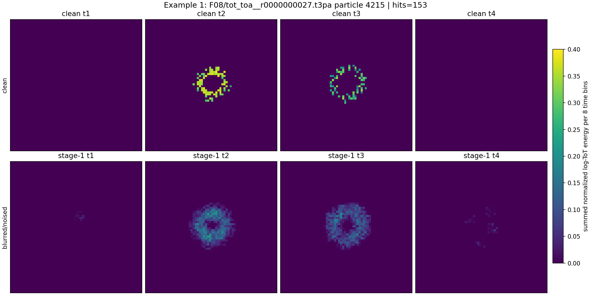
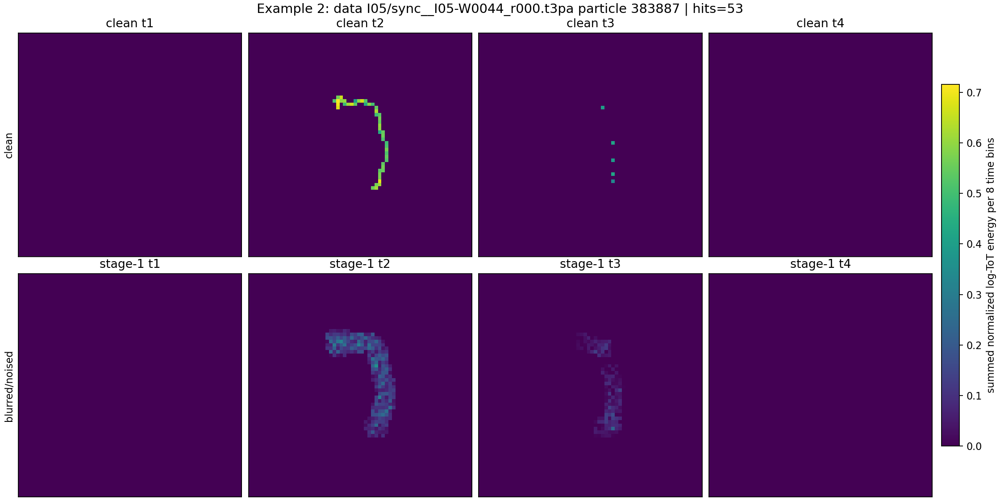
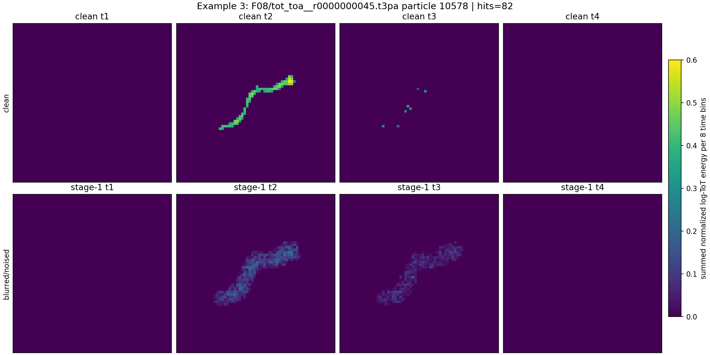
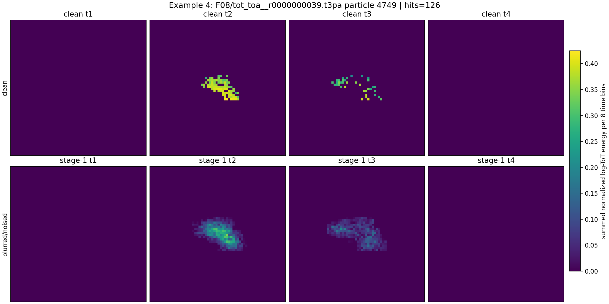
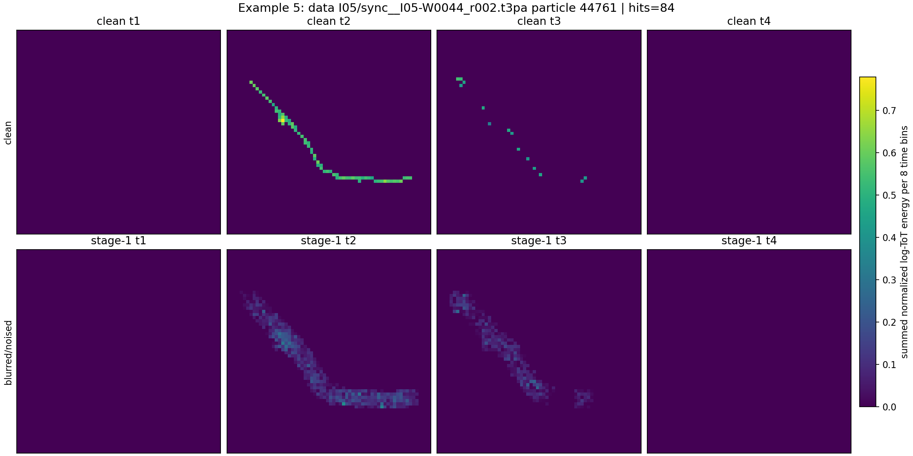
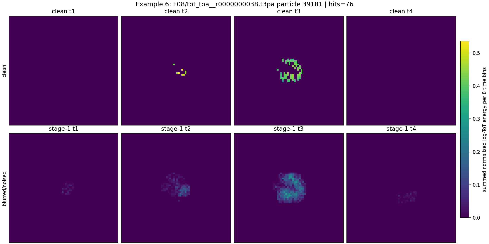
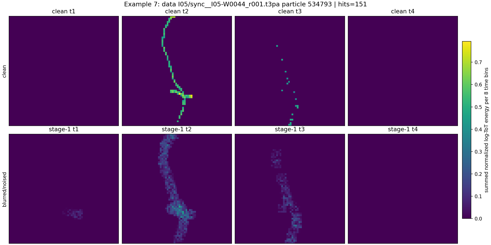
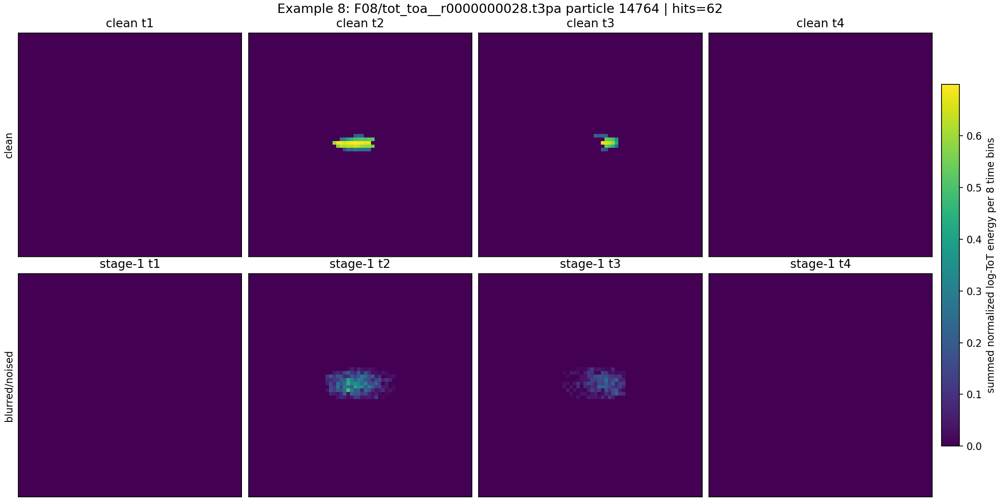
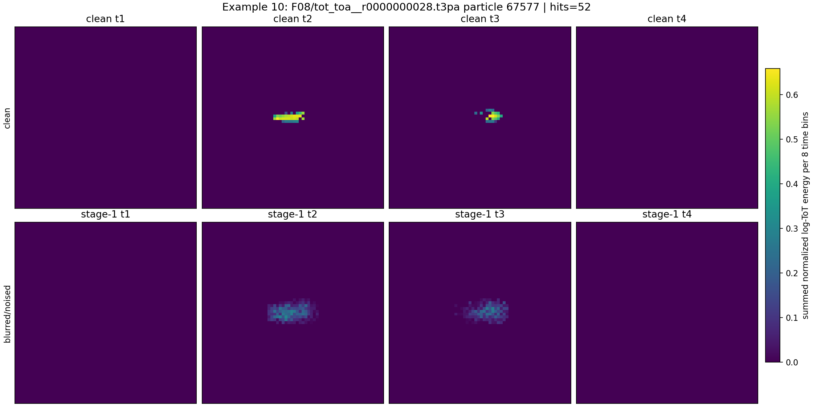

# Phase 2 Voxel Training Examples

These are real estimated particles converted into logical 3D energy tensors of shape `32 x 64 x 64` (`time x y x x`).

Each image is a 2D view of the 3D tensor. The 32 time bins are split into four blocks of 8 bins, and each block is summed into one XY image.

Top row: clean centered energy tensor. Bottom row: the first curriculum-stage training input after `5 x 5 x 5` blur, support noise `0.04`, and voxel dropout `0.08`.

| # | source | particle | hits | kept hits | kept energy | image |
|---:|---|---:|---:|---:|---:|---|
| 1 | `F08/tot_toa__r0000000027.t3pa` | 4215 | 153 | 100.00% | 100.00% | [png](../../../assets/phase2_voxel_autoencoder/training_stage_examples/voxel_training_example_01.png) |
| 2 | `data I05/sync__I05-W0044_r000.t3pa` | 383887 | 53 | 100.00% | 100.00% | [png](../../../assets/phase2_voxel_autoencoder/training_stage_examples/voxel_training_example_02.png) |
| 3 | `F08/tot_toa__r0000000045.t3pa` | 10578 | 82 | 100.00% | 100.00% | [png](../../../assets/phase2_voxel_autoencoder/training_stage_examples/voxel_training_example_03.png) |
| 4 | `F08/tot_toa__r0000000039.t3pa` | 4749 | 126 | 100.00% | 100.00% | [png](../../../assets/phase2_voxel_autoencoder/training_stage_examples/voxel_training_example_04.png) |
| 5 | `data I05/sync__I05-W0044_r002.t3pa` | 44761 | 84 | 100.00% | 100.00% | [png](../../../assets/phase2_voxel_autoencoder/training_stage_examples/voxel_training_example_05.png) |
| 6 | `F08/tot_toa__r0000000038.t3pa` | 39181 | 76 | 100.00% | 100.00% | [png](../../../assets/phase2_voxel_autoencoder/training_stage_examples/voxel_training_example_06.png) |
| 7 | `data I05/sync__I05-W0044_r001.t3pa` | 534793 | 151 | 76.82% | 75.77% | [png](../../../assets/phase2_voxel_autoencoder/training_stage_examples/voxel_training_example_07.png) |
| 8 | `F08/tot_toa__r0000000028.t3pa` | 14764 | 62 | 100.00% | 100.00% | [png](../../../assets/phase2_voxel_autoencoder/training_stage_examples/voxel_training_example_08.png) |
| 9 | `F08/tot_toa__r0000000052.t3pa` | 9665 | 84 | 100.00% | 100.00% | [png](../../../assets/phase2_voxel_autoencoder/training_stage_examples/voxel_training_example_09.png) |
| 10 | `F08/tot_toa__r0000000028.t3pa` | 67577 | 52 | 100.00% | 100.00% | [png](../../../assets/phase2_voxel_autoencoder/training_stage_examples/voxel_training_example_10.png) |

## Example 1

## Example 2

## Example 3

## Example 4

## Example 5

## Example 6

## Example 7

## Example 8

## Example 9

## Example 10

