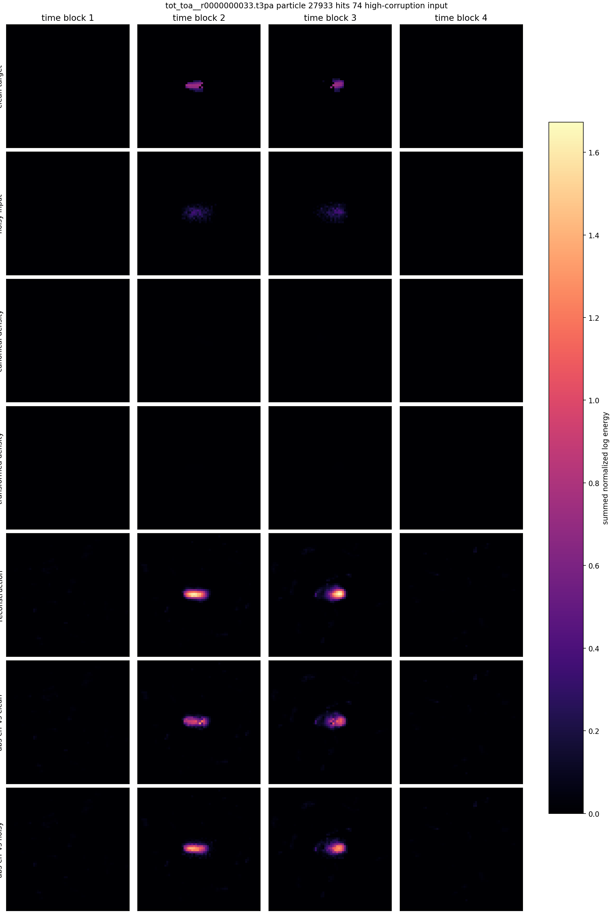
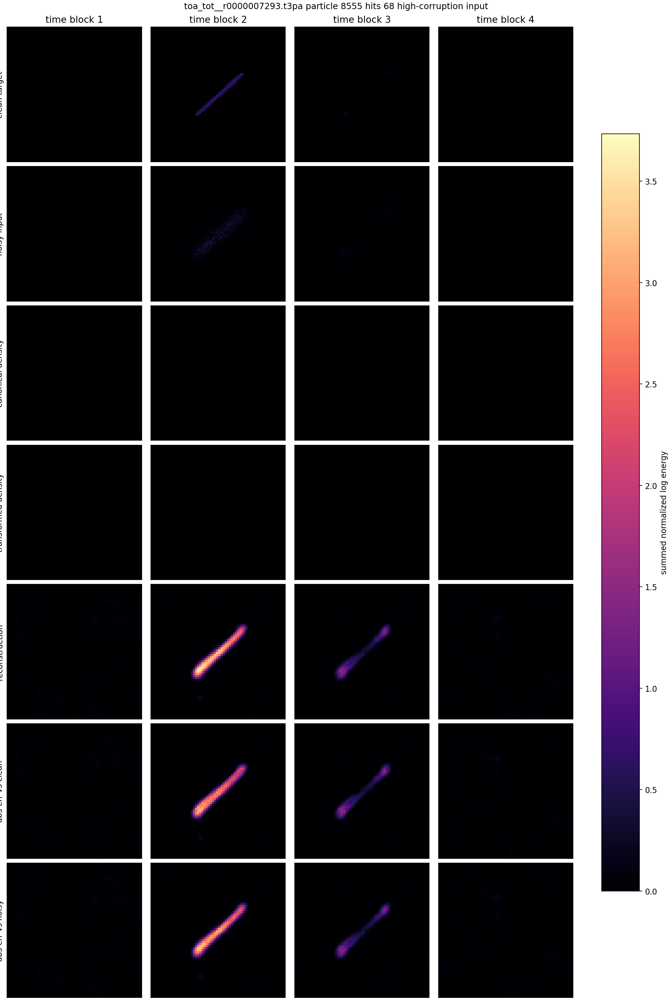
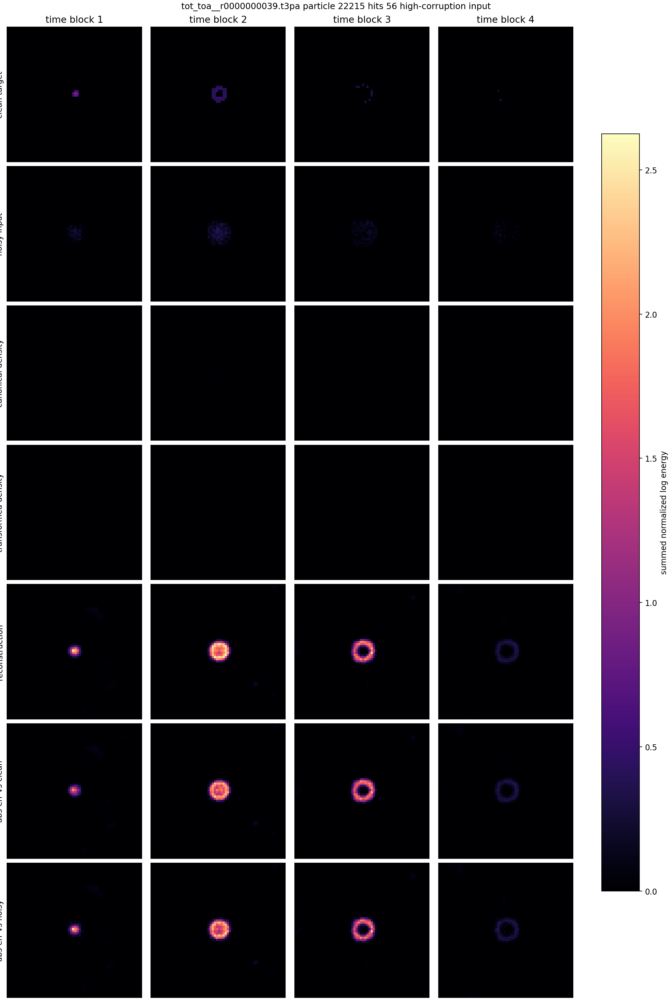
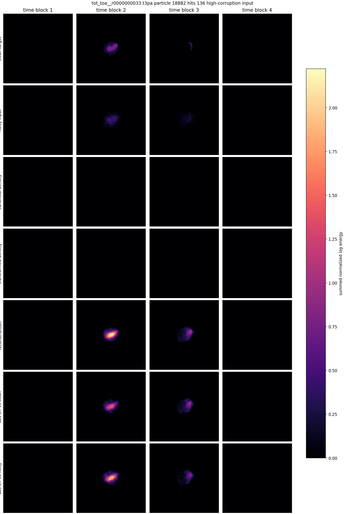
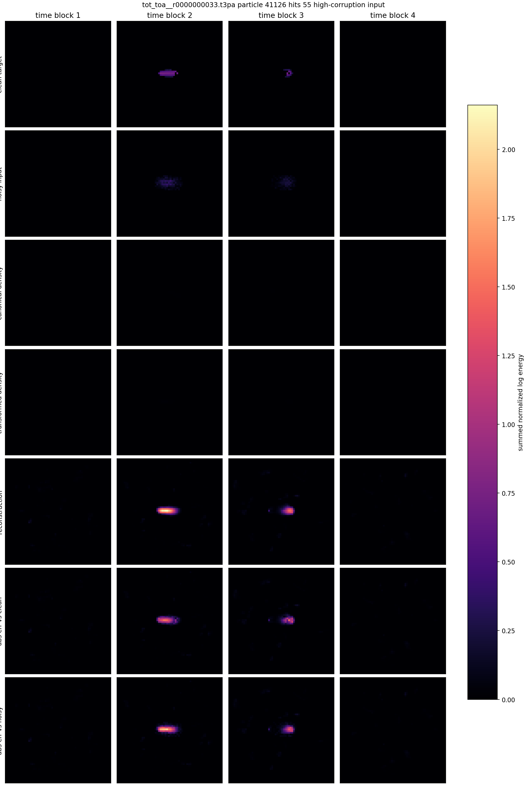
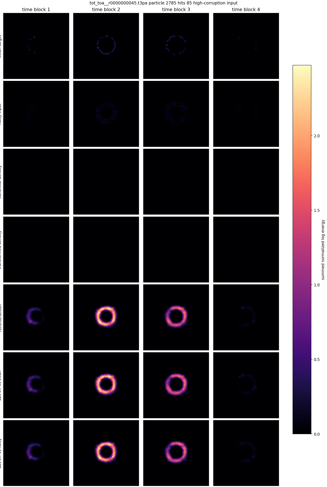
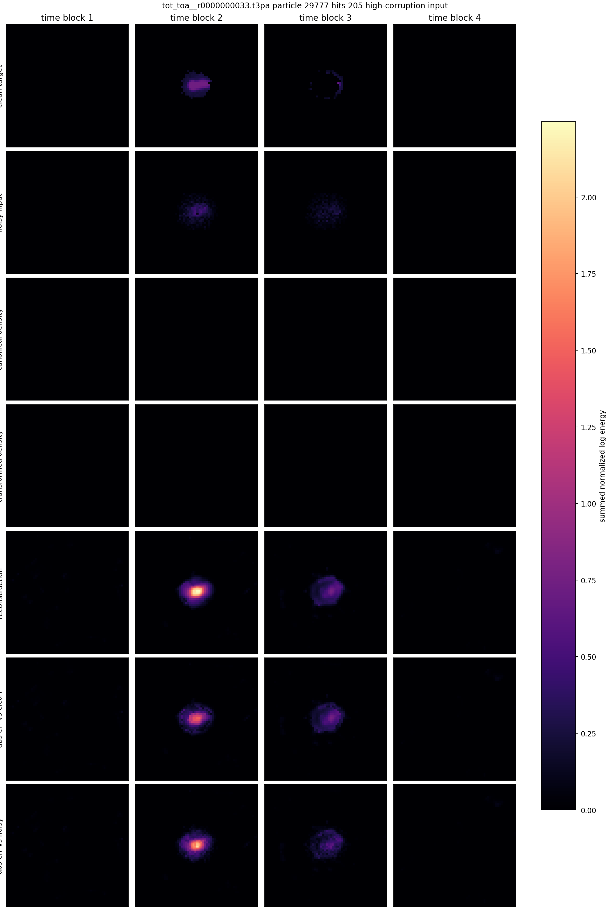
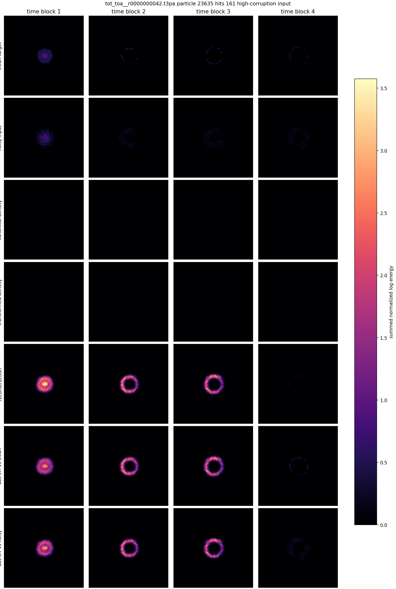

# Phase 2 Canonical Hard-Mined L2 Noisy-Input Gallery

Checkpoint: `local_data/experiments/phase2_canonical_voxel_ae_hardmine_l2_v001/runs/canonical_transform_voxel_z8_t7_hardmine_l2/checkpoint.pt`

This gallery feeds the autoencoder the same fixed high-corruption input used in the hard-mined training run: `blur_kernel=5`, `blur_mix=1.0`, `noise_std=0.04`, `voxel_dropout=0.08`.

Each image compares clean target, corrupted/noisy model input, reconstruction from that noisy input, and absolute errors against both clean and noisy tensors.

| # | source | particle | hits | energy clean/noisy/recon | L2 vs clean | L2 vs noisy | transform | image |
|---:|---|---:|---:|---:|---:|---:|---|---|
| 1 | `F08/tot_toa__r0000000033.t3pa` | 27933 | 74 | 33.400/35.554/134.328 | 1.2149 | 3.6005 | `dx_norm=0.00057, dy_norm=0.0135, dt_norm=0.00974, theta_xy=-2.78, theta_time_tilt=-0.00246, scale_xyz=0.836, energy_scale=134` | [png](../../../assets/phase2_canonical_hardmine_l2/gallery_v001/canonical_hardmine_noisy_example_01.png) |
| 2 | `F08/tot_toa__r0000000033.t3pa` | 6454 | 50 | 20.271/22.891/138.754 | 1.8243 | 5.1632 | `dx_norm=-0.0154, dy_norm=0.0227, dt_norm=-0.0299, theta_xy=-1.95, theta_time_tilt=-0.038, scale_xyz=0.802, energy_scale=139` | [png](../../../assets/phase2_canonical_hardmine_l2/gallery_v001/canonical_hardmine_noisy_example_02.png) |
| 3 | `08_thu_proton_daily_batch/toa_tot__r0000007293.t3pa` | 8555 | 68 | 34.430/42.128/498.259 | 2.6131 | 7.6314 | `dx_norm=0.0187, dy_norm=-0.00518, dt_norm=-0.203, theta_xy=-2.35, theta_time_tilt=0.0277, scale_xyz=1.27, energy_scale=498` | [png](../../../assets/phase2_canonical_hardmine_l2/gallery_v001/canonical_hardmine_noisy_example_03.png) |
| 4 | `D05/tot_toa__r0000000039.t3pa` | 22215 | 56 | 24.129/43.806/328.142 | 2.4741 | 5.1835 | `dx_norm=0.0157, dy_norm=0.00835, dt_norm=-0.099, theta_xy=-2.27, theta_time_tilt=0.0119, scale_xyz=1.41, energy_scale=328` | [png](../../../assets/phase2_canonical_hardmine_l2/gallery_v001/canonical_hardmine_noisy_example_04.png) |
| 5 | `08_thu_proton_daily_batch/toa_tot__r0000007293.t3pa` | 7091 | 57 | 29.908/33.162/260.726 | 1.9343 | 5.9903 | `dx_norm=0.00198, dy_norm=-0.00237, dt_norm=-0.00988, theta_xy=-2.3, theta_time_tilt=-0.0263, scale_xyz=1.02, energy_scale=261` | [png](../../../assets/phase2_canonical_hardmine_l2/gallery_v001/canonical_hardmine_noisy_example_05.png) |
| 6 | `F08/tot_toa__r0000000033.t3pa` | 18882 | 136 | 53.553/55.778/175.486 | 1.2005 | 3.0994 | `dx_norm=0.0211, dy_norm=0.0097, dt_norm=-0.0134, theta_xy=-2.39, theta_time_tilt=-0.0468, scale_xyz=0.905, energy_scale=175` | [png](../../../assets/phase2_canonical_hardmine_l2/gallery_v001/canonical_hardmine_noisy_example_06.png) |
| 7 | `F08/tot_toa__r0000000033.t3pa` | 41126 | 55 | 26.329/28.937/116.774 | 1.2766 | 3.8758 | `dx_norm=-0.00138, dy_norm=0.0175, dt_norm=-0.0281, theta_xy=-2.85, theta_time_tilt=0.031, scale_xyz=0.816, energy_scale=117` | [png](../../../assets/phase2_canonical_hardmine_l2/gallery_v001/canonical_hardmine_noisy_example_07.png) |
| 8 | `D05/tot_toa__r0000000045.t3pa` | 2785 | 85 | 30.218/48.751/723.293 | 3.4055 | 10.1049 | `dx_norm=-0.00437, dy_norm=0.00697, dt_norm=-0.246, theta_xy=-2.32, theta_time_tilt=-0.0232, scale_xyz=1.66, energy_scale=723` | [png](../../../assets/phase2_canonical_hardmine_l2/gallery_v001/canonical_hardmine_noisy_example_08.png) |
| 9 | `F08/tot_toa__r0000000033.t3pa` | 29777 | 205 | 72.712/77.365/257.858 | 1.2690 | 3.0144 | `dx_norm=0.0141, dy_norm=0.0114, dt_norm=-0.00569, theta_xy=-2.43, theta_time_tilt=-0.0367, scale_xyz=1.02, energy_scale=258` | [png](../../../assets/phase2_canonical_hardmine_l2/gallery_v001/canonical_hardmine_noisy_example_09.png) |
| 10 | `D05/tot_toa__r0000000042.t3pa` | 23635 | 161 | 76.315/123.677/721.392 | 2.1101 | 4.3627 | `dx_norm=0.0183, dy_norm=-0.014, dt_norm=-0.344, theta_xy=-2.3, theta_time_tilt=0.0192, scale_xyz=1.69, energy_scale=721` | [png](../../../assets/phase2_canonical_hardmine_l2/gallery_v001/canonical_hardmine_noisy_example_10.png) |

## Example 1

## Example 2

## Example 3

## Example 4

## Example 5

## Example 6

## Example 7

## Example 8

## Example 9

## Example 10

