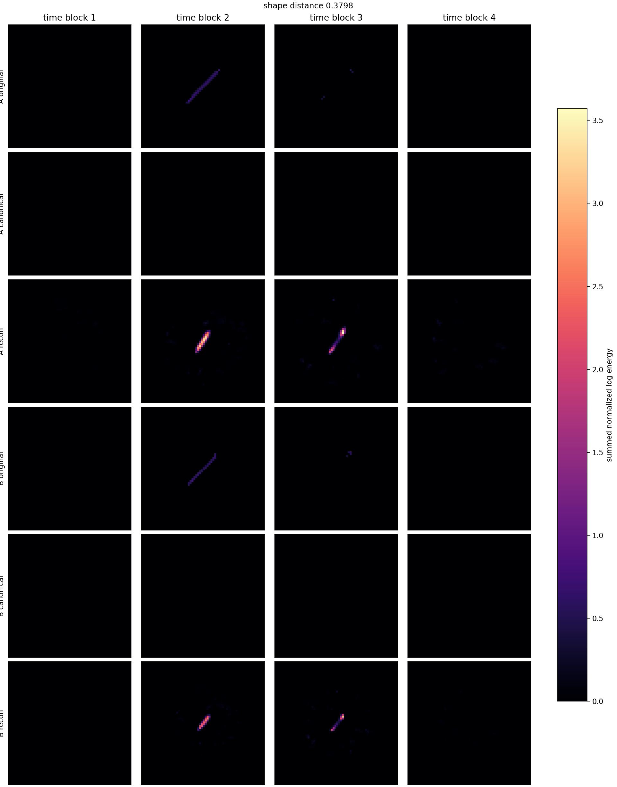
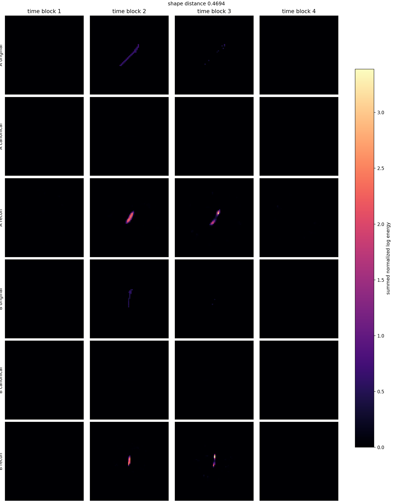
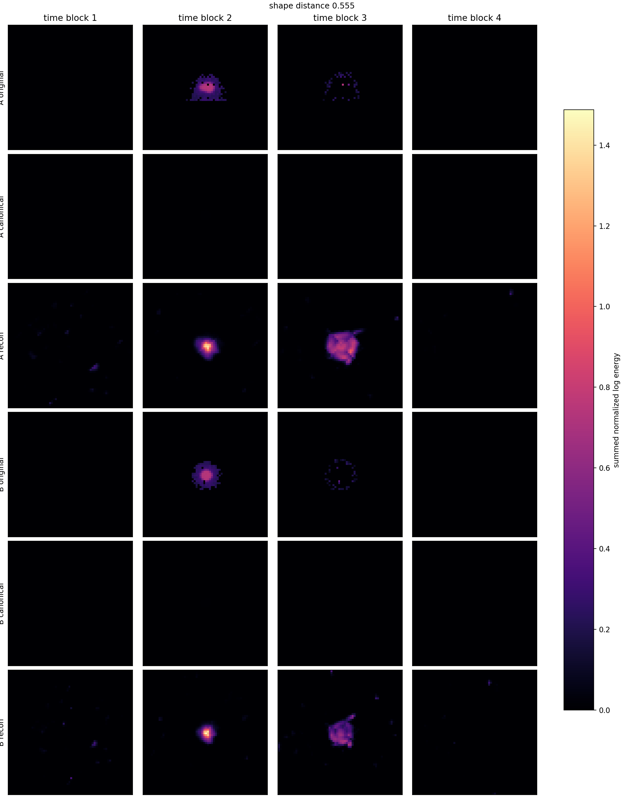
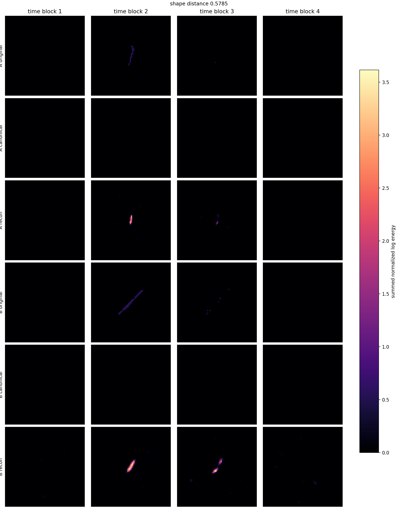

# Phase 2 Canonical Latent Pair Gallery

Checkpoint: `local_data/experiments/phase2_canonical_voxel_ae_hardmine_l2_v001/runs/canonical_transform_voxel_z8_t7_hardmine_l2/checkpoint.pt`

| pair | shape dist | d theta_xy | d theta_time | hits A/B | image |
|---:|---:|---:|---:|---:|---|
| 1 | 0.3798 | 0.100 | 0.112 | 51/35 | [png](../../../assets/phase2_canonical_hardmine_l2/pairs_v001/canonical_latent_pair_01.png) |
| 2 | 0.4694 | 0.427 | 0.008 | 44/23 | [png](../../../assets/phase2_canonical_hardmine_l2/pairs_v001/canonical_latent_pair_02.png) |
| 3 | 0.5188 | 0.058 | 0.101 | 42/53 | [png](../../../assets/phase2_canonical_hardmine_l2/pairs_v001/canonical_latent_pair_03.png) |
| 4 | 0.5383 | 0.019 | 0.106 | 52/52 | [png](../../../assets/phase2_canonical_hardmine_l2/pairs_v001/canonical_latent_pair_04.png) |
| 5 | 0.5517 | 0.161 | 0.126 | 25/36 | [png](../../../assets/phase2_canonical_hardmine_l2/pairs_v001/canonical_latent_pair_05.png) |
| 6 | 0.5550 | 0.309 | 0.008 | 217/202 | [png](../../../assets/phase2_canonical_hardmine_l2/pairs_v001/canonical_latent_pair_06.png) |
| 7 | 0.5679 | 0.326 | 0.053 | 53/32 | [png](../../../assets/phase2_canonical_hardmine_l2/pairs_v001/canonical_latent_pair_07.png) |
| 8 | 0.5758 | 0.300 | 0.030 | 46/30 | [png](../../../assets/phase2_canonical_hardmine_l2/pairs_v001/canonical_latent_pair_08.png) |
| 9 | 0.5785 | 0.347 | 0.008 | 22/51 | [png](../../../assets/phase2_canonical_hardmine_l2/pairs_v001/canonical_latent_pair_09.png) |
| 10 | 0.5967 | 0.311 | 0.030 | 51/58 | [png](../../../assets/phase2_canonical_hardmine_l2/pairs_v001/canonical_latent_pair_10.png) |

## Pair 1

- A transform: `dx_norm=0.00923, dy_norm=0.000988, dt_norm=0.00691, theta_xy=-2.09, theta_time_tilt=-0.075, scale_xyz=0.744, energy_scale=144`
- B transform: `dx_norm=0.0241, dy_norm=0.0127, dt_norm=0.00797, theta_xy=-2.19, theta_time_tilt=0.0374, scale_xyz=0.583, energy_scale=71.2`

## Pair 2

- A transform: `dx_norm=0.0258, dy_norm=-0.00277, dt_norm=0.00267, theta_xy=-2.12, theta_time_tilt=0.0449, scale_xyz=0.743, energy_scale=92.1`
- B transform: `dx_norm=0.00264, dy_norm=0.0135, dt_norm=0.00495, theta_xy=-1.69, theta_time_tilt=0.0366, scale_xyz=0.514, energy_scale=51.9`

## Pair 3

- A transform: `dx_norm=0.0131, dy_norm=0.0207, dt_norm=0.0133, theta_xy=-2.24, theta_time_tilt=-0.0213, scale_xyz=0.815, energy_scale=136`
- B transform: `dx_norm=0.0164, dy_norm=0.0296, dt_norm=0.0206, theta_xy=-2.3, theta_time_tilt=0.0801, scale_xyz=0.793, energy_scale=167`

## Pair 4

- A transform: `dx_norm=0.00616, dy_norm=0.0181, dt_norm=0.0109, theta_xy=-2.22, theta_time_tilt=0.0632, scale_xyz=0.752, energy_scale=132`
- B transform: `dx_norm=0.00791, dy_norm=0.00754, dt_norm=0.0261, theta_xy=-2.23, theta_time_tilt=-0.0424, scale_xyz=0.867, energy_scale=156`

## Pair 5

- A transform: `dx_norm=0.0249, dy_norm=-0.00432, dt_norm=0.0299, theta_xy=-2.59, theta_time_tilt=0.11, scale_xyz=0.685, energy_scale=38.2`
- B transform: `dx_norm=0.0195, dy_norm=0.000802, dt_norm=0.0263, theta_xy=-2.43, theta_time_tilt=-0.0156, scale_xyz=0.6, energy_scale=53.1`

## Pair 6

- A transform: `dx_norm=0.0356, dy_norm=0.00479, dt_norm=0.0648, theta_xy=-2.42, theta_time_tilt=-0.092, scale_xyz=0.952, energy_scale=199`
- B transform: `dx_norm=0.0183, dy_norm=0.00213, dt_norm=0.0446, theta_xy=-2.11, theta_time_tilt=-0.1, scale_xyz=0.777, energy_scale=125`

## Pair 7

- A transform: `dx_norm=0.00625, dy_norm=0.00104, dt_norm=0.0186, theta_xy=-2.13, theta_time_tilt=0.0302, scale_xyz=0.672, energy_scale=92.2`
- B transform: `dx_norm=0.015, dy_norm=-0.00221, dt_norm=-0.00905, theta_xy=-2.46, theta_time_tilt=-0.0227, scale_xyz=0.676, energy_scale=65.9`

## Pair 8

- A transform: `dx_norm=0.0198, dy_norm=0.00436, dt_norm=-0.0174, theta_xy=-2.36, theta_time_tilt=0.0232, scale_xyz=0.794, energy_scale=127`
- B transform: `dx_norm=0.0128, dy_norm=0.00691, dt_norm=-0.0225, theta_xy=-2.06, theta_time_tilt=-0.00711, scale_xyz=0.634, energy_scale=63.9`

## Pair 9

- A transform: `dx_norm=0.00552, dy_norm=0.0082, dt_norm=-0.0527, theta_xy=-1.79, theta_time_tilt=0.0217, scale_xyz=0.551, energy_scale=41.1`
- B transform: `dx_norm=0.00837, dy_norm=0.00704, dt_norm=0.0209, theta_xy=-2.14, theta_time_tilt=0.0139, scale_xyz=0.819, energy_scale=130`

## Pair 10

- A transform: `dx_norm=0.000138, dy_norm=0.0205, dt_norm=0.00929, theta_xy=-2.05, theta_time_tilt=0.0137, scale_xyz=0.615, energy_scale=68.6`
- B transform: `dx_norm=0.0148, dy_norm=0.0217, dt_norm=0.00442, theta_xy=-2.36, theta_time_tilt=0.0438, scale_xyz=0.765, energy_scale=149`