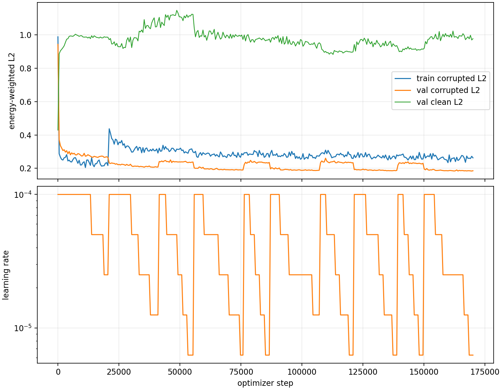

# Phase 2 Canonical Hard-Mined L2 Training

Run directory: `local_data/experiments/phase2_canonical_voxel_ae_hardmine_l2_v001/runs/canonical_transform_voxel_z8_t7_hardmine_l2`
Checkpoint: `local_data/experiments/phase2_canonical_voxel_ae_hardmine_l2_v001/runs/canonical_transform_voxel_z8_t7_hardmine_l2/checkpoint.pt`

This run uses fixed highest corruption and trains only on the highest-loss 10% mined from the train split before each phase. The gradient loss is energy-weighted final reconstruction L2 only.

## Final Metrics

| split/input | energy-weighted L2 | p95 | energy rel L1 | mass overlap | support leakage |
|---|---:|---:|---:|---:|---:|
| test corrupted | 0.189330 | 0.290838 | 5.580287 | 0.899619 | 2.040339 |
| test clean | 0.964396 | 1.534345 | 4.249173 | 0.307300 | 2.564842 |

## Mining Phases

| phase | scanned | selected | selected min L2 | selected mean L2 | scan s |
|---:|---:|---:|---:|---:|---:|
| 1 | 2625498 | 262550 | 0.988322 | 0.999948 | 365.3 |
| 2 | 2625498 | 262550 | 0.361071 | 0.503075 | 364.8 |
| 3 | 2625498 | 262550 | 0.298455 | 0.371497 | 366.1 |
| 4 | 2625498 | 262550 | 0.300908 | 0.364822 | 364.6 |
| 5 | 2625498 | 262550 | 0.291096 | 0.350471 | 364.8 |
| 6 | 2625498 | 262550 | 0.292718 | 0.350960 | 364.6 |
| 7 | 2625498 | 262550 | 0.287277 | 0.343410 | 364.7 |
| 8 | 2625498 | 262550 | 0.286785 | 0.343335 | 364.6 |
| 9 | 2625498 | 262550 | 0.287568 | 0.341475 | 365.4 |
| 10 | 2625498 | 262550 | 0.286417 | 0.342584 | 365.0 |

## Training Phases

| phase | steps | best step | best val L2 | final LR | stop reason | duration s |
|---:|---:|---:|---:|---:|---|---:|
| 1 | 20512 | 16384 | 0.265513 | 1.25e-05 | max_steps | 3761.7 |
| 2 | 20512 | 38944 | 0.206691 | 6.25e-06 | max_steps | 3890.1 |
| 3 | 14336 | 53312 | 0.234009 | 3.13e-06 | lr_below_5e-06 | 2611.1 |
| 4 | 20512 | 72256 | 0.189548 | 6.25e-06 | max_steps | 3849.8 |
| 5 | 10752 | 76384 | 0.223693 | 3.13e-06 | lr_below_5e-06 | 1949.1 |
| 6 | 20512 | 105568 | 0.186685 | 1.25e-05 | max_steps | 3851.3 |
| 7 | 13824 | 116864 | 0.231500 | 3.13e-06 | lr_below_5e-06 | 2513.8 |
| 8 | 17920 | 134784 | 0.185315 | 3.13e-06 | lr_below_5e-06 | 3363.0 |
| 9 | 10752 | 139392 | 0.219859 | 3.13e-06 | lr_below_5e-06 | 1947.2 |
| 10 | 20512 | 169600 | 0.183672 | 6.25e-06 | max_steps | 3852.8 |
