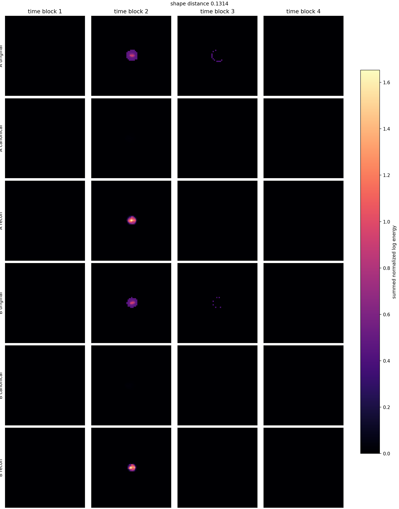
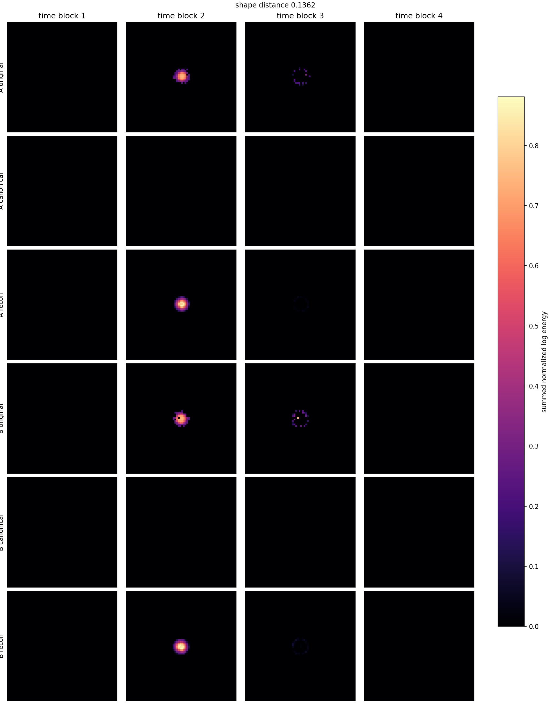
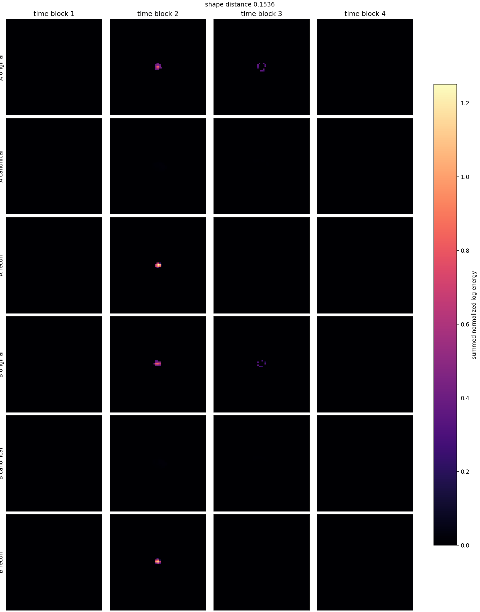
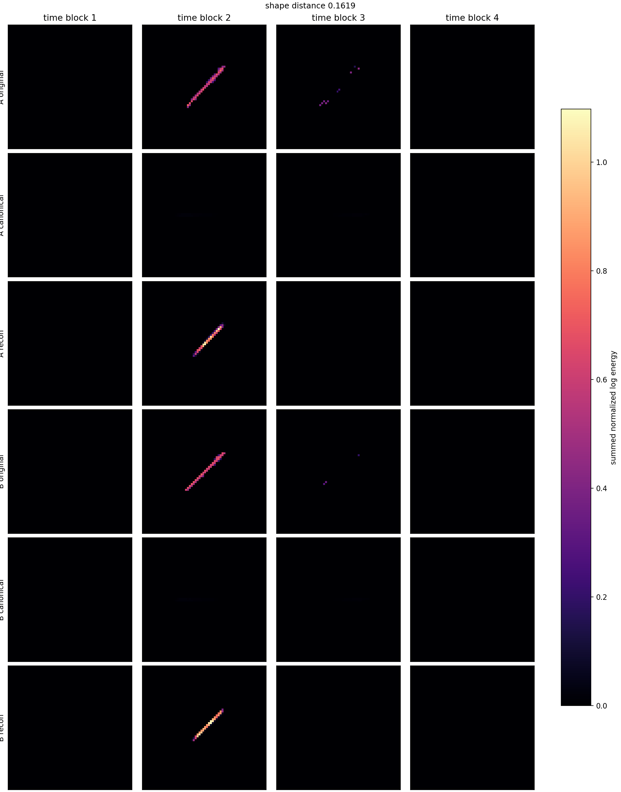

# Phase 2 Canonical Latent Pair Gallery

Checkpoint: `local_data/experiments/phase2_canonical_voxel_ae_v002/runs/canonical_transform_voxel_z8_t7/checkpoint.pt`

| pair | shape dist | d theta_xy | d theta_time | hits A/B | image |
|---:|---:|---:|---:|---:|---|
| 1 | 0.1314 | 0.028 | 0.108 | 82/65 | [png](../../../assets/phase2_canonical_voxel_ae/pairs_v002/canonical_latent_pair_01.png) |
| 2 | 0.1362 | 0.350 | 0.031 | 80/85 | [png](../../../assets/phase2_canonical_voxel_ae/pairs_v002/canonical_latent_pair_02.png) |
| 3 | 0.1457 | 0.302 | 0.032 | 41/32 | [png](../../../assets/phase2_canonical_voxel_ae/pairs_v002/canonical_latent_pair_03.png) |
| 4 | 0.1474 | 0.553 | 0.057 | 28/21 | [png](../../../assets/phase2_canonical_voxel_ae/pairs_v002/canonical_latent_pair_04.png) |
| 5 | 0.1490 | 0.049 | 0.112 | 41/37 | [png](../../../assets/phase2_canonical_voxel_ae/pairs_v002/canonical_latent_pair_05.png) |
| 6 | 0.1493 | 0.169 | 0.115 | 43/38 | [png](../../../assets/phase2_canonical_voxel_ae/pairs_v002/canonical_latent_pair_06.png) |
| 7 | 0.1536 | 0.358 | 0.044 | 29/23 | [png](../../../assets/phase2_canonical_voxel_ae/pairs_v002/canonical_latent_pair_07.png) |
| 8 | 0.1560 | 0.310 | 0.060 | 20/20 | [png](../../../assets/phase2_canonical_voxel_ae/pairs_v002/canonical_latent_pair_08.png) |
| 9 | 0.1588 | 0.070 | 0.102 | 69/58 | [png](../../../assets/phase2_canonical_voxel_ae/pairs_v002/canonical_latent_pair_09.png) |
| 10 | 0.1619 | 0.023 | 0.118 | 61/50 | [png](../../../assets/phase2_canonical_voxel_ae/pairs_v002/canonical_latent_pair_10.png) |
| 11 | 0.1676 | 0.009 | 0.141 | 52/50 | [png](../../../assets/phase2_canonical_voxel_ae/pairs_v002/canonical_latent_pair_11.png) |
| 12 | 0.1686 | 0.013 | 0.112 | 41/43 | [png](../../../assets/phase2_canonical_voxel_ae/pairs_v002/canonical_latent_pair_12.png) |

## Pair 1

- A transform: `dx_norm=0.00652, dy_norm=0.00591, dt_norm=-0.363, theta_xy=-3.04, theta_time_tilt=-0.164, scale_xyz=0.685, energy_scale=35.8`
- B transform: `dx_norm=0.0103, dy_norm=0.00105, dt_norm=-0.391, theta_xy=-3.01, theta_time_tilt=-0.272, scale_xyz=0.621, energy_scale=29.4`

## Pair 2

- A transform: `dx_norm=0.00848, dy_norm=0.0118, dt_norm=-0.0271, theta_xy=-2.62, theta_time_tilt=0.00484, scale_xyz=0.392, energy_scale=29`
- B transform: `dx_norm=-0.00293, dy_norm=-0.0127, dt_norm=-0.0252, theta_xy=-2.27, theta_time_tilt=-0.0265, scale_xyz=0.409, energy_scale=32.4`

## Pair 3

- A transform: `dx_norm=0.0221, dy_norm=0.0149, dt_norm=-0.269, theta_xy=-2.9, theta_time_tilt=0.805, scale_xyz=0.494, energy_scale=12.4`
- B transform: `dx_norm=0.0107, dy_norm=0.0233, dt_norm=-0.284, theta_xy=-2.6, theta_time_tilt=0.837, scale_xyz=0.446, energy_scale=11.7`

## Pair 4

- A transform: `dx_norm=0.0038, dy_norm=-0.00411, dt_norm=-0.184, theta_xy=-2.31, theta_time_tilt=0.636, scale_xyz=0.376, energy_scale=10.8`
- B transform: `dx_norm=-0.0023, dy_norm=0.0196, dt_norm=-0.138, theta_xy=-2.86, theta_time_tilt=0.579, scale_xyz=0.359, energy_scale=9.11`

## Pair 5

- A transform: `dx_norm=0.0255, dy_norm=0.0277, dt_norm=-0.0648, theta_xy=-2.31, theta_time_tilt=0.328, scale_xyz=0.652, energy_scale=21`
- B transform: `dx_norm=0.02, dy_norm=0.0355, dt_norm=-0.0931, theta_xy=-2.36, theta_time_tilt=0.216, scale_xyz=0.654, energy_scale=20.9`

## Pair 6

- A transform: `dx_norm=0.0138, dy_norm=-0.0145, dt_norm=-0.297, theta_xy=-2.79, theta_time_tilt=0.547, scale_xyz=0.513, energy_scale=17.1`
- B transform: `dx_norm=0.01, dy_norm=0.0142, dt_norm=-0.285, theta_xy=-2.96, theta_time_tilt=0.662, scale_xyz=0.486, energy_scale=14.3`

## Pair 7

- A transform: `dx_norm=0.00411, dy_norm=0.00674, dt_norm=-0.165, theta_xy=-2.35, theta_time_tilt=0.378, scale_xyz=0.37, energy_scale=9.88`
- B transform: `dx_norm=-0.00617, dy_norm=0.0243, dt_norm=-0.162, theta_xy=-2.71, theta_time_tilt=0.422, scale_xyz=0.363, energy_scale=8.48`

## Pair 8

- A transform: `dx_norm=-0.00869, dy_norm=0.000291, dt_norm=-0.207, theta_xy=-2.48, theta_time_tilt=0.431, scale_xyz=0.383, energy_scale=9.43`
- B transform: `dx_norm=-0.00241, dy_norm=0.022, dt_norm=-0.123, theta_xy=-2.79, theta_time_tilt=0.371, scale_xyz=0.357, energy_scale=7.96`

## Pair 9

- A transform: `dx_norm=0.0429, dy_norm=0.0594, dt_norm=-0.119, theta_xy=-2.39, theta_time_tilt=0.199, scale_xyz=0.744, energy_scale=29.7`
- B transform: `dx_norm=0.053, dy_norm=0.0504, dt_norm=-0.126, theta_xy=-2.33, theta_time_tilt=0.302, scale_xyz=0.731, energy_scale=28.7`

## Pair 10

- A transform: `dx_norm=0.0729, dy_norm=0.0611, dt_norm=-0.092, theta_xy=-2.34, theta_time_tilt=0.272, scale_xyz=0.714, energy_scale=25.8`
- B transform: `dx_norm=0.06, dy_norm=0.0425, dt_norm=-0.151, theta_xy=-2.36, theta_time_tilt=0.155, scale_xyz=0.712, energy_scale=27`

## Pair 11

- A transform: `dx_norm=0.0258, dy_norm=0.000745, dt_norm=-0.0806, theta_xy=-2.32, theta_time_tilt=0.154, scale_xyz=0.719, energy_scale=27.7`
- B transform: `dx_norm=0.0226, dy_norm=0.0235, dt_norm=-0.0648, theta_xy=-2.33, theta_time_tilt=0.295, scale_xyz=0.677, energy_scale=25`

## Pair 12

- A transform: `dx_norm=0.0284, dy_norm=0.0457, dt_norm=-0.0853, theta_xy=-2.35, theta_time_tilt=0.181, scale_xyz=0.687, energy_scale=23.6`
- B transform: `dx_norm=0.0258, dy_norm=0.0123, dt_norm=-0.0635, theta_xy=-2.36, theta_time_tilt=0.293, scale_xyz=0.681, energy_scale=23.5`