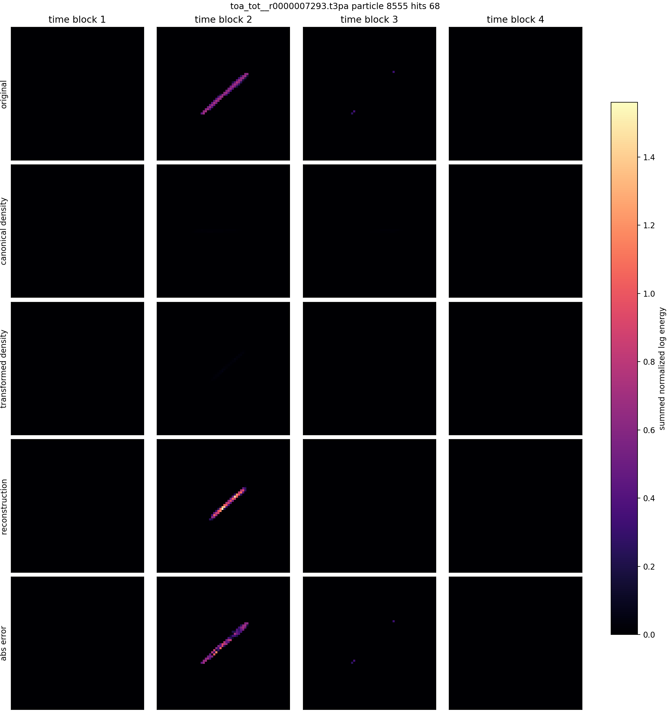
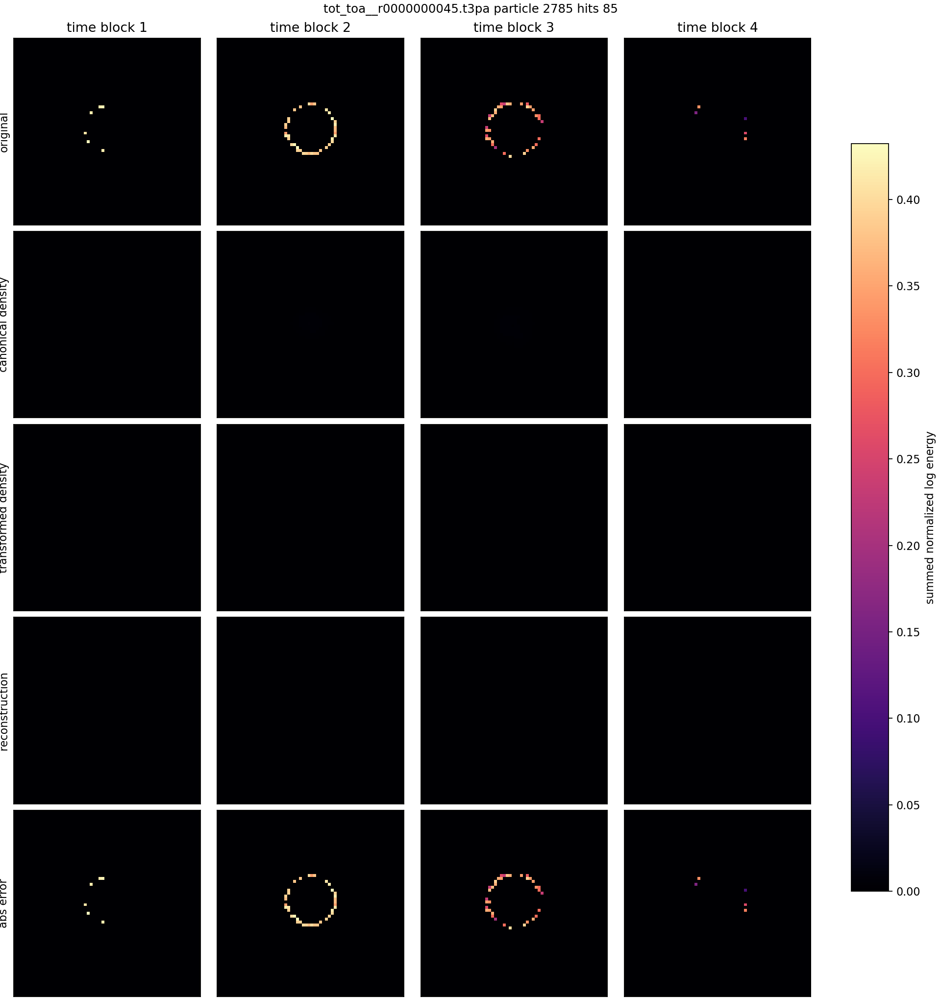
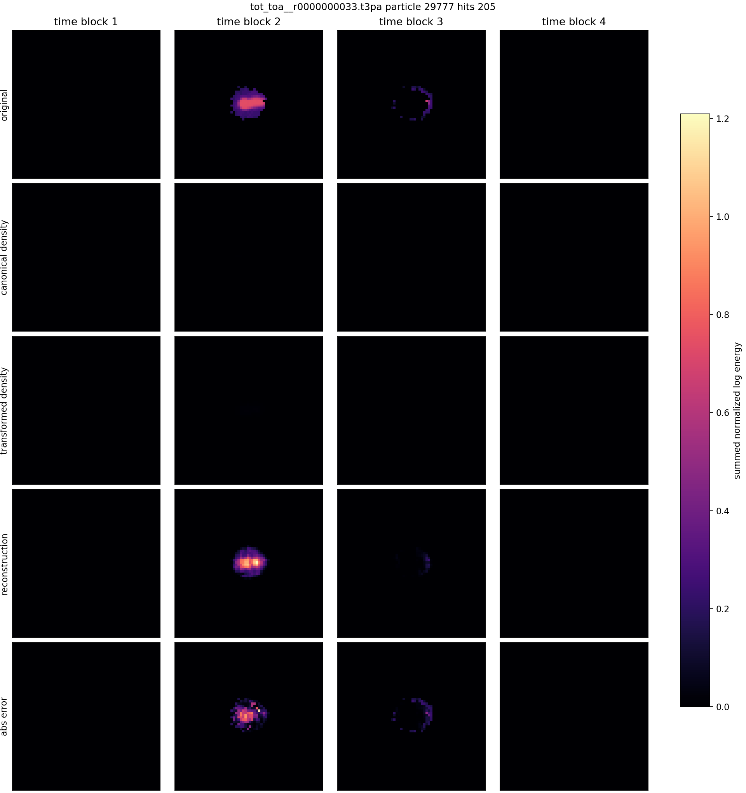
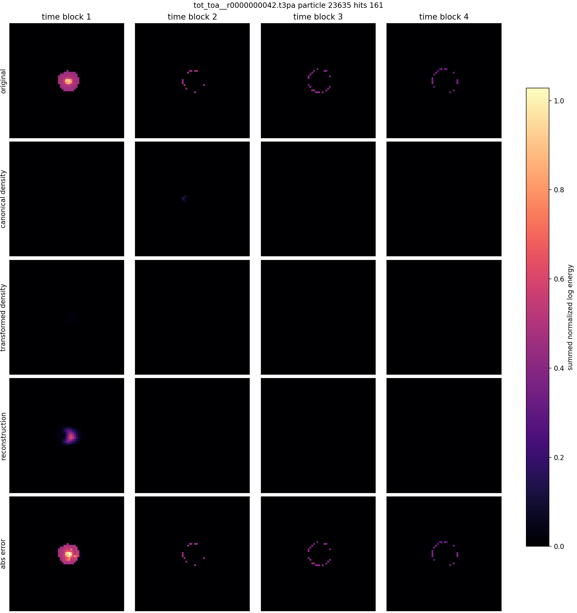
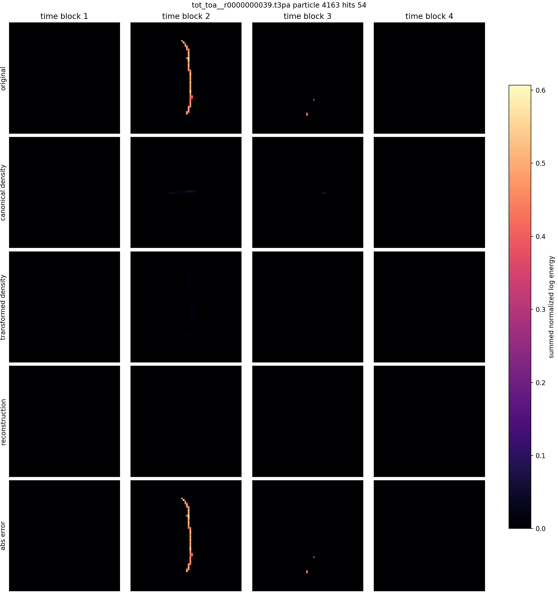

# Phase 2 Canonical Transform Voxel AE Gallery

Checkpoint: `local_data/experiments/phase2_canonical_voxel_ae_v002/runs/canonical_transform_voxel_z8_t7/checkpoint.pt`

| # | source | particle | hits | energy target/recon | transform | image |
|---:|---|---:|---:|---:|---|---|
| 1 | `F08/tot_toa__r0000000033.t3pa` | 27933 | 74 | 33.400/32.759 | `dx_norm=-0.067, dy_norm=0.00865, dt_norm=-0.0691, theta_xy=-2.97, theta_time_tilt=1.04, scale_xyz=0.454, energy_scale=32.8` | [png](../../../assets/phase2_canonical_voxel_ae/gallery_v002/canonical_voxel_example_01.png) |
| 2 | `F08/tot_toa__r0000000033.t3pa` | 6454 | 50 | 20.271/18.952 | `dx_norm=-0.0173, dy_norm=0.0359, dt_norm=-0.0645, theta_xy=-2.09, theta_time_tilt=0.204, scale_xyz=0.437, energy_scale=19` | [png](../../../assets/phase2_canonical_voxel_ae/gallery_v002/canonical_voxel_example_02.png) |
| 3 | `08_thu_proton_daily_batch/toa_tot__r0000007293.t3pa` | 8555 | 68 | 34.430/34.736 | `dx_norm=0.0682, dy_norm=0.0405, dt_norm=-0.239, theta_xy=-2.43, theta_time_tilt=0.254, scale_xyz=0.758, energy_scale=34.7` | [png](../../../assets/phase2_canonical_voxel_ae/gallery_v002/canonical_voxel_example_03.png) |
| 4 | `D05/tot_toa__r0000000039.t3pa` | 22215 | 56 | 24.129/17.961 | `dx_norm=0.0171, dy_norm=0.00465, dt_norm=-0.438, theta_xy=-2.85, theta_time_tilt=-0.968, scale_xyz=0.751, energy_scale=18` | [png](../../../assets/phase2_canonical_voxel_ae/gallery_v002/canonical_voxel_example_04.png) |
| 5 | `08_thu_proton_daily_batch/toa_tot__r0000007293.t3pa` | 7091 | 57 | 29.908/28.281 | `dx_norm=0.0194, dy_norm=0.0132, dt_norm=-0.0288, theta_xy=-2.39, theta_time_tilt=0.229, scale_xyz=0.699, energy_scale=28.3` | [png](../../../assets/phase2_canonical_voxel_ae/gallery_v002/canonical_voxel_example_05.png) |
| 6 | `F08/tot_toa__r0000000033.t3pa` | 18882 | 136 | 53.553/52.472 | `dx_norm=0.03, dy_norm=0.0196, dt_norm=-0.0665, theta_xy=-2.71, theta_time_tilt=0.85, scale_xyz=0.527, energy_scale=52.5` | [png](../../../assets/phase2_canonical_voxel_ae/gallery_v002/canonical_voxel_example_06.png) |
| 7 | `F08/tot_toa__r0000000033.t3pa` | 41126 | 55 | 26.329/25.979 | `dx_norm=-0.0113, dy_norm=0.0162, dt_norm=-0.0682, theta_xy=-3.08, theta_time_tilt=1.04, scale_xyz=0.439, energy_scale=26` | [png](../../../assets/phase2_canonical_voxel_ae/gallery_v002/canonical_voxel_example_07.png) |
| 8 | `D05/tot_toa__r0000000045.t3pa` | 2785 | 85 | 30.218/0.000 | `dx_norm=-0.00792, dy_norm=-0.00343, dt_norm=-0.00075, theta_xy=-2.05, theta_time_tilt=-0.0817, scale_xyz=1.69, energy_scale=1e-08` | [png](../../../assets/phase2_canonical_voxel_ae/gallery_v002/canonical_voxel_example_08.png) |
| 9 | `F08/tot_toa__r0000000033.t3pa` | 29777 | 205 | 72.712/71.341 | `dx_norm=0.0212, dy_norm=0.011, dt_norm=-0.0484, theta_xy=-3.05, theta_time_tilt=0.397, scale_xyz=0.608, energy_scale=71.3` | [png](../../../assets/phase2_canonical_voxel_ae/gallery_v002/canonical_voxel_example_09.png) |
| 10 | `D05/tot_toa__r0000000042.t3pa` | 23635 | 161 | 76.315/20.937 | `dx_norm=0.0377, dy_norm=-0.00681, dt_norm=-0.449, theta_xy=-3.14, theta_time_tilt=-0.931, scale_xyz=2.06, energy_scale=20.9` | [png](../../../assets/phase2_canonical_voxel_ae/gallery_v002/canonical_voxel_example_10.png) |
| 11 | `D05/tot_toa__r0000000039.t3pa` | 4163 | 54 | 25.523/0.000 | `dx_norm=0.081, dy_norm=-0.00492, dt_norm=-0.17, theta_xy=-1.57, theta_time_tilt=0.225, scale_xyz=1.82, energy_scale=9.41e-05` | [png](../../../assets/phase2_canonical_voxel_ae/gallery_v002/canonical_voxel_example_11.png) |
| 12 | `08_thu_proton_daily_batch/toa_tot__r0000007293.t3pa` | 1309 | 71 | 34.787/32.682 | `dx_norm=0.0676, dy_norm=0.0485, dt_norm=-0.101, theta_xy=-2.34, theta_time_tilt=0.217, scale_xyz=0.742, energy_scale=32.7` | [png](../../../assets/phase2_canonical_voxel_ae/gallery_v002/canonical_voxel_example_12.png) |

## Example 1

## Example 2

## Example 3

## Example 4

## Example 5

## Example 6

## Example 7

## Example 8

## Example 9

## Example 10

## Example 11

## Example 12

