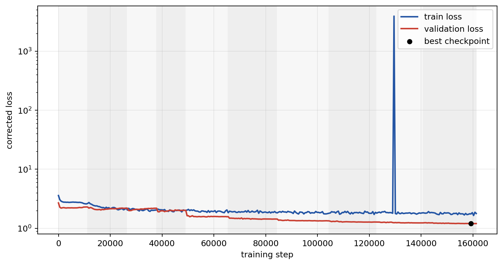
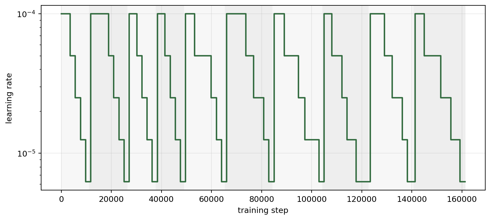
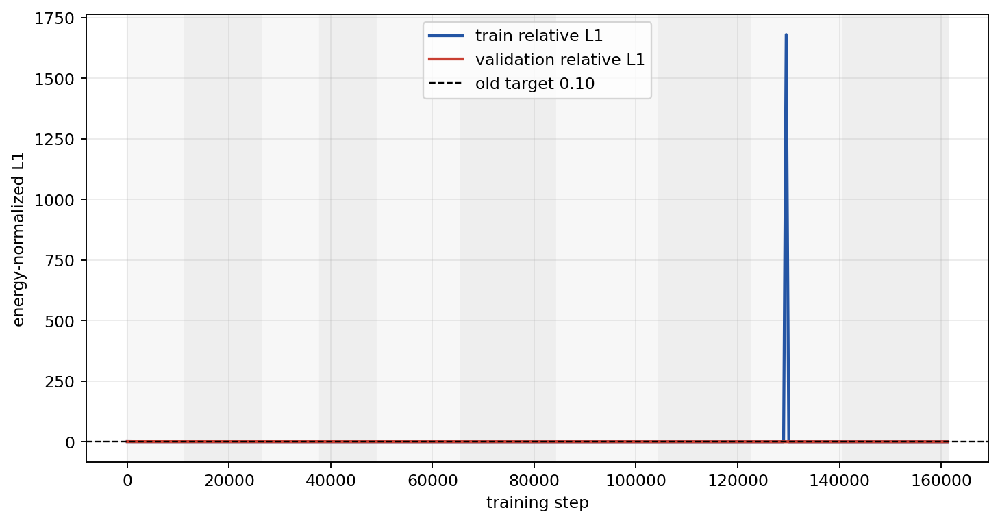
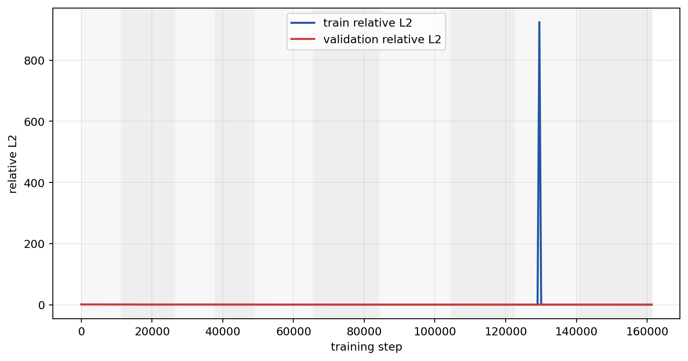
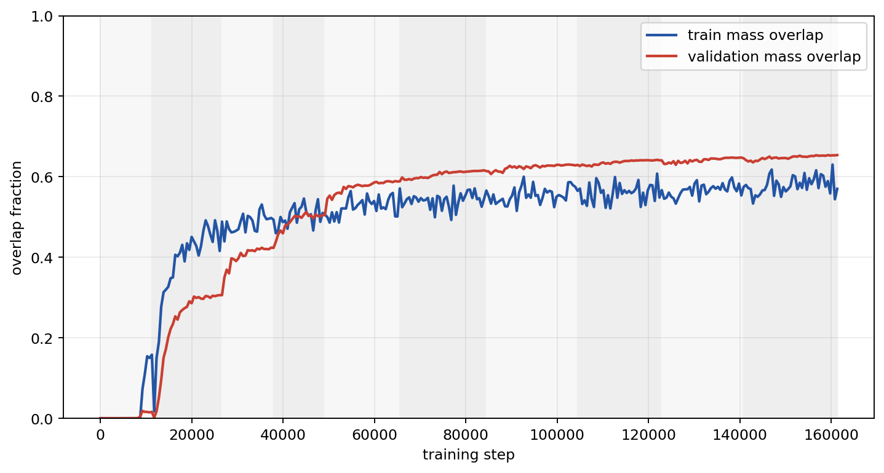
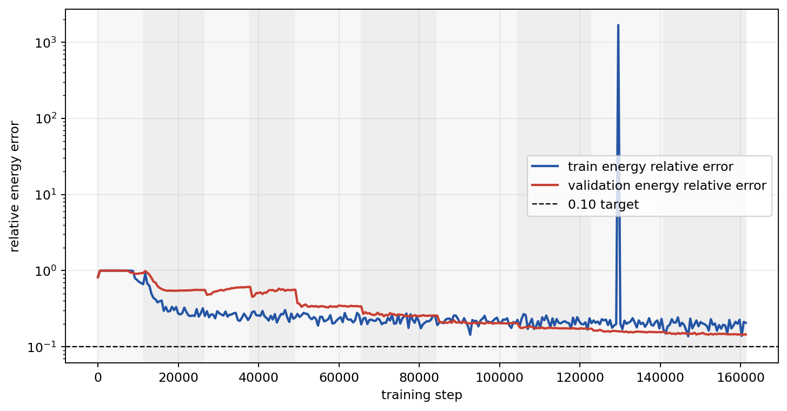
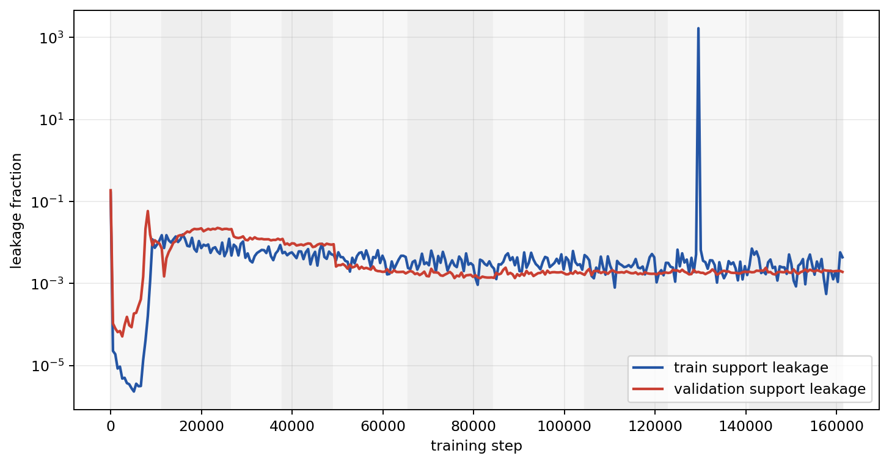
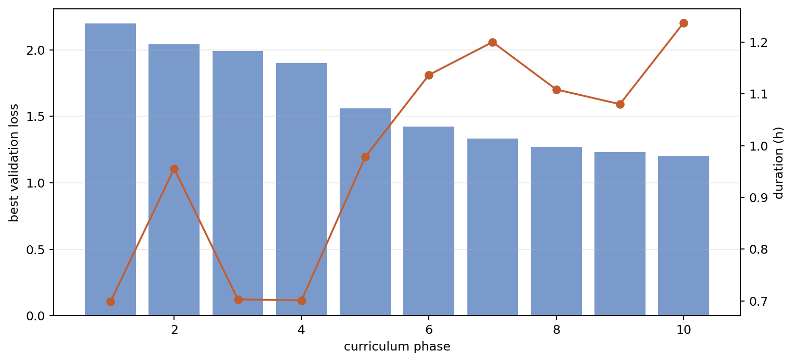

# Phase 2 Canonical Voxel AE Training Convergence

This report is regenerated from the corrected `v002` run. The checkpoint was selected with sparse-particle metrics, not dense full-volume mean L1/MSE.

Run directory: `local_data/experiments/phase2_canonical_voxel_ae_v002/runs/canonical_transform_voxel_z8_t7`
Checkpoint: `local_data/experiments/phase2_canonical_voxel_ae_v002/runs/canonical_transform_voxel_z8_t7/checkpoint.pt`

## Summary

| item | value |
|---|---:|
| total duration | 9.80 h |
| completed phases | 10 / 10 |
| final step | 161,280 |
| best checkpoint step | 159,232 |
| best validation loss | 1.201710 |
| test relative L1 | 0.610515 |
| test relative L2 | 0.545904 |
| test mass overlap | 0.650727 |
| test energy relative error | 0.134370 |

## Plots

### Corrected Loss Convergence

### Learning-Rate Schedule

### Energy-Normalized Relative L1

### Relative L2

### Mass Overlap

### Energy Relative Error

### Support Leakage

### Best Validation Loss And Phase Duration

## Stage Summary

| phase | steps | best step | best val loss | stop reason | final LR | blur mix | noise std | dropout | duration |
|---:|---:|---:|---:|---|---:|---:|---:|---:|---:|
| 1 | 11,264 | 1,024 | 2.199622 | lr_below_5e-06 | 3.13e-06 | 1.0000 | 0.04000 | 0.08000 | 0.70 h |
| 2 | 15,360 | 16,384 | 2.044052 | lr_below_5e-06 | 3.13e-06 | 0.7743 | 0.03097 | 0.06194 | 0.96 h |
| 3 | 11,264 | 27,648 | 1.993598 | lr_below_5e-06 | 3.13e-06 | 0.5995 | 0.02398 | 0.04796 | 0.70 h |
| 4 | 11,264 | 38,912 | 1.902655 | lr_below_5e-06 | 3.13e-06 | 0.4642 | 0.01857 | 0.03713 | 0.70 h |
| 5 | 16,384 | 57,344 | 1.562337 | lr_below_5e-06 | 3.13e-06 | 0.3594 | 0.01438 | 0.02875 | 0.98 h |
| 6 | 18,944 | 78,336 | 1.423740 | lr_below_5e-06 | 3.13e-06 | 0.2783 | 0.01113 | 0.02226 | 1.14 h |
| 7 | 19,968 | 100,352 | 1.334467 | lr_below_5e-06 | 3.13e-06 | 0.2154 | 0.00862 | 0.01724 | 1.20 h |
| 8 | 18,432 | 120,832 | 1.271742 | lr_below_5e-06 | 3.13e-06 | 0.1668 | 0.00667 | 0.01334 | 1.11 h |
| 9 | 17,920 | 138,752 | 1.232364 | lr_below_5e-06 | 3.13e-06 | 0.1292 | 0.00517 | 0.01033 | 1.08 h |
| 10 | 20,480 | 159,232 | 1.201710 | lr_below_5e-06 | 3.13e-06 | 0.1000 | 0.00400 | 0.00800 | 1.24 h |

## Test Metrics

| metric | value |
|---|---:|
| corrected loss | 1.20416226 |
| relative L1 | 0.61051522 |
| relative L2 | 0.54590440 |
| mass overlap | 0.65072746 |
| energy relative error | 0.13436965 |
| support leakage | 0.00194945 |
| canonical density L1 | 1.02074389 |
| scale relative error | 0.16177765 |
| shift MSE | 0.00063642 |
| theta XY loss | 0.33856637 |
| theta-time loss | 0.23180672 |

## Interpretation

The corrected run no longer hides shape errors behind empty voxels. It improves mass overlap from roughly `0.11` in the failed `v001` checkpoint to about `0.65` on the test split. That is a real improvement, but it is still not near-perfect reconstruction. The galleries should be treated as the deciding evidence for whether this voxel AE is useful for phase 2, not just the scalar loss.
