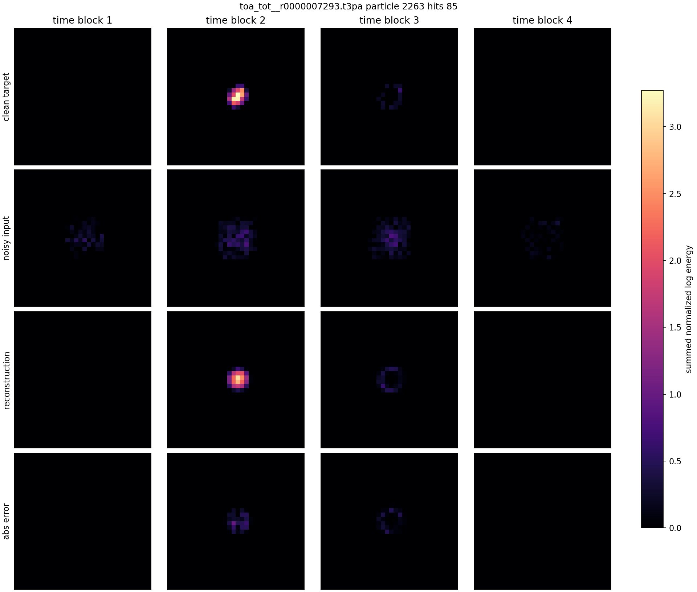
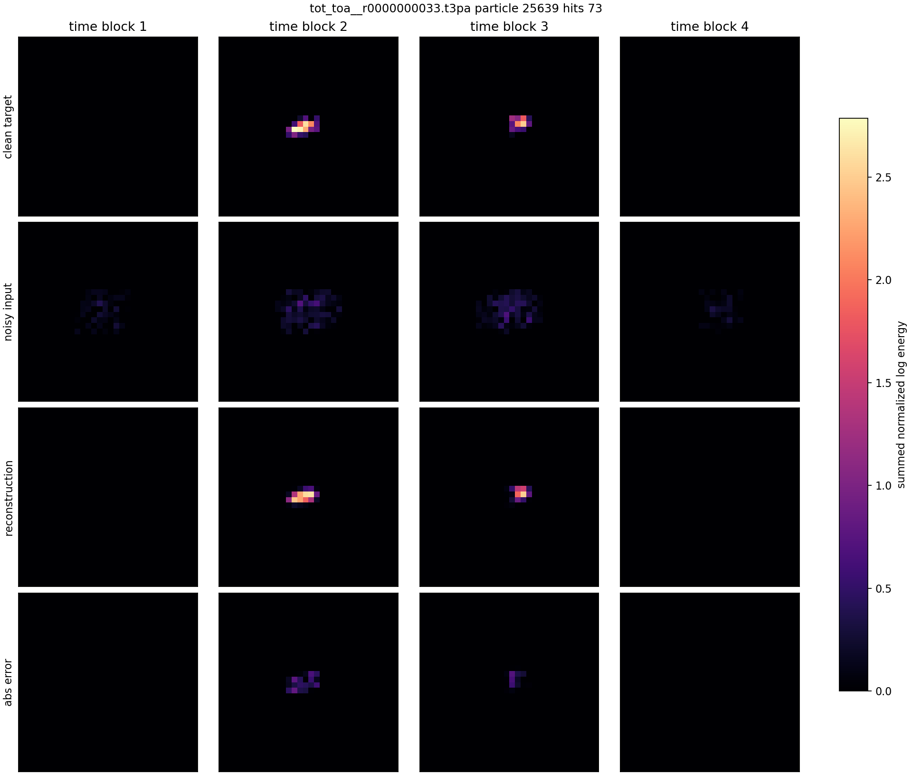
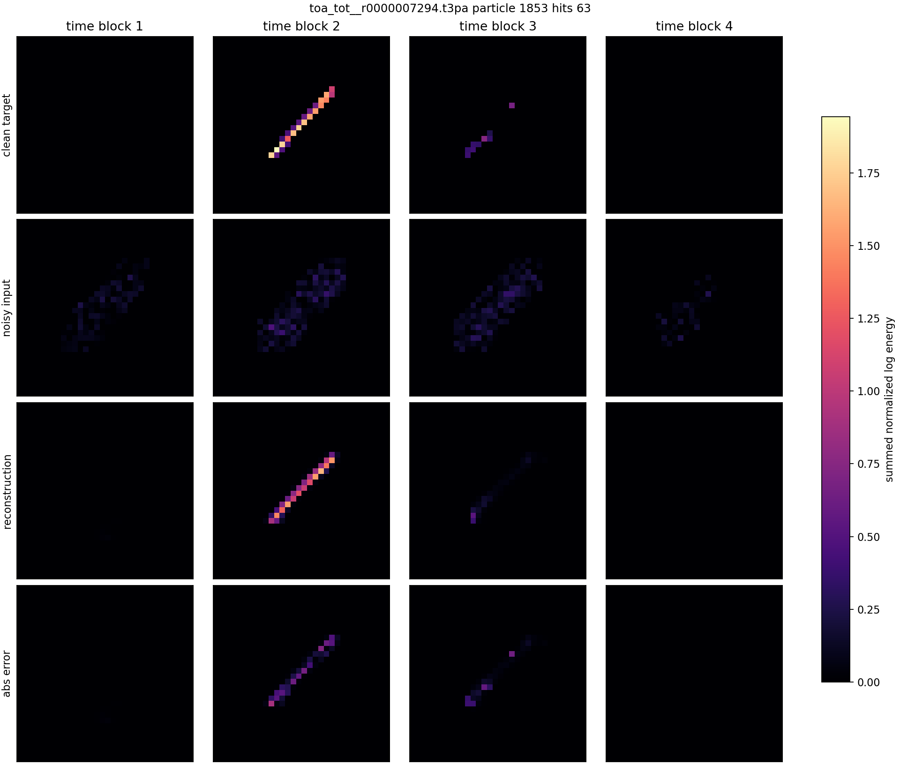
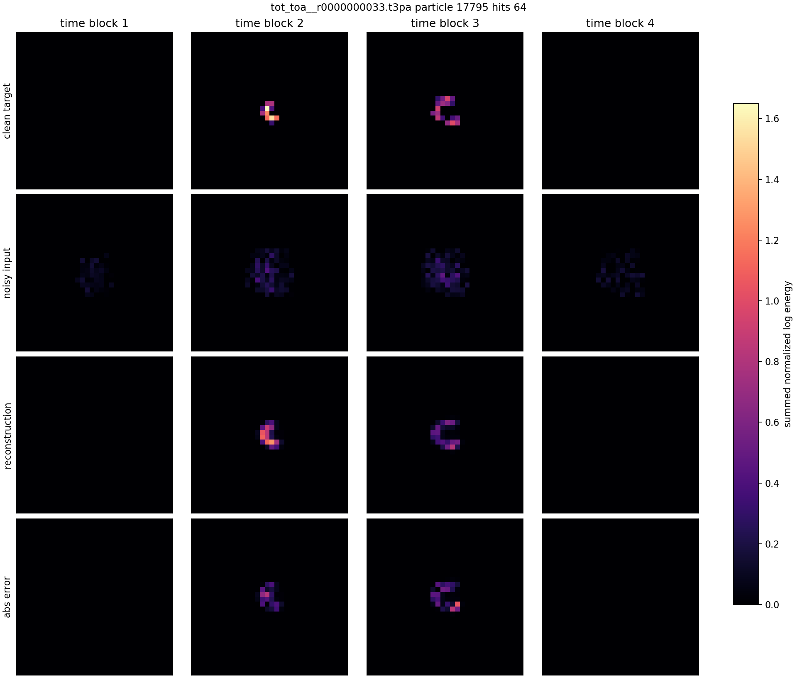

# Compressed GPU-Cached Plain L2 Gallery

Model input is the fixed high-corruption tensor used during training.

| # | source | particle | hits | energy clean/noisy/recon | relative L2 clean | image |
|---:|---|---:|---:|---:|---:|---|
| 1 | `08_thu_proton_daily_batch/toa_tot__r0000007293.t3pa` | 11013 | 92 | 43.872/53.970/44.188 | 0.2979 | [png](../../../assets/phase2_compressed_gpu_cached_plain_l2/gallery_v001/compressed_gpu_cached_example_01.png) |
| 2 | `08_thu_proton_daily_batch/toa_tot__r0000007293.t3pa` | 3286 | 69 | 34.653/48.970/33.219 | 0.2152 | [png](../../../assets/phase2_compressed_gpu_cached_plain_l2/gallery_v001/compressed_gpu_cached_example_02.png) |
| 3 | `08_thu_proton_daily_batch/toa_tot__r0000007293.t3pa` | 2263 | 85 | 38.383/52.697/42.250 | 0.2699 | [png](../../../assets/phase2_compressed_gpu_cached_plain_l2/gallery_v001/compressed_gpu_cached_example_03.png) |
| 4 | `D05/tot_toa__r0000000039.t3pa` | 27935 | 88 | 43.850/51.534/42.062 | 0.5622 | [png](../../../assets/phase2_compressed_gpu_cached_plain_l2/gallery_v001/compressed_gpu_cached_example_04.png) |
| 5 | `F08/tot_toa__r0000000033.t3pa` | 25639 | 73 | 35.170/40.157/32.469 | 0.3019 | [png](../../../assets/phase2_compressed_gpu_cached_plain_l2/gallery_v001/compressed_gpu_cached_example_05.png) |
| 6 | `F08/tot_toa__r0000000033.t3pa` | 12240 | 83 | 38.344/49.909/41.031 | 0.4129 | [png](../../../assets/phase2_compressed_gpu_cached_plain_l2/gallery_v001/compressed_gpu_cached_example_06.png) |
| 7 | `08_thu_proton_daily_batch/toa_tot__r0000007294.t3pa` | 1853 | 63 | 32.246/43.174/30.656 | 0.3977 | [png](../../../assets/phase2_compressed_gpu_cached_plain_l2/gallery_v001/compressed_gpu_cached_example_07.png) |
| 8 | `F08/tot_toa__r0000000033.t3pa` | 17795 | 64 | 21.320/27.926/21.016 | 0.5728 | [png](../../../assets/phase2_compressed_gpu_cached_plain_l2/gallery_v001/compressed_gpu_cached_example_08.png) |
| 9 | `08_thu_proton_daily_batch/toa_tot__r0000007293.t3pa` | 2697 | 64 | 29.526/39.147/29.734 | 0.2318 | [png](../../../assets/phase2_compressed_gpu_cached_plain_l2/gallery_v001/compressed_gpu_cached_example_09.png) |
| 10 | `D05/tot_toa__r0000000039.t3pa` | 9974 | 65 | 29.353/44.161/29.578 | 0.3035 | [png](../../../assets/phase2_compressed_gpu_cached_plain_l2/gallery_v001/compressed_gpu_cached_example_10.png) |

## Example 1

## Example 2

## Example 3

## Example 4

## Example 5

## Example 6

## Example 7

## Example 8

## Example 9

## Example 10

