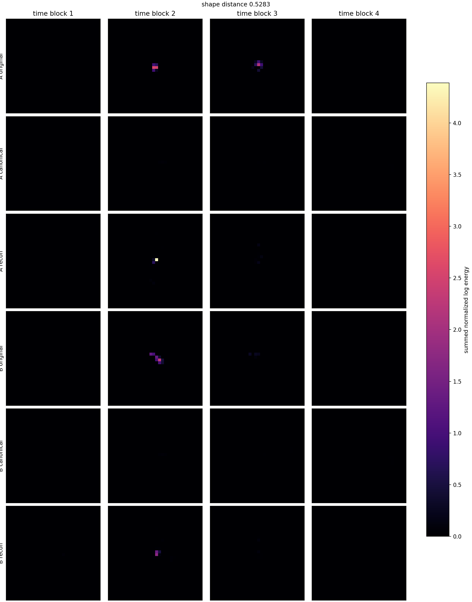
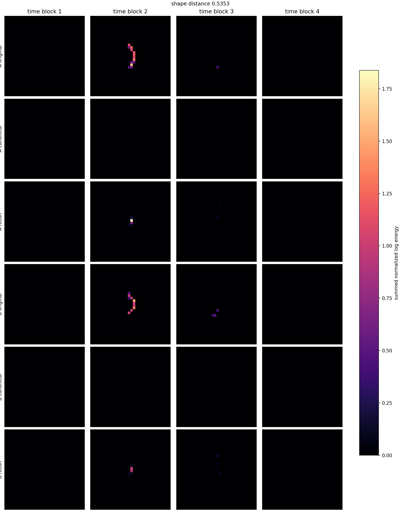
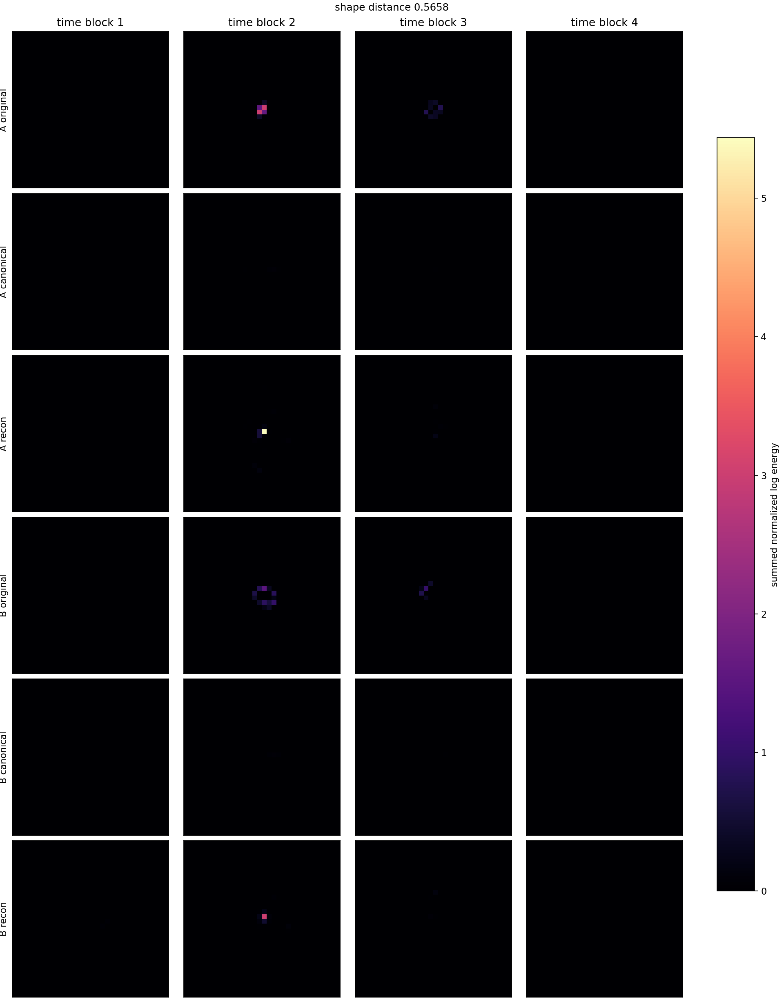
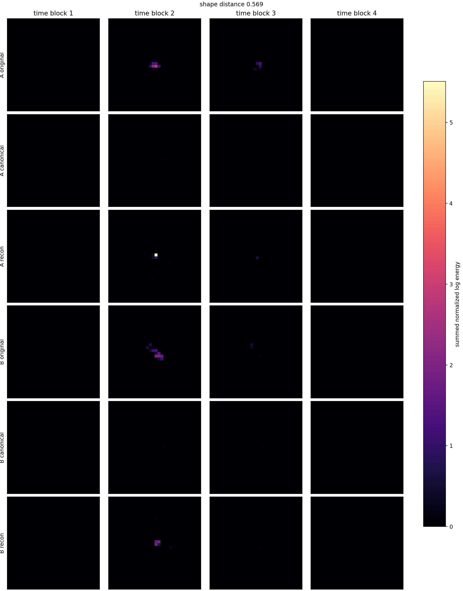
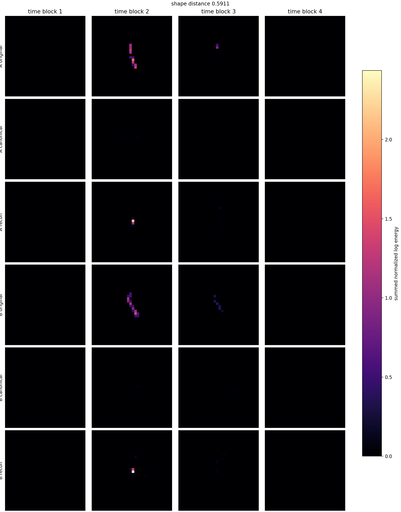

# Phase 2 Canonical Latent Pair Gallery

Checkpoint: `local_data/experiments/phase2_canonical_voxel_ae_compressed_plain_l2_gpu_cached_v001/checkpoint.pt`

| pair | shape dist | d theta_xy | d theta_time | hits A/B | image |
|---:|---:|---:|---:|---:|---|
| 1 | 0.4037 | 0.018 | 0.121 | 22/62 | [png](../../../assets/phase2_compressed_gpu_cached_plain_l2/pairs_v001/canonical_latent_pair_01.png) |
| 2 | 0.4670 | 0.019 | 0.105 | 32/37 | [png](../../../assets/phase2_compressed_gpu_cached_plain_l2/pairs_v001/canonical_latent_pair_02.png) |
| 3 | 0.5222 | 0.024 | 0.100 | 30/33 | [png](../../../assets/phase2_compressed_gpu_cached_plain_l2/pairs_v001/canonical_latent_pair_03.png) |
| 4 | 0.5283 | 0.001 | 0.104 | 30/23 | [png](../../../assets/phase2_compressed_gpu_cached_plain_l2/pairs_v001/canonical_latent_pair_04.png) |
| 5 | 0.5353 | 0.054 | 0.127 | 23/23 | [png](../../../assets/phase2_compressed_gpu_cached_plain_l2/pairs_v001/canonical_latent_pair_05.png) |
| 6 | 0.5359 | 0.040 | 0.106 | 39/27 | [png](../../../assets/phase2_compressed_gpu_cached_plain_l2/pairs_v001/canonical_latent_pair_06.png) |
| 7 | 0.5421 | 0.051 | 0.106 | 34/31 | [png](../../../assets/phase2_compressed_gpu_cached_plain_l2/pairs_v001/canonical_latent_pair_07.png) |
| 8 | 0.5658 | 0.016 | 0.104 | 27/37 | [png](../../../assets/phase2_compressed_gpu_cached_plain_l2/pairs_v001/canonical_latent_pair_08.png) |
| 9 | 0.5689 | 0.055 | 0.111 | 41/29 | [png](../../../assets/phase2_compressed_gpu_cached_plain_l2/pairs_v001/canonical_latent_pair_09.png) |
| 10 | 0.5690 | 0.057 | 0.102 | 30/26 | [png](../../../assets/phase2_compressed_gpu_cached_plain_l2/pairs_v001/canonical_latent_pair_10.png) |
| 11 | 0.5850 | 0.016 | 0.101 | 52/36 | [png](../../../assets/phase2_compressed_gpu_cached_plain_l2/pairs_v001/canonical_latent_pair_11.png) |
| 12 | 0.5911 | 0.032 | 0.103 | 23/29 | [png](../../../assets/phase2_compressed_gpu_cached_plain_l2/pairs_v001/canonical_latent_pair_12.png) |

## Pair 1

- A transform: `dx_norm=0.0517, dy_norm=0.0867, dt_norm=-0.168, theta_xy=-2.31, theta_time_tilt=-0.642, scale_xyz=0.361, energy_scale=7.14`
- B transform: `dx_norm=0.0371, dy_norm=0.102, dt_norm=-0.156, theta_xy=-2.33, theta_time_tilt=-0.763, scale_xyz=0.366, energy_scale=15.2`

## Pair 2

- A transform: `dx_norm=0.0657, dy_norm=0.0737, dt_norm=-0.175, theta_xy=-2.33, theta_time_tilt=-0.636, scale_xyz=0.366, energy_scale=9.23`
- B transform: `dx_norm=0.0557, dy_norm=0.0799, dt_norm=-0.167, theta_xy=-2.32, theta_time_tilt=-0.741, scale_xyz=0.364, energy_scale=11.5`

## Pair 3

- A transform: `dx_norm=0.0731, dy_norm=0.0916, dt_norm=-0.163, theta_xy=-2.29, theta_time_tilt=-0.769, scale_xyz=0.363, energy_scale=8.81`
- B transform: `dx_norm=0.0736, dy_norm=0.0652, dt_norm=-0.188, theta_xy=-2.27, theta_time_tilt=-0.668, scale_xyz=0.363, energy_scale=8.58`

## Pair 4

- A transform: `dx_norm=0.0611, dy_norm=0.0913, dt_norm=-0.141, theta_xy=-2.29, theta_time_tilt=-0.757, scale_xyz=0.36, energy_scale=6.9`
- B transform: `dx_norm=0.083, dy_norm=0.068, dt_norm=-0.164, theta_xy=-2.29, theta_time_tilt=-0.653, scale_xyz=0.36, energy_scale=4.91`

## Pair 5

- A transform: `dx_norm=0.0732, dy_norm=0.0859, dt_norm=-0.149, theta_xy=-2.18, theta_time_tilt=-0.639, scale_xyz=0.36, energy_scale=3.95`
- B transform: `dx_norm=0.0755, dy_norm=0.0799, dt_norm=-0.158, theta_xy=-2.13, theta_time_tilt=-0.766, scale_xyz=0.362, energy_scale=3.55`

## Pair 6

- A transform: `dx_norm=0.0906, dy_norm=0.0948, dt_norm=-0.16, theta_xy=-2.32, theta_time_tilt=-0.758, scale_xyz=0.364, energy_scale=16.1`
- B transform: `dx_norm=0.0826, dy_norm=0.0652, dt_norm=-0.171, theta_xy=-2.28, theta_time_tilt=-0.651, scale_xyz=0.362, energy_scale=11.5`

## Pair 7

- A transform: `dx_norm=0.0547, dy_norm=0.0496, dt_norm=-0.167, theta_xy=-2.38, theta_time_tilt=-0.65, scale_xyz=0.366, energy_scale=3.01`
- B transform: `dx_norm=0.0524, dy_norm=0.0878, dt_norm=-0.145, theta_xy=-2.32, theta_time_tilt=-0.756, scale_xyz=0.36, energy_scale=4.61`

## Pair 8

- A transform: `dx_norm=0.0646, dy_norm=0.101, dt_norm=-0.142, theta_xy=-2.29, theta_time_tilt=-0.768, scale_xyz=0.361, energy_scale=8.49`
- B transform: `dx_norm=0.0603, dy_norm=0.0665, dt_norm=-0.182, theta_xy=-2.28, theta_time_tilt=-0.664, scale_xyz=0.364, energy_scale=5.3`

## Pair 9

- A transform: `dx_norm=0.115, dy_norm=0.0685, dt_norm=-0.153, theta_xy=-2.4, theta_time_tilt=-0.624, scale_xyz=0.361, energy_scale=11`
- B transform: `dx_norm=0.0942, dy_norm=0.091, dt_norm=-0.137, theta_xy=-2.34, theta_time_tilt=-0.735, scale_xyz=0.361, energy_scale=9.16`

## Pair 10

- A transform: `dx_norm=0.0763, dy_norm=0.0826, dt_norm=-0.133, theta_xy=-2.32, theta_time_tilt=-0.722, scale_xyz=0.361, energy_scale=9.43`
- B transform: `dx_norm=0.0861, dy_norm=0.0693, dt_norm=-0.164, theta_xy=-2.27, theta_time_tilt=-0.621, scale_xyz=0.359, energy_scale=8.02`

## Pair 11

- A transform: `dx_norm=0.0513, dy_norm=0.0735, dt_norm=-0.17, theta_xy=-2.2, theta_time_tilt=-0.761, scale_xyz=0.388, energy_scale=11.3`
- B transform: `dx_norm=0.0376, dy_norm=0.0781, dt_norm=-0.162, theta_xy=-2.18, theta_time_tilt=-0.861, scale_xyz=0.387, energy_scale=8.55`

## Pair 12

- A transform: `dx_norm=0.0775, dy_norm=0.0743, dt_norm=-0.157, theta_xy=-2.27, theta_time_tilt=-0.671, scale_xyz=0.36, energy_scale=4.76`
- B transform: `dx_norm=0.0688, dy_norm=0.0532, dt_norm=-0.162, theta_xy=-2.3, theta_time_tilt=-0.568, scale_xyz=0.358, energy_scale=5.73`