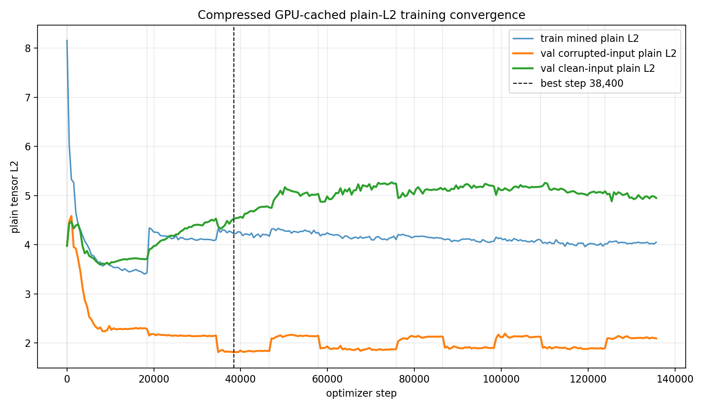
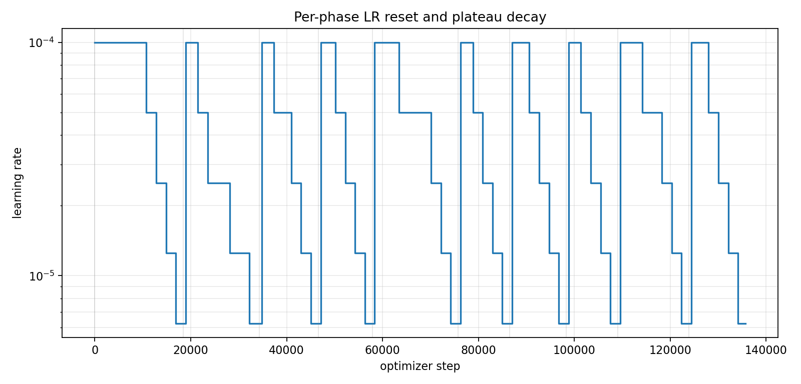
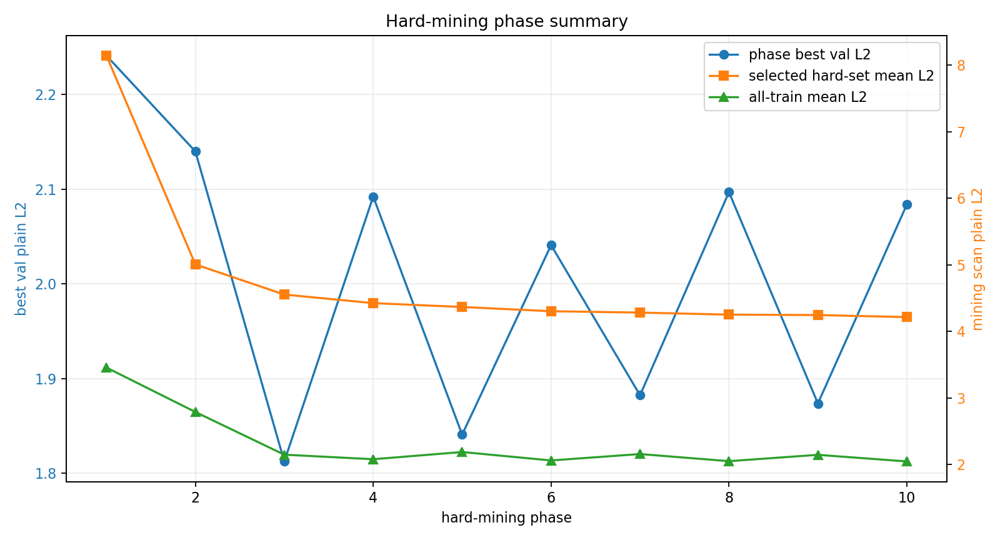

# Phase 2 Compressed GPU-Cached Plain-L2 Training Convergence

This report summarizes the completed compressed voxel AE run that kept the full representative dataset resident on the RTX 5090 as `float16` tensors and trained with plain tensor L2.

## Run

| item | value |
|---|---:|
| checkpoint | `local_data/experiments/phase2_canonical_voxel_ae_compressed_plain_l2_gpu_cached_v001/checkpoint.pt` |
| loss mode | `plain_tensor_l2` |
| grid | `8 x 32 x 32` |
| train particles | 757,765 |
| val particles | 66,022 |
| test particles | 176,213 |
| total optimizer steps | 135,680 |
| wall time | 71.4 min |
| best validation step | 38,400 |
| best validation plain L2 | 1.8124 |

## Final Test Metrics

| split input | plain L2 mean | p50 | p95 | mass overlap | energy-relative L1 |
|---|---:|---:|---:|---:|---:|
| corrupted input | 1.4501 | 1.2389 | 2.9259 | 0.5207 | 2.48e+03 |
| clean input | 2.8594 | 1.7109 | 9.2064 | 0.2103 | 3.3e+03 |

The checkpoint is selected by corrupted-validation plain L2, matching the high-corruption training input distribution. The clean-input row is diagnostic only for this run.

## Curves

## Phase Summary

| phase | steps | best step | best val L2 | final LR | min | stop |
| --- | --- | --- | --- | --- | --- | --- |
| 1 | 18,432 | 8,192 | 2.2409 | 3.13e-06 | 9.6 | lr_below_5e-06 |
| 2 | 15,872 | 32,256 | 2.1398 | 3.13e-06 | 8.3 | lr_below_5e-06 |
| 3 | 12,288 | 38,400 | 1.8124 | 3.13e-06 | 6.4 | lr_below_5e-06 |
| 4 | 11,264 | 47,616 | 2.0921 | 3.13e-06 | 5.9 | lr_below_5e-06 |
| 5 | 17,920 | 67,584 | 1.8408 | 3.13e-06 | 9.4 | lr_below_5e-06 |
| 6 | 10,752 | 76,288 | 2.0408 | 3.13e-06 | 5.6 | lr_below_5e-06 |
| 7 | 11,776 | 88,064 | 1.8823 | 3.13e-06 | 6.2 | lr_below_5e-06 |
| 8 | 10,752 | 98,816 | 2.0968 | 3.13e-06 | 5.6 | lr_below_5e-06 |
| 9 | 14,848 | 115,712 | 1.8737 | 3.13e-06 | 7.8 | lr_below_5e-06 |
| 10 | 11,776 | 125,440 | 2.0836 | 3.13e-06 | 6.2 | lr_below_5e-06 |

## Hard-Mining Summary

Each phase rescanned the full train split and selected the top 10 percent highest corrupted-input plain-L2 particles.

| phase | scanned | selected | scan s | all mean L2 | p90 L2 | selected mean L2 |
| --- | --- | --- | --- | --- | --- | --- |
| 1 | 757,765 | 75,777 | 2.41 | 3.4584 | 6.3445 | 8.1440 |
| 2 | 757,765 | 75,777 | 2.23 | 2.7911 | 4.0902 | 5.0078 |
| 3 | 757,765 | 75,777 | 2.23 | 2.1494 | 3.5582 | 4.5549 |
| 4 | 757,765 | 75,777 | 2.23 | 2.0813 | 3.3729 | 4.4260 |
| 5 | 757,765 | 75,777 | 2.23 | 2.1896 | 3.3443 | 4.3680 |
| 6 | 757,765 | 75,777 | 2.23 | 2.0629 | 3.2912 | 4.3044 |
| 7 | 757,765 | 75,777 | 2.23 | 2.1590 | 3.2900 | 4.2841 |
| 8 | 757,765 | 75,777 | 2.23 | 2.0522 | 3.2588 | 4.2532 |
| 9 | 757,765 | 75,777 | 2.23 | 2.1473 | 3.2756 | 4.2472 |
| 10 | 757,765 | 75,777 | 2.23 | 2.0481 | 3.2481 | 4.2158 |

## Notes

- The dataset stayed resident on GPU as fp16; mining scans took about `2.25` seconds for all 757,765 train particles.
- Batch size was 4096. Each phase reset LR to `1e-4` and decayed on plateau down to `<5e-6`.
- The best validation point happened in phase 3 at step 38,400; later hard-mining phases continued improving mined subsets but did not beat that validation point.
- Companion docs: [reconstruction gallery](phase2-compressed-gpu-cached-plain-l2-gallery.md) and [latent pair gallery](phase2-compressed-gpu-cached-plain-l2-pairs.md).
