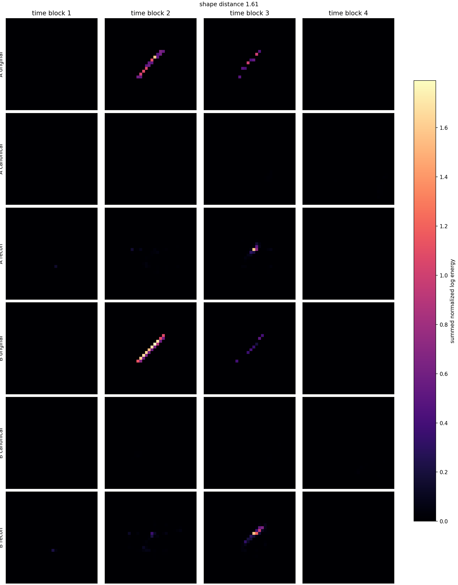
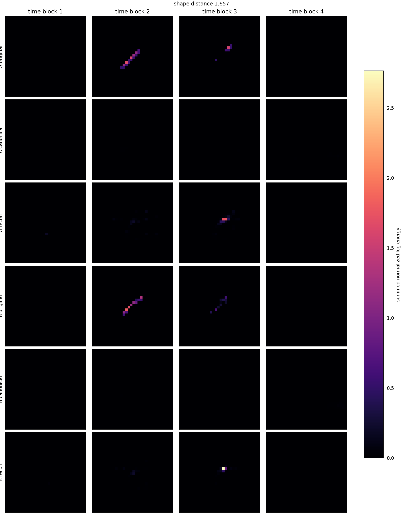
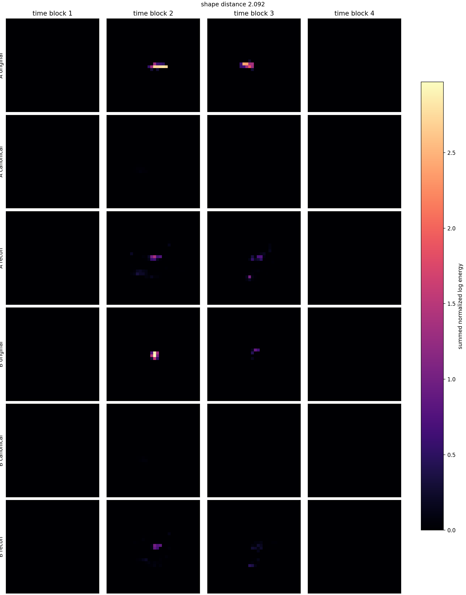
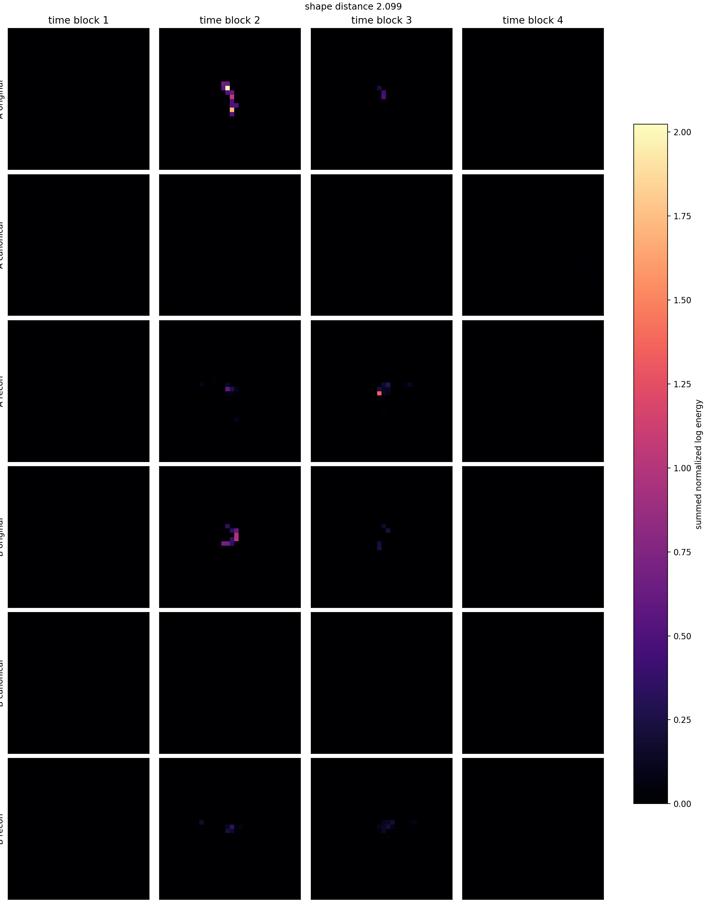

# Phase 2 Large z16 b512 Latent Pair Gallery

Checkpoint: `local_data/experiments/phase2_canonical_voxel_ae_compressed_plain_l2_large_z16_b512_v001/checkpoint.pt`

| pair | shape dist | d theta_xy | d theta_time | hits A/B | image |
|---:|---:|---:|---:|---:|---|
| 1 | 1.6097 | 0.006 | 0.107 | 32/44 | [png](../../../assets/phase2_compressed_large_z16_b512/pairs_v001/canonical_latent_pair_01.png) |
| 2 | 1.6567 | 0.003 | 0.104 | 30/33 | [png](../../../assets/phase2_compressed_large_z16_b512/pairs_v001/canonical_latent_pair_02.png) |
| 3 | 1.8534 | 0.009 | 0.103 | 26/21 | [png](../../../assets/phase2_compressed_large_z16_b512/pairs_v001/canonical_latent_pair_03.png) |
| 4 | 1.9342 | 0.000 | 0.106 | 40/47 | [png](../../../assets/phase2_compressed_large_z16_b512/pairs_v001/canonical_latent_pair_04.png) |
| 5 | 1.9537 | 0.001 | 0.102 | 60/77 | [png](../../../assets/phase2_compressed_large_z16_b512/pairs_v001/canonical_latent_pair_05.png) |
| 6 | 1.9779 | 0.006 | 0.103 | 36/20 | [png](../../../assets/phase2_compressed_large_z16_b512/pairs_v001/canonical_latent_pair_06.png) |
| 7 | 2.0285 | 0.001 | 0.103 | 43/31 | [png](../../../assets/phase2_compressed_large_z16_b512/pairs_v001/canonical_latent_pair_07.png) |
| 8 | 2.0915 | 0.004 | 0.100 | 54/34 | [png](../../../assets/phase2_compressed_large_z16_b512/pairs_v001/canonical_latent_pair_08.png) |
| 9 | 2.0991 | 0.008 | 0.113 | 20/20 | [png](../../../assets/phase2_compressed_large_z16_b512/pairs_v001/canonical_latent_pair_09.png) |
| 10 | 2.1527 | 0.001 | 0.108 | 55/58 | [png](../../../assets/phase2_compressed_large_z16_b512/pairs_v001/canonical_latent_pair_10.png) |
| 11 | 2.1820 | 0.001 | 0.104 | 22/24 | [png](../../../assets/phase2_compressed_large_z16_b512/pairs_v001/canonical_latent_pair_11.png) |
| 12 | 2.1988 | 0.011 | 0.115 | 27/23 | [png](../../../assets/phase2_compressed_large_z16_b512/pairs_v001/canonical_latent_pair_12.png) |

## Pair 1

- A transform: `dx_norm=0.113, dy_norm=-0.065, dt_norm=-0.125, theta_xy=-3.12, theta_time_tilt=-0.695, scale_xyz=0.39, energy_scale=5.6`
- B transform: `dx_norm=0.0974, dy_norm=-0.0628, dt_norm=-0.135, theta_xy=-3.13, theta_time_tilt=-0.801, scale_xyz=0.401, energy_scale=10.3`

## Pair 2

- A transform: `dx_norm=0.099, dy_norm=-0.0601, dt_norm=-0.136, theta_xy=-3.12, theta_time_tilt=-0.788, scale_xyz=0.392, energy_scale=8.87`
- B transform: `dx_norm=0.104, dy_norm=-0.0616, dt_norm=-0.134, theta_xy=-3.13, theta_time_tilt=-0.685, scale_xyz=0.382, energy_scale=6.35`

## Pair 3

- A transform: `dx_norm=0.0959, dy_norm=-0.067, dt_norm=-0.13, theta_xy=-3.12, theta_time_tilt=-0.801, scale_xyz=0.387, energy_scale=8.34`
- B transform: `dx_norm=0.0944, dy_norm=-0.0639, dt_norm=-0.133, theta_xy=-3.11, theta_time_tilt=-0.698, scale_xyz=0.374, energy_scale=4.33`

## Pair 4

- A transform: `dx_norm=0.117, dy_norm=-0.06, dt_norm=-0.12, theta_xy=-3.12, theta_time_tilt=-0.753, scale_xyz=0.399, energy_scale=6.88`
- B transform: `dx_norm=0.1, dy_norm=-0.062, dt_norm=-0.125, theta_xy=-3.13, theta_time_tilt=-0.86, scale_xyz=0.408, energy_scale=11.8`

## Pair 5

- A transform: `dx_norm=0.104, dy_norm=-0.0646, dt_norm=-0.124, theta_xy=-3.12, theta_time_tilt=-0.794, scale_xyz=0.398, energy_scale=12.2`
- B transform: `dx_norm=0.0982, dy_norm=-0.0638, dt_norm=-0.135, theta_xy=-3.12, theta_time_tilt=-0.691, scale_xyz=0.386, energy_scale=13.4`

## Pair 6

- A transform: `dx_norm=0.0962, dy_norm=-0.072, dt_norm=-0.13, theta_xy=-3.11, theta_time_tilt=-0.781, scale_xyz=0.385, energy_scale=3.25`
- B transform: `dx_norm=0.1, dy_norm=-0.0675, dt_norm=-0.126, theta_xy=-3.11, theta_time_tilt=-0.678, scale_xyz=0.371, energy_scale=1.7`

## Pair 7

- A transform: `dx_norm=0.109, dy_norm=-0.0552, dt_norm=-0.137, theta_xy=-3.11, theta_time_tilt=-0.663, scale_xyz=0.38, energy_scale=9`
- B transform: `dx_norm=0.11, dy_norm=-0.0563, dt_norm=-0.127, theta_xy=-3.11, theta_time_tilt=-0.766, scale_xyz=0.383, energy_scale=8.36`

## Pair 8

- A transform: `dx_norm=0.103, dy_norm=-0.0672, dt_norm=-0.131, theta_xy=-3.11, theta_time_tilt=-0.805, scale_xyz=0.392, energy_scale=15.3`
- B transform: `dx_norm=0.117, dy_norm=-0.0602, dt_norm=-0.132, theta_xy=-3.11, theta_time_tilt=-0.705, scale_xyz=0.377, energy_scale=9.4`

## Pair 9

- A transform: `dx_norm=0.09, dy_norm=-0.0603, dt_norm=-0.133, theta_xy=-3.11, theta_time_tilt=-0.658, scale_xyz=0.373, energy_scale=5.11`
- B transform: `dx_norm=0.106, dy_norm=-0.0653, dt_norm=-0.127, theta_xy=-3.12, theta_time_tilt=-0.771, scale_xyz=0.378, energy_scale=3.02`

## Pair 10

- A transform: `dx_norm=0.108, dy_norm=-0.0719, dt_norm=-0.124, theta_xy=-3.12, theta_time_tilt=-0.777, scale_xyz=0.379, energy_scale=7.01`
- B transform: `dx_norm=0.116, dy_norm=-0.0586, dt_norm=-0.127, theta_xy=-3.12, theta_time_tilt=-0.669, scale_xyz=0.38, energy_scale=8.78`

## Pair 11

- A transform: `dx_norm=0.119, dy_norm=-0.0792, dt_norm=-0.112, theta_xy=-3.12, theta_time_tilt=-0.808, scale_xyz=0.384, energy_scale=2.33`
- B transform: `dx_norm=0.11, dy_norm=-0.0663, dt_norm=-0.124, theta_xy=-3.12, theta_time_tilt=-0.704, scale_xyz=0.376, energy_scale=5.28`

## Pair 12

- A transform: `dx_norm=0.116, dy_norm=-0.0469, dt_norm=-0.114, theta_xy=-3.11, theta_time_tilt=-0.624, scale_xyz=0.37, energy_scale=1.51`
- B transform: `dx_norm=0.127, dy_norm=-0.0644, dt_norm=-0.0832, theta_xy=-3.12, theta_time_tilt=-0.739, scale_xyz=0.371, energy_scale=0.0298`
