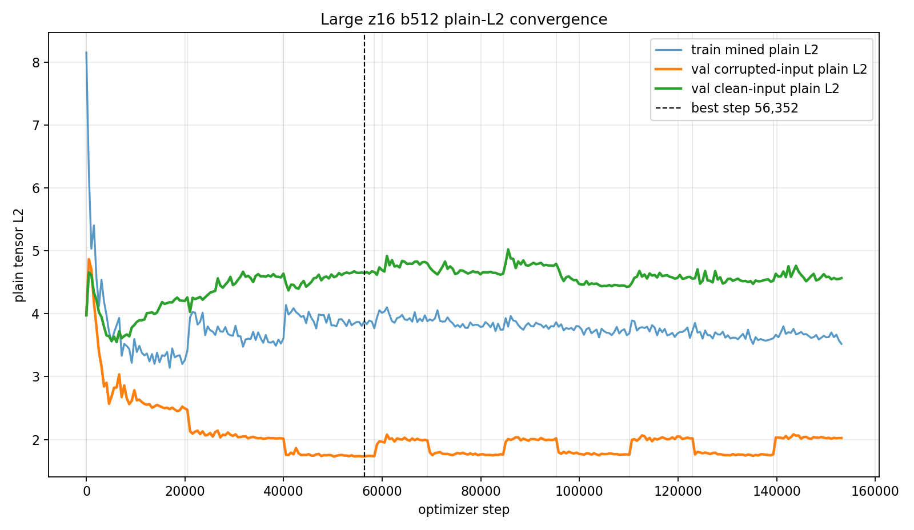
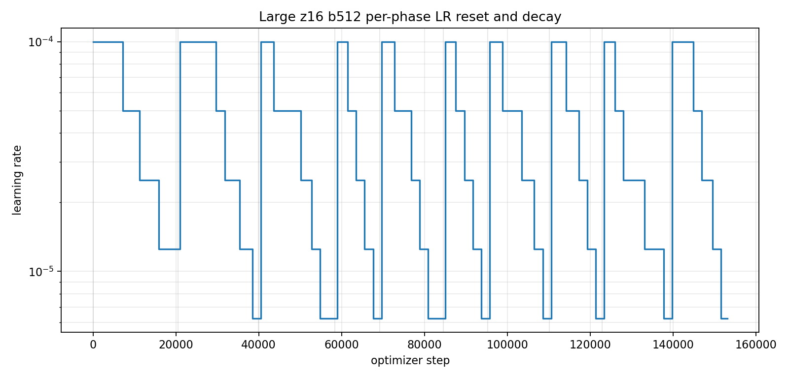
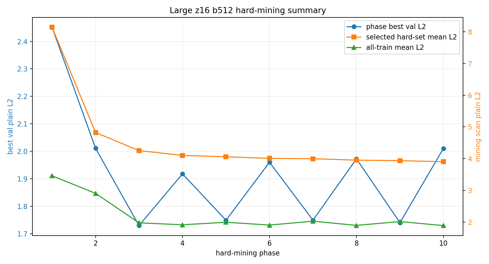

# Phase 2 Large z16 b512 Plain-L2 Training Convergence

This report summarizes the larger compressed voxel AE run: `z_shape=16`, `hidden_dim=1536`, `patch_hidden_dim=384`, `patch_embed_dim=64`, batch size `512`, with the full representative dataset resident on the RTX 5090 as fp16 tensors.

## Run

| item | value |
|---|---:|
| checkpoint | `local_data/experiments/phase2_canonical_voxel_ae_compressed_plain_l2_large_z16_b512_v001/checkpoint.pt` |
| loss mode | `plain_tensor_l2` |
| grid | `8 x 32 x 32` |
| shape latent | 16 |
| hidden dim | 1536 |
| patch hidden/embed | 384 / 64 |
| train particles | 757,765 |
| val particles | 66,022 |
| test particles | 176,213 |
| total optimizer steps | 153,120 |
| wall time | 14.1 min |
| best validation step | 56,352 |
| best validation plain L2 | 1.7296 |

## Final Test Metrics

| split input | plain L2 mean | p50 | p95 | mass overlap | energy-relative L1 |
|---|---:|---:|---:|---:|---:|
| corrupted input | 1.3714 | 1.1469 | 2.7928 | 0.6117 | 1.9249 |
| clean input | 2.9683 | 1.9302 | 8.9895 | 0.0223 | 2.9610 |

## Comparison To Previous z8 b4096 Run

| metric | previous z8 b4096 | large z16 b512 | change |
|---|---:|---:|---:|
| params | 2.30M | 8.97M | 3.90x |
| total steps | 135,680 | 153,120 | 1.13x |
| wall time | 71.4 min | 14.1 min | 0.20x |
| best val L2 | 1.8124 | 1.7296 | -0.0829 |
| corrupted test L2 | 1.4501 | 1.3714 | -0.0786 |
| corrupted test p95 | 2.9259 | 2.7928 | -0.1331 |
| corrupted mass overlap | 0.5207 | 0.6117 | +0.0911 |

## Curves

## Phase Summary

| phase | steps | best step | best val L2 | final LR | seconds | stop |
| --- | --- | --- | --- | --- | --- | --- |
| 1 | 20,512 | 18,432 | 2.4517 | 6.25e-06 | 110.4 | max_steps |
| 2 | 19,456 | 35,872 | 2.0112 | 3.13e-06 | 104.1 | lr_below_5e-06 |
| 3 | 18,432 | 56,352 | 1.7296 | 3.13e-06 | 98.7 | lr_below_5e-06 |
| 4 | 10,752 | 58,912 | 1.9179 | 3.13e-06 | 57.5 | lr_below_5e-06 |
| 5 | 15,360 | 82,464 | 1.7490 | 3.13e-06 | 82.1 | lr_below_5e-06 |
| 6 | 10,752 | 85,024 | 1.9603 | 3.13e-06 | 57.5 | lr_below_5e-06 |
| 7 | 14,848 | 103,968 | 1.7493 | 3.13e-06 | 79.4 | lr_below_5e-06 |
| 8 | 12,800 | 114,720 | 1.9727 | 3.13e-06 | 68.5 | lr_below_5e-06 |
| 9 | 16,384 | 135,200 | 1.7402 | 3.13e-06 | 87.8 | lr_below_5e-06 |
| 10 | 13,824 | 146,976 | 2.0105 | 3.13e-06 | 74.4 | lr_below_5e-06 |

## Hard-Mining Summary

Each phase rescanned the full train split and selected the top 10 percent highest corrupted-input plain-L2 particles.

| phase | scanned | selected | scan s | all mean L2 | p90 L2 | selected mean L2 |
| --- | --- | --- | --- | --- | --- | --- |
| 1 | 757,765 | 75,777 | 2.73 | 3.4585 | 6.3447 | 8.1442 |
| 2 | 757,765 | 75,777 | 2.53 | 2.9064 | 4.0402 | 4.8245 |
| 3 | 757,765 | 75,777 | 2.53 | 1.9755 | 3.3706 | 4.2546 |
| 4 | 757,765 | 75,777 | 2.53 | 1.9148 | 3.1706 | 4.1009 |
| 5 | 757,765 | 75,777 | 2.53 | 1.9938 | 3.1579 | 4.0580 |
| 6 | 757,765 | 75,777 | 2.53 | 1.9057 | 3.1218 | 4.0103 |
| 7 | 757,765 | 75,777 | 2.53 | 2.0277 | 3.1391 | 3.9965 |
| 8 | 757,765 | 75,777 | 2.53 | 1.8957 | 3.1057 | 3.9532 |
| 9 | 757,765 | 75,777 | 2.53 | 2.0157 | 3.1196 | 3.9360 |
| 10 | 757,765 | 75,777 | 2.53 | 1.8891 | 3.0951 | 3.9035 |

## Notes

- This run is substantially faster in wall time because batch `512` gives many fast optimizer updates; it still scanned the full train split before every phase.
- Corrupted-test L2 improved versus the previous z8 run, but clean-input L2 remains worse because the checkpoint is selected for the high-corruption training distribution.
- Companion docs: [reconstruction gallery](phase2-compressed-large-z16-b512-gallery.md) and [latent pair gallery](phase2-compressed-large-z16-b512-pairs.md).
