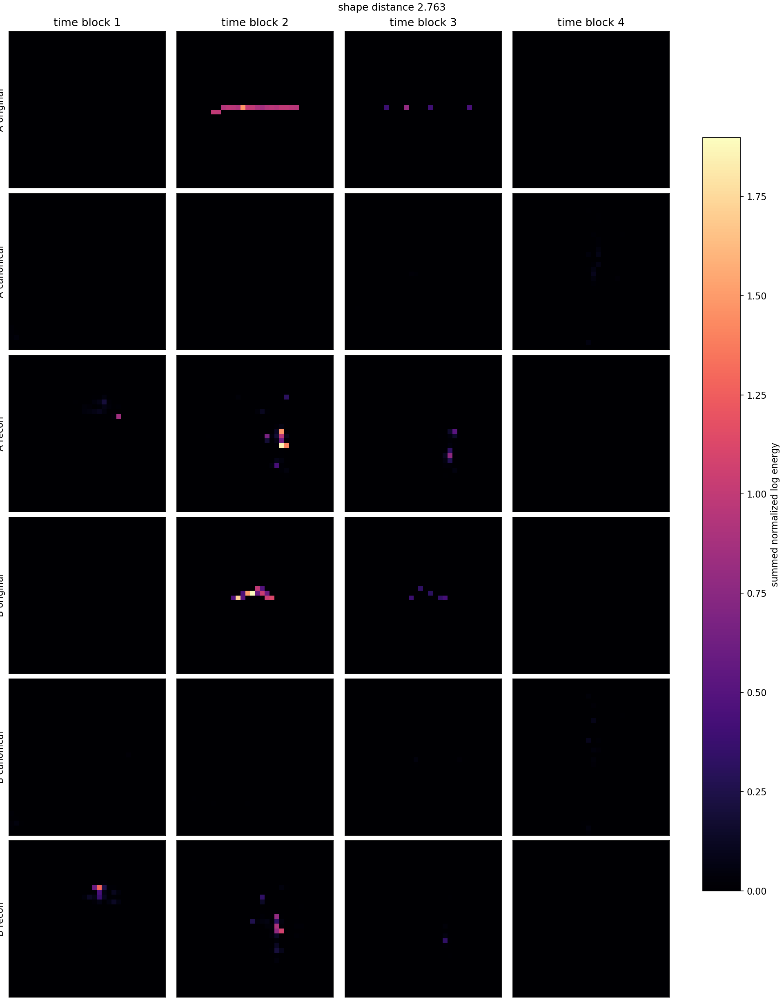
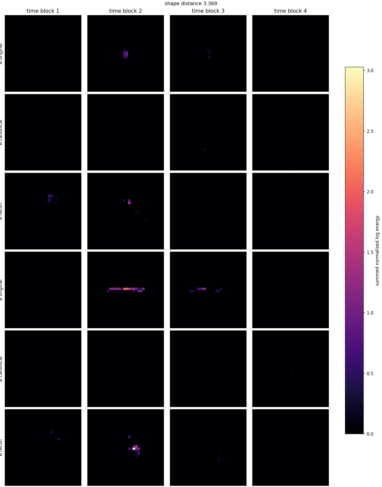
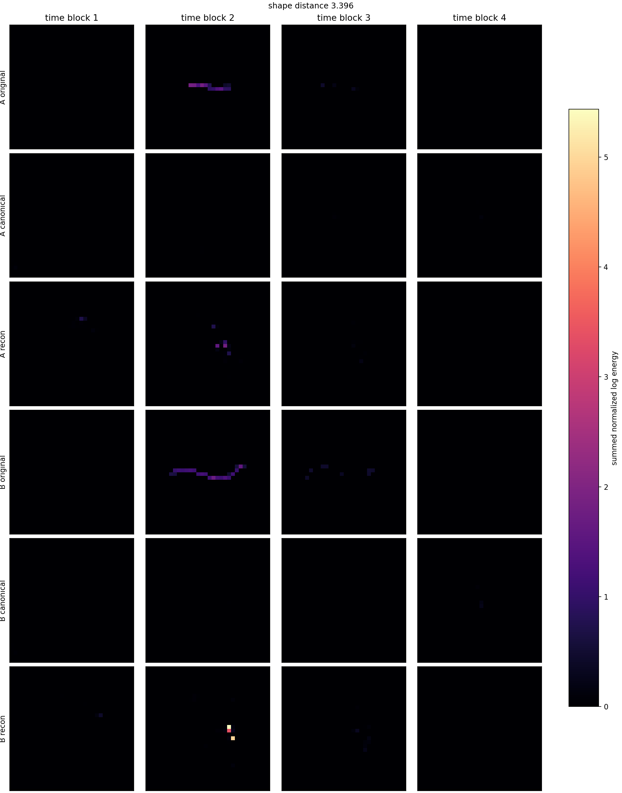
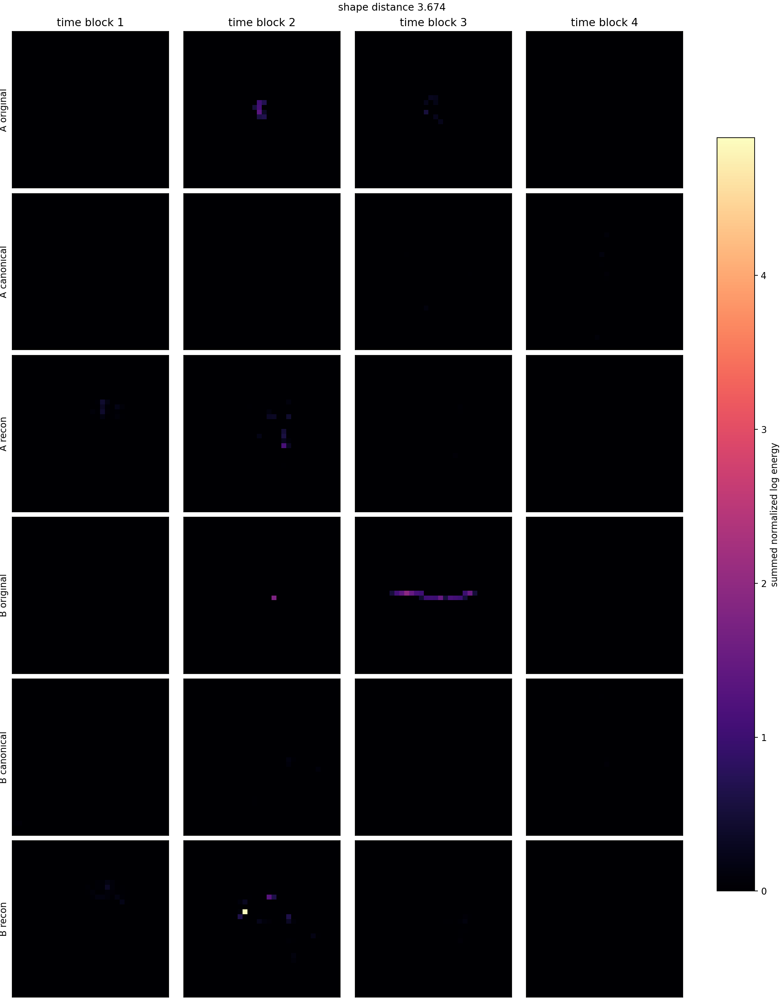
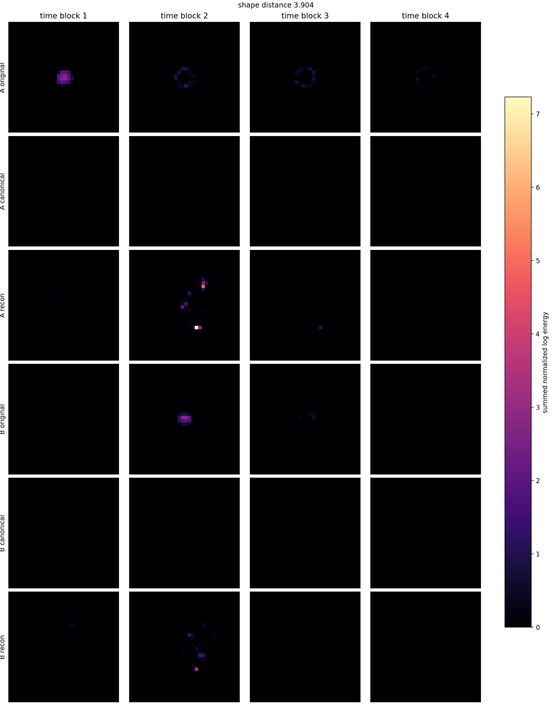
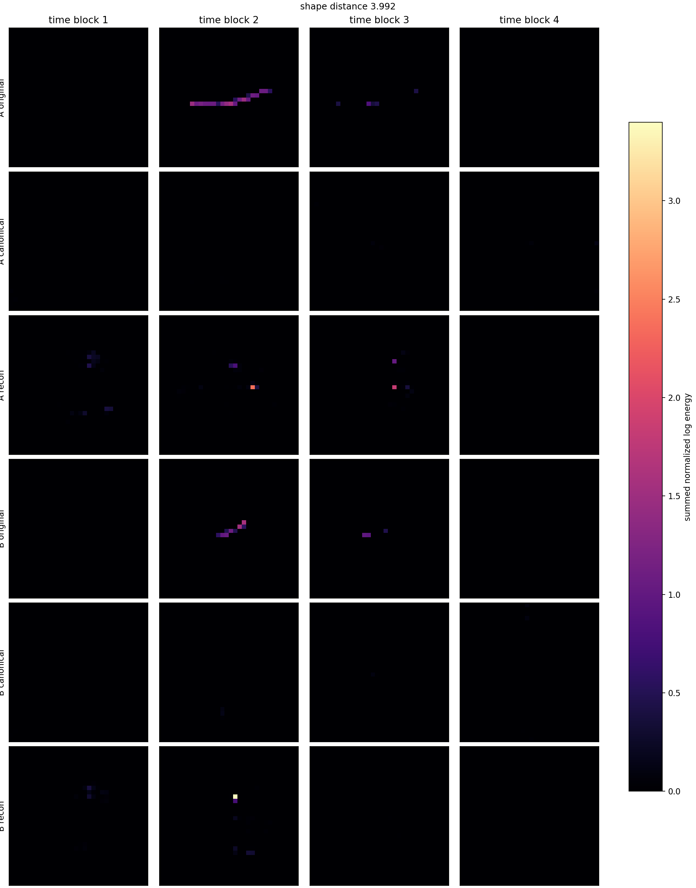

# Phase 2 Wide z24 Depth b4096 Continuation Latent Pair Gallery

Checkpoint: `local_data/experiments/phase2_canonical_voxel_ae_compressed_plain_l2_wide_z24_depth_b4096_continue_v001/checkpoint.pt`

| pair | shape dist | d theta_xy | d theta_time | hits A/B | image |
|---:|---:|---:|---:|---:|---|
| 1 | 2.7627 | 0.015 | 0.104 | 42/28 | [png](../../../assets/phase2_compressed_wide_z24_depth_b4096_continue/pairs_v001/canonical_latent_pair_01.png) |
| 2 | 3.3691 | 0.001 | 0.102 | 21/51 | [png](../../../assets/phase2_compressed_wide_z24_depth_b4096_continue/pairs_v001/canonical_latent_pair_02.png) |
| 3 | 3.3955 | 0.008 | 0.111 | 40/51 | [png](../../../assets/phase2_compressed_wide_z24_depth_b4096_continue/pairs_v001/canonical_latent_pair_03.png) |
| 4 | 3.4330 | 0.005 | 0.100 | 46/22 | [png](../../../assets/phase2_compressed_wide_z24_depth_b4096_continue/pairs_v001/canonical_latent_pair_04.png) |
| 5 | 3.5314 | 0.014 | 0.100 | 62/30 | [png](../../../assets/phase2_compressed_wide_z24_depth_b4096_continue/pairs_v001/canonical_latent_pair_05.png) |
| 6 | 3.6743 | 0.001 | 0.119 | 27/44 | [png](../../../assets/phase2_compressed_wide_z24_depth_b4096_continue/pairs_v001/canonical_latent_pair_06.png) |
| 7 | 3.7285 | 0.010 | 0.110 | 49/25 | [png](../../../assets/phase2_compressed_wide_z24_depth_b4096_continue/pairs_v001/canonical_latent_pair_07.png) |
| 8 | 3.7376 | 0.004 | 0.104 | 50/32 | [png](../../../assets/phase2_compressed_wide_z24_depth_b4096_continue/pairs_v001/canonical_latent_pair_08.png) |
| 9 | 3.7880 | 0.003 | 0.112 | 51/33 | [png](../../../assets/phase2_compressed_wide_z24_depth_b4096_continue/pairs_v001/canonical_latent_pair_09.png) |
| 10 | 3.8830 | 0.010 | 0.108 | 42/20 | [png](../../../assets/phase2_compressed_wide_z24_depth_b4096_continue/pairs_v001/canonical_latent_pair_10.png) |
| 11 | 3.9041 | 0.003 | 0.106 | 113/46 | [png](../../../assets/phase2_compressed_wide_z24_depth_b4096_continue/pairs_v001/canonical_latent_pair_11.png) |
| 12 | 3.9922 | 0.005 | 0.127 | 48/21 | [png](../../../assets/phase2_compressed_wide_z24_depth_b4096_continue/pairs_v001/canonical_latent_pair_12.png) |

## Pair 1

- A transform: `dx_norm=0.0806, dy_norm=-0.0278, dt_norm=-0.389, theta_xy=3.11, theta_time_tilt=-0.857, scale_xyz=0.536, energy_scale=13.8`
- B transform: `dx_norm=0.0838, dy_norm=-0.0232, dt_norm=-0.377, theta_xy=3.12, theta_time_tilt=-0.752, scale_xyz=0.5, energy_scale=10.5`

## Pair 2

- A transform: `dx_norm=0.0949, dy_norm=-0.0224, dt_norm=-0.377, theta_xy=3.12, theta_time_tilt=-0.722, scale_xyz=0.499, energy_scale=8.2`
- B transform: `dx_norm=0.0806, dy_norm=-0.0242, dt_norm=-0.385, theta_xy=3.12, theta_time_tilt=-0.824, scale_xyz=0.538, energy_scale=16.1`

## Pair 3

- A transform: `dx_norm=0.0857, dy_norm=-0.027, dt_norm=-0.381, theta_xy=3.11, theta_time_tilt=-0.773, scale_xyz=0.523, energy_scale=9.96`
- B transform: `dx_norm=0.0759, dy_norm=-0.0339, dt_norm=-0.401, theta_xy=3.12, theta_time_tilt=-0.885, scale_xyz=0.558, energy_scale=18`

## Pair 4

- A transform: `dx_norm=0.0806, dy_norm=-0.0269, dt_norm=-0.386, theta_xy=3.12, theta_time_tilt=-0.813, scale_xyz=0.524, energy_scale=11.5`
- B transform: `dx_norm=0.093, dy_norm=-0.0228, dt_norm=-0.374, theta_xy=3.11, theta_time_tilt=-0.713, scale_xyz=0.487, energy_scale=5.94`

## Pair 5

- A transform: `dx_norm=0.0804, dy_norm=-0.0249, dt_norm=-0.386, theta_xy=3.11, theta_time_tilt=-0.866, scale_xyz=0.547, energy_scale=19.5`
- B transform: `dx_norm=0.0901, dy_norm=-0.0244, dt_norm=-0.374, theta_xy=3.12, theta_time_tilt=-0.766, scale_xyz=0.505, energy_scale=16.4`

## Pair 6

- A transform: `dx_norm=0.094, dy_norm=-0.0239, dt_norm=-0.373, theta_xy=3.12, theta_time_tilt=-0.727, scale_xyz=0.491, energy_scale=7.24`
- B transform: `dx_norm=0.0901, dy_norm=-0.023, dt_norm=-0.386, theta_xy=3.12, theta_time_tilt=-0.845, scale_xyz=0.539, energy_scale=13.4`

## Pair 7

- A transform: `dx_norm=0.0675, dy_norm=-0.0314, dt_norm=-0.386, theta_xy=3.11, theta_time_tilt=-0.871, scale_xyz=0.539, energy_scale=15.7`
- B transform: `dx_norm=0.0929, dy_norm=-0.0309, dt_norm=-0.362, theta_xy=3.12, theta_time_tilt=-0.761, scale_xyz=0.503, energy_scale=12.5`

## Pair 8

- A transform: `dx_norm=0.0738, dy_norm=-0.0281, dt_norm=-0.397, theta_xy=3.11, theta_time_tilt=-0.881, scale_xyz=0.553, energy_scale=14.6`
- B transform: `dx_norm=0.0838, dy_norm=-0.0285, dt_norm=-0.382, theta_xy=3.11, theta_time_tilt=-0.777, scale_xyz=0.521, energy_scale=11.8`

## Pair 9

- A transform: `dx_norm=0.0577, dy_norm=-0.0354, dt_norm=-0.409, theta_xy=3.12, theta_time_tilt=-0.886, scale_xyz=0.568, energy_scale=18.4`
- B transform: `dx_norm=0.0864, dy_norm=-0.0268, dt_norm=-0.375, theta_xy=3.12, theta_time_tilt=-0.773, scale_xyz=0.51, energy_scale=13.4`

## Pair 10

- A transform: `dx_norm=0.0755, dy_norm=-0.0314, dt_norm=-0.388, theta_xy=3.11, theta_time_tilt=-0.85, scale_xyz=0.532, energy_scale=11.9`
- B transform: `dx_norm=0.0973, dy_norm=-0.0249, dt_norm=-0.371, theta_xy=3.12, theta_time_tilt=-0.742, scale_xyz=0.5, energy_scale=6.63`

## Pair 11

- A transform: `dx_norm=0.0484, dy_norm=-0.0248, dt_norm=-0.403, theta_xy=3.12, theta_time_tilt=-0.837, scale_xyz=0.489, energy_scale=32.3`
- B transform: `dx_norm=0.0928, dy_norm=-0.0207, dt_norm=-0.376, theta_xy=3.13, theta_time_tilt=-0.731, scale_xyz=0.489, energy_scale=15.2`

## Pair 12

- A transform: `dx_norm=0.0778, dy_norm=-0.0337, dt_norm=-0.387, theta_xy=3.12, theta_time_tilt=-0.879, scale_xyz=0.532, energy_scale=13.5`
- B transform: `dx_norm=0.0911, dy_norm=-0.0245, dt_norm=-0.375, theta_xy=3.12, theta_time_tilt=-0.752, scale_xyz=0.503, energy_scale=8.04`
