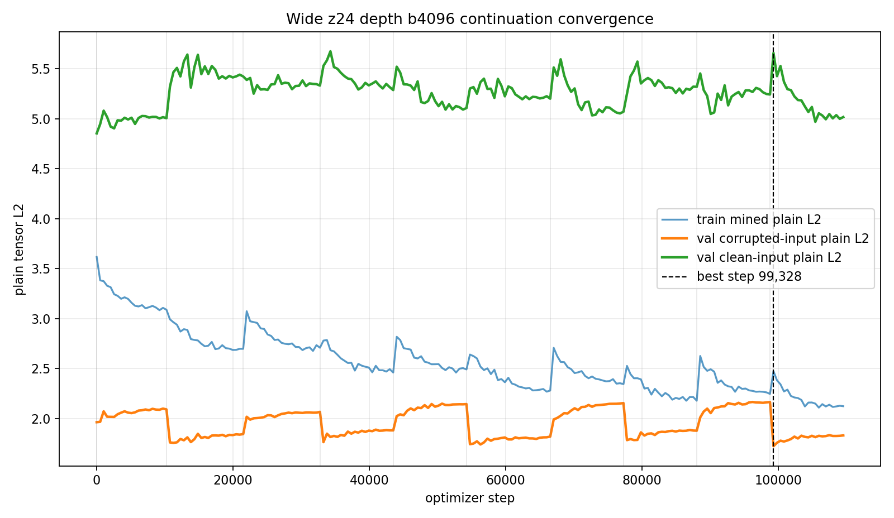
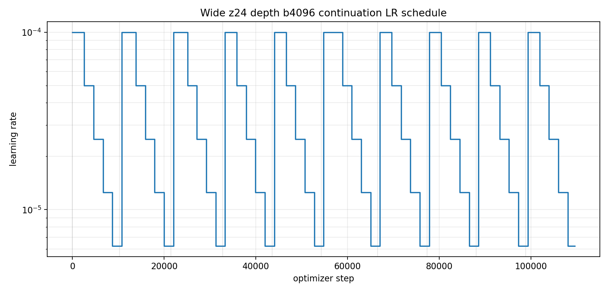
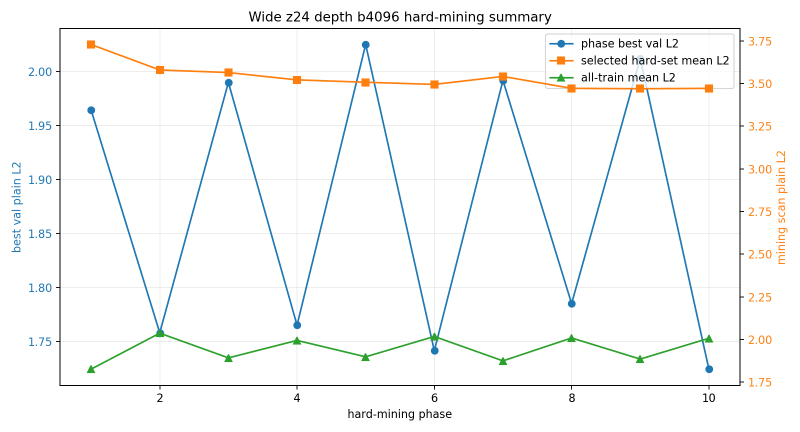

# Phase 2 Wide z24 Depth b4096 Continuation Convergence

This report summarizes the continuation run initialized from the wide `z24 + depth` batch-512 checkpoint and then trained with physical batch size `4096`.

## Run

| item | value |
|---|---:|
| checkpoint | `local_data/experiments/phase2_canonical_voxel_ae_compressed_plain_l2_wide_z24_depth_b4096_continue_v001/checkpoint.pt` |
| init checkpoint | `local_data/experiments/phase2_canonical_voxel_ae_compressed_plain_l2_wide_z24_depth_b512_v001/checkpoint.pt` |
| loss mode | `plain_tensor_l2` |
| grid | `8 x 32 x 32` |
| shape latent | 24 |
| hidden dim | 2048 |
| patch hidden/embed | 512 / 96 |
| encoder/decoder depth | 2 / 1 |
| train particles | 757,765 |
| val particles | 66,022 |
| test particles | 176,213 |
| total optimizer steps | 109,568 |
| wall time | 76.5 min |
| best validation step | 99,328 |
| best validation plain L2 | 1.7243 |

## Final Test Metrics

| split input | plain L2 mean | p50 | p95 | mass overlap | energy-relative L1 |
|---|---:|---:|---:|---:|---:|
| corrupted input | 1.2876 | 1.0681 | 2.8489 | 0.7466 | 1166 |
| clean input | 4.1786 | 3.3099 | 10.6114 | 0.0248 | 1556 |

## Run Comparison

| run | best val L2 | corrupted test L2 | corrupted p95 | mass overlap | wall time |
| --- | --- | --- | --- | --- | --- |
| z8 b4096 | 1.8124 | 1.4501 | 2.9259 | 0.5207 | 71.4 min |
| large z16 b512 | 1.7296 | 1.3714 | 2.7928 | 0.6117 | 14.1 min |
| wide z24 depth b512 | 1.7295 | 1.3469 | 2.7905 | 0.7207 | 16.6 min |
| wide z24 depth b4096 continuation | 1.7243 | 1.2876 | 2.8489 | 0.7466 | 76.5 min |

## Curves

## Phase Summary

| phase | steps | best step | best val L2 | final LR | min | stop |
| --- | --- | --- | --- | --- | --- | --- |
| 1 | 10,240 | 1 | 1.9645 | 3.13e-06 | 7.1 | lr_below_5e-06 |
| 2 | 11,264 | 11,264 | 1.7580 | 3.13e-06 | 7.8 | lr_below_5e-06 |
| 3 | 11,264 | 22,528 | 1.9901 | 3.13e-06 | 7.8 | lr_below_5e-06 |
| 4 | 10,752 | 33,280 | 1.7650 | 3.13e-06 | 7.5 | lr_below_5e-06 |
| 5 | 10,752 | 44,032 | 2.0252 | 3.13e-06 | 7.5 | lr_below_5e-06 |
| 6 | 12,288 | 56,320 | 1.7414 | 3.13e-06 | 8.5 | lr_below_5e-06 |
| 7 | 10,752 | 67,072 | 1.9920 | 3.13e-06 | 7.4 | lr_below_5e-06 |
| 8 | 10,752 | 77,824 | 1.7851 | 3.13e-06 | 7.5 | lr_below_5e-06 |
| 9 | 10,752 | 88,576 | 2.0123 | 3.13e-06 | 7.4 | lr_below_5e-06 |
| 10 | 10,752 | 99,328 | 1.7243 | 3.13e-06 | 7.5 | lr_below_5e-06 |

## Hard-Mining Summary

Each phase rescanned the full train split and selected the top 10 percent highest corrupted-input plain-L2 particles.

| phase | scanned | selected | scan s | all mean L2 | p90 L2 | selected mean L2 |
| --- | --- | --- | --- | --- | --- | --- |
| 1 | 757,765 | 75,777 | 3.06 | 1.8266 | 3.0270 | 3.7289 |
| 2 | 757,765 | 75,777 | 2.88 | 2.0375 | 3.0205 | 3.5796 |
| 3 | 757,765 | 75,777 | 2.88 | 1.8926 | 2.9814 | 3.5645 |
| 4 | 757,765 | 75,777 | 2.88 | 1.9949 | 2.9768 | 3.5215 |
| 5 | 757,765 | 75,777 | 2.88 | 1.8988 | 2.9574 | 3.5076 |
| 6 | 757,765 | 75,777 | 2.88 | 2.0180 | 2.9655 | 3.4950 |
| 7 | 757,765 | 75,777 | 2.88 | 1.8751 | 2.9857 | 3.5417 |
| 8 | 757,765 | 75,777 | 2.88 | 2.0093 | 2.9573 | 3.4719 |
| 9 | 757,765 | 75,777 | 2.88 | 1.8855 | 2.9455 | 3.4696 |
| 10 | 757,765 | 75,777 | 2.88 | 2.0074 | 2.9564 | 3.4719 |

## Notes

- This run was initialized from the completed wide z24 depth batch-512 checkpoint, then continued with batch `4096`.
- The final saved `checkpoint.pt` is the best validation state selected during this continuation.
- During this run, `checkpoint_best.pt` and `checkpoint_latest.pt` were also written, so interruption recovery is now safer.
- Companion docs: [reconstruction gallery](phase2-compressed-wide-z24-depth-b4096-continue-gallery.md) and [latent pair gallery](phase2-compressed-wide-z24-depth-b4096-continue-pairs.md).
