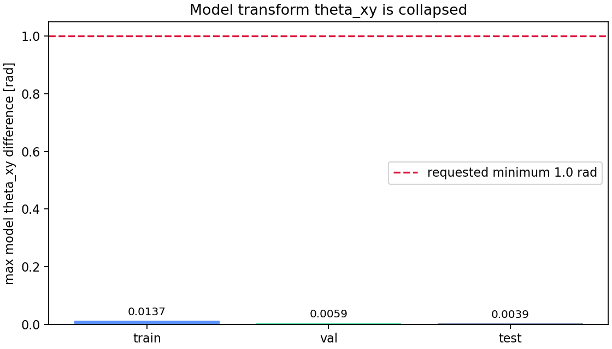

# Phase 2 Wide z24 Depth xy-energy Model-Transform Pair Check

Checkpoint: `local_data/experiments/phase2_canonical_voxel_ae_compressed_plain_l2_wide_z24_depth_xyenergy_b512_v001/checkpoint.pt`

Requested pair condition: similar `z_shape`, but model `z_transform.theta_xy` differs by at least `1.0` rad.

**Result: no such pairs exist.** The learned `theta_xy` transform head is effectively collapsed near pi, so the model is not using the explicit rotation transform. Any visually different rotations are being absorbed by `z_shape` or by the decoder, not by `z_transform.theta_xy`.

| split | particles scanned | min theta_xy | max theta_xy | std theta_xy | largest possible pair delta | passes `>=1 rad`? |
|---|---:|---:|---:|---:|---:|---|
| train | 757,765 | 3.126953 | 3.140625 | 4.58e-05 | 0.013672 | no |
| val | 66,022 | 3.134766 | 3.140625 | 6.22e-05 | 0.005859 | no |
| test | 176,213 | 3.136719 | 3.140625 | 3.09e-05 | 0.003906 | no |

## Interpretation

This is a failed disentanglement result for the `xy_energy` transform experiment. The model produced acceptable-looking reconstructions by routing orientation through the shape pathway instead of the explicit transform pathway.

To force model-transform rotation pairs to exist, the next training run needs an explicit pressure on `theta_xy`, for example PCA theta supervision, rotation augmentation with a known composed target, and a penalty that canonical `z_shape` remains stable under XY rotations.