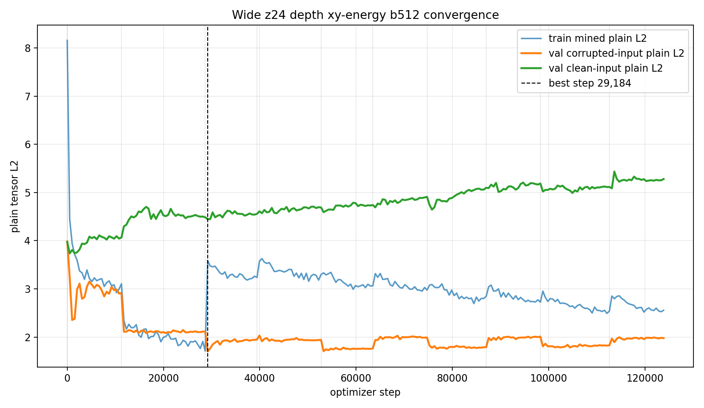
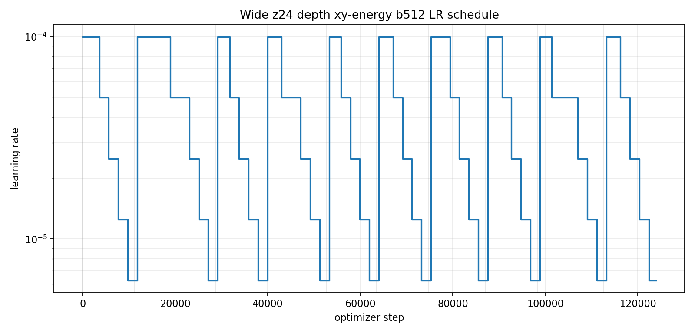
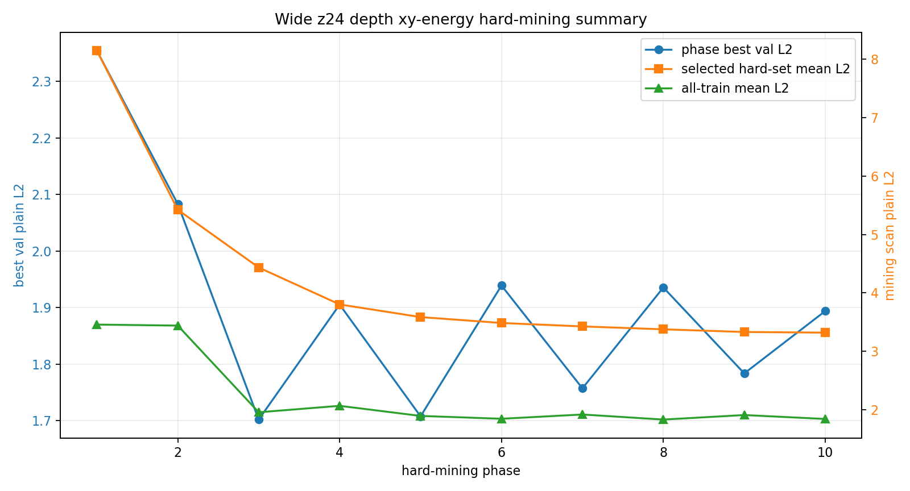

# Phase 2 Wide z24 Depth xy-energy b512 Convergence

This report summarizes the fresh constrained-transform run. The network used the same wide/deep architecture as the previous z24 run, but the explicit transform head was restricted to only `theta_xy` and `energy_scale`.

## Run

| item | value |
|---|---:|
| checkpoint | `local_data/experiments/phase2_canonical_voxel_ae_compressed_plain_l2_wide_z24_depth_xyenergy_b512_v001/checkpoint.pt` |
| loss mode | `plain_tensor_l2` |
| transform mode | `xy_energy` |
| active transform variables | `theta_xy`, `energy_scale` |
| fixed transform variables | `dx=0`, `dy=0`, `dt=0`, `theta_time_tilt=0`, `scale_xyz=1` |
| grid | `8 x 32 x 32` |
| shape latent | 24 |
| hidden dim | 2048 |
| patch hidden/embed | 512 / 96 |
| encoder/decoder depth | 2 / 1 |
| train particles | 757,765 |
| val particles | 66,022 |
| test particles | 176,213 |
| total optimizer steps | 123,904 |
| wall time | 15.9 min |
| best validation step | 29,184 |
| best validation plain L2 | 1.7020 |

## Final Test Metrics

| split input | plain L2 mean | p50 | p95 | mass overlap | energy-relative L1 |
|---|---:|---:|---:|---:|---:|
| corrupted input | 1.3017 | 1.0655 | 2.8160 | 0.7825 | 5417 |
| clean input | 2.9960 | 2.0953 | 8.1269 | 0.0090 | 7223 |

## Run Comparison

| run | transform mode | best val L2 | corrupted test L2 | corrupted p95 | mass overlap | wall time |
| --- | --- | --- | --- | --- | --- | --- |
| z8 b4096 | full | 1.8124 | 1.4501 | 2.9259 | 0.5207 | 71.4 min |
| large z16 b512 | full | 1.7296 | 1.3714 | 2.7928 | 0.6117 | 14.1 min |
| wide z24 depth b512 | full | 1.7295 | 1.3469 | 2.7905 | 0.7207 | 16.6 min |
| wide z24 depth b4096 continuation | full | 1.7243 | 1.2876 | 2.8489 | 0.7466 | 76.5 min |
| wide z24 depth xy-energy b512 | xy_energy | 1.7020 | 1.3017 | 2.8160 | 0.7825 | 15.9 min |

## Curves

## Phase Summary

| phase | steps | best step | best val L2 | final LR | min | stop |
| --- | --- | --- | --- | --- | --- | --- |
| 1 | 11,264 | 1,024 | 2.3547 | 3.13e-06 | 1.4 | lr_below_5e-06 |
| 2 | 17,408 | 20,480 | 2.0833 | 3.13e-06 | 2.2 | lr_below_5e-06 |
| 3 | 10,752 | 29,184 | 1.7020 | 3.13e-06 | 1.3 | lr_below_5e-06 |
| 4 | 13,312 | 44,544 | 1.9054 | 3.13e-06 | 1.7 | lr_below_5e-06 |
| 5 | 10,752 | 53,248 | 1.7077 | 3.13e-06 | 1.3 | lr_below_5e-06 |
| 6 | 11,264 | 64,512 | 1.9391 | 3.13e-06 | 1.4 | lr_below_5e-06 |
| 7 | 12,288 | 76,800 | 1.7572 | 3.13e-06 | 1.5 | lr_below_5e-06 |
| 8 | 11,264 | 88,064 | 1.9356 | 3.13e-06 | 1.4 | lr_below_5e-06 |
| 9 | 14,336 | 104,448 | 1.7836 | 3.13e-06 | 1.8 | lr_below_5e-06 |
| 10 | 11,264 | 113,664 | 1.8939 | 3.13e-06 | 1.4 | lr_below_5e-06 |

## Hard-Mining Summary

Each phase rescanned the full train split and selected the top 10 percent highest corrupted-input plain-L2 particles.

| phase | scanned | selected | scan s | all mean L2 | p90 L2 | selected mean L2 |
| --- | --- | --- | --- | --- | --- | --- |
| 1 | 757,765 | 75,777 | 3.06 | 3.4585 | 6.3447 | 8.1442 |
| 2 | 757,765 | 75,777 | 2.88 | 3.4414 | 4.8219 | 5.4219 |
| 3 | 757,765 | 75,777 | 2.88 | 1.9592 | 3.7975 | 4.4347 |
| 4 | 757,765 | 75,777 | 2.88 | 2.0694 | 3.1189 | 3.8034 |
| 5 | 757,765 | 75,777 | 2.88 | 1.8966 | 3.0276 | 3.5869 |
| 6 | 757,765 | 75,777 | 2.88 | 1.8483 | 2.9500 | 3.4862 |
| 7 | 757,765 | 75,777 | 2.88 | 1.9212 | 2.9328 | 3.4271 |
| 8 | 757,765 | 75,777 | 2.88 | 1.8345 | 2.8852 | 3.3777 |
| 9 | 757,765 | 75,777 | 2.88 | 1.9118 | 2.8780 | 3.3321 |
| 10 | 757,765 | 75,777 | 2.88 | 1.8447 | 2.8467 | 3.3209 |

## Notes

- The constrained transform improves best validation L2 versus the previous full-transform z24 runs in this set, but corrupted-test L2 is slightly worse than the full-transform b4096 continuation.
- Because translation/scale/time-tilt are fixed, any remaining pose variation must be absorbed by `z_shape` and the canonical decoder.
- Companion docs: [reconstruction gallery](phase2-compressed-wide-z24-depth-xyenergy-b512-gallery.md) and [latent pair gallery](phase2-compressed-wide-z24-depth-xyenergy-b512-pairs.md).
