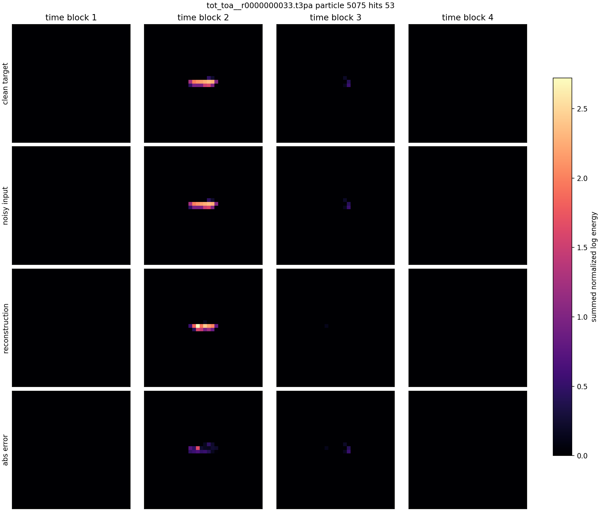
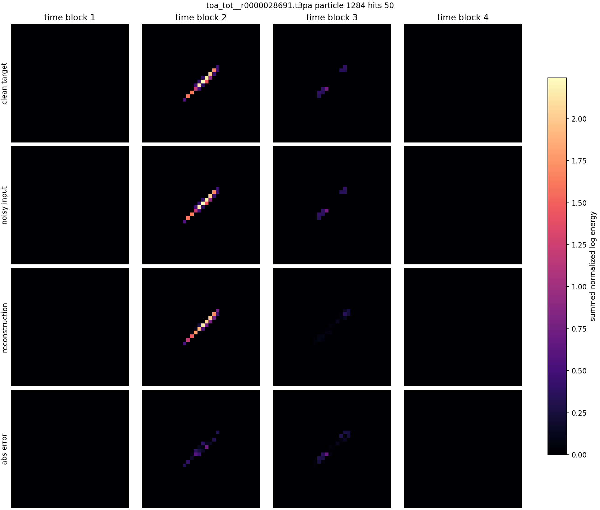
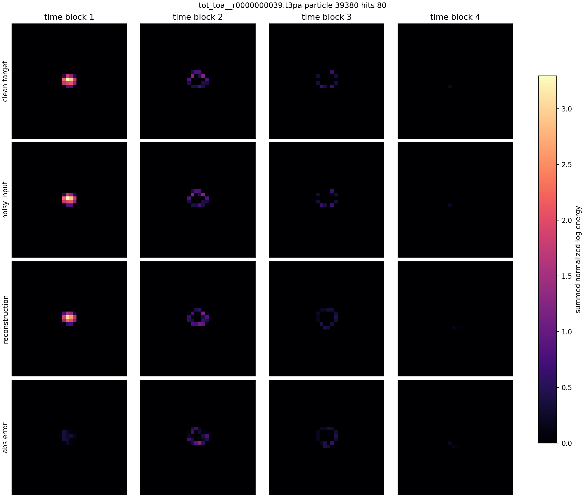
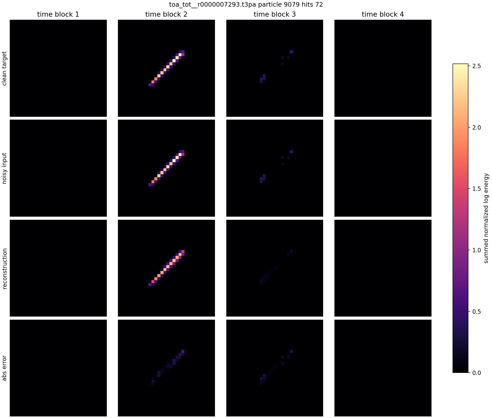

# Simple z8 Voxel Autoencoder Gallery

Model input uses the same corruption parameters as training. This model has no explicit transform layer and only an 8D direct latent bottleneck.

Corruption: `blur_kernel=5`, `blur_mix=0.0`, `noise_std=0.0`, `voxel_dropout=0.0`.

| # | source | particle | hits | energy clean/noisy/recon | relative L2 clean | image |
|---:|---|---:|---:|---:|---:|---|
| 1 | `F08/tot_toa__r0000000033.t3pa` | 7583 | 431 | 128.751/128.751/120.454 | 0.1958 | [png](../../../assets/phase2_simple_voxel_z8_b1024_clean_fixedmine_20phase/gallery_v001/simple_z8_example_01.png) |
| 2 | `D05/tot_toa__r0000000039.t3pa` | 8867 | 86 | 36.759/36.759/34.541 | 0.3305 | [png](../../../assets/phase2_simple_voxel_z8_b1024_clean_fixedmine_20phase/gallery_v001/simple_z8_example_02.png) |
| 3 | `F08/tot_toa__r0000000033.t3pa` | 5075 | 53 | 24.913/24.913/21.304 | 0.3490 | [png](../../../assets/phase2_simple_voxel_z8_b1024_clean_fixedmine_20phase/gallery_v001/simple_z8_example_03.png) |
| 4 | `13_tue_proton_daily_batch/toa_tot__r0000028691.t3pa` | 1284 | 50 | 24.459/24.459/21.464 | 0.3044 | [png](../../../assets/phase2_simple_voxel_z8_b1024_clean_fixedmine_20phase/gallery_v001/simple_z8_example_04.png) |
| 5 | `08_thu_proton_daily_batch/toa_tot__r0000007293.t3pa` | 6857 | 97 | 48.082/48.082/43.727 | 0.4111 | [png](../../../assets/phase2_simple_voxel_z8_b1024_clean_fixedmine_20phase/gallery_v001/simple_z8_example_05.png) |
| 6 | `F08/tot_toa__r0000000033.t3pa` | 43762 | 51 | 23.601/23.601/21.314 | 0.2455 | [png](../../../assets/phase2_simple_voxel_z8_b1024_clean_fixedmine_20phase/gallery_v001/simple_z8_example_06.png) |
| 7 | `D05/tot_toa__r0000000045.t3pa` | 15295 | 59 | 27.508/27.508/24.065 | 0.3728 | [png](../../../assets/phase2_simple_voxel_z8_b1024_clean_fixedmine_20phase/gallery_v001/simple_z8_example_07.png) |
| 8 | `F08/tot_toa__r0000000033.t3pa` | 4402 | 57 | 25.182/25.182/23.441 | 0.1950 | [png](../../../assets/phase2_simple_voxel_z8_b1024_clean_fixedmine_20phase/gallery_v001/simple_z8_example_08.png) |
| 9 | `D05/tot_toa__r0000000039.t3pa` | 39380 | 80 | 36.463/36.463/37.088 | 0.3150 | [png](../../../assets/phase2_simple_voxel_z8_b1024_clean_fixedmine_20phase/gallery_v001/simple_z8_example_09.png) |
| 10 | `08_thu_proton_daily_batch/toa_tot__r0000007293.t3pa` | 9079 | 72 | 35.842/35.842/34.877 | 0.1876 | [png](../../../assets/phase2_simple_voxel_z8_b1024_clean_fixedmine_20phase/gallery_v001/simple_z8_example_10.png) |

## Example 1

## Example 2

## Example 3

## Example 4

## Example 5

## Example 6

## Example 7

## Example 8

## Example 9

## Example 10

