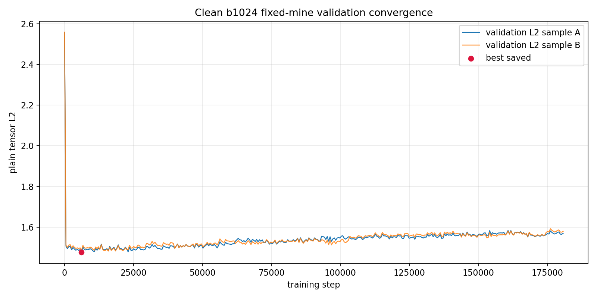
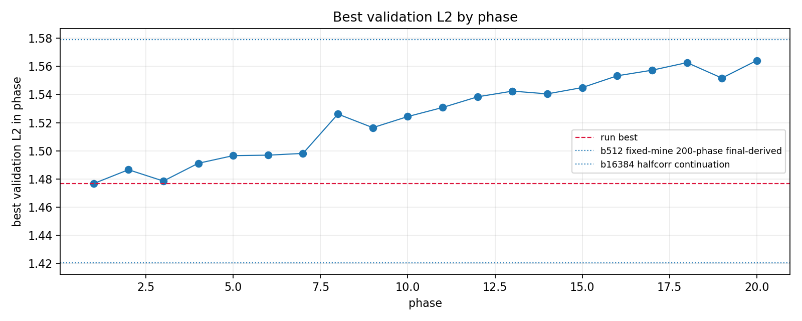
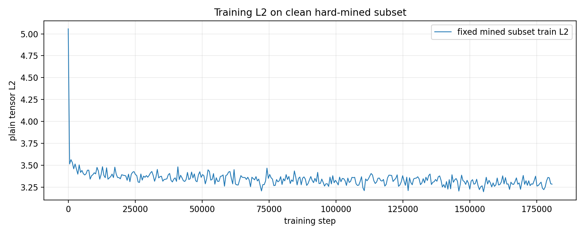
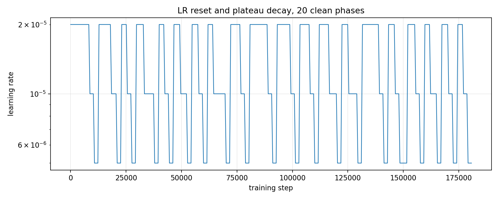
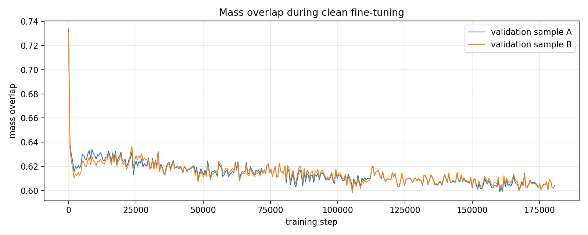

# Simple Voxel z8 b1024 Clean Fixed-Mine 20-Phase Fine-Tune

This run continued from the final/latest state of the b512 200-phase fixed-mine experiment, but disabled corruption entirely: `blur_mix=0`, `noise_std=0`, and `voxel_dropout=0`. The loop still used one fixed hard-mined 10% subset selected in phase 1, with LR reset each phase.

## Verdict

Clean-data fine-tuning immediately repaired much of the damage from the overtrained noised final checkpoint. The best checkpoint was early, at phase `1` / step `6,144` with validation L2 `1.476723`. After that, continued fixed-subset training overfit and validation degraded.

| run | batch | phases | corruption | best val L2 | best step | clean test L2 | clean test p95 |
|---|---:|---:|---|---:|---:|---:|---:|
| clean b1024 fixed-mine | 1024 | 20 | none | 1.476723 | 6,144 | 1.247952 | 2.237494 |
| b512 fixed-mine 200-phase final-derived | - | - | as run | 1.579057 | 78,336 | 1.799484 | 3.266199 |
| b16384 halfcorr continuation | - | - | as run | 1.420299 | 1 | 1.453231 | 3.276500 |

## Run Setup

| setting | value |
|---|---:|
| init checkpoint | `local_data/experiments/phase2_simple_voxel_ae_z8_b512_halfcorr_fixedmine_200phase_v001/checkpoint_latest.pt` |
| output | `local_data/experiments/phase2_simple_voxel_ae_z8_b1024_clean_fixedmine_20phase_v001` |
| latent dim | 8 |
| batch size | 1024 |
| phases | 20 |
| total optimizer steps | 180,736 |
| duration | 8.17 min |
| hard-mined rows | 75,777 / 757,765 |
| corruption | none |

## Curves

## Best And Final Rows

| row | step | phase | lr | train L2 | val L2 | validation sample B L2 | val overlap |
|---|---:|---:|---:|---:|---:|---:|---:|
| best | 6,144 | 1 | 2.00e-05 | 3.388590 | 1.476723 | 1.485726 | 0.6260 |
| final | 180,736 | 20 | 5.00e-06 | 3.283756 | 1.569525 | 1.579583 | 0.6044 |

## Test Metrics From Saved Best

| eval sample | L2 | p50 L2 | p95 L2 | mass overlap | energy relative L1 |
|---|---:|---:|---:|---:|---:|
| clean test sample A | 1.247952 | 1.128819 | 2.237494 | 0.5899 | 0.2008 |
| clean test sample B | 1.256807 | 1.129984 | 2.264253 | 0.5891 | 3263.1826 |

Both test rows are clean-input evaluations in this run because corruption was disabled. They use different random evaluation samples.

## Gallery

The reconstruction gallery generated from the saved best checkpoint is here:

[phase2-simple-voxel-z8-b1024-clean-fixedmine-20phase-gallery.md](phase2-simple-voxel-z8-b1024-clean-fixedmine-20phase-gallery.md)

## Interpretation

This is the first run in this sequence where clean reconstruction quality clearly improves. The important lesson is that denoising/noised-input training was making optimization harder than the model could handle at z8. For this architecture, clean reconstruction should be stabilized first, with early stopping around phase 1, before reintroducing corruption gradually.
