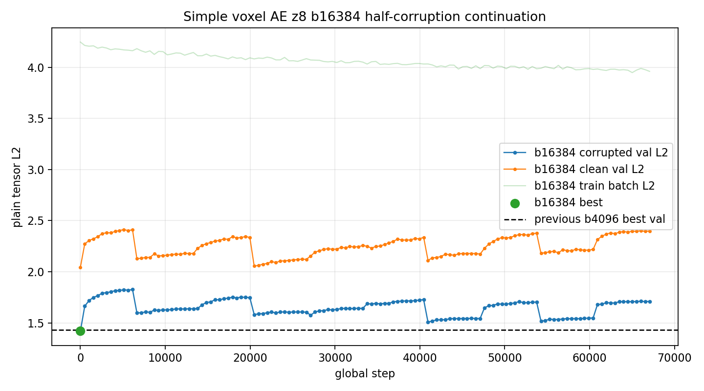
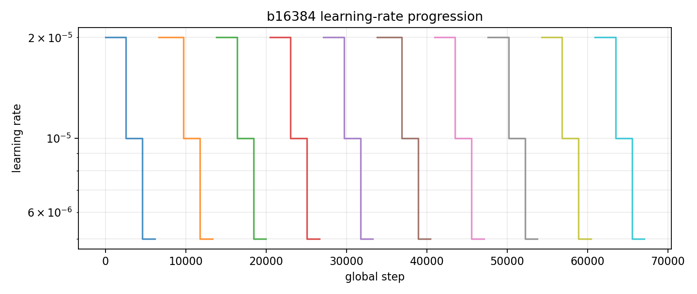
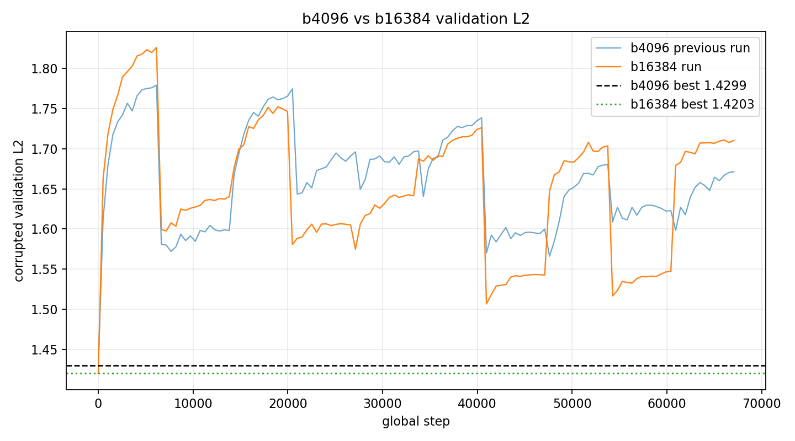
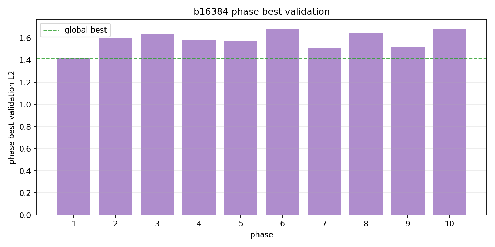

# Phase 2 Simple Voxel AE z8 b16384 Half-Corruption Continuation

This run continued from:

`local_data/experiments/phase2_simple_voxel_ae_z8_b4096_halfcorr_continue_v3_lowlr/checkpoint.pt`

It used the same simple no-transform compressed voxel AE, but with batch size `16384` (`4 x 4096`).

| item | value |
|---|---:|
| voxel tensor | `8 x 32 x 32` |
| shape latent | 8 |
| explicit transform latent | 0 |
| batch size | 16384 |
| hidden dim | 768 |
| patch hidden / embed | 192 / 32 |
| loss | plain tensor L2 |
| corruption | blur mix 0.5, noise std 0.02, dropout 0.04 |
| LR start per phase | 2e-5 |
| duration | 61.6 min |

## Result

The run completed all 10 phases. The best validation point was again the first evaluation immediately after loading the checkpoint, at step `1`.

| run | batch | best validation L2 | corrupted test L2 | clean test L2 | note |
|---|---:|---:|---:|---:|---|
| previous low-LR run | 4096 | 1.429873 | 0.963547 | 1.425051 | previous best checkpoint |
| this run | 16384 | 1.420299 | 0.955729 | 1.453231 | larger batch, no training-phase improvement |

The larger batch is feasible and gives a slightly lower corrupted validation/test L2 at the loaded-checkpoint evaluation. But the actual training phases still drift upward, so batch size was not the missing ingredient.

## Convergence

## Phase Summary

| phase | steps | best step | phase best validation L2 | duration s | final LR |
|---:|---:|---:|---:|---:|---:|
| 1 | 6,144 | 1 | 1.420299 | 337.4 | 2.50e-06 |
| 2 | 7,168 | 7,168 | 1.597543 | 393.5 | 2.50e-06 |
| 3 | 6,656 | 13,824 | 1.640304 | 365.2 | 2.50e-06 |
| 4 | 6,656 | 20,480 | 1.580509 | 365.4 | 2.50e-06 |
| 5 | 6,656 | 27,136 | 1.575009 | 365.2 | 2.50e-06 |
| 6 | 7,168 | 34,304 | 1.684341 | 393.4 | 2.50e-06 |
| 7 | 6,656 | 40,960 | 1.506703 | 365.4 | 2.50e-06 |
| 8 | 6,656 | 47,616 | 1.647423 | 365.2 | 2.50e-06 |
| 9 | 6,656 | 54,272 | 1.516687 | 365.7 | 2.50e-06 |
| 10 | 6,656 | 60,928 | 1.679463 | 365.5 | 2.50e-06 |

## Files

- Checkpoint: `local_data/experiments/phase2_simple_voxel_ae_z8_b16384_halfcorr_continue_v001/checkpoint.pt`
- Metrics: `local_data/experiments/phase2_simple_voxel_ae_z8_b16384_halfcorr_continue_v001/metrics.csv`
- Summary: `local_data/experiments/phase2_simple_voxel_ae_z8_b16384_halfcorr_continue_v001/summary.json`
- Gallery: [phase2-simple-voxel-z8-b16384-halfcorr-continue-gallery.md](phase2-simple-voxel-z8-b16384-halfcorr-continue-gallery.md)

## Takeaway

Batch `16384` works, but this objective still pulls the checkpoint away from the validation optimum. The next useful change should be in the data/objective/model, not simply another larger-batch continuation.
